# ElasticSearch

核心端口: 9300

在bin目录下存在一个elasticsearch.bat文件, 可以直接执行启动.

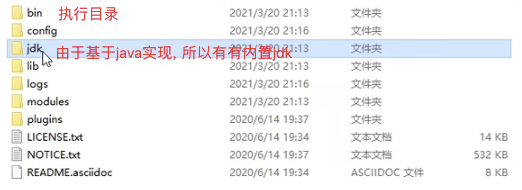

或者使用dockercompose搭建环境:

```yaml
version: '3.7'
services:
  elasticsearch:
    image: elasticsearch:8.6.1
    container_name: elasticsearch
    volumes:
      - ./data/8:/usr/share/elasticsearch/data
    environment:
      - "discovery.type=single-node"
      - xpack.security.enabled=true
      - ELASTIC_USERNAME=elastic
      - ELASTIC_PASSWORD=MagicWord
    ports:
      - 9200:9200
      - 9300:9300
  kibana:
    container_name: kibana
    image: kibana:8.6.1
    environment:
      - ELASTICSEARCH_HOSTS=http://elasticsearch:9200
      - xpack.security.enabled=true
      - "discovery.type=single-node"
      - ELASTIC_USERNAME=elastic
      - ELASTIC_PASSWORD=MagicWord  # 添加密码, 可以只是用密码不适用用户名
    ports:
      - 5601:5601
    depends_on:
      - elasticsearch
```

> 需要注意的是, 在老版本7.x中并没有使用xpack的密码加密功能, 但是在新版本中, 使用了xpack的加密功能, 一般使用curl的时候需要加入"--user <username>:<password>" 来进行基础认证. 否则就会提出错误: `missing authentication token for REST request`. 因此如果使用版本8的时候需要加入密码处理.
> 在8中默认继承了xpack, 所以一定要设置用户名密码

## api 基本使用

在es中不存在数据库的概念但是存在索引的概念,因为主要是使用索引来进行存储数据. 索引的名称必须是全小写字母.

### 索引

put请求创建索引, 对于索引是不能使用post的:
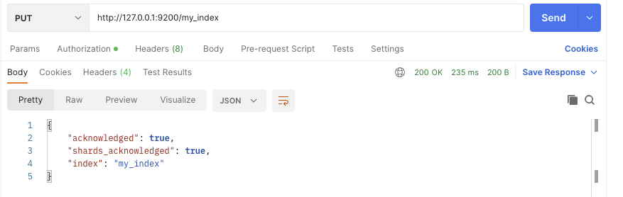

get查看索引, 其中包含了创建信息, uuid等
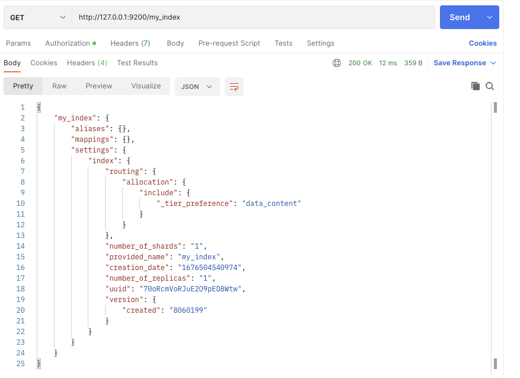
查看所有的索引:
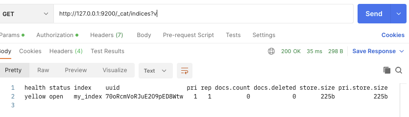

删除索引
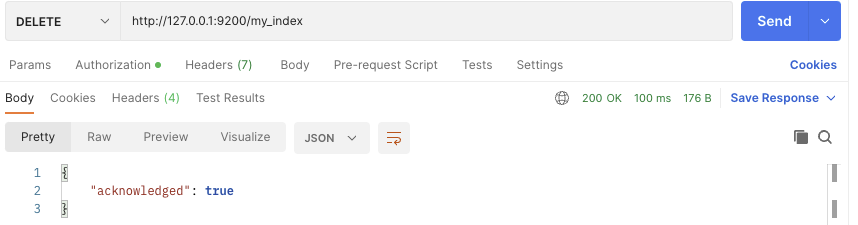

### 文档操作

文档操作只能使用post请求 `http://127.0.0.1:9200/<indices>/_doc` 添加一个文档, 可以重复不同的文件, 每次都会生成一个独一无二的_id来对文档进行唯一性标示.

```json
{"title": "aaaaaa bbbbb", "category": "ccccc dddddd", "image": "http://www.google.com/test.jpg","price": 11234.01}
```

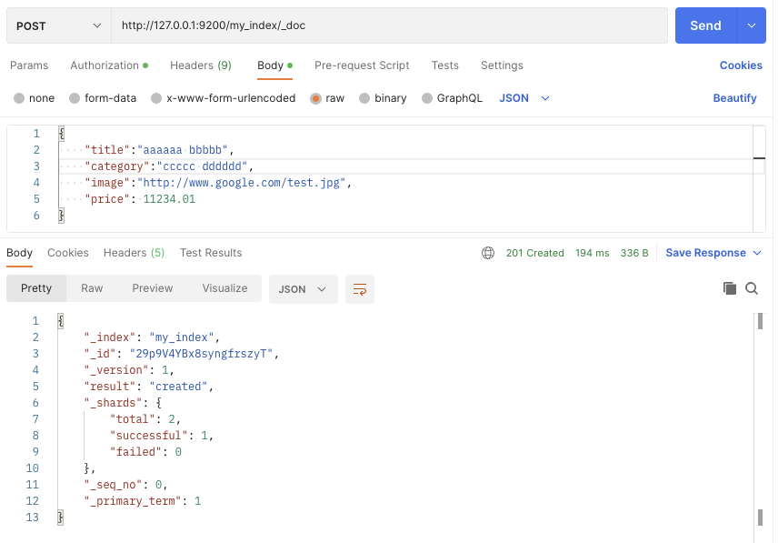

使用我们自己生成的文档id, 此时是可以使用put来进行操作的, 因为做的事幂等性的操作, 每次返回的数据必须一致:

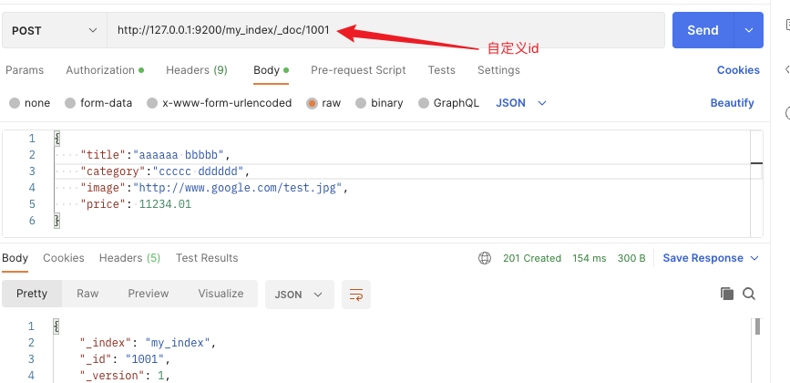

根据id获取文档, 如果找到了那么found就会是true, 否则found就是false

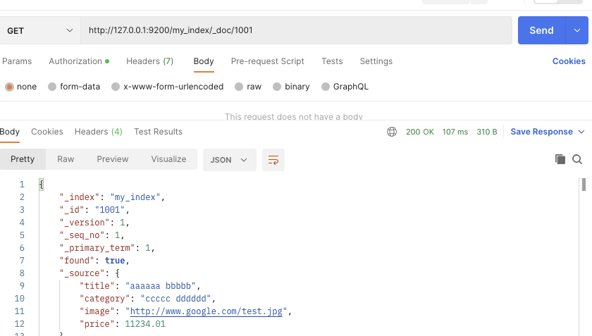

全文档查询:

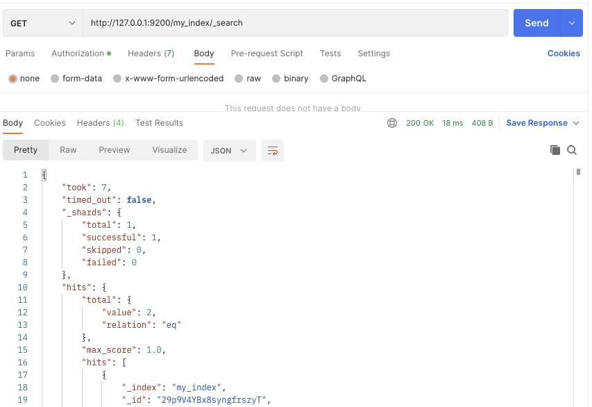

修改文档, 修改文档存在两种修改一种修改为完全修改, 另一种为特定字段修改

全量修改就是, 根据插入全部修改, 如果修改成功的话就会覆盖文档, 但其实本质就是使用put进行插入操作, 但是系统会察觉到其实是覆盖掉了原先的文件.
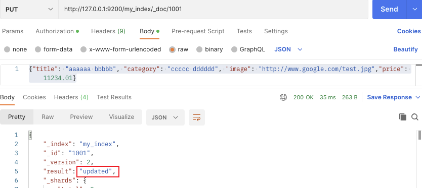

更新字段
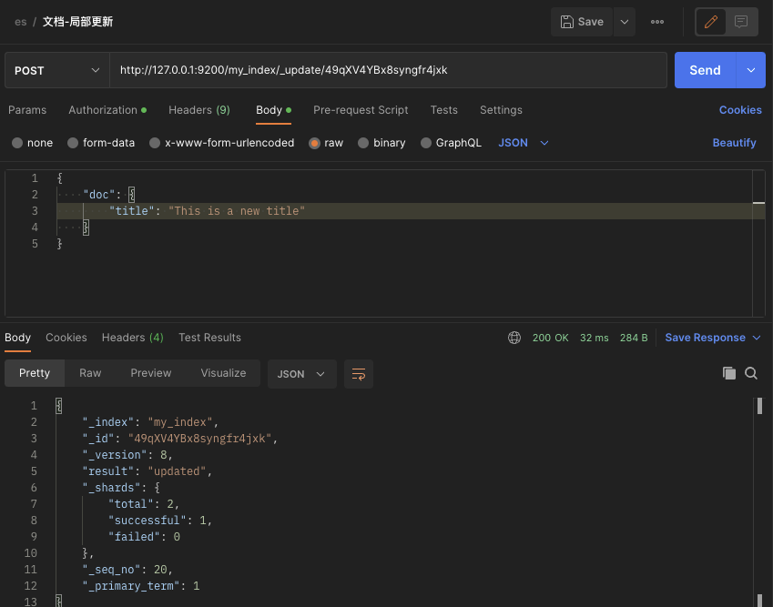

删除文档
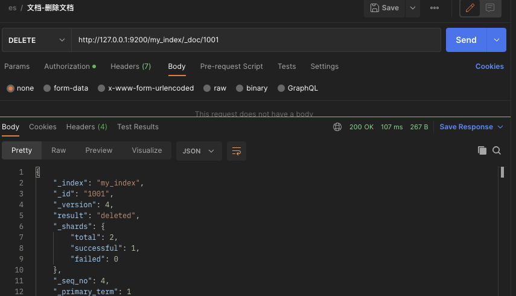

#### 文档查询

es的强大功能是查询, 而不是增删改, 注意这里的search使用的就是倒排索引, 我们可以直接进行单词的查询

条件查询可以使用url来进行也可以使用postbody来进行, get的url查询:

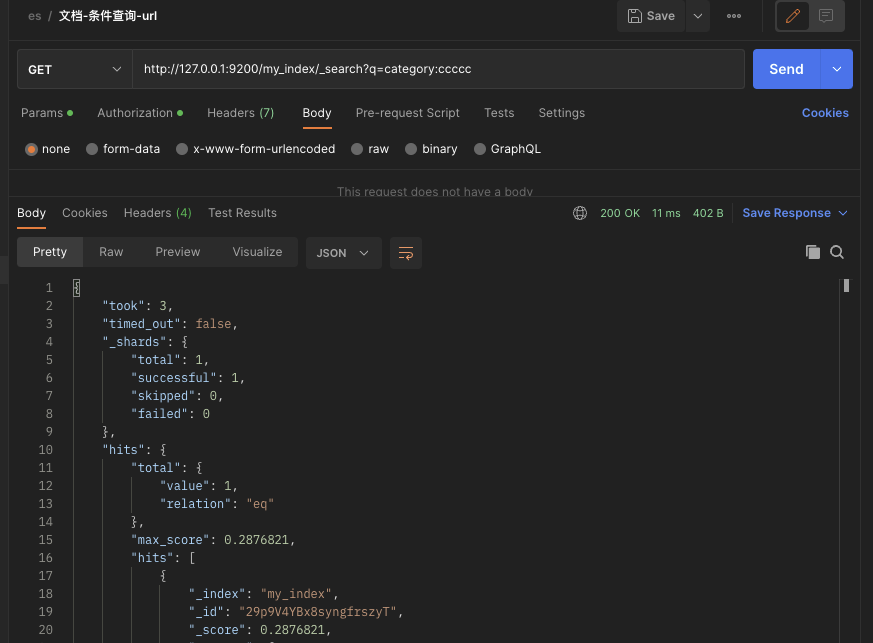

---

使用请求体进行查询
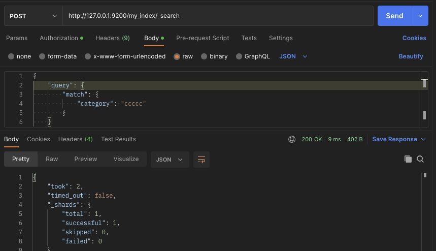

---

查询全部
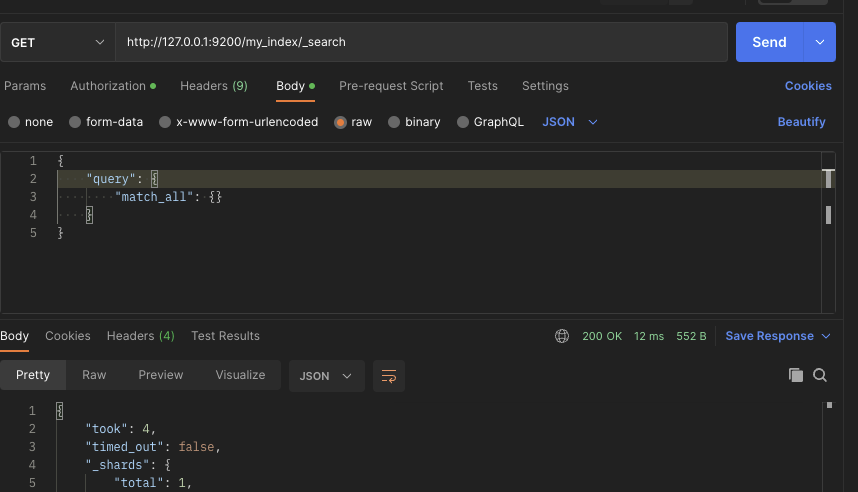

---

请求体的一般使用:

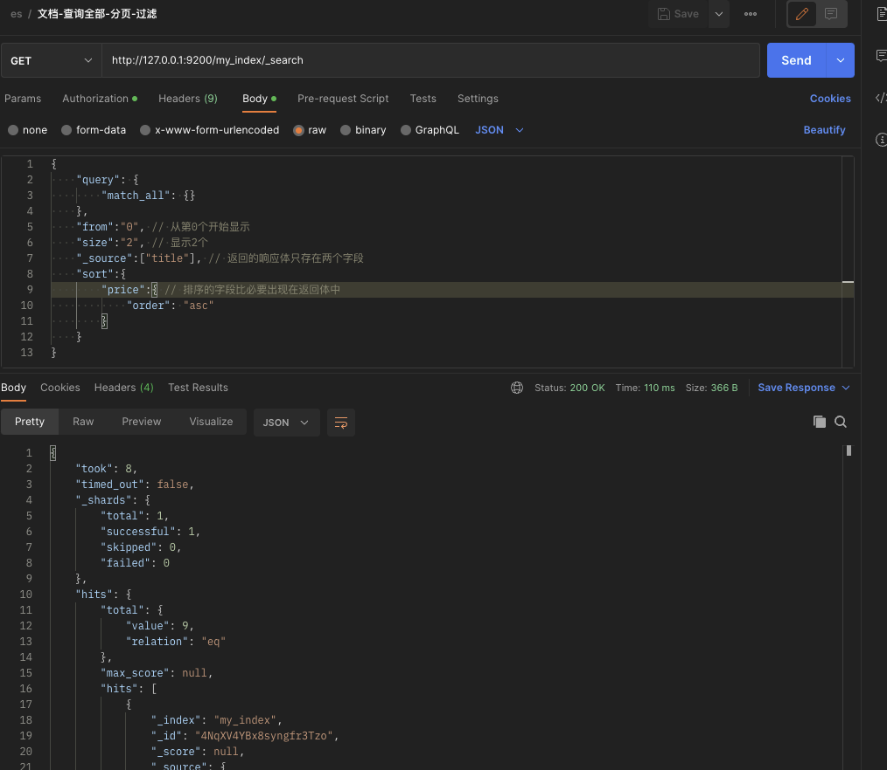

#### 复合条件查询

在进行搜索的时候所有的字段都会进行分词, 然后进行倒排索引进行匹配, 匹配成功就会直接返回.

```json
{
    "query":{
        "bool":{ // 表是多个条件进行查询
            "must":[ // 类似and属性的查询, 所有的必须成立
                {"match": {"title": "This"}},
                {"match": {"price": 11234.01}}
            ],
            "should":[ // 类似or属性的查询, 任意命中就可以
                {"match": {"title": "This"}},
                {"match": {"price": 111}}
            ],
            "filter":[ // 范围查询
                {
                    "range":{
                        "price":{
                            "gt": 5000 //大于5000的文档
                        }
                    }
                }
            ]
        }
    }
}
```

---

如果需要精准匹配的话就需要使用特殊关键词 match_phrase

```json
{
    "query":{
        "bool":{ // 表是多个条件进行查询
            "must":[ // 类似and属性的查询, 所有的必须成立
                {"match": {"title": "This"}},
                {"match": {"price": 11234.01}}
            ],
            "should":[ // 类似or属性的查询, 任意命中就可以
                {"match": {"title": "This"}},
                {"match": {"price": 111}}
            ],
            "filter":[ // 范围查询
                {
                    "range":{
                        "price":{
                            "gt": 5000 //大于5000的文档
                        }
                    }
                }
            ]
        }
    }
}
```

---

精准搜索需要用到match_phrase, 也就是文档必须存在所有的词:

```json
{
    "query": {
        "match_phrase": {
            "title": "This is"
        }
    }
}
```

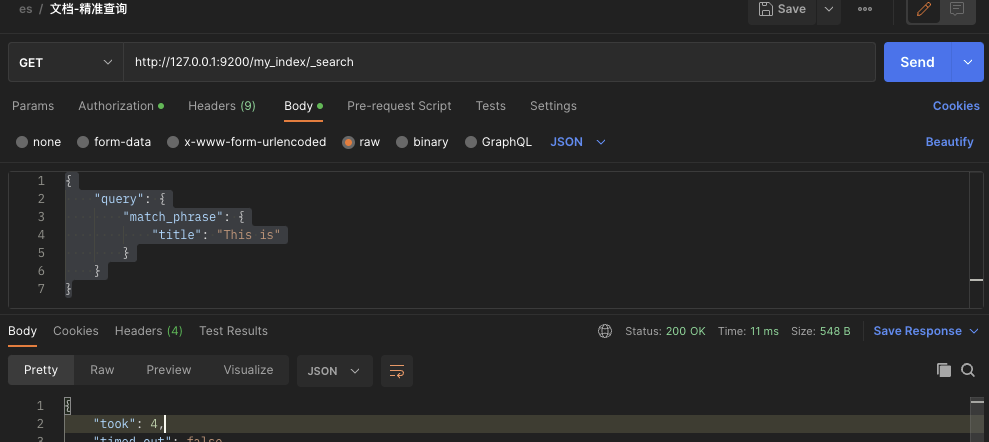

---

添加高亮显示, 需要注意的是, 高亮显示的字段必须是查询字段, 不是结果字段.

```json
{
    "query": {
        "match_phrase": {
            "title": "This is"
        }
    },
    "highlight": {
        "fields": {
            "title": {}
        }
    }
}
```

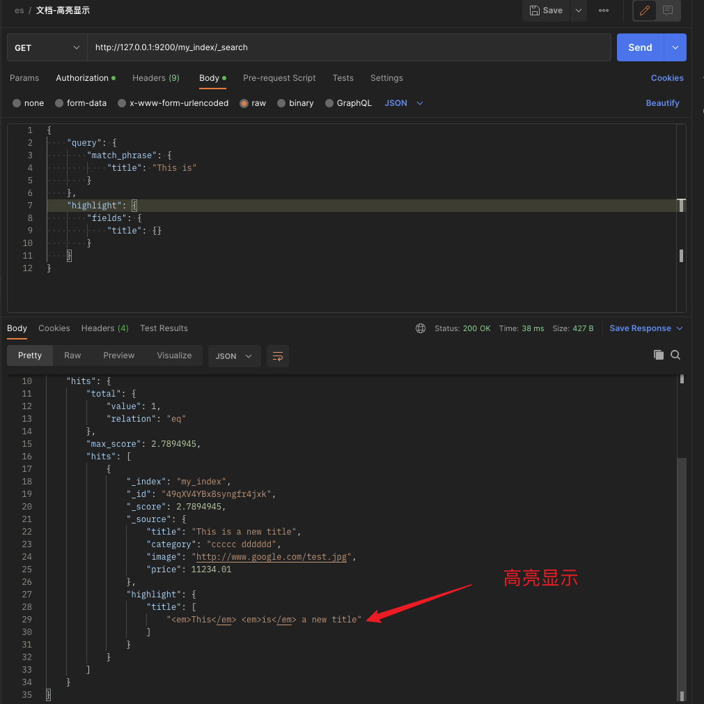

#### 请求体聚合操作

```json
{
    "aggs": { // 聚合操作
        "price_group": { // 对统计结果起的名字, 随意起名字
            "terms": { // 分组操作
                "field":"price" // 对price进行分组, 类似于group by操作
            }
        }
    }
}
```

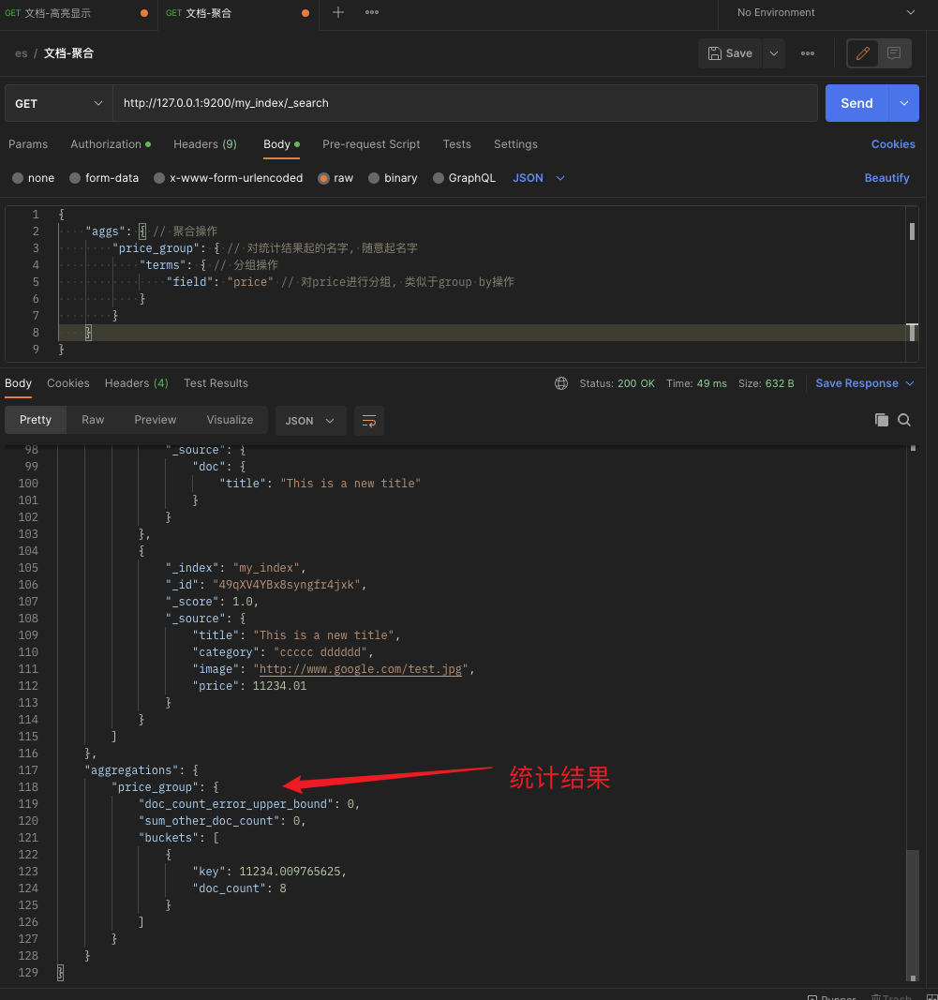

上面的案例中会出现原始的搜索结果, 很多时候我们只需要原始的统计结果, 可以加上size将原始数据进行过滤:

```json
{
    "aggs": { // 聚合操作
        "price_group": { // 对统计结果起的名字, 随意起名字
            "terms": { // 分组操作
                "field":"price" // 对price进行分组, 类似于group by操作
            }
        }
    },
    "size": 0
}
```

统计平均值:

```json
{
    "aggs": { // 聚合操作
        "price_group": { // 对统计结果起的名字, 随意起名字
            "avg": { // 分组操作
                "field":"price" // 对price进行分组, 类似于group by操作
            }
        }
    },
    "size": 0
}
```

#### 结构映射

很多时候我们对字段的查询可以进行分词查询. 有的时候却需要进行全量查询. 那么如何进行查询我们使用的就是es的结构映射. 在sql数据库中可以看做是列的约束. 需要使用post mapping路径 <http://127.0.0.1:9200/user/_mapping>

如果想要查询, 可以使用get方法对上面的映射进行查看

```json
{
    "properties":{ // 数据需要什么样的约束
        "name":{
            "type":"text", // 类型是字符串类型
            "index":true // 表明这个字段可以被索引查询的
        },
        "gender":{
            "type":"keyword", // 不能被分词只能被完整匹配
            "index":true // 表明这个字段可以被索引查询的
        },
        "telphone":{
            "type":"keyword", // 不能被分词只能被完整匹配
            "index":false // 不能被索引, 如果搜索会报错因为没有索引
        }
    }
}
```

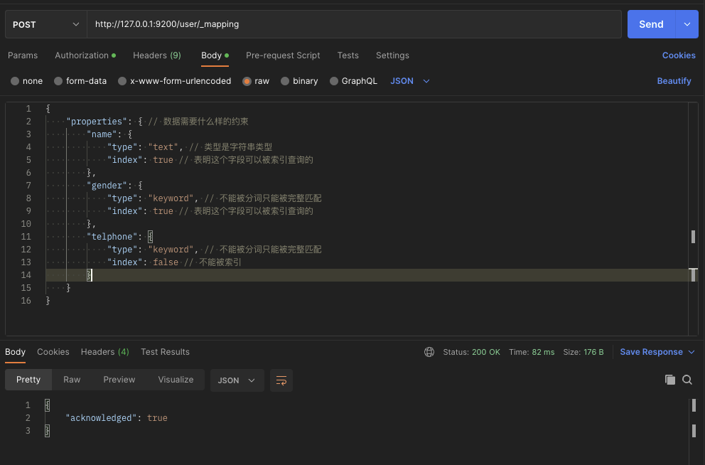

## 使用kibana

索引操作:

```kibana
# 创建索引
# PUT 索引名称(小写)
PUT test_index

# 增加索引的配置: json格式的主题内容
PUT test_index_1
{
  "aliases": {
    "test1": {}
  }
}

# 判断: HEAD 索引, 返回http状态码200,或者404
HEAD test_index

# 查询索引
# GET 索引名称
GET test_index_1
GET test1
# 查询所有索引
GET _cat/indices

# 不允许修改索引配置, 如果需要修改就要创建新的
#POST test_index_1
#{
#  "aliases": {
#    "test2": {}
#  }
#}

# 删除索引
# DELETE 索引名称
DELETE test_index_1
```

简单的文档操作, 增删改查:

```kibana
##################
# 文档操作
##################
# 创建文档, 也就是创建索引数据, 创建数据需要拥有唯一性标示, 所以创建的时候应该增加唯一性标示
PUT test_doc

# 手动
PUT test_doc/_doc/1001
{
  "id": 1,
  "first_name": "Jeanette",
  "last_name": "Penddreth",
  "email": "jpenddreth0@census.gov",
  "gender": "Female",
  "ip_address": "26.58.193.2"
}
# 自动
POST test_doc/_doc
{
  "id": 1,
  "first_name": "Jeanette",
  "last_name": "Penddreth",
  "email": "jpenddreth0@census.gov",
  "gender": "Female",
  "ip_address": "26.58.193.2"
}

# 查询文档
GET test_doc/_doc/1001

# 查询索引中所有的文档数据
GET test_doc/_search

# 修改
PUT test_doc/_doc/1001
{
  "id": 2,
  "first_name": "Giavani",
  "last_name": "Frediani",
  "email": "gfrediani1@senate.gov",
  "gender": "Male",
  "ip_address": "229.179.4.212"
}
POST test_doc/_doc/1002
{
  "id": 123,
  "first_name": "GGGGGGG",
  "last_name": "FFFFFFFF",
  "email": "gfrediani1@senate.gov",
  "gender": "Male",
  "ip_address": "229.179.4.212"
}


# 删除数据
DELETE test_doc/_doc/1002
```

查询操作

```kibana
#######################
# 数据索引
#######################
PUT test_query

# 批量添加数据, 总共插入6条数据
PUT test_query/_bulk
{"index":{"_index":"test_query","_id":"1001"}}
{"id":"1001","name":"zhang san", "age": 30}
{"index":{"_index":"test_query","_id":"1002"}}
{"id":"1002","name":"li si", "age": 40}
{"index":{"_index":"test_query","_id":"1003"}}
{"id":"1003","name":"wang wu", "age": 50}
{"index":{"_index":"test_query","_id":"1004"}}
{"id":"1004","name":"zhangsan", "age": 30}
{"index":{"_index":"test_query","_id":"1005"}}
{"id":"1005","name":"lisi", "age": 40}
{"index":{"_index":"test_query","_id":"1006"}}
{"id":"1006","name":"wangwu", "age": 50}

# 查询
GET test_query/_search # 查询所有数据

# match关键字的作用主要是匹配分词结果
GET test_query/_search
{
  "query":{
    "match":{
      "name": "zhangsan li"
    }
  }
}

# 完整的关键词匹配, 这里无法匹配因为zhang和san被分词了, 所以无法查询任何结果
GET test_query/_search
{
  "query":{
    "term":{
      "name": {
        "value": "zhang san"
      }
    }
  }
}

# 对查询结果进行限制, 只要name和age
GET test_query/_search
{
  "_source": ["name", "age"], 
  "query":{
    "match":{
      "name": "zhangsan li"
    }
  }
}

# 复合条件查询, or的逻辑, 多个match任何一个满足就会返回
GET test_query/_search
{
  "query":{
    "bool":{
      "should": [
        {"match": {"name":"zhangsan"}},
        {"match": {"age":40}}  
      ]
    }
  }
}

# 排序后查询
GET test_query/_search
{
  "query":{
    "match":{
      "name": "zhang li"
    }
  },
  "sort":[
    {"age": {"order": "desc"}}
  ]
}

# 分页查询
GET test_query/_search
{
  "query":{
    "match_all":{
    }
  },
  "from":0,
  "size":2
}
```

简单的聚合操作

```kibana
#######################
# 聚合操作
#######################
# 获取所有的年龄
GET test_query/_search
{
  "aggs":{
    "ageGroup":{
      "terms": {
        "field": "age"
      }
    }
  },
  "size": 0 
}

# 对分组的年龄求和
GET test_query/_search
{
  "aggs":{
    "ageGroup":{
      "terms": {
        "field": "age"
      },
      "aggs": {
        "age_sum": {
          "sum": {"field": "age"}
        }
      }
    }
  },
  "size": 0 
}
# 平均值
GET test_query/_search
{
  "aggs":{
    "avg_age":{
      "avg": {
        "field": "age"
      }
    }
  },
  "size": 0 
}

# 获取前几名操作, 前两名, 对结果进行排序
GET test_query/_search
{
  "aggs":{
    "top2":{
      "top_hits": {
        "sort": [{"age": {"order": "desc"}}], 
        "size": 2
      }
    }
  },
  "size": 0 
}
```

索引模版的修改

```kibana
#######################
# 修改索引模版
#######################
PUT test_temp
GET test_temp
# 修改index
PUT test_temp_1
{
  "settings":{
    "number_of_shards": 2
  }
}
# 对新建索引的模版进行修改
# 创建/覆盖模版
PUT _template/mytemplate
{
  "index_patterns": ["my*"],
  "settings": {
    "index": {
      "number_of_shards": "2"
    }
  },
  "mappings": {
    "properties": {
      "now":{
        "type": "date",
        "format": "yyyy/MM/dd"
      }
    }
  }
}

# 查看模版
GET _template/mytemplate

PUT my_test_temp_1
GET my_test_temp_1

# 删除模版
DELETE _template/mytemplate
```

自定义的分词: 在插件的/config目录中可以添加dic文件, 然后放入词组. 然后再配置文件中添加dic文件

```kibana
##########################
# 分词的analyzer
##########################
# 中文分词需要下载安装
GET _analyze
{
  "analyzer":"standard",
  "text":"this is a test"
}
```

TFIDF 评分机制

```kibana
##########################
# 文档评分机制
##########################
# 越新的数据评分就会越高, 匹配度越高
PUT test_score
put test_score/_doc/1001
{
  "text": "this is a test string"
}
put test_score/_doc/1002
{
  "text": "this is another text"
}

GET test_score/_search
{
  "query": {
    "match": {
      "text": "this"
    }
  }
}

# 展示分析的过程, TFIDF, 使用的是权重boost和tf/idf计算
GET test_score/_search?explain=true
{
  "query": {
    "match": {
      "text": "this"
    }
  }
}
```

TF: 词频, 搜索文本中各个词条在查询文本中出现的次数. 每次搜索都会司改
IDF 逆文档频率, 搜索文本中的词条在整个索引的所有文档中出现的次数, 出现越多, 越不重要, 也就比较低

使用 GET test_score/_search?explain=true就可以显示搜索的详细评分结果. 其中还会包含

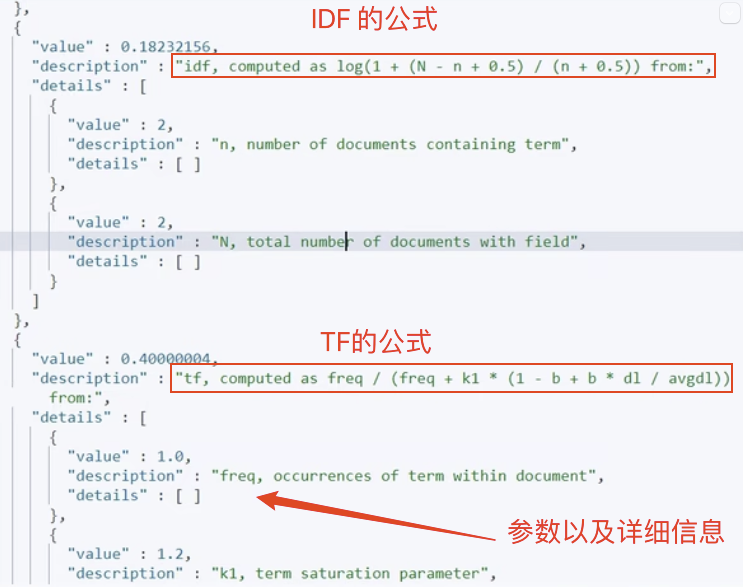

每一条数据都会有一条权重信息, 相对于整个索引来说的结果权重, 我们成为文档权重, 我们还可以手动复制一个查询权重, 这个查询权重可以给文件赋值一个查询的权重.

```kibana
# 修改查询权重, query就是关键字, boost就是针对于这个关键字的查询权重
GET test_score/_search
{
  "query": {
    "bool": {
      "should": [
        {"match": {"text": {"query": "this", "boost": 1}}},
        {"match": {"text": {"query": "another", "boost": 5}}}
      ]
    }
  }
}
```

## EQL event query language, 事件查询语言

搜索到的数据流或者索引必须包含时间戳或者事件类别字段, 默认情况下EQL使用通用的ECS中的@timestamp和event.category字段

```json
# 创建索引
PUT /gmail
PUT gmail/_bulk
{"index":{"_index":"gmail"}}
{"@timestamp":"2022-06-01T12:00:00.00+08:00", "event":{"category":"page"}, "page":{"session_id":"ac8e2570-fdc2-4236-aa87-3f5d8f4af805", "last_page_id":"", "page_id":"login","user_id":1}}
{"index":{"_index":"gmail"}}
{"@timestamp":"2022-06-01T12:00:10.00+08:00", "event":{"category":"page"}, "page":{"session_id":"ac8e2570-fdc2-4236-aa87-3f5d8f4af805", "last_page_id":"login", "page_id":"good_list","user_id":1}}
{"index":{"_index":"gmail"}}
{"@timestamp":"2022-06-01T12:00:20.00+08:00", "event":{"category":"page"}, "page":{"session_id":"ac8e2570-fdc2-4236-aa87-3f5d8f4af805", "last_page_id":"good_list", "page_id":"good_detail","user_id":1}}
{"index":{"_index":"gmail"}}
{"@timestamp":"2022-06-01T12:00:30.00+08:00", "event":{"category":"page"}, "page":{"session_id":"ac8e2570-fdc2-4236-aa87-3f5d8f4af805", "last_page_id":"good_detail", "page_id":"order","user_id":1}}
{"index":{"_index":"gmail"}}
{"@timestamp":"2022-06-01T12:00:40.00+08:00", "event":{"category":"page"}, "page":{"session_id":"ac8e2570-fdc2-4236-aa87-3f5d8f4af805", "last_page_id":"order", "page_id":"payment","user_id":1}}
{"index":{"_index":"gmail"}}
{"@timestamp":"2022-06-01T12:00:50.00+08:00", "event":{"category":"page"}, "page":{"session_id":"ac8e2570-fdc2-4236-aa87-3f5d8f4af805", "last_page_id":"", "page_id":"login","user_id":2}}
{"index":{"_index":"gmail"}}
{"@timestamp":"2022-06-01T12:00:50.00+08:00", "event":{"category":"page"}, "page":{"session_id":"ac8e2570-fdc2-4236-aa87-3f5d8f4af805", "last_page_id":"login", "page_id":"payment","user_id":2}}

# 查询任意category分类, 只要用户为1就查询出来
GET /gmail/_eql/search
{
  "query":"""
    any where page.user_id == "1"
  """
}

# 查询出符合条件的事件
# 根据时间戳查询我们需要的数据
GET /gmail/_eql/search
{
  "query":"""
    any where true
  """,
  "filter":{
    "range": {
      "@timestamp": {
        "gte": 1654056000000,
        "lte": 1654056005000
      }
    }
  }
}

# 事件序列
# 同一个用户(sessionid), 返回同一个sessionid中,page category的序列结果
# 类似于数据挖掘查看这个用户什么时间做了这些事情
GET /gmail/_eql/search
{
  "query":"""
    sequence by page.session_id
      [page where page.page_id=="login"]
      [page where page.page_id=="good_detail"]
  """
}
```

安全用例, eql很适合对数据进行安全的数据挖掘

```json
## eql在安全检测中被广泛使用
# 比如下面的查询就是在所有的数据中找到process.name中包含regsvr32的字段
GET my-eql-index/_eql/search?filter_path=-hits.events
{
  "query":"""
    any where process.name=="regsvr32.exe"
  """
}
```

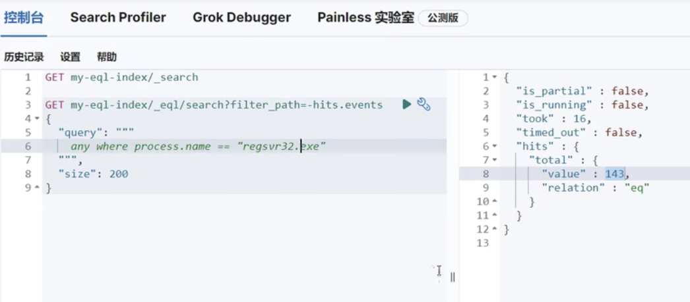

```json
# 检查命令行参数
GET my-eql-index/_eql/search?filter_path=-hits.events
{
  "query":"""
    any 
    where process.name=="regsvr32.exe"
    and process.command_line.keyword != null
  """
}
```

找到一个结果命中, 这种行为是有共计性的
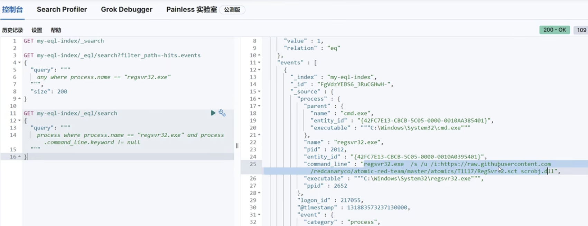

也可以查看是否被执行了这个dll文件
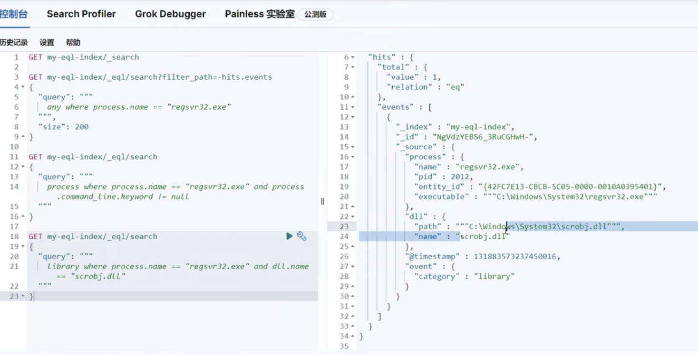

这里就是通过序列查看是否被一个一个执行过了

### SQL

在6.3以后就支持sql了, 我们可以吧sql看成是一个eql的翻译器.

cluster = databse, index = table, row = document, column = field

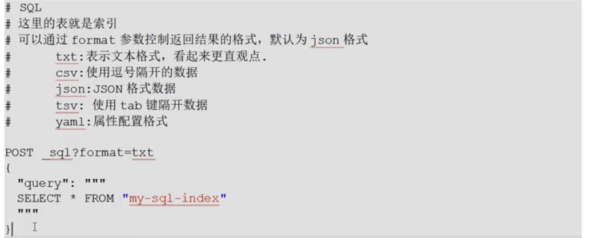

查询全部的index类型

```json
# sql, 索引的名字一般有引号,因为索引可能出现特殊字符
POST _sql?format=text
{
  "query":"""
    select * from "my-sql-index"
  """
}
# text表示的是用sqltable展示, 也可以用yaml或者json
POST _sql?format=text
{
  "query":"""
    select * from "my-sql-index" where page_count>500
  """
}
# 转换为dsl类型的数据
POST _sql/translate
{
  "query":"""
    select * from "my-sql-index" where page_count>500
  """
}
POST _sql/translate
{
  "query":"""
    select * from "my-sql-index" where page_count>500
  """,
  "filter":{
    "range": {
      "page_count": {
        "gte": 400,
        "lte": 500
      }
    }
  },
  "size": 20
}

# 查看所有的表
GET _sql?format=txt
{
  "query":"""
    show tables
  """
}

# 查看指定的索引
GET _sql?format=txt
{
  "query":"""
    show tables like "%testabc%"
  """
}

GET _sql?format=txt
{
  "query":"""
    describe "myindex"
  """
}
```

## nlp 自然语言处理

在网上下载opennlp插件然后放入plugins文件目录下. 注意要下载相同的版本, 如果不同的话可以尝试修改`plugin-descriptor.properties`文件的版本信息. 版本差别不大的时候可以用. 然后就可以重启.

Opennlp可以检测时间,人物,位置等信息. 可以从sourceforge下载NER的模型信息 `bin/ingest-opennlp/download-models`

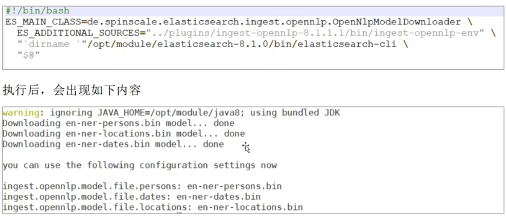

下载模型结束以后就可以在elasticsearch的根目录下的config中的elasticsearch.yml文件中指定模型.

```properties
ingest.opennlp.model.file.persons: en-ner-persons.bin
ingest.opennlp.model.file.dates: en-ner-dates.bin
...
```

然后重新启动es, 就可以使用:

1. 创建nlp的预处理pipeline, 在数据存储在es之前, 提前进行处理. 分析处理的字段叫做message.

   ```json
   PUT _injest/pipeline/opennlp-pipeline
   {
     "processors":[
      {
        "opennlp":{
          "field": "message"
        }
      }
     ]
   }
   ```

2. 增加数据中需要有message信息, 然后在查询信息的结果中就会有`entities`字段附带着提取出来的信息:
   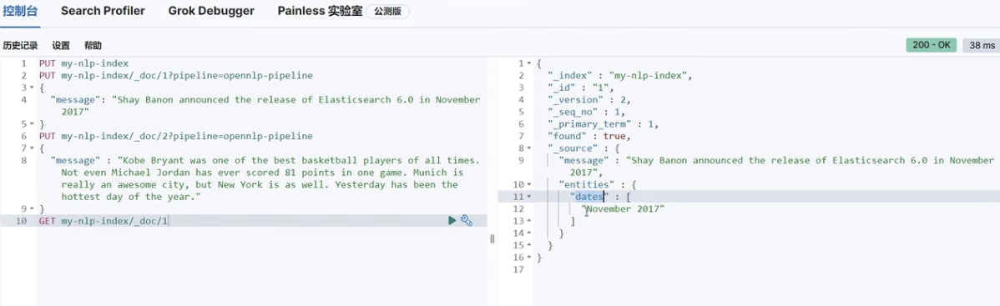
