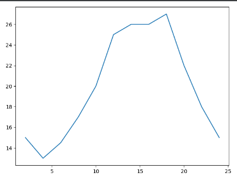
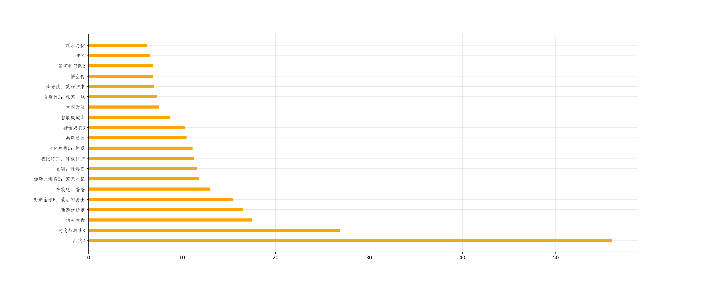
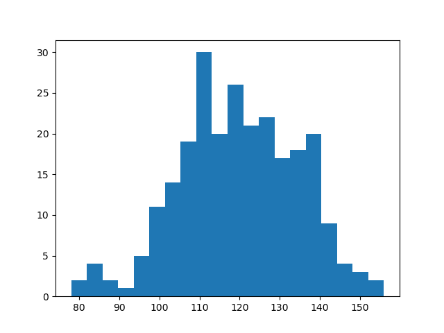
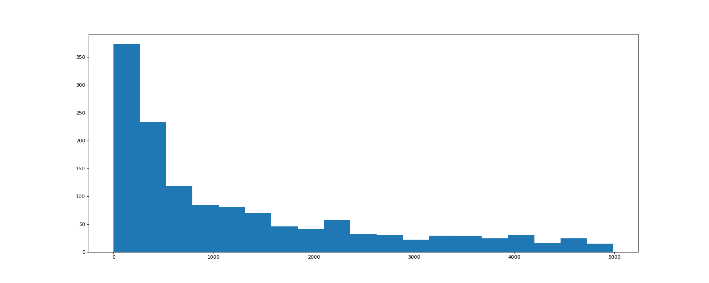
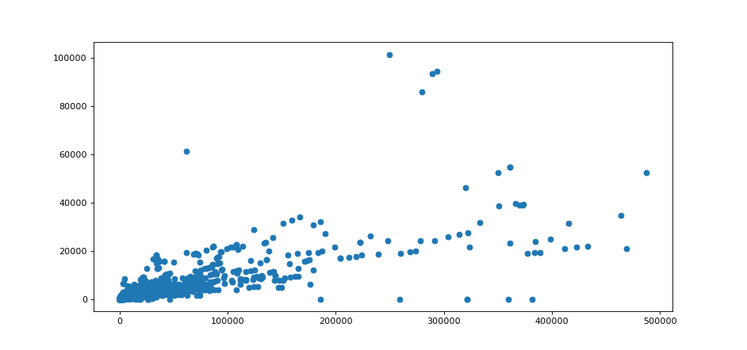
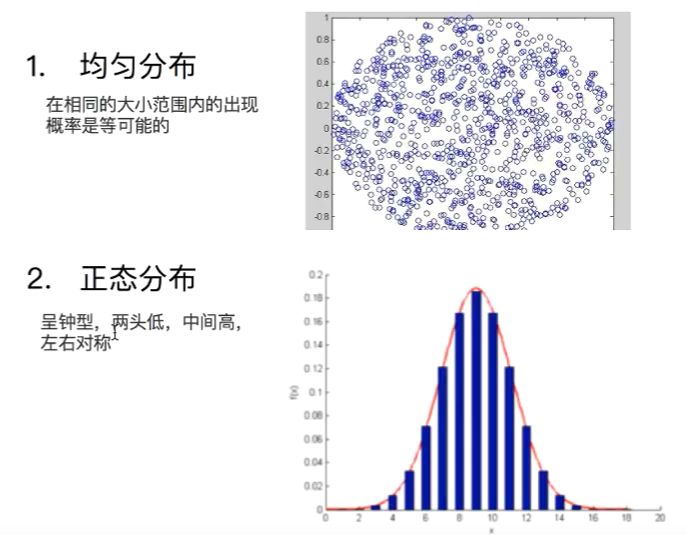

# Python 数据分析工具

[toc]

## MatPlotLib

python底层的绘图库. 主要做数据可视化的图标. 名字取材于matlab. 模仿MATLAB构架. matplotlib主要使用的是pyplot库来进行图标的操作.

anaconda安装pyplot库

```shell
conda install matplotlib 
```

### 创建折线图

然后创建python

```python
from matplotlib import pyplot as plt

if __name__ == "__main__":
    x = range(2, 26, 2)
    y = [15, 13, 14.5, 17, 20, 25, 26, 26, 27, 22, 18, 15]

    plt.plot(x, y)
    plt.show()
```

输出:


<!--  -->
可以修改一下图片更多的属性. 包括保存

```python
from matplotlib import pyplot as plt

if __name__ == "__main__":
    # 修改图片的大小, 宽20, 高8. 每英寸80pix, 清晰程度
    fig = plt.figure(figsize=(20, 8), dpi=80)

    x = range(2, 26, 2)  # range()返回一个list, 2-26 每个数字间隔为2. 输入必须为整数
    y = [15, 13, 14.5, 17, 20, 25, 26, 26, 27, 22, 18, 15]

    # 修改x刻度, 默认为步长为5
    specialTicks = [i / 2 for i in range(4, 50)]  # 4-50 的列表, 每隔值除以2
    # plt.xticks(specialTicks)
    plt.xticks(specialTicks[::3])  # 在列表中每隔3个取一个
    plt.yticks([14, 16, 18, 20, 22, 24, 26])  # y的卡尺也是一个list

    # 开始绘图
    plt.plot(x, y)

    # 保存
    # plt.savefig("./test.png")
    # 矢量图保存
    # plt.savefig("./test.svg")

    # 展示
    plt.show()
```

也可以设置不同的字体或者展示方法

```python
import random

from matplotlib import font_manager
from matplotlib import pyplot as plt

# matplotlib默认不显示中文. 可以使用fc-list从unix中查看语言
# # 推荐的字体方法:
# font = {'family': 'MicroSoft YaHei',
#         'weight': 'bold'}
# matplotlib.rc('font', **font)  # 等同于 matplotlib.rc('font', family'MicroSoft YaHei', weight='bold')

# 100%可以 因为可以找到字体文件
myFont = font_manager.FontProperties(fname='E:\\Workspace\\ml\\python-tools\\simfang.ttf')

if __name__ == "__main__":
    fig = plt.figure(figsize=(20, 8), dpi=80)
    x = range(0, 120)
    y = [random.randint(20, 35) for i in range(120)]  # 120个随机数 从20-35

    # 显示字符串
    _x = list(x)[::3]  # 每10个切一个片
    # _xticks_lables = ["hello,{}".format(i) for i in _x]
    if x.__len__() > 60:
        _xticks_lables = ["10点{}分".format(i) for i in range(60)]
        _xticks_lables += ["11点{}分".format(i) for i in range(x.__len__() - 60)]
    else:
        _xticks_lables = ["10点{}分".format(i) for i in range(x.__len__())]

    # 步长与数据需要一一对应, 数字对应到字符串: (数字, 字符串)
    # plt.xticks(list(x)[::3], _xticks_lables[::3])
    plt.xticks(list(x)[::10], _xticks_lables[::10], rotation=270, fontproperties=myFont)  # 旋转270度, 设置字体

    # 添加网格
    # plt.grid()
    plt.grid(alpha=0.4)  # 修改网格透明度

    # 添加描述信息
    plt.xlabel("时间", fontproperties=myFont)
    plt.ylabel("温度", fontproperties=myFont)
    plt.title("气温变化情况", fontproperties=myFont)

    # 绘制第一条线
    # plt.plot(x, y)
    plt.plot(x, y, label="第一条线")

    # 绘制第二条线
    y1 = [random.randint(20, 35) for i in range(120)]
    plt.plot(x, y1, label="第二条线", color="cyan", linestyle=':')  # 可以给个颜色

    # 可以用的位置:
    #         best
    #         upper right
    #         upper left
    #         lower left
    #         lower right
    #         right
    #         center left
    #         center right
    #         lower center
    #         upper center
    #         center
    plt.legend(prop=myFont, loc="upper left")  # 字体, 提示的位置

    plt.show()
```


### 散点图

```python
# coding=utf-8
from matplotlib import font_manager
from matplotlib import pyplot as plt

my_font = font_manager.FontProperties(fname="E:\\Workspace\\ml\\python-tools\\simfang.ttf")
y_3 = [11, 17, 16, 11, 12, 11, 12, 6, 6, 7, 8, 9, 12, 15, 14, 17, 18, 21, 16, 17, 20, 14, 15, 15, 15, 19, 21, 22, 22,
       22, 23]
y_10 = [26, 26, 28, 19, 21, 17, 16, 19, 18, 20, 20, 19, 22, 23, 17, 20, 21, 20, 22, 15, 11, 15, 5, 13, 17, 10, 11, 13,
        12, 13, 6]

x_3 = range(1, 32)
x_10 = range(51, 82)

# 设置图形大小
plt.figure(figsize=(20, 8), dpi=80)

# 使用scatter方法绘制散点图,和之前绘制折线图的唯一区别
plt.scatter(x_3, y_3, label="3月份")
plt.scatter(x_10, y_10, label="10月份")

# 调整x轴的刻度
_x = list(x_3) + list(x_10)
_xtick_labels = ["3月{}日".format(i) for i in x_3]
_xtick_labels += ["10月{}日".format(i - 50) for i in x_10]
plt.xticks(_x[::3], _xtick_labels[::3], fontproperties=my_font, rotation=45)

# 添加图例
plt.legend(loc="upper left", prop=my_font)

# 添加描述信息
plt.xlabel("时间", fontproperties=my_font)
plt.ylabel("温度", fontproperties=my_font)
plt.title("标题", fontproperties=my_font)
# 展示
plt.show()

```

### 条形图

条形图使用的绘图方法为bar()

```python
# coding=utf-8
from matplotlib import font_manager
from matplotlib import pyplot as plt

if __name__ == '__main__':
    # 字体
    my_font = font_manager.FontProperties(fname="E:\\Workspace\\ml\\python-tools\\simfang.ttf")

    a = ["战狼2", "速度与激情8", "功夫瑜伽", "西游伏妖篇", "变形金刚5：最后的骑士", "摔跤吧！爸爸", "加勒比海盗5：死无对证", "金刚：骷髅岛", "极限特工：终极回归", "生化危机6：终章",
         "乘风破浪", "神偷奶爸3", "智取威虎山", "大闹天竺", "金刚狼3：殊死一战", "蜘蛛侠：英雄归来", "悟空传", "银河护卫队2", "情圣", "新木乃伊", ]

    b = [56.01, 26.94, 17.53, 16.49, 15.45, 12.96, 11.8, 11.61, 11.28, 11.12, 10.49, 10.3, 8.75, 7.55, 7.32, 6.99, 6.88,
         6.86, 6.58, 6.23]
    # # 绘制纵向条形图
    # # 设置图形大小
    # plt.figure(figsize=(20, 15), dpi=80)
    # # 绘制条形图
    # plt.bar(range(len(a)), b, width=0.3) # 线条粗细
    # # 设置字符串到x轴
    # plt.xticks(range(len(a)), a, fontproperties=my_font, rotation=90)
    # plt.savefig("./movie.png")

    # 绘制横向条形图
    # 设置图形大小
    plt.figure(figsize=(20, 8), dpi=80)
    # 绘制条形图
    plt.barh(range(len(a)), b, height=0.3, color="orange")  # 线条粗细
    # 设置字符串到x轴
    plt.yticks(range(len(a)), a, fontproperties=my_font)
    plt.grid(alpha=0.3)  # 网格透明度

    plt.show()
```



多属性条状图

```python
# coding=utf-8
from matplotlib import font_manager
from matplotlib import pyplot as plt

if __name__ == '__main__':
    # 字体
    my_font = font_manager.FontProperties(fname="E:\\Workspace\\ml\\python-tools\\simfang.ttf")

    a = ["猩球崛起3：终极之战", "敦刻尔克", "蜘蛛侠：英雄归来", "战狼2"]
    b_16 = [15746, 312, 4497, 319]
    b_15 = [12357, 156, 2045, 168]
    b_14 = [2358, 399, 2358, 362]

    bar_width = 0.2

    # 将每一个图形移动一下
    x_14 = list(range(len(a)))
    x_15 = [i + bar_width for i in x_14]
    x_16 = [i + bar_width * 2 for i in x_14]

    # 设置图形大小
    plt.figure(figsize=(20, 8), dpi=80)

    plt.bar(range(len(a)), b_14, width=bar_width, label="9月14日")
    plt.bar(x_15, b_15, width=bar_width, label="9月15日")
    plt.bar(x_16, b_16, width=bar_width, label="9月16日")

    # 设置图例
    plt.legend(prop=my_font)

    # 设置x轴的刻度
    plt.xticks(x_15, a, fontproperties=my_font)

    plt.show()

```

### 直方图

将输入的数据自动分组, 然后展示. 需要注意的是, 统计过的数据是不能生成直方图的. 统计过的数据可以使用bar来进行绘制



```python
# coding=utf-8
from matplotlib import font_manager
from matplotlib import pyplot as plt

if __name__ == '__main__':
    # 字体
    my_font = font_manager.FontProperties(fname="E:\\Workspace\\ml\\python-tools\\simfang.ttf")

    a = [131, 98, 125, 131, 124, 139, 131, 117, 128, 108, 135, 138, 131, 102, 107, 114, 119, 128, 121, 142, 127, 130,
         124, 101, 110, 116, 117, 110, 128, 128, 115, 99, 136, 126, 134, 95, 138, 117, 111, 78, 132, 124, 113, 150, 110,
         117, 86, 95, 144, 105, 126, 130, 126, 130, 126, 116, 123, 106, 112, 138, 123, 86, 101, 99, 136, 123, 117, 119,
         105, 137, 123, 128, 125, 104, 109, 134, 125, 127, 105, 120, 107, 129, 116, 108, 132, 103, 136, 118, 102, 120,
         114, 105, 115, 132, 145, 119, 121, 112, 139, 125, 138, 109, 132, 134, 156, 106, 117, 127, 144, 139, 139, 119,
         140, 83, 110, 102, 123, 107, 143, 115, 136, 118, 139, 123, 112, 118, 125, 109, 119, 133, 112, 114, 122, 109,
         106, 123, 116, 131, 127, 115, 118, 112, 135, 115, 146, 137, 116, 103, 144, 83, 123, 111, 110, 111, 100, 154,
         136, 100, 118, 119, 133, 134, 106, 129, 126, 110, 111, 109, 141, 120, 117, 106, 149, 122, 122, 110, 118, 127,
         121, 114, 125, 126, 114, 140, 103, 130, 141, 117, 106, 114, 121, 114, 133, 137, 92, 121, 112, 146, 97, 137,
         105, 98, 117, 112, 81, 97, 139, 113, 134, 106, 144, 110, 137, 137, 111, 104, 117, 100, 111, 101, 110, 105, 129,
         137, 112, 120, 113, 133, 112, 83, 94, 146, 133, 101, 131, 116, 111, 84, 137, 115, 122, 106, 144, 109, 123, 116,
         111, 111, 133, 150]

    # plt.hist(a, 20)  # 直接展示

    # 计算组数
    d = 3  # 组距
    num_bins = (max(a) - min(a)) // d  # 这里需要被整除, 否则的话不会匹配, 需要给d+1
    print(max(a), min(a), max(a) - min(a))
    print(num_bins)

    # 设置图形的大小
    plt.figure(figsize=(20, 8), dpi=80)
    # plt.hist(a, num_bins) # 频数分布图
    plt.hist(a, num_bins, normed=True)  # 频率分布图

    # 设置x轴的刻度
    plt.xticks(range(min(a), max(a) + d, d))

    plt.grid()

    plt.show()
```

## Numpy 数据处理库

numpy是数据处理库, 用来处理不同的数据类型.

```python
# coding=utf-8
import numpy as np

###
# 数组, 数组与数组间的运算
###

t1 = np.arange(12)
print(t1)  # [ 0  1  2  3  4  5  6  7  8  9 10 11]

print(t1.shape)  # 展示形态, 是一个一维数组, 第二维没有数据, (12,)

t2 = np.array([[1, 2, 3], [4, 5, 6]])  # 一个二维数组
print(t2)  # [[1 2 3] [4 5 6]]
print(t2.shape)  # (2,3), 二维数组, 两列, 每列三个

t3 = np.array([[[1, 2, 3], [4, 5, 6]], [[7, 8, 9], [10, 11, 12]]])
print(t3)
print(t3.shape)  # (2, 2, 3) 三维数组 两个两行三列的数组

print("*" * 100)

t4 = np.arange(12)  # 创建一个一维数组
print(t4.reshape((3, 4)))  # 转变成一个二维的 三行四列数组

t5 = np.arange(24).reshape((2, 3, 4))  # 转换成一个三维数组
print(t5)
print(t5.reshape((4, 6)))  # 转换成为一个二维数组, t5 不会改变
print(t5)

print(t5.reshape((24,)))  # 转换成为一个一维数组
print("t5 不变:")
print(t5)
print("*" * 100)

# 获取元素个数
print(t5.size)
print(t5.flatten())  # 等同于reshape((24,)) 展示成一维的数组

t5 = t5.reshape((4, 6))
print(t5)
print(t5 + 2)  # 所有数字加2

print(t5 / 0)
# [[nan inf inf inf inf inf]
#  [inf inf inf inf inf inf]
#  [inf inf inf inf inf inf]
#  [inf inf inf inf inf inf]]

t6 = np.arange(100, 124).reshape((4, 6))
print(t6)
print(t6 + t5)  # 单纯的每个数字位置的数字计算
# [[100 102 104 106 108 110]
#  [112 114 116 118 120 122]
#  [124 126 128 130 132 134]
#  [136 138 140 142 144 146]]

t7 = np.arange(0, 6)  # [0,1,2,3,4,5]
print(t5 - t7)  # 每一行进行计算
# [[ 0  0  0  0  0  0]
#  [ 6  6  6  6  6  6]
#  [12 12 12 12 12 12]
#  [18 18 18 18 18 18]]

t8 = np.arange(4).reshape(4, 1)  # [[1],[2],...]
print(t5 - t8)  # 每一列的数字减去每一列的数字
# [[ 0  1  2  3  4  5]
#  [ 5  6  7  8  9 10]
#  [10 11 12 13 14 15]
#  [15 16 17 18 19 20]]


t9 = np.arange(10)
print(t9)
# print(t5 - t9)  # 报错, 形状不一样

t10 = np.arange(24).reshape((4, 6))
print(t10.transpose())  # 行转列(转置)
print(t10.swapaxes(1, 0))  # 等同于转置行转列

print(t10 < 10)
# 返回
# [[ True  True  True  True  True  True]
#  [ True  True  True  True False False]
#  [False False False False False False]
#  [False False False False False False]]

# t10[t10 < 10] = 3
# print(t10)
# # [[ 3  3  3  3  3  3]
# #  [ 3  3  3  3 10 11]
# #  [12 13 14 15 16 17]
# #  [18 19 20 21 22 23]]

# where 操作
print(np.where(t10 < 10, 0, 10))  # 小于10的话赋值0,其他情况下赋值10
# [[ 0  0  0  0  0  0]
#  [ 0  0  0  0 10 10]
#  [10 10 10 10 10 10]
#  [10 10 10 10 10 10]]

# clip 裁剪操作
print(t10.clip(10, 18))  # 比10小的变为10, 大于18的变为18
# [[10 10 10 10 10 10]
#  [10 10 10 10 10 11]
#  [12 13 14 15 16 17]
#  [18 18 18 18 18 18]]


###
# 需要注意的是:只要结构相同三维数组是可以和二维数组计算的
# (1,2) * (1,2,3) 是可以运算的
###


```

numpy的类型

| 类型       | 解释                                                                       |
|------------|----------------------------------------------------------------------------|
| bool_      | 布尔型数据类型（True 或者 False）                                          |
| int_       | 默认的整数类型（类似于 C 语言中的 long，int32 或 int64）                   |
| intc       | 与 C 的 int 类型一样，一般是 int32 或 int 64                               |
| intp       | 用于索引的整数类型（类似于 C 的 ssize_t，一般情况下仍然是 int32 或 int64） |
| int8       | 字节（-128 to 127）                                                        |
| int16      | 整数（-32768 to 32767）                                                    |
| int32      | 整数（-2147483648 to 2147483647）                                          |
| int64      | 整数（-9223372036854775808 to 9223372036854775807）                        |
| uint8      | 无符号整数（0 to 255）                                                     |
| uint16     | 无符号整数（0 to 65535）                                                   |
| uint32     | 无符号整数（0 to 4294967295）                                              |
| uint64     | 无符号整数（0 to 18446744073709551615）                                    |
| float_     | float64 类型的简写                                                         |
| float16    | 半精度浮点数，包括：1 个符号位，5 个指数位，10 个尾数位                    |
| float32    | 单精度浮点数，包括：1 个符号位，8 个指数位，23 个尾数位                    |
| float64    | 双精度浮点数，包括：1 个符号位，11 个指数位，52 个尾数位                   |
| complex_   | complex128 类型的简写，即 128 位复数                                       |
| complex64  | 复数，表示双 32 位浮点数（实数部分和虚数部分）                             |
| complex128 | 复数，表示双 64 位浮点数（实数部分和虚数部分）                             |

```python
# coding=utf-8
import random
import numpy as np

# 使用numpy生成数组,得到ndarray的类型
t1 = np.array([1, 2, 3, ])
print(t1)  # [1 2 3]
print(type(t1))  # <class 'numpy.ndarray'> array数据类型

t2 = np.array(range(10))
print(t2)  # [0 1 2 3 4 5 6 7 8 9]
print(type(t2))  # <class 'numpy.ndarray'>

t3 = np.arange(4, 10, 2)
print(t3)  # [4 6 8]
print(type(t3))  # <class 'numpy.ndarray'>

print(t3.dtype)  # int32 注意, 这里是python的系统类型, 这里32位的python
print("*" * 100)

# numpy中的数据类型
t4 = np.array(range(1, 4), dtype="i1")
print(t4)  # [1 2 3]
print(t4.dtype)  # int8

# numpy中的bool类型
t5 = np.array([1, 1, 0, 1, 0, 0], dtype=bool)
print(t5)  # [1 1 0 1 0 0]
print(t5.dtype)  # bool

# 调整数据类型
t6 = t5.astype("int8")
print(t6)  # [1 1 0 1 0 0]
print(t6.dtype)  # int8

# numpy中的小数
t7 = np.array([random.random() for i in range(10)])
print(t7)
print(t7.dtype)

t8 = np.round(t7, 2)  # 保留两位小数
print(t8)

```

numpy读取文件, 对行列进行读取

```python
import numpy as np

# 测试数据:
# 364857,3521,24218,6501
# 2817086,18485,723,5728
# 9396,76,2,13
# 482681,949,138,598
# 151736,2153,102,444
us_file_path = "E:\\Workspace\\ml\\python-tools\\data\\US_video_data_numbers.csv"
uk_file_path = "E:\\Workspace\\ml\\python-tools\\data\\GB_video_data_numbers.csv"

# np.loadtxt(frame,dtype=np.float,delimiter=None,skiprows=0,usecols=None,unpack=False)
# frame: 文件字符串生成器
# dtype: 内容类型
# delimiter: 分隔符
# skiprows: 跳过
# usecols: 指定列, 索引, 元祖类型
# unpack: 行转列(转置), 默认false, 如果为true按照列来进行分组
# t1 = np.loadtxt(us_file_path, delimiter=',') # 默认属于科学计数法
t1 = np.loadtxt(us_file_path, delimiter=',', dtype=int)
t2 = np.loadtxt(uk_file_path, delimiter=',', dtype=int)

print(t1)
print(t2)

print("*" * 100)

# 取行
# print(t2[2])  # 获取第3行

# 取连续的多行
# print(t2[2:]) # 第3行以后的所有行

# 取不连续的多行
# print(t2[[2, 8, 10]])  # 第2,8,10行

# 取列
# print(t2[1, :]) # 第2行的所有列
# print(t2[2:, :]) # 从第3行开始的所有列
# print(t2[[2, 10, 3], :]) # 从第3,11,4行的所有列

# print(t2[:, 0])  # 第1列, 这里返回一维列表

# 取连续的多列
# print(t2[:,2:]) # 第三列和后面的

# 取不连续的多列
# print(t2[:,[0,2]]) # 第1/3列

# 取行和列，取第3行，第四列的值
# a = t2[2,3]
# print(a)
# print(type(a))

# 取多行和多列，取第3行到第五行，第2列到第4列的结果, (前包后不包)
# 取的是行和列交叉点的位置
b = t2[2:5, 1:4]
# print(b)

# 取多个不相邻的点
# 选出来的结果是（0，0） （2，1） （2，3）
c = t2[[0, 2, 2], [0, 1, 3]]
print(c)
```

常用统计方法

1. `nan`和任何值计算结果都是`nan`

标准差公式: $\sigma = \sqrt{\frac{1}{N}\sum_{i=1}^N(x_i-\mu)}$

```python
# coding=utf-8
import numpy as np

t = np.arange(24).reshape((4, 6))
print(t)

print(np.count_nonzero(t))  # 统计一下多少个非0
print(np.isnan(t))  # 统计一下多少个nan
print(np.sum(t, axis=0))  # 每一列的和
print(np.sum(t, axis=1))  # 每一行的和

print(t.mean())  # 平均值
print(np.median(t))  # 中间值
print(t.max())  # 最大值
print(t.min())  #
print(np.ptp(t, axis=None))  # 最大值和最小值的差
print(t.std(axis=None))  # 标准差

# 数组的操作
t1 = np.arange(12).reshape((2, 6))
t2 = np.arange(12, 24).reshape((2, 6))
print(t1)
# [[ 0  1  2  3  4  5]
#  [ 6  7  8  9 10 11]]

print(t2)
# [[12 13 14 15 16 17]
#  [18 19 20 21 22 23]]

print(np.vstack((t1, t2)))  # 垂直堆叠 vertically
# [[ 0  1  2  3  4  5]
#  [ 6  7  8  9 10 11]
#  [12 13 14 15 16 17]
#  [18 19 20 21 22 23]]

print(np.hstack((t1, t2)))  # 水平堆叠 horizon
# [[ 0  1  2  3  4  5 12 13 14 15 16 17]
#  [ 6  7  8  9 10 11 18 19 20 21 22 23]]


# 行列交换
t = np.arange(12, 24).reshape(3, 4)
print(t)
t[[1, 2], :] = t[[2, 1], :]  # 第2行第3行交换
print(t)

t[:, [0, 2]] = t[:, [2, 0]]  # 第1列与第3列交换交换
print(t)

```

**把非数字的位置放上数字**:

```python
import numpy as np


def fill_ndarray(t1):
    for i in range(t1.shape[1]):
        temp_col = t1[:, i]  # 当前这一列
        nan_num = np.count_nonzero(temp_col != temp_col)
        if nan_num != 0:  # 当前这一列存在nan
            temp_not_nan_col = temp_col[temp_col == temp_col]  # 当前这一列不为nan的array
            temp_col[np.isnan(temp_col)] = temp_not_nan_col.mean()  # 把当前为nan的位置赋值为均值
    return t1


if __name__ == '__main__':
    t1 = np.arange(24).reshape((4, 6)).astype("float")
    t1[1, 2:] = np.nan
    print(t1)
    # [[ 0.  1.  2.  3.  4.  5.]
    #  [ 6.  7. nan nan nan nan]
    #  [12. 13. 14. 15. 16. 17.]
    #  [18. 19. 20. 21. 22. 23.]]
    t1 = fill_ndarray(t1)
    print(t1)
    # [[ 0.  1.  2.  3.  4.  5.]
    #  [ 6.  7. 12. 13. 14. 15.]
    #  [12. 13. 14. 15. 16. 17.]
    #  [18. 19. 20. 21. 22. 23.]]

```

绘制直方图

```python
import numpy as np
from matplotlib import pyplot

us_file_path = "E:\\Workspace\\ml\\python-tools\\data\\US_video_data_numbers.csv"
uk_file_path = "E:\\Workspace\\ml\\python-tools\\data\\GB_video_data_numbers.csv"
t_uk = np.loadtxt(us_file_path, delimiter=',', dtype=int)
t_us = np.loadtxt(uk_file_path, delimiter=',', dtype=int)

# 绘制直方图

# # 获取评论数, 获取最后一列
# t_us_comments = t_us[:, -1]
# t_us_comments = t_us_comments[t_us_comments < 5000]  # 只使用比5000小的数据
# bin_nums = (t_us_comments.max() - t_us_comments.min()) // 250  # 分为20组
# print(t_us_comments)
# print(t_us_comments.max(), t_us_comments.min())
#
# # 绘图
# pyplot.figure(figsize=(20, 8), dpi=80);
# pyplot.hist(t_us_comments, bin_nums)
# pyplot.show()

t_uk = t_uk[t_uk[:, 1] < 500000]  # 找出第二列比50万小的行数

t_uk_comment = t_uk[:, -1]
t_uk_like = [t_uk[:, 1]]

pyplot.figure(figsize=(20, 8), dpi=80)
pyplot.scatter(t_uk_like, t_uk_comment)
pyplot.show()

```




简单的行列拼接, eye函数以及最大值输出

```python
import numpy as np

us_file_path = "E:\\Workspace\\ml\\python-tools\\data\\US_video_data_numbers.csv"
uk_file_path = "E:\\Workspace\\ml\\python-tools\\data\\GB_video_data_numbers.csv"

# 加载国家数据
uk_data = np.loadtxt(us_file_path, delimiter=',', dtype=int)
us_data = np.loadtxt(uk_file_path, delimiter=',', dtype=int)

# 交换两行数据
print(us_data)
us_data[[1, 2], :] = us_data[[2, 1], :]
print(us_data)
us_data[:, [0, 2]] = us_data[:, [2, 0]]
print(us_data)

# 构造全为0、1的数组. 总数据那么多的行, 一列
zeros_data = np.zeros((us_data.shape[0], 1)).astype(int)
ones_data = np.ones((uk_data.shape[0], 1)).astype(int)

# 分别添加一列全为0、1的数组. 水平拼接, 添加列
us_data = np.hstack((us_data, zeros_data))
uk_data = np.hstack((uk_data, ones_data))

# 拼接两组数据. 拼接行
final_data = np.vstack((us_data, uk_data))
print(final_data)
# [[  13548   78240 7426393     705       0]
#  [    151   13119  142819    1141       0]
#  [   1309    2651  494203       0       0]
#  ...
#  [ 142463    4231     148     279       1]
#  [2162240   41032    1384    4737       1]
#  [ 515000   34727     195    4722       1]]


# 创建一个E矩阵
# [[1. 0. 0. 0. 0. 0. 0. 0. 0. 0.]
#  [0. 1. 0. 0. 0. 0. 0. 0. 0. 0.]
#  [0. 0. 1. 0. 0. 0. 0. 0. 0. 0.]
#  [0. 0. 0. 1. 0. 0. 0. 0. 0. 0.]
#  [0. 0. 0. 0. 1. 0. 0. 0. 0. 0.]
#  [0. 0. 0. 0. 0. 1. 0. 0. 0. 0.]
#  [0. 0. 0. 0. 0. 0. 1. 0. 0. 0.]
#  [0. 0. 0. 0. 0. 0. 0. 1. 0. 0.]
#  [0. 0. 0. 0. 0. 0. 0. 0. 1. 0.]
#  [0. 0. 0. 0. 0. 0. 0. 0. 0. 1.]]
print(np.eye(10))

# 取最大值的位置 [2 2 2 ... 2 2 2]
print(np.argmax(us_data, axis=1))

```

随机数的生成

| 类型              | 解释               |
|-----------------------------------|---------------------------------------------------------------------|
| rand(d0…dn)       | 根据d0…dn形状创建随机数数组，浮点数，[0,1)均匀分布                 |
| randn(d0…dn)                      | 根据d0…dn形状创建随机数数组，标准正态分布                          |
| randint(low[,high,shape])         | 根据shape形状创建随机数数组，范围是[low,high)           |
| seed(s)| 随机数种子                |
| shuffle(a)                        | 对数组a的第0轴进行随机元素排列，改变数组a               |
| permutation(a)                    | 对数组a的第0轴进行随机元素排列，不改变数组a             |
| choice(a[,shape,replace=Flase,p]) | 从一维数组a中以概率p随机抽取元素，形成shape形状新数组，replace表示是否可以重用元素 |
| uniform(low,high,shape)           | 产生在low与high之间均匀分布的shape形状的数组            |
| normal(loc,scale,shape)           | 产生具有正态分布的shape形状的数组，loc为均值，scale为标准差                        |
| poisson(lam,shape)                | 产生具有泊松分布的shape形状的数组，lam为随机事件发生概率|



随机数以及复制克隆操作

```python
import numpy as np

# 随机数
print(np.random.randint(10, 20, (4, 5)))  # 4行5列的数组，数组元素值范围在10到20, 包含10不包含20

# 随机种子：可以通过设计相同的随机数种子，使得每次生成相同的随机数
np.random.seed(10)
print(np.random.randint(10, 20, (4, 5)))
np.random.seed(10)
print(np.random.randint(10, 20, (4, 5)))

# copy和view. copy就是类似克隆. view类似引用
# a = b[:] 引用, a的数据完全由b保管,两个数据变换是一样的
# a = b.copy() 复制, 类似克隆
a = np.arange(3)
b = a  # a、b的地址一样
print(id(a), id(b))
b = a[:]  # 视图的操作，会创建新的对象b，但是b的数据由a保管，它们数据变化保持一致
print(id(a), id(b))
b = a.copy()  # a、b数据互不影响
print(id(a), id(b))

```

## Pandas 处理非数字类型的数据的库

引入: `import pandas as pd`

### Series

series 本质上就是带标签的一维数组. list的很多属性都可以存在于Series中 可以参考[文档](https://pandas.pydata.org/docs/reference/api/pandas.Series.html)

```python
import pandas as pd

t = pd.Series([1, 2, 31, 12, 3, 4])
print(t)
# 0     1
# 1     2
# 2    31
# 3    12
# 4     3
# 5     4

t2 = pd.Series([1, 23, 2, 2, 1], index=list("abcde"))  # 为数据建立索引
print(t2)
# a     1
# b    23
# c     2
# d     2
# e     1
print(t2.dtype)  # int64

temp_dict = {"name": "xiaohong", "age": 30, "tel": 10086, "false": False}
t3 = pd.Series(temp_dict)  # 通过字典类型创建索引 (kv类型的索引)
print(t3)
# name     xiaohong
# age            30
# tel         10086
# false       False
print(t3.dtype)  # object

##########################################
# 切片以及索引
##########################################

print(t3["age"])  # 30 通过元素获取
print(t3[0])  # xiaohong 通过索引获取
print(t3[["age", "name"]])  # 切片获取
# age           30
# name    xiaohong

print(t2[t2 > 10])  # 逻辑运算索引
# b    23

print(t3.index)  # Index(['name', 'age', 'tel', 'false'], dtype='object')
print(type(t3.index))  # <class 'pandas.core.indexes.base.Index'>
print(len(t3.index))  # 4
print(list(t3.index))  # ['name', 'age', 'tel', 'false']
print(list(t3.index)[:2])  # ['name', 'age']
print(list(t3.index)[2:])  # ['tel', 'false']

print(type(t3.values))  # <class 'numpy.ndarray'>

```

### 读取外部数据

```python
# coding=utf-8
import pandas as pd
from pymongo import MongoClient

file_path = "E:\\Workspace\\ml\\python-tools\\data\\dogNames2.csv"

# 从文件读取数据. 不止是read_csv也可以读取其他类型的数据. 其中包括pd.read_sql(sql_sentence,connection)
# 第一列为索引, 后面的是数据
df = pd.read_csv(file_path)
#      Row_Labels  Count_AnimalName
# 0         RENNY                 1
# 1        DEEDEE                 2
# 2     GLADIATOR                 1
# 3        NESTLE                 1
# 4          NYKE                 1
# ...         ...               ...
# 4159    ALEXXEE                 1
# 4160  HOLLYWOOD                 1
# 4161      JANGO                 2
# 4162  SUSHI MAE                 1
# 4163      GHOST                 3
print(df)

# 读取mongodb的数据:
# 调取 from pymongo import MongoClient
client = MongoClient()  # 默认连接到localhost:27017
collection = client["collection"]["document"]
data = list(collection.find())
print(pd.Series(data[0]))  # 读取第一个返回结果, 然后字典索引
```

### dataframe

```python
# coding=utf-8
import numpy as np
import pandas as pd

t = pd.DataFrame(np.arange(12).reshape(3, 4))
print(t)
#    0  1   2   3
# 0  0  1   2   3
# 1  4  5   6   7
# 2  8  9  10  11

# DataFrame的属性:
#  self,
#  data=None,
#  index: Axes | None = None,
#  columns: Axes | None = None,
#  dtype: Dtype | None = None,
#  copy: bool | None = None,
# 创建特殊的的索引
t = pd.DataFrame(np.arange(12).reshape(3, 4), index=list("abc"), columns=list("WXYZ"))
print(t)
#    W  X   Y   Z
# a  0  1   2   3
# b  4  5   6   7
# c  8  9  10  11

d1 = {"name": ["xiaoming", "xiaogang"], "age": [20, 32], "tel": [10086, 10010]}
t1 = pd.DataFrame(d1)
print(t1)
#        name  age    tel
# 0  xiaoming   20  10086
# 1  xiaogang   32  10010

d2 = [{"name": "xiaoming", "age": 20, "tel": 10086},
      {"name": "xiaogang", "age": 32, "tel": 10010},
      {"age": 32, "tel": 10010}]
t2 = pd.DataFrame(d2)
print(t2)  # 结果与上面的一样, 缺少的数据就是NaN
#        name  age    tel
# 0  xiaoming   20  10086
# 1  xiaogang   32  10010
# 2       NaN   32  10010

# 因此:
# 可以用DataFrame读取mongo json的返回数据
# pd.DataFrame(mongoQueryResult) ==> table数据
# 也可以对数据进行整合化处理
# for i in data:
#     temp = {}
#     temp["info"] = i["info"]
#     ...


# 属性和方法
print(t2.index)  # RangeIndex(start=0, stop=3, step=1)
print(t2.values)  # nd.array类型
# [['xiaoming' 20 10086]
#  ['xiaogang' 32 10010]
#  [nan 32 10010]]

print(t2.shape)  # (3, 3)
print(t2.dtypes)
# name    object
# age      int64
# tel      int64

df = pd.read_csv("E:\\Workspace\\ml\\python-tools\\data\\dogNames2.csv")
print(df.head(3))  # 显示前三行
print(df.tail(3))  # 最后三行
print(df.info())  # 展示内存情况, 包括行数列数
# <class 'pandas.core.frame.DataFrame'>
# RangeIndex: 4164 entries, 0 to 4163
# Data columns (total 2 columns):
#  #   Column            Non-Null Count  Dtype
# ---  ------            --------------  -----
#  0   Row_Labels        4164 non-null   object
#  1   Count_AnimalName  4164 non-null   int64
# dtypes: int64(1), object(1)
# memory usage: 65.2+ KB
# None

print(df.describe())  # 展示数学统计模型
#        Count_AnimalName
# count       4164.000000
# mean           2.643372
# std            5.836910
# min            1.000000
# 25%            1.000000
# 50%            1.000000
# 75%            2.000000
# max          112.000000

# 排序
#  def sort_values(
#      self,
#      by,
#      axis: Axis = 0,
#      ascending=True, 升序
#      inplace: bool = False,
#      kind: str = "quicksort",
#      na_position: str = "last",
#      ignore_index: bool = False,
#      key: ValueKeyFunc = None,
#  ):
print(df.sort_values(by="Count_AnimalName"))

# 切片/索引
# 如果是数字,那么就是行切片, 如果是字符串, 那么就是列切片
print(df[:20])  # 切20行
print(df["Count_AnimalName"])  # 展示"Count_AnimalName"列
print(df[:20]["Count_AnimalName"])  # 切20行的"Count_AnimalName"列

print(type(df[:20]))  # <class 'pandas.core.frame.DataFrame'>

t3 = pd.DataFrame(np.arange(12).reshape(3, 4), index=list("abc"), columns=list("WXYZ"))
print(t3.loc["a", "Z"])  # 3 获取位置的数据
print(type(t3.loc["a", "Z"]))  # <class 'numpy.int32'>
print(t3.loc["a", :])
# W    0
# X    1
# Y    2
# Z    3

print(t3.loc[["a", "c"], :])  # 获取多行
#    W  X   Y   Z
# a  0  1   2   3
# c  8  9  10  11

print(t3.loc["a": "c", :])  # 获取从a行到c行, 包括c
#    W  X   Y   Z
# a  0  1   2   3
# b  4  5   6   7
# c  8  9  10  11

print(t3.iloc[0, :])  # 通过位置索引进行索引
# W    0
# X    1
# Y    2
# Z    3

print(t3.iloc[1:, :2])  # 后面或者前面全部
#    W  X
# b  4  5
# c  8  9

t3.iloc[1:, :2] = 30  # 也可以赋值
print(t3)
#     W   X   Y   Z
# a   0   1   2   3
# b  30  30   6   7
# c  30  30  10  11

t3.iloc[1:, :2] = np.nan  # 也可以用nan
print(t3)
#      W    X   Y   Z
# a  0.0  1.0   2   3
# b  NaN  NaN   6   7
# c  NaN  NaN  10  11


# 布尔索引
df = pd.read_csv("E:\\Workspace\\ml\\python-tools\\data\\dogNames2.csv")
print(df[(df["Count_AnimalName"] > 800) & (df["Count_AnimalName"] < 1000)])  # 多条件需要括号

print(df["Row_Labels"].str.split("A"))  # str方法可以将后面的string操作作用于每一个结果
# 0             [RENNY]
# 1            [DEEDEE]
# 2       [GL, DI, TOR]
# 3            [NESTLE]
# 4              [NYKE]
#             ...
# 4159       [, LEXXEE]
# 4160      [HOLLYWOOD]
# 4161         [J, NGO]
# 4162     [SUSHI M, E]
# 4163          [GHOST]

# 缺失数据NaN
print(pd.isnull(t3))
#        W      X      Y      Z
# a  False  False  False  False
# b   True   True  False  False
# c   True   True  False  False

print(t3[pd.notnull(t3["W"])])  # W列中不为nan的数据
#      W    X  Y  Z
# a  0.0  1.0  2  3

print(t3.dropna(axis=0))  # 取出不存在NaN的行
#      W    X  Y  Z
# a  0.0  1.0  2  3

print(t3.dropna(axis=0, how="all"))  # 只有全部为NaN的数据才删除, 默认为any
#      W    X   Y   Z
# a  0.0  1.0   2   3
# b  NaN  NaN   6   7
# c  NaN  NaN  10  11

# t3.dropna(axis=0, inplace=True)  # 结果赋值给t3
print(t3)
#      W    X  Y  Z
# a  0.0  1.0  2  3

print(t3.fillna(t3.mean()))  # 将平均值填充到NAN中, 一般是当前列
# a  0.0  1.0   2   3
# b  0.0  1.0   6   7
# c  0.0  1.0  10  11

# t3["W"] = t3["W"].fillna(t3["W"].mean())
print(t3)
#      W    X   Y   Z
# a  0.0  1.0   2   3
# b  0.0  NaN   6   7
# c  0.0  NaN  10  11

# 对0操作: t[t==0] = np.nan

```

#### 简单的绘图案例

对数据进行处理, 创建一个直方图

```python
import pandas as pd
from matplotlib import pyplot as plt

file_path = "E:\\Workspace\\ml\\python-tools\\data\\IMDB-Movie-Data.csv"
df = pd.read_csv(file_path)

print(df.head(1))
print(df.info())

# rating,runtime分布情况
# 选择图形，直方图
# 准备数据
# runtime_data = df["Runtime (Minutes)"].values
runtime_data = df["Rating"].values

max_runtime = runtime_data.max()
min_runtime = runtime_data.min()

# 计算组数
print(max_runtime - min_runtime)
# num_bin = (max_runtime - min_runtime) // 0.5

# 设置不等宽的组距，hist方法中取到的会是一个左闭右开的去见[1.9,3.5)
# 设置的list必须是单调增长的, 因此需要一个循环让其递增
num_bin_list = [1.9, 3.5]
i = 3.5
while i <= max_runtime:
    i += 0.5
    num_bin_list.append(i)
print(num_bin_list)

# 设置图形的大小
plt.figure(figsize=(20, 8), dpi=80)
# plt.hist(runtime_data, int(num_bin))
plt.hist(runtime_data, num_bin_list)

# x步长大小进行操作
# _x = [min_runtime]
# i = min_runtime
# while i <= max_runtime + 0.5:
#     i = i + 0.5
#     _x.append(i)

plt.xticks(num_bin_list)

plt.show()
```

### 常用的统计方法

```python
# coding=utf-8
import pandas as pd

file_path = "E:\\Workspace\\ml\\python-tools\\data\\IMDB-Movie-Data.csv"
df = pd.read_csv(file_path)

print(df.info())

# 电影平均评分
print(df['Rating'].mean())
# 导演人数
print(len(set(df['Director'].tolist())))
print(len(df['Director'].unique()))  # unique是唯一值 同set

# 获取演员的人数
temp_actors_list = df['Actors'].str.split(", ").tolist()
actor_list = [i for j in temp_actors_list for i in j]  # for(j in temp_actors_list){for(i in j)}
actor_num = len(set(actor_list))
print(actor_num)
```

#### 绘图

统计所有的歌曲的数量

```python
# coding=utf-8
import numpy as np
import pandas as pd
from matplotlib import pyplot as plt

file_path = "E:\\Workspace\\ml\\python-tools\\data\\IMDB-Movie-Data.csv"

df = pd.read_csv(file_path)
print(df["Genre"].head(3))

# 统计分类的列表
temp_list = df["Genre"].str.split(",").tolist()  # [[],[],[]]

genre_list = list(set([i for j in temp_list for i in j]))

# 构造全为0的数组
zeros_df = pd.DataFrame(np.zeros((df.shape[0], len(genre_list))), columns=genre_list)
print(zeros_df)

# 给每个电影出现分类的位置赋值1. 出现了一个0/1的矩阵
for i in range(df.shape[0]):
    # zeros_df.loc[0,["Sci-fi","Mucical"]] = 1
    zeros_df.loc[i, temp_list[i]] = 1

print(zeros_df.head(3))

# 统计每个分类的电影的数量和
genre_count = zeros_df.sum(axis=0)
print(genre_count)

# 排序
genre_count = genre_count.sort_values()
# 横坐标/纵坐标
_x = genre_count.index
_y = genre_count.values
# 画图
plt.figure(figsize=(20, 8), dpi=80)
plt.bar(range(len(_x)), _y, width=0.4, color="orange")
plt.xticks(range(len(_x)), _x)
plt.show()

```


### 数据的交集/并集

```python
# coding=utf-8
import numpy as np
import pandas as pd

df1 = pd.DataFrame(np.ones((2, 4)), index=["A", "B"], columns=list("abcd"))
print(df1)
#      a    b    c    d
# A  1.0  1.0  1.0  1.0
# B  1.0  1.0  1.0  1.0

df2 = pd.DataFrame(np.zeros((3, 3)), index=["A", "B", "C"], columns=list("xyz"))
print(df2)
#      a    b    c
# A  0.0  0.0  0.0
# B  0.0  0.0  0.0
# C  0.0  0.0  0.0

# 行合并
print(df1.join(df2))
#      a    b    c    d    x    y    z
# A  1.0  1.0  1.0  1.0  0.0  0.0  0.0
# B  1.0  1.0  1.0  1.0  0.0  0.0  0.0

print(df2.join(df1))
#      x    y    z    a    b    c    d
# A  0.0  0.0  0.0  1.0  1.0  1.0  1.0
# B  0.0  0.0  0.0  1.0  1.0  1.0  1.0
# C  0.0  0.0  0.0  NaN  NaN  NaN  NaN

# 列合并
df3 = pd.DataFrame(np.zeros((3, 3)), columns=list("fax"))
print(df1.merge(df3, on="a"))  # 返回空 [] 因为我们希望df3的"a"列和df1的"a"列进行合并. 默认情况下取的是并集

df3.loc[1, "a"] = 1  # 强行给一个值
print(df1.merge(df3, on="a"))
#      a    b    c    d    f    x
# 0  1.0  1.0  1.0  1.0  0.0  0.0
# 1  1.0  1.0  1.0  1.0  0.0  0.0


# 并集操作, 这里的并集会需要双方都有的数据才可以取并集, 对于都有的数据做迪卡尔集
df3 = pd.DataFrame(np.arange(9).reshape(3, 3), columns=list("fax"))
print(df3)
#    f  a  x
# 0  0  1  2
# 1  3  4  5
# 2  6  7  8
print(df1)
#      a    b    c    d
# A  1.0  1.0  1.0  1.0
# B  1.0  1.0  1.0  1.0
print(df1.merge(df3, on="a"))  # 寻找出df1中的值, 然后再df3中进行并集操作
#      a    b    c    d
# A  1.0  1.0  1.0  1.0
# B  1.0  1.0  1.0  1.0
print(df3.merge(df1, on="a"))  # 同样的并集.
#    f  a  x    b    c    d
# 0  0  1  2  1.0  1.0  1.0
# 1  0  1  2  1.0  1.0  1.0
print(df1.merge(df3, on="a", how="outer"))  # 默认使用的是inner, outer就是完全的迪卡尔集
#      a    b    c    d  f  x
# 0  1.0  1.0  1.0  1.0  0  2
# 1  1.0  1.0  1.0  1.0  0  2
# 2  4.0  NaN  NaN  NaN  3  5
# 3  7.0  NaN  NaN  NaN  6  8
print(df3.merge(df1, on="a", how="outer"))
#    f  a  x    b    c    d
# 0  0  1  2  1.0  1.0  1.0
# 1  0  1  2  1.0  1.0  1.0
# 2  3  4  5  NaN  NaN  NaN
# 3  6  7  8  NaN  NaN  NaN

```

### 索引

```python
# coding=utf-8
import numpy as np
import pandas as pd

file_path = "E:\\Workspace\\ml\\python-tools\\data\\starbucks_store_worldwide.csv"
df = pd.read_csv(file_path)

print(df.head(1))
print(df.info())
#  #   Column          Non-Null Count  Dtype
# ---  ------          --------------  -----
#  0   Brand           25600 non-null  object
#  1   Store Number    25600 non-null  object
#  2   Store Name      25600 non-null  object
#  3   Ownership Type  25600 non-null  object
#  4   Street Address  25598 non-null  object
#  5   City            25585 non-null  object
#  6   State/Province  25600 non-null  object
#  7   Country         25600 non-null  object
#  8   Postcode        24078 non-null  object
#  9   Phone Number    18739 non-null  object
#  10  Timezone        25600 non-null  object
#  11  Longitude       25599 non-null  float64
#  12  Latitude        25599 non-null  float64
# dtypes: float64(2), object(11)

grouped = df.groupby(by="Country")
print(grouped)  # <pandas.core.groupby.generic.DataFrameGroupBy object at 0x000001D37FB84F40>

# # DataFrameGroupBy
# # 可以进行遍历, 每一个数据是一个元祖, key是国家, value是全部的数据
# for i, j in grouped:
#     print(i)
#     print("-" * 100)
#     print(j, type(j))  # <class 'pandas.core.frame.DataFrame'>
#     print("*" * 100)
# # df[df["Country"] = "US"] # 获取英国的数据

# # 调用聚合方法
# country_count = grouped["Brand"].count()
# print(country_count["US"])  # 13608
# print(country_count["CN"])  # 2734

# # 统计中国每个省店铺的数量
# # 可以使用的聚合方法: count sum mean median std(标准差) var(方差) min max
# china_data = df[df["Country"] == "CN"]
# grouped = china_data.groupby(by="State/Province").count()["Brand"]
# print(grouped)

# # 数据按照多个条件进行分组,返回Series
# # 由于按照多条件进行分组, 会出现多个索引, 在这里, country和state就变成了索引
# grouped = df["Brand"].groupby(by=[df["Country"], df["State/Province"]]).count()
# print(grouped)
# # Country  State/Province
# # AD       7                  1
# # AE       AJ                 2
# #          AZ                48
# #          DU                82
# #          FU                 2
# #                            ..
# # US       WV                25
# print(type(grouped))  # <class 'pandas.core.series.Series'>

# 数据按照多个条件进行分组,返回DataFrame. 下面的三个group都是一样的结果
grouped1 = df[["Brand"]].groupby(by=[df["Country"], df["State/Province"]]).count()
grouped2 = df.groupby(by=[df["Country"], df["State/Province"]])[["Brand"]].count()
grouped3 = df.groupby(by=[df["Country"], df["State/Province"]]).count()[["Brand"]]
print(grouped1, type(grouped1))
print("*" * 100)
print(grouped2, type(grouped2))
print("*" * 100)
print(grouped3, type(grouped3))

# 索引的方法和属性. 此时的索引成为复合索引
print(grouped1.index)
# MultiIndex([('AD',  '7'),
#             ('AE', 'AJ'),
#             ('AE', 'AZ'),
#             ('AE', 'DU'),
#             ('AE', 'FU'),
#             ('AE', 'RK'),
#             ('AE', 'SH'),
#             ('AE', 'UQ'),
#             ('AR',  'B'),
#             ('AR',  'C'),
#             ...
#             ('US', 'UT'),
#             ('US', 'VA'),
#             ('US', 'VT'),
#             ('US', 'WA'),
#             ('US', 'WI'),
#             ('US', 'WV'),
#             ('US', 'WY'),
#             ('VN', 'HN'),
#             ('VN', 'SG'),
#             ('ZA', 'GT')],
#            names=['Country', 'State/Province'], length=545)


df1 = pd.DataFrame(np.ones(8).reshape(2, 4), columns=list("abcd"), index=["A", "B"])
df1.loc["A", "a"] = 100
print(df1)
#        a    b    c    d
# A  100.0  1.0  1.0  1.0
# B    1.0  1.0  1.0  1.0
df1.index = ["a", "b"]  # 设置一个索引
print(df1)
#        a    b    c    d
# a  100.0  1.0  1.0  1.0
# b    1.0  1.0  1.0  1.0

print(df1.reindex(["a", "f"]))
#        a    b    c    d
# a  100.0  1.0  1.0  1.0
# f    NaN  NaN  NaN  NaN

print(df1.set_index(["a"]))  # 以a列的所有数据为index
#          b    c    d
# a
# 100.0  1.0  1.0  1.0
# 1.0    1.0  1.0  1.0
print(df1.set_index(["a"], drop=False))  # 以a列的所有数据为index, 但是a还在返回值中
#            a    b    c    d
# a
# 100.0  100.0  1.0  1.0  1.0
# 1.0      1.0  1.0  1.0  1.0

# 看一下index中不重复的值
print(df1.set_index(["b"]).index.unique())  # Float64Index([1.0], dtype='float64', name='b')
print(df1.set_index(["b", "a"]).index)  # 多重index
# MultiIndex([(1.0, 100.0),
#             (1.0,   1.0)],
#            names=['b', 'a'])

a = pd.DataFrame(
    {
        'a': range(7),
        'b': range(7, 0, -1),
        'c': ['one', 'one', 'one', 'two', 'two', 'two', 'two'],
        'd': list("hjklmno")
    }
)
print(a)
b = a.set_index(["c", "d"])
print(b)
#        a  b
# c   d
# one h  0  7
#     j  1  6
#     k  2  5
# two l  3  4
#     m  4  3
#     n  5  2
#     o  6  1

print("-" * 100)
c = b["a"]
print(c)
# c    d
# one  h    0
#      j    1
#      k    2
# two  l    3
#      m    4
#      n    5
#      o    6
print(c["one"])

# index存在一个level属性, 可以使用swap方法将index放在primary index中
d = a.set_index(["d", "c"])["a"]
print(d)  # 此时primary index应该是d
# d  c
# h  one    0
# j  one    1
# k  one    2
# l  two    3
# m  two    4
# n  two    5
# o  two    6
print(d.swaplevel())
# c    d
# one  h    0
#      j    1
#      k    2
# two  l    3
#      m    4
#      n    5
#      o    6
print(d.swaplevel()["one"])
# d
# h    0
# j    1
# k    2

# 获取单一位置的值
print(b)
#        a  b
# c   d
# one h  0  7
#     j  1  6
#     k  2  5
# two l  3  4
#     m  4  3
#     n  5  2
#     o  6  1
print(b.loc["one"].loc["h"])  # 获取到 a=0 b=7

```

### 统计案例

```python
# coding=utf-8
import pandas as pd
from matplotlib import font_manager
from matplotlib import pyplot as plt

my_font = font_manager.FontProperties(fname="E:\\Workspace\\ml\\python-tools\\simfang.ttf")
file_path = "E:\\Workspace\\ml\\python-tools\\data\\starbucks_store_worldwide.csv"
df = pd.read_csv(file_path)

# '''
# 使用matplotlib呈现出店铺总数排名前十的国家
# '''
# # brand就是用来计数的, 其他的也可以, 但是必须每个数据都有的那个
# data = df.groupby(by="Country").count()["Brand"].sort_values(ascending=False)[:10]
# _x = data.index
# _y = data.values
#
# plt.figure(figsize=(20, 12), dpi=80)
# plt.bar(range(len(_x)), _y, color="orange")
# plt.xticks(range(len(_x)), _x, fontproperties=my_font)

'''
使用matplotlib呈现出每个中国每个城市的店铺数量
'''
df = df[df["Country"] == "CN"]
data = df.groupby(by="City").count()["Brand"].sort_values(ascending=False)[:25]
_x = data.index
_y = data.values
plt.figure(figsize=(20, 12), dpi=80)
plt.barh(range(len(_x)), _y, height=0.3, color="orange")
plt.yticks(range(len(_x)), _x, fontproperties=my_font)

plt.show()

```

```python
# coding=utf-8
import pandas as pd
from matplotlib import font_manager
from matplotlib import pyplot as plt

my_font = font_manager.FontProperties(fname="E:\\Workspace\\ml\\python-tools\\simfang.ttf")
file_path = "E:\\Workspace\\ml\\python-tools\\data\\books.csv"
df = pd.read_csv(file_path)

# 取出列中为Nan的行
# pd.notna返回一个boolean的值
data = df[pd.notna(df["original_publication_year"])]  # dataframe中original_publication_year中不是nan的数据
print(data)
# 统计每一个original_publication_year中average_rating的平均值
grouped = df["average_rating"].groupby(by=data["original_publication_year"]).mean()
print(grouped)

_x = grouped.index
_y = grouped.values

plt.figure(figsize=(20, 8), dpi=80)
plt.plot(range(len(_x)), _y)
plt.xticks(list(range(len(_x)))[::10], _x[::10].astype("int"), rotation=45)

plt.show()

```

### 时间序列

不管在什么行业，时间序列都是一种非常重要的数据形式，很多统计数据以及数据的规律也都和时间序列有着非常重要的联系
而且在pandas中处理时间序列是非常简单的

别名| 偏移量类型| 说明
----|----------|------
D| Day| 日历一天
B| BusinessDay| 工作日
H| Hour| 小时
T或者min| Minute| 分钟
S| Second| 秒
L或者ms| Milli-second| 毫秒
U| Micro-second| 微秒
M| MonthEnd| 一个月最后一天
BM| BusinessMonthEnd| 一个月最后一个工作日
MS| MonthBegin| 一个月第一天
BMS| BusinessMonthBegin| 一个月第一个工作日

```python
import pandas as pd

# def date_range(
#     start=None,
#     end=None,
#     periods=None, # 总出现次数
#     freq=None, # 频率单位, 10天或者3个小时之类的
#     tz=None,
#     normalize: bool = False,
#     name: Hashable = None,
#     closed: str | None | lib.NoDefault = lib.no_default,
#     inclusive: str | None = None,
#     **kwargs,
# )
df = pd.date_range(start="20171230", end="20200531", freq="D")
print(df)
# DatetimeIndex(['2017-12-30', '2017-12-31', '2018-01-01', '2018-01-02',
#                '2018-01-03', '2018-01-04', '2018-01-05', '2018-01-06',
#                '2018-01-07', '2018-01-08',
#                ...
#                '2020-05-22', '2020-05-23', '2020-05-24', '2020-05-25',
#                '2020-05-26', '2020-05-27', '2020-05-28', '2020-05-29',
#                '2020-05-30', '2020-05-31'],
#               dtype='datetime64[ns]', length=884, freq='D')

df = pd.date_range(start="20171230", end="20200531", periods=3)
print(df)
# DatetimeIndex(['2017-12-30 00:00:00', '2019-03-16 12:00:00',
#                '2020-05-31 00:00:00'],
#               dtype='datetime64[ns]', freq=None)

df = pd.date_range(start="20171230", end="20200531", freq="10D")
print(df)
# DatetimeIndex(['2017-12-30', '2018-01-09', '2018-01-19', '2018-01-29',
#                '2018-02-08', '2018-02-18', '2018-02-28', '2018-03-10',
#                '2018-03-20', '2018-03-30', '2018-04-09', '2018-04-19',
#                ...
#                '2020-03-09', '2020-03-19', '2020-03-29', '2020-04-08',
#                '2020-04-18', '2020-04-28', '2020-05-08', '2020-05-18',
#                '2020-05-28'],
#               dtype='datetime64[ns]', freq='10D')

# 生成从start开始的频率为freq的periods个时间索引
df2 = pd.date_range(start="20171230", periods=10, freq="10D")
print(df2)
# DatetimeIndex(['2017-12-30', '2018-01-09', '2018-01-19', '2018-01-29',
#                '2018-02-08', '2018-02-18', '2018-02-28', '2018-03-10',
#                '2018-03-20', '2018-03-30'],
#               dtype='datetime64[ns]', freq='10D')

print(pd.date_range(start="20171230", periods=10, freq="10M"))
# DatetimeIndex(['2017-12-31', '2018-10-31', '2019-08-31', '2020-06-30',
#                '2021-04-30', '2022-02-28', '2022-12-31', '2023-10-31',
#                '2024-08-31', '2025-06-30'],
#               dtype='datetime64[ns]', freq='10M')

print(pd.date_range(start="2017/12/30", periods=10, freq="H"))
# DatetimeIndex(['2017-12-30 00:00:00', '2017-12-30 01:00:00',
#                '2017-12-30 02:00:00', '2017-12-30 03:00:00',
#                '2017-12-30 04:00:00', '2017-12-30 05:00:00',
#                '2017-12-30 06:00:00', '2017-12-30 07:00:00',
#                '2017-12-30 08:00:00', '2017-12-30 09:00:00'],
#               dtype='datetime64[ns]', freq='H')

```

案例

```python
import pandas as pd
from matplotlib import pyplot as plt

file_path = "E:\\Workspace\\ml\\python-tools\\data\\PM2.5\\BeijingPM20100101_20151231.csv"

df = pd.read_csv(file_path)

print(df.head())
#    No  year  month  day  hour  season  PM_Dongsi  PM_Dongsihuan  PM_Nongzhanguan  PM_US Post  DEWP  HUMI    PRES  TEMP cbwd    Iws  precipitation  Iprec
# 0   1  2010      1    1     0       4        NaN            NaN              NaN         NaN -21.0  43.0  1021.0 -11.0   NW   1.79            0.0    0.0
# 1   2  2010      1    1     1       4        NaN            NaN              NaN         NaN -21.0  47.0  1020.0 -12.0   NW   4.92            0.0    0.0
# 2   3  2010      1    1     2       4        NaN            NaN              NaN         NaN -21.0  43.0  1019.0 -11.0   NW   6.71            0.0    0.0
# 3   4  2010      1    1     3       4        NaN            NaN              NaN         NaN -21.0  55.0  1019.0 -14.0   NW   9.84            0.0    0.0
# 4   5  2010      1    1     4       4        NaN            NaN              NaN         NaN -20.0  51.0  1018.0 -12.0   NW  12.97            0.0    0.0

print(df.info())
# Data columns (total 18 columns):
#  #   Column           Non-Null Count  Dtype
# ---  ------           --------------  -----
#  0   No               52584 non-null  int64
#  1   year             52584 non-null  int64
#  2   month            52584 non-null  int64
#  3   day              52584 non-null  int64
#  4   hour             52584 non-null  int64
#  5   season           52584 non-null  int64
#  6   PM_Dongsi        25052 non-null  float64
#  7   PM_Dongsihuan    20508 non-null  float64
#  8   PM_Nongzhanguan  24931 non-null  float64
#  9   PM_US Post       50387 non-null  float64
#  10  DEWP             52579 non-null  float64
#  11  HUMI             52245 non-null  float64
#  12  PRES             52245 non-null  float64
#  13  TEMP             52579 non-null  float64
#  14  cbwd             52579 non-null  object
#  15  Iws              52579 non-null  float64
#  16  precipitation    52100 non-null  float64
#  17  Iprec            52100 non-null  float64
# dtypes: float64(11), int64(6), object(1)


# 把分开的时间字符串通过periodIndex的方法转化为pandas的时间类型
# 将时间转换为index
period = pd.PeriodIndex(year=df["year"], month=df["month"], day=df["day"], hour=df["hour"], freq="H")
df["datetime"] = period
# print(df.head(10))

# 把datetime 设置为索引
df.set_index("datetime", inplace=True)

# 进行降采样
df = df.resample("7D").mean()
print(df.head())
# 处理缺失数据，删除缺失数据
# print(df["PM_US Post"])

data = df["PM_US Post"]
data_china = df["PM_Nongzhanguan"]

print(data_china.head(100))
# 画图
_x = data.index
_x = [i.strftime("%Y%m%d") for i in _x]
_x_china = [i.strftime("%Y%m%d") for i in data_china.index]
print(len(_x_china), len(_x_china))
_y = data.values
_y_china = data_china.values

plt.figure(figsize=(20, 8), dpi=80)

plt.plot(range(len(_x)), _y, label="US_POST", alpha=0.7)
plt.plot(range(len(_x_china)), _y_china, label="CN_POST", alpha=0.7)

plt.xticks(range(0, len(_x_china), 10), list(_x_china)[::10], rotation=45)

plt.legend(loc="best")

plt.show()

```
