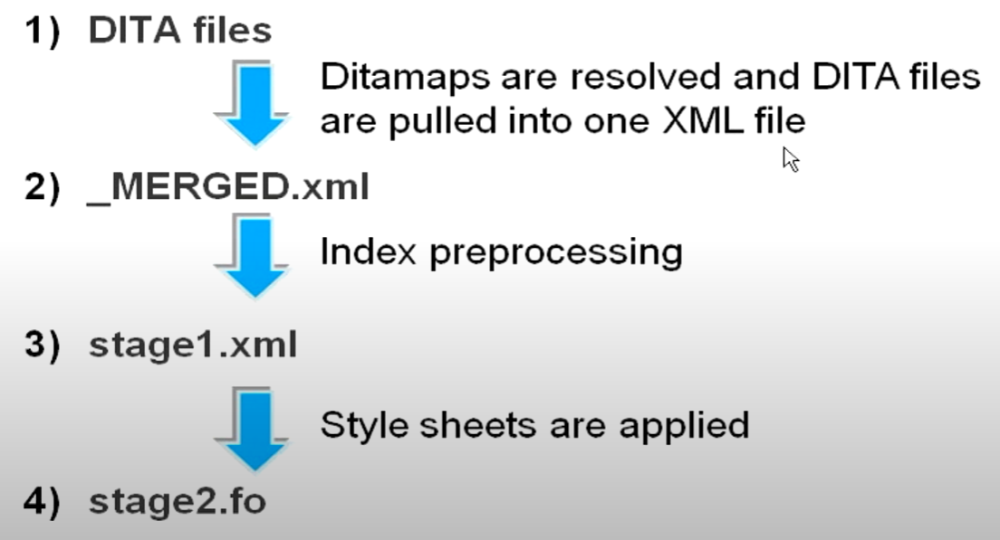
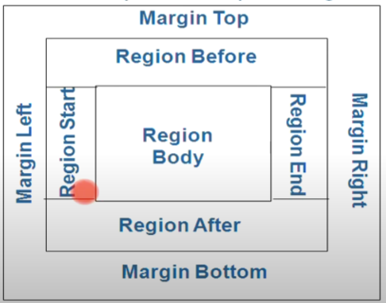
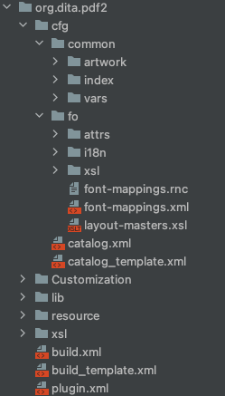

# Dita-ot

1. 配置ANT_HOME 和 DITA_OT_HOME路径执行ditaot文件夹
2. 配置环境变量指向bin文件夹

## ant

可以再 `/dita-ot-3.7.1/docsrc/samples/ant_sample` 目录中找到ant的测试文件. 然后使用`ant -f <filename.xml>` 来执行一个测试文件进行dita的执行.

这里需要注意, 使用的ant需要用ditaot的ant文件. 也可以使用自己的ant但是需要设置环境变量. 在根目录下, 执行startcmd.sh 或者startcmd.bat来进行操作

## dita

dita需要一个input和一个output属性, 同时还需要一个transtype属性来执行

执行dita可以用到三中执行方式

- java: `java -jar lib/dost.jar /i:samples/sequence.ditamap /outdir:out /transtype:xhtml` 使用java的时候会使用到dost.jar文件.
  里面包含着对于ant的可执行脚本.
- ant: `bin/ant -f build-script target`
- dita: `dita --input=sequence.ditamap --format=html5`

[dita的基础属性](https://www.dita-ot.org/dev/parameters/parameters-base.html)

### ditamap

ditamap使用的是一个topic定义的xml文件, 主标签是用的是`<map>`. 其引用的标签和引用的属性根据需求可以生成对应的模块. 比如生成pdf那么引用的模块就可以变为段落或者文字. 也可以不适用引用直接进行创建.
一切给予的是plugin中的配置, plugin中多用的都是xslt文件. 而生成pdf的用的是java类库中的fo模块.

在dita的命令行中属性通常为`args.input`

默认情况下, ditamap中的所有属性都会进行输出.

```xml
<?xml version="1.0" encoding="utf-8"?>
<!DOCTYPE map PUBLIC "-//OASIS//DTD DITA Map//EN" "map.dtd">
<!--  This file is part of the DITA Open Toolkit project. See the accompanying LICENSE file for applicable license.  -->
<!-- (C) Copyright IBM Corporation 2001, 2005. All Rights Reserved. -->
<map>
    <title>Working in the garage</title>
    <topicref href="tasks/garagetaskoverview.xml" type="concept">
        <topicref href="tasks/changingtheoil.xml" type="task"/>
        <topicref href="tasks/organizing.xml" type="task"/>
        <topicref href="tasks/shovellingsnow.xml" type="task"/>
        <topicref href="tasks/spraypainting.xml" type="task"/>
        <topicref href="tasks/takinggarbage.xml" type="task"/>
        <topicref href="tasks/washingthecar.xml" type="task"/>
    </topicref>
    <topicref href="concepts/garageconceptsoverview.xml" type="concept">
        <topicref href="concepts/lawnmower.xml" type="concept"/>
        <topicref href="concepts/oil.xml" type="concept"/>
        <topicref href="concepts/paint.xml" type="concept"/>
        <topicref href="concepts/shelving.xml" type="concept"/>
        <topicref href="concepts/snowshovel.xml" type="concept"/>
        <topicref href="concepts/toolbox.xml" type="concept"/>
        <topicref href="concepts/tools.xml" type="concept"/>
        <topicref href="concepts/waterhose.xml" type="concept"/>
        <topicref href="concepts/wheelbarrow.xml" type="concept"/>
        <topicref href="concepts/workbench.xml" type="concept"/>
        <topicref href="concepts/wwfluid.xml" type="concept"/>
    </topicref>
</map>
```

### ditaval

在ditamap中默认情况下, 所有的输入都会成为输出. 因此就引入了对于output的控制文件ditaval. ditaval可以对ditamap中指定的属性进行选择性的输出.

ditaval使用的是`<val>`标签作为主标签. 在旧版的dita命令行中可以使用`dita.input.valfile`, 在新版的dita中会使用`args.filter`来进行控制.
比如`--args.filter="filter1.ditaval;filter2.ditaval;filter3.ditaval"`

```xml
<?xml version="1.0" encoding="UTF-8"?>
<val>
    <!-- att是属性. 此处表示的是当platform中包含unix的时候include, 但是当platform为其他所有属性的时候剔除 -->
    <!-- 此处的属性是使用空格隔开的, 比如 platform="unix windows" 此处就会使用空格匹配 -->
    <prop action="include" att="platform" val="unix"/>
    <prop action="exclude" att="platform"/>
    <!-- 同时ditaval也可以作为属性配置工具,携带小部分的配置属性 -->
    <!-- 也就是product属性值为test的时候, 渲染为red/pink/italics, flag表示的是动作为标记 -->
    <prop atr="product" val='test' action='flag' color='red' backcolor='pink' style='italics'/>
</val>
```

属性可以在这里找到 [https://docs.oasis-open.org/dita/v1.2/os/spec/langref/ditaval-prop.html](https://docs.oasis-open.org/dita/v1.2/os/spec/langref/ditaval-prop.html)

在输入project中可以配置ditaval文件

```xml
<?xml version="1.0" encoding="UTF-8"?>
<?xml-model href="../../../resources/project.rnc" type="application/relax-ng-compact-syntax"?>
<project xmlns="https://www.dita-ot.org/project">
    <context id="html">
        <input href="../../userguide.ditamap"/>
        <profile>
            <ditaval href="../../resources/html.ditaval"/>
        </profile>
    </context>
</project>
```

### transtype

每一个dita运行都需要一个transtype来对文件进行操作

在dita命令行中的属性为 `transtype`

### dita生成文件

dita主要使用插件输出文件.

#### 文件声称该过程

fo生成式pdf文件的重要环节, 因为pdf文件类似于html, 需要使用到style. 因此fo文件就变得非常重要.



- dita文件通过ditamap/ditaval来生成一个resolved xml文件.
- resolved 可以选择对xml文件进行处理, 比如修改一部分结构或者属性字段生成一个最终的finalres xml文件.
- 然后通过resolve xml和stylesheet生成fo文件, 也就是用来生成pdf的模板
- 在生成fo文件以后可以选择是否继续对fo文件进行修改, fo文件也是xml格式, 也是可以用xslt来进行修改的
- 最终, 使用fo文件通过xsl-fo引擎(比如apache FOP, RenderX, Antenna House等)将fo文件转换为pdf文件
    - 中间部分的文件会存储在tmp文件夹中.

生成的配置文件会存储在tmp文件夹中。 默认情况下， 默认文件会被清空。 需要手动配置来启用不删除temp文件

- ant中需要使用命令`<property name="clean.temp" value="no"/>`,
  如果需要在旧版中配置pdf的中间文件需要配置retainpdf属性`<property name="retain.topic.fo" value="yes"/>`。
  需要注意的是ant在某些环境中会出现插件不匹配的情况，主要还是因为dita的插件更新未必会更新ant导致的.
- dita中使用`--clean.temp=no`

#### XSL FO

xpath的简单实用案例

- 语法: [https://www.w3schools.com/xml/xpath_syntax.asp](https://www.w3schools.com/xml/xpath_syntax.asp)
- 案例: [https://www.w3schools.com/xml/xpath_examples.asp](https://www.w3schools.com/xml/xpath_examples.asp)
- AXEs: [https://www.w3schools.com/xml/xpath_axes.asp](https://www.w3schools.com/xml/xpath_axes.asp)

xsl fo是一个定义性语言, 使用的是xsl, 定义page layout以及数据. 通常可以用于pdf的生成, 也就是fop

root属性为`<fo:root>` 元素是 XSL-FO 文档的根元素。这个根元素也要声明 XSL-FO 的命名空间

```xml

<fo:root xmlns:fo="http://www.w3.org/1999/XSL/format">
</fo:root>
```

可以使用fo定义pagelayout

```xml
<?xml version="1.0" encoding="ISO-8859-1"?>
<fo:root xmlns:fo="http://www.w3.org/1999/XSL/Format">
    <fo:layout-master-set>
        <!-- 定义一个sequence -->
        <fo:simple-page-master master-name="MyPageMaster" margin-bottom="5">
            <!-- Page template goes here -->
            <fo:region-body>
        </fo:simple-page-master>
    </fo:layout-master-set>

    <!-- 引用上面定义的fo -->
    <fo:page-sequence master-reference="MyPageMaster">
        <!-- Page content goes here -->
    </fo:page-sequence>
</fo:root>
```

元素 `<fo:layout-master-set>`包含一个或多个页面模板： 每个 `<fo:simple-page-master>` 元素包含一个单一的页面模板。每个模板必须有一个唯一的名称（master-name）
一个或多个 `<fo:page-sequence>` 元素可描述页面内容。master-reference 属性使用相同的名称来引用 simple-page-master 模板

##### XSL-FO 页面（Page）、流（Flow）以及块（Block）

内容"块"会"流"入"页面"中，然后输出到媒介。

XSL-FO 输出通常被嵌套在 `<fo:block>` 元素内，`<fo:block>` 嵌套于 `<fo:flow>` 元素内，`<fo:flow>` 嵌套于 `<fo:page-sequence>` 元素内：

```xml

<fo:page-sequence>
    <fo:flow flow-name="xsl-region-body">
        <fo:block>
            <!-- Output goes here -->
        </fo:block>
    </fo:flow>
</fo:page-sequence>
```

现在让看一个真实的 XSL-FO 实例：

```xml
<?xml version="1.0" encoding="ISO-8859-1"?>

<fo:root xmlns:fo="http://www.w3.org/1999/XSL/Format">
    <fo:layout-master-set>
        <fo:simple-page-master master-name="A4">
            <fo:region-body/>
        </fo:simple-page-master>
    </fo:layout-master-set>

    <fo:page-sequence master-reference="A4">
        <fo:flow flow-name="xsl-region-body">
            <fo:block>Hello RUNOOB</fo:block>
        </fo:flow>
    </fo:page-sequence>
</fo:root>
```

每个 XSL-FO 页面均包含一系列的 Regions（区）：

- region-body（页面的主体）
- region-before（页面的页眉）
- region-after（页面的页脚）
- region-start（左侧栏）
- region-end（右侧栏）



`<fo:flow>` 元素有一个 "flow-name" 属性。flow-name 属性的值定义 `<fo:flow>` 元素的内容会去往何处。

- xsl-region-body（进入 region-body）
- xsl-region-before（进入 region-before）
- xsl-region-after（进入 region-after）
- xsl-region-start（进入 region-start）
- xsl-region-end（进入 region-end）

块是位于矩形框中的输出序列：

```xml

<fo:block border-width="1mm">
    This block of output will have a one millimeter border around it.
</fo:block>
```

由于块区域是矩形框，所以可共享许多公共的区域属性：

- space before 和 space after
- margin
- border
- padding

有四种 XSL-FO 对象可用来创建列表：

fo:list-block（包含整个列表） (contains the whole list)
fo:list-item（包含列表中的每个项目） (contains each item in the list)
fo:list-item-label（包含用于 list-item 的标签 - 典型地，包含一个数字或者字符的 `<fo:block>` ） fo:list-item-body（包含 list-item 的内容/主体 -
典型地，一个或多个 `<fo:block>`对象） 一个 XSL-FO 列表实例:

```xml

<fo:list-block>
    <fo:list-item>
        <fo:list-item-label>
            <fo:block>*</fo:block>
        </fo:list-item-label>
        <fo:list-item-body>
            <fo:block>Volvo</fo:block>
        </fo:list-item-body>
    </fo:list-item>

    <fo:list-item>
        <fo:list-item-label>
            <fo:block>*</fo:block>
        </fo:list-item-label>
        <fo:list-item-body>
            <fo:block>Saab</fo:block>
        </fo:list-item-body>
    </fo:list-item>
</fo:list-block>
```

上面代码的输出如下所示：

```text
* Volvo
* Saab
```

#### fo-plugin pdf生成插件

插件结构：



其中， 所有的xsl文件会保存在 org.dita.pdf2/xsl/common 和 org.dita.pdf2/xsl/fo 中。属性的xsl会封装在`org.dita.pdf2/cfg/fo/attrs` 中.
如果需要修改全局生成策略。 可以在插件中修改需要的属性。

- Title Page 一般使用 `front-matter.xsl` 和 `org.dita.pdf2/cfg/fo/attrs/front-matter-attr.xsl`
- Table of content 使用 `toc.xsl` 和 `toc-attr.xsl`
- 静态内容包括 footer 和 header使用 `static-content.xsl` 和 `static-content-attr.xsl` 来进行转换
- 链接使用 `links.xsl` `links-attr.xsl`
- bookmark使用`bookmark.xsl` `bookmarks-attr.xsl`
- 布局的属性(类似margins)会使用到 `layout-masters.xsl` `layout-masters.xml`
- 内容主体
    - 布局
        - programming domain `pr-domain.xsl` `pr-domain-attr.xsl`
        - 软件domain `sw-domain.xsl` `sw-domain-attr.xsl`
        - ui `ui-domain.xsl` `ui-domain-attr.xsl`
        - 高亮domain `hi-domain.xsl` `hi-domain-attr.xsl`
    - 标题 `commons.xsl` `commons-attr.xsl`
    - 列表 `list.xsl` `lists-attr.xsl`
    - 表格 `tables.xs` `tables-attr.xsl`
    - `cfg/fo/attrs/basic-settings.xsl` 可以配置page-width page-height等属性

> **自定义插件**
> 1. 创建一个文件夹。 可以选择pdf插件中的customization，也可以创建一个customization文件夹
> 2. 复制必要的template文件到`customization/fo/xsl`然后再`custom.xsl`中加入template。 或者将绝对路径直接复制进入`customization/fo/xsl/custom.xsl`
> 3. 配置catalog.xml.orig文件为catalog.xml, 然后定义我们刚刚配置的custom.xsl文件
>
> ```xml
> <?xml version="1.0" encoding="utf-8" ?>
> <catalog xmlns="urn:oasis:names:tc:entity:xmlns:xml:catalog">
>     <!--    <uri name="cfg:fo/attrs/custom.xsl" uri="fo/attrs/custom.xsl"/>-->
>     <uri name="cfg:fo/xsl/custom.xsl" uri="fo/xsl/custom.xsl"/>
> </catalog>
> ```
>
> 如果你自定义directory可以在构建的时候配置属性`<param name="customization.dir" value="your/dir/here"/>`
