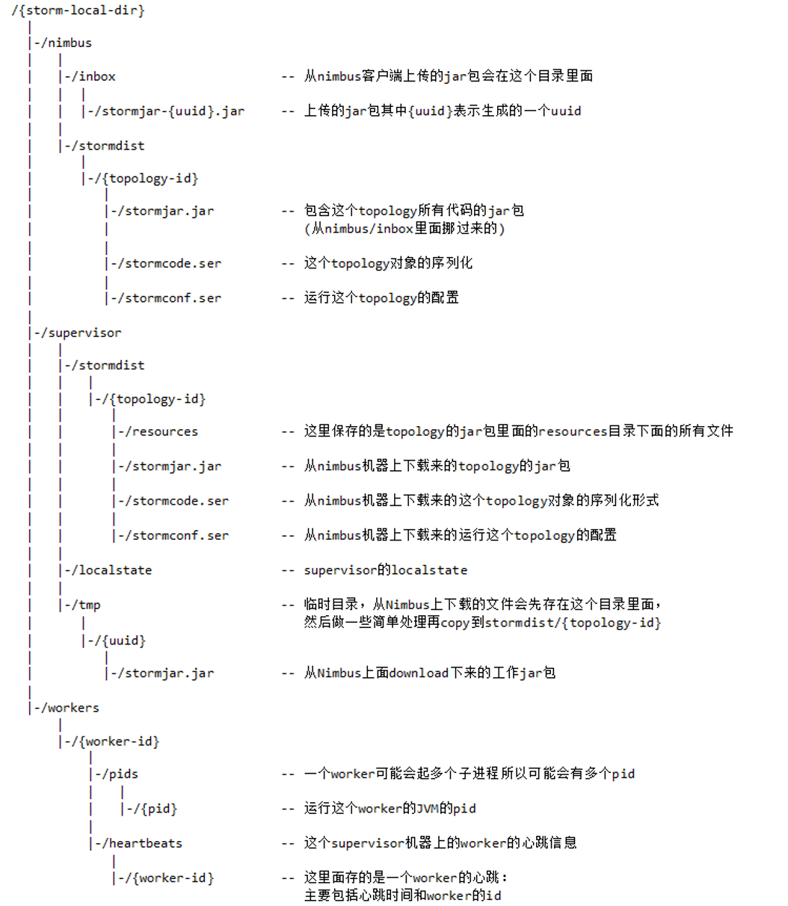

# Storm 流式处理框架

## 理论基础

Storm 是个实时的、分布式以及具备高容错的计算系统

- Storm 进程常驻内存
- Storm 数据不经过磁盘，在内存中处理

架构：类似于 hadoop 的主从架构模型，一主多从。同一时间段只能有一个主存在。所有的角色都是以进程存在于内存当中的。所以一个服务器可以开辟多个进程，从而获得多个角色.

- Nimbus: 主节点，设计管理。 主要处理资源的调度，任务的分配和 jar 包任务的上传。类似于 hadoop 中的 job tracker。主要负责则资源调度，任务分配，接受 jar 包
- Supervisor: 从节点，接受 nimbus 的任务，启动停止自己管理的 workier 进程
- Worker: 从节点上开辟的进程。运行处理组件的进程，启动 executor，也就是 jvm 的一个进程
  - worker 包含 `spout` 和 `bolt` 两种任务
  - executor，线程任务，负责执行 task 任务

编程模型

- DAG （Topology）
- Spout
- Bolt

数据传输

- ZMQ（twitter 早期产品,已经被淘汰）
  - ZeroMQ 开源的消息传递框架，并不是一个 MessageQueue
- Netty
  - Netty 是基于 NIO 的网络框架，更加高效。（之所以 Storm 0.9 版本之后使用 Netty，是因为 ZMQ 的 license 和 Storm 的 license 不兼容。）

高可靠性

- 异常处理
- 消息可靠性保障机制(ACK)

流式处理（只有开始没有结束）

- 流式处理（异步 与 同步）

  - 客户端提交数据进行结算，并不会等待数据计算结果

- 逐条处理

  - 例：ETL（数据清洗）extracted transform load

- 统计分析
  - 例：计算 PV、UV、访问热点 以及 某些数据的聚合、加和、平均等
    客户端提交数据之后，计算完成结果存储到 Redis、HBase、MySQL 或者其他 MQ 当中，
    客户端并不关心最终结果是多少。

实时请求

- 实时请求应答服务（同步）

  - 客户端提交数据请求之后，立刻取得计算结果并返回给客户端

- Drpc (Distributed RPC) 推送数据，然后异步处理数据，实时处理。 DRPC 也是一个服务。

Storm：进程、线程常驻内存运行，数据不进入磁盘，数据通过网络传递。
MapReduce：为 TB、PB 级别数据设计的批处理计算框架

|    Storm     |    MapReduce    |
| :----------: | :-------------: |
|   流式处理   |     批处理      |
| （毫）秒级别 |      分钟       |
|   DAG 模型   | Map+Reduce 模型 |
|   常住运行   |    任务交互     |

Storm：纯流式处理

- 专门为流式处理设计
- 数据传输模式更为简单，很多地方也更为高效
- 并不是不能做批处理，它也可以来做微批处理，来提高吞吐

Spark Streaming：微批处理

- 将 RDD 做的很小来用小的批处理来接近流式处理
- 基于内存和 DAG 可以把处理任务做的很快

---

## 架构模型

一主多从的形式，使用的 zookeeper 来淡化主节点的作用

1. 客户端提交 job 作业
2. nimbus 兑 topology 进行校验（jar 包进行校验）
3. 建立 topology 在本地存放目录 nimbus/storm/dist/topology-id,其中包含 3 个文件：
   - stormjar.jar -- 从 nimbus/inbox 目录下移动来的 topology 的 jar 包，也就是提交的任务 jar 包
   - stormcode.ser -- 对 topology 对象的序列化方法，序列化的方法
   - stormconf.ser -- topology 的运行配置，拓扑作业中的信息
4. nimbus 根据初始化 task 的数量，分配任务。具体过程就是向 zookeeper 写入/task 节点
5. Nimbus 会在 zookeeper 上创建 task 节点，并对该节点进行 task 的心跳监控
6. 在任务分配信息写入到 assignment/topology-id 节点中，此时可以认为是任务提交完毕
7. zookeeper 的 storms/topology-id 节点下存放任务的运行时间，状态等信息
8. Supervisor 会定期检查 storm 节点，看是否有新的任务提交
9. 删除本地已经不运行的任务
10. 根据节点信息，启动 worker，调度任务
11. 当 worker 建立以后，worker 并不会跟 supervisor 进行通信，而是查看 zookeeper 的人物信息，查看需要执行的 task 任务
12. 当 worker 获取相应的 task 信息以后（也就是 spout、bolt）会执行运算，根据 ip 地址和端口发送消息数据

目录树



---

## 安装 storm

### 简单的 docker 安装 storm

docker-compose.yml 文件：

```yaml
version: "3.1"
services:
  zookeeper:
    image: zookeeper
    container_name: zookeeper
    restart: always

  nimbus:
    image: storm
    container_name: nimbus
    command: storm nimbus
    depends_on:
      - zookeeper
    links:
      - zookeeper
    restart: always
    ports:
      - 6627:6627

  supervisor:
    image: storm
    container_name: supervisor
    command: storm supervisor
    depends_on:
      - nimbus
      - zookeeper
    links:
      - nimbus
      - zookeeper
    restart: always
```

```yaml
version: "3.1"
services:
  zookeeper:
    image: zookeeper
    container_name: zookeeper
    restart: always

  kafka:
    image: michaeldqin/kafka
    container_name: kafka
    depends_on:
      - zookeeper
    links:
      - zookeeper
    volumes:
      - ./data:/data
    ports:
      - 9092:9092
    environment:
      KAFKA_BROKER_NO: 1
      KAFKA_ZOOKEEPER_CONNECT: zookeeper
      KAFKA_ADVERTISED_LISTENERS: PLAINTEXT://kafka:9092

  ui:
    image: storm:1.1
    command: storm ui
    restart: always
    depends_on:
      - nimbus
    links:
      - nimbus
    container_name: ui
    ports:
      - 8090:8080

  nimbus:
    image: storm:1.1
    command: storm nimbus
    restart: always
    volumes:
      - /www/storm/data:/data
      - /www/logs/storm:/logs
    depends_on:
      - zookeeper
    links:
      - zookeeper
      - kafka
    container_name: nimbus
    ports:
      - 6627:6627

  supervisor:
    image: storm:1.1
    command: storm supervisor
    restart: always
    volumes:
      - /www/storm/data:/data
      - /www/logs/storm:/logs
    depends_on:
      - nimbus
      - zookeeper
    links:
      - nimbus
      - zookeeper
      - kafka
    container_name: supervisor
```

## 搭建集群

需要 java6 以上版本，storm 会集成 python，如果自己制作需要注意版本需求

执行伪分布式启动，把 storm 的 bin 文件夹加入到 bin 路径. 然后执行如下命令就可以执行命令，这里的命令的主要作用就是给与输出一个 log 路径，同时输出标准输出模式，最后一个&表示系统启动以后，你还可以执行其他命令

```shell
storm dev-zookeeper >> ./logs/zk.out 2>&1 &
storm nimbus >> ./logs/nimbus.out 2>&1 &
storm supervisor >> ./logs/supervisor.out 2>&1 &
storm ui >> ./logs/ui.out 2>&1 &
```

```output
[root@localhost ~]# jps
20307 Nimbus
20712 Jps
20202 DevZookeeper
20460 Supervisor
20623 UIServer
```

然后使用`ss -nal`查看端口信息，确定 8080 启动起来了。

### 分布式集群

1. 首先要在集群中部署 zookeeper，可以参考 docker 快速部署, 或者手动部署 `zkServer.sh start`
2. 修改 conf/storm.yaml 文件修改参数

   修改 `storm.zookeeper.servers` 中添加数组

   ```yaml
   storm.zookeeper.servers:
     - "node1"
     - "node2"
     - "node3"
   ```

   修改 `nimbus.host: "nimbus"` 的信息,指向 nimbus 节点,新版本中使用的是 seeds 属性，可以定义多个 nimbus 节点

   ```yaml
   nimbus.seeds: ["host1", "host2"]
   ```

   可以修改`storm.local.dir`来指定提交任务的目录(老版本)

   可以配置`supervisor.slots.ports`来指定 worker 进程的通信的端口(老版本)

3. 分发 `` scp -r apache-storm-2.2.0/ node2:`pwd1`  `` 分发到目标服务器(同时配置环境变量)

4. 启动系统

   ```shell
   storm nimbus >> ./logs/nimbus.out 2>&1 &
   storm ui >> ./logs/ui.out 2>&1 &
   storm supervisor >> ./logs/supervisor.out 2>&1 &
   ```

---

## storm 配置

引入 storm 的依赖

```xml
<dependency>
    <groupId>org.apache.storm</groupId>
    <artifactId>storm-core</artifactId>
    <version>0.9.6</version>
    <scope>provided</scope>
</dependency>
```

### 并发机制

多线程控制。

- `worker` 一个 topology 会包含多个 worker，每一个 worker 只能存在一个 topology，worker 会散列在不同的节点上，也就是一个 topology 拓扑其实是由并行在 storm 中的进程组成
- `Executor` 进程。由 worker 生成。 一个 worker 对应多个 executor。 一个 executor 线程中可以执行多个 task。默认 executor 只执行一个 task 任务。但是这些 task 都是对应着同一个组件（spout,bolt）
- `task` 执行任务的最小单元，对应一个 spout 或者 Bolt
  - task 数量在整个 topology 生命周期中保持不变，但是 executor 可以变化或者手动调整

添加 executor：

```java
// 设置executor的数量
tb.setBolt("wcbolt", new WcBolt(),3).shuffleGrouping("wcspout");

// 限制work的数量
Config config = new Config();
config.setNumWorkers(2);
config.setNumAckers(2);

// 设置task的数量
tb.setSpout("wcspout", new WcSpout()).setNumTasks(2);
tb.setBolt("wcbolt", new WcBolt()).shuffleGrouping("wcspout").setNumTasks(3);
```

调整storm的进程

```SHELL
storm rebalance <topology-name> [-w <wait-time-second>] [-n <new-num-workers>] [-e component=parallelism]

# 比如
storm rebalance myTopo -w 2 -n 4 -e myBolt=4
```

---

### Grouping 的方法

在分发 bolt 数据的时候我们可以选择如何分发我们的结果集，到目标 bolt

1. `Shuffle Grouping`
   随机分组，随机派发 stream 里面的 tuple，保证每个 bolt task 接收到的 tuple 数目大致相同。
   轮询，平均分配

2. `Fields Grouping`
   按字段分组，比如，按"user-id"这个字段来分组，那么具有同样"user-id"的 tuple 会被分到相同的 Bolt 里的一个 task， 而不同的"user-id"则可能会被分配到不同的 task。

3. `All Grouping`
   广播发送，对于每一个 tuple，所有的 bolts 都会收到

4. `Global Grouping`
   全局分组，把 tuple 分配给 task id 最低的 task
5. `None Grouping`
   不分组，这个分组的意思是说 stream 不关心到底怎样分组。目前这种分组和 Shuffle grouping 是一样的效果。 有一点不同的是 storm 会把使用 none grouping 的这个 bolt 放到这个 bolt 的订阅者同一个线程里面去执行（未来 Storm 如果可能的话会这样设计）。

6. `Direct Grouping`
   指向型分组， 这是一种比较特别的分组方法，用这种分组意味着消息（tuple）的发送者指定由消息接收者的哪个 task 处理这个消息。只有被声明为 Direct Stream 的消息流可以声明这种分组方法。而且这种消息 tuple 必须使用 emitDirect 方法来发射。消息处理者可以通过 TopologyContext 来获取处理它的消息的 task 的 id (OutputCollector.emit 方法也会返回 task 的 id)

7. `Local or shuffle grouping`
   本地或随机分组。如果目标 bolt 有一个或者多个 task 与源 bolt 的 task 在同一个工作进程中，tuple 将会被随机发送给这些同进程中的 tasks。否则，和普通的 Shuffle Grouping 行为一致

customGrouping
自定义，相当于 mapreduce 那里自己去实现一个 partition 一样。

---

## 案例

### wordsum 案例累加所有的数字，持续化供给

创建 spout 提供信息，信息的属性会发送到 bolt

```java
public class WcSpout extends BaseRichSpout {
    private Map conf;
    private TopologyContext context;
    private SpoutOutputCollector collector;

    // 累计属性
    int i = 0;

    /**
     * 当任务开始，这个组件就会被初始化
     *
     * @param map                  配置项，配置文件对象，提供集群拓扑作业的配置信息，在本服务器
     * @param topologyContext      容器上下文，获取当前任务的位置信息，包括任务id组件ID和输入输出信息
     * @param spoutOutputCollector 数据集的发送器，用于tuples，如果需要发送信息需要调用这个发送器
     */
    @Override
    public void open(Map map, TopologyContext topologyContext, SpoutOutputCollector spoutOutputCollector) {
        this.conf = map;
        this.context = topologyContext;
        this.collector = spoutOutputCollector;
    }

    /**
     * 发送到output collecotr，方法是非阻塞如果没有方法发送，这个方法会返回，这里是个循环
     * 1+2+3+4+5...
     * 需要使用collector发送
     */
    @Override
    public void nextTuple() {
        i++;
        // values 就是list，但是是storm实现的容器
        List tuple = new Values(i);
        this.collector.emit(tuple);
        System.out.println("spout ===============  " + i);
        try {
            Thread.sleep(1000);
        } catch (InterruptedException e) {
        }
    }

    @Override
    public void declareOutputFields(OutputFieldsDeclarer outputFieldsDeclarer) {
        // 声明,发送的字段是什么，在这里声明一下, 注意发送几个声明就需要几个
        outputFieldsDeclarer.declare(new Fields("num"));
    }
}
```

创建 bolt， 处理每次过来的信息

```java
public class WcBolt extends BaseRichBolt {
    private Map stormConf;
    private TopologyContext context;
    private OutputCollector collector;

    int sum = 0;

    /**
     * @param stormConf 配置对象，给当前的bolt的配置
     * @param context   获取任务信息
     * @param collector 发送数据
     */
    @Override
    public void prepare(Map stormConf, TopologyContext context, OutputCollector collector) {
        this.stormConf = stormConf;
        this.context = context;
        this.collector = collector;
    }

    @Override
    public void execute(Tuple input) {
        int i = input.getIntegerByField("num");// 根据field获取我们从spout发送的信息
        sum += i;
        System.out.println("Sum ==================== " + sum);
    }

    @Override
    public void declareOutputFields(OutputFieldsDeclarer declarer) {

    }
}
```

搭建框架

```java
/**
 * 构建拓扑结构
 */
public static void main(String[] args) {
    TopologyBuilder tb = new TopologyBuilder();

    // 第一个参数是id，用来指定当前任务是什么id
    tb.setSpout("wcspout", new WcSpout());
    tb.setBolt("wcbolt", new WcBolt()).shuffleGrouping("wcspout"); // 关联spout，分发策略，用什么方式获取过来

    // 放入集群，这里创建的是本地集群
    LocalCluster cluster = new LocalCluster();
    cluster.submitTopology("wc", new Config(), tb.createTopology());

}
```

### wordcount 字体累加

创建一个 spout

```java
public class WcSpout extends BaseRichSpout {
    private SpoutOutputCollector collector;

    // 一个简单的静态模拟文本流处理
    String[] text = {
            "nihao welcome hello",
            "hello hi ok",
            "another fake string",
            "fake string ok"
    };

    Random r = new Random();

    @Override
    public void open(Map map, TopologyContext topologyContext, SpoutOutputCollector spoutOutputCollector) {
        this.collector = spoutOutputCollector;
    }

    // 发送行数据给下一个bolt，一般是io流
    @Override
    public void nextTuple() {
        List line = new Values(text[r.nextInt(text.length)]); // 随机抓取一个字符串
        this.collector.emit(line);
        System.out.println("Spout ------ 向bolt发送数据：  " + line);
        Utils.sleep(1000); // 歇一会
    }

    @Override
    public void declareOutputFields(OutputFieldsDeclarer outputFieldsDeclarer) {
        // 声明,发送的字段是什么，在这里声明一下, 注意发送几个声明就需要几个
        outputFieldsDeclarer.declare(new Fields("line"));
    }
}
```

创建切分字段的 bolt

```java
public class WordSplitBolt extends BaseRichBolt {
    private OutputCollector collector;

    @Override
    public void prepare(Map stormConf, TopologyContext context, OutputCollector collector) {
        this.collector = collector;
    }

    @Override
    public void execute(Tuple input) {
        // 获取数据，切分数组，发送数据
        String line = input.getStringByField("line");

        String[] words = line.split(" ");

        for (String word : words) {
            // 向后推送
            this.collector.emit(new Values(word));
        }

    }

    @Override
    public void declareOutputFields(OutputFieldsDeclarer declarer) {
        declarer.declare(new Fields("words"));
    }
}
```

创建字段处理，统计 bolt

```java
public class WordCountBolt extends BaseRichBolt {

    Map<String, Integer> wcmap = new HashMap<String, Integer>();

    @Override
    public void prepare(Map stormConf, TopologyContext context, OutputCollector collector) {
    }

    @Override
    public void execute(Tuple input) {
        int count = 1;
        String word = input.getStringByField("words");
        if (wcmap.containsKey(word)) {
            count = wcmap.get(word) + 1;
        }
        wcmap.put(word, count);

        System.out.println("wc===:" + wcmap);
    }

    @Override
    public void declareOutputFields(OutputFieldsDeclarer declarer) {
    }
}
```

创建 main 程序本地运行

```java
/**
 * 构建拓扑结构
 */
public class TestStormApplication {

    public static void main(String[] args) {
        TopologyBuilder tb = new TopologyBuilder();

        // 第一个参数是id，用来指定当前任务是什么id
        tb.setSpout("wcspout", new WcSpout());
        tb.setBolt("wordsplitbolt", new WordSplitBolt(), 3).shuffleGrouping("wcspout"); // 这里的3表示的是多线程并行
        // 这里给一个多线程的话map就会变成局部变量，同时处理的数据变成了一个分量，需要做一次汇总
//        tb.setBolt("wcbolt", new WordCountBolt(), 3).shuffleGrouping("wordsplitbolt");
        // 因此，我们可以使用按照字段进行分发，相同的key交给同一个bolt进行处理
        tb.setBolt("wcbolt", new WordCountBolt(), 3).fieldsGrouping("wordsplitbolt", new Fields("words"));

        // 放入集群，这里创建的是本地集群
        LocalCluster cluster = new LocalCluster();
        cluster.submitTopology("wc", new Config(), tb.createTopology());

    }

}
```

## 提交 job 作业

如果需要提交 job 作业到 storm 中，我们需要多 job 进行打包，此时就不能使用 localcluster。 此时的 main 方法：

```java
public static void main(String[] args) throws AlreadyAliveException, InvalidTopologyException {
        TopologyBuilder tb = new TopologyBuilder();

        // 第一个参数是id，用来指定当前任务是什么id
        tb.setSpout("wcspout", new WcSpout());
        tb.setBolt("wcbolt", new WcBolt()).shuffleGrouping("wcspout"); // 关联spout，分发策略，用什么方式获取过来

        Config config = new Config();

        if (args.length > 0) {
            // 如果有参数，提交作业到集群当中
            StormSubmitter.submitTopology(args[0], config, tb.createTopology());
        } else {
            // 放入集群，这里创建的是本地集群
            LocalCluster cluster = new LocalCluster();
            cluster.submitTopology("wc", config, tb.createTopology());
        }
    }
```

然后将 jar 包提交到服务器中：
`storm jar /opt/storm/wc.jar com.snowave.storm.Application myTopologyName`

[需要注意的是版本需要一致，这里有一个 2.0 的版本 spout/bolt]

```java
public class WcSpout extends BaseRichSpout {
    private Map conf;
    private TopologyContext context;
    private SpoutOutputCollector collector;

    // 累计属性
    int i = 0;

    @Override
    public void open(Map map, TopologyContext topologyContext, SpoutOutputCollector spoutOutputCollector) {
        this.conf = map;
        this.context = topologyContext;
        this.collector = spoutOutputCollector;
    }

    /**
     * 发送到output collecotr，方法是非阻塞如果没有方法发送，这个方法会返回，这里是个循环
     * 1+2+3+4+5...
     * 需要使用collector发送
     */
    @Override
    public void nextTuple() {
        i++;
        // values 就是list，但是是storm实现的容器
        List tuple = new Values(i);
        this.collector.emit(tuple);
        System.out.println("spout ===============  " + i);
        try {
            Thread.sleep(1000);
        } catch (InterruptedException e) {
        }
    }

    @Override
    public void declareOutputFields(OutputFieldsDeclarer outputFieldsDeclarer) {
        // 声明,发送的字段是什么，在这里声明一下, 注意发送几个声明就需要几个
        outputFieldsDeclarer.declare(new Fields("num"));
    }
}
```

bolt

```java
public class WcBolt extends BaseBasicBolt {

    int sum = 0;

    @Override
    public void execute(Tuple tuple, BasicOutputCollector basicOutputCollector) {
        int i = tuple.getIntegerByField("num");// 根据field获取我们从spout发送的信息
        sum += i;
        System.out.println("Sum ==================== " + sum);
    }

    @Override
    public void declareOutputFields(OutputFieldsDeclarer outputFieldsDeclarer) {

    }
}
```

提交过后，webui 的 Topology Summary 中就会有一个 topology。

### 关闭 storm 任务

`storm kill myTopologyName`
`storm kill myTopologyName -w 2` 两秒以后停下这个任务

使用 java 关闭集群 `killall java`

## DRPC 远程调用执行运算
