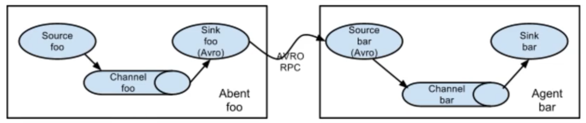
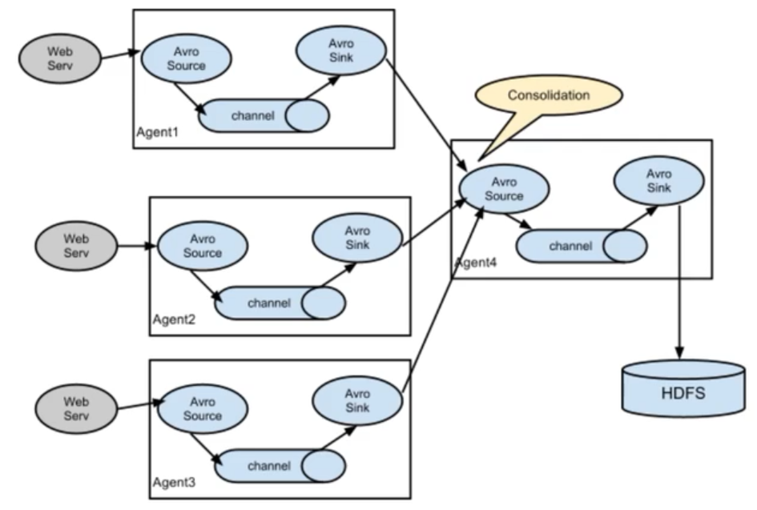
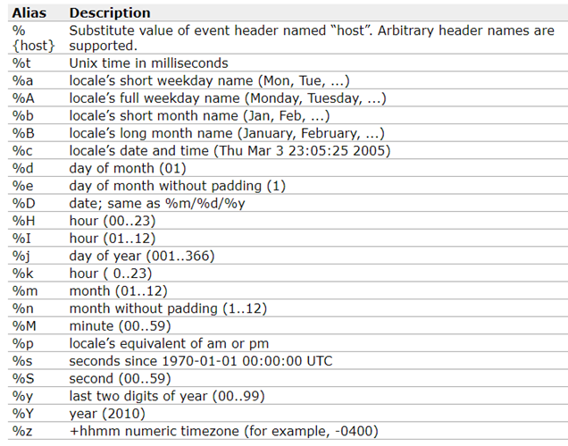

# Flume

flume 是 apache 下的顶级项目. 官网地址: <http://flume.apache.org>. 本课程选择版本对应的官方文档：<http://flume.apache.org/releases/content/1.6.0/FlumeUserGuide.html>. 下载的 url: <https://flume.apache.org/download.html>

框架主要目的就是收集日志, 和聚合的动作, 将数据从不同的话数据来源进行采集, 然后同意放入 hdfs 中. Flume 可以传输大量的数据, 包括社交媒体声称的数据和电子邮件的数据.

3 个元素: source, channel, sink:


## 安装 Flume

### 下载配置

在网站下载 tar 包,然后再服务器上解压缩 `tar -zxvf apache-flume-<version>-bin.tar.gz`

然后将 flume 的配置文件模板拷贝一份

```shell
cd /opt/flume/conf
cp flume-env.sh.template flume-env.sh
```

然后再 shell 文件中添加 JAVA_HOME 配置 `export JAVA_HOME=/usr/lib/jvm/java-1.8.0-openjdk-1.8.0.252.b09-2.el7_8.x86_64/jre`.

之后在`/etc/profile`中配置 flume 变量

```shell
export FLUME_HOME=/opt/flume
export PATH=$PATH:$JAVA_HOME/bin:$FLUME_HOME/bin
```

启动一个 agent: `bin/flume-ng agent -n $agent_name -c conf -f conf/flume-conf.properties.template`

配置 property 文件, 我们可以用`-f`指定目标配置文件,所以没有必要放在那里,只需要只使用的时候指定配置文件就可以了,配置如下:

```properties
# 定义agent的source,sink,channel的名称
a1.sources = r1
a1.sinks = k1
a1.channels = c1

# 对source进行操作, netcat就是服务器监听. 这里就是让source r1对44444进行监听
a1.sources.r1.type = netcat
a1.sources.r1.bind = node1
a1.sources.r1.port = 44444

# 配置sink, 这里指定的logger就是终端输出. 就会在控制台中直接打印出来
a1.sinks.k1.type = logger

# channel 的配置属性
# 这里使用的是内存属性,也就是内存传输数据, 容量的大小,这里的1000是记录的数量而不是空间. 然后每次传输100条
a1.channels.c1.type = memory
a1.channels.c1.capacity = 1000
a1.channels.c1.transactionCapacity = 100

# 绑定channel, 可以看到这里的sources和channels的配置可以有多个输入和多个输出
a1.sources.r1.channels = c1
a1.sinks.k1.channel = c1
```

### 启动和简单的使用

启动服务`flume-ng agent -n a1 -f /opt/flume/conf/flume-conf`

上面配置的 consolelog,所以可以指定输出等级 `flume-ng agent -n a1 -f /opt/flume/conf/flume-conf -Dflume.root.logger=INFO,console`

> 如果在启动的时候后出现`Warning: No configuration directory set! Use --conf <dir> to override.` 表示的是没有指定文件夹可以添加 `-conf` 来指定配置文件所在的文件夹名称. 如果当前目录中有.property 配置文件那么也可以启动. `flume-ng agent -n a1 --conf /opt/flume/conf -f /opt/flume/conf/flume-conf -Dflume.root.logger=INFO,console`

此时就会启动目标. 然后就可以使用 telnet 对 44444 端口进行测试. 也可以直接用 postman 进行 http 请求的输入.

使用`ctrl-c`关闭

> flume 不提供 docker 的安装方式. 自己打包吧.

---

## flume 串联

flume 的串联表示的是多个 flume 穿行交互.



主要处理多个源不同的输入方法进行汇总传输



在 node1 上配置

```properties
a1.sources = r1
a1.sinks = k1
a1.channels = c1

a1.sources.r1.type = netcat
a1.sources.r1.bind = node1
a1.sources.r1.port = 44444

# 配置sink, 目标指定到node6
a1.sinks.k1.type = avro
a1.sinks.k1.hostname = node6
a1.sinks.k1.port = 44444

a1.channels.c1.type = memory
a1.channels.c1.capacity = 1000
a1.channels.c1.transactionCapacity = 100

a1.sources.r1.channels = c1
a1.sinks.k1.channel = c1
```

启动 node1 `flume-ng agent -n a1 --conf /opt/flume/conf -f /opt/flume/conf/flume-conf.properties`

然后再 node6 上配置

```properties
a1.sources = r1
a1.sinks = k1
a1.channels = c1

# 对source进行操作, netcat就是服务器监听. 这里就是让source r1对44444进行监听
a1.sources.r1.type = avro
a1.sources.r1.bind = node6
a1.sources.r1.port = 12345

a1.sinks.k1.type = logger

a1.channels.c1.type = memory
a1.channels.c1.capacity = 1000
a1.channels.c1.transactionCapacity = 100

a1.sources.r1.channels = c1
a1.sinks.k1.channel = c1
```

启动 node6`flume-ng agent -n a1 --conf /opt/flume/conf -f /opt/flume/conf/flume-conf.properties -Dflume.root.logger=INFO,console`

---

## 源

我们可以配置不同的源来进行信息收集

1. Avro Source
2. Thrift Source
3. Exec Source - 命令行输出监听
4. Spooling Directory Source
5. Kafka Source - kafka 源
6. NetCat Source - 端口监听 source

### exec source 命令行监听

可以使用运行命令类似 tail -f ... 来进行监听

```properties
a1.sources = r1
a1.sinks = k1
a1.channels = c1

# 指定源 为exec 指定命令为tail
a1.sources.r1.type = exec
a1.sources.r1.command = tail -f /root/exec-test.log

a1.sinks.k1.type = logger

a1.channels.c1.type = memory
a1.channels.c1.capacity = 1000
a1.channels.c1.transactionCapacity = 100

a1.sources.r1.channels = c1
a1.sinks.k1.channel = c1
```

然后再终端执行 echo 命令`echo "hello1" >> exec-test.log`

### spoolDir 对目录文件进行监听

用于对目标文件夹进行监听, 对完成的文件添加一个 .COMPLETE 后缀. 可以用 fileHeader 确定是否添加.

```properties
a1.sources = r1
a1.sinks = k1
a1.channels = c1

# 指定源dir spool
a1.sources.r1.type = spooldir
a1.sources.r1.spoolDir = /root/log
a1.sources.r1.fileHeader = true
# a1.sources.r1.fileSurfix = .COMPLETED_CUSTOMIZE # 指定扩展名. 默认为.COMPLETED

a1.sinks.k1.type = logger

a1.channels.c1.type = memory
a1.channels.c1.capacity = 1000
a1.channels.c1.transactionCapacity = 100

a1.sources.r1.channels = c1
a1.sinks.k1.channel = c1
```

此时 log 的文件就是.complete 后缀

```log
[root@node1 ~]# cp exec-test.log log/exec-test.log
[root@node1 ~]# cd log
[root@node1 log]# ls
exec-test.log.COMPLETED
```

---

## sink

### hdfs 进行存储

支持的逃逸字符



hdfs 支持的属性

| 属性名称                                                                        | 默认值                                                                          | 说明                                                                                                                 |
| ------------------------------------------------------------------------------- | ------------------------------------------------------------------------------- | -------------------------------------------------------------------------------------------------------------------- |
| channel                                                                         | -                                                                               |                                                                                                                      |
| type                                                                            | -                                                                               | 组件类型名称，必须是 hdfs                                                                                            |
| hdfs.path                                                                       | -                                                                               | HDFS 路径，如 hdfs://mycluster/flume/mydata                                                                          |
| hdfs.filePrefix                                                                 | FlumeData                                                                       | flume 在 hdfs 目录中创建文件的前缀                                                                                   |
| hdfs.fileSuffix                                                                 | -                                                                               | flume 在 hdfs 目录中创建文件的后缀。                                                                                 |
| hdfs.inUsePrefix                                                                | -                                                                               | flume 正在写入的临时文件的前缀                                                                                       |
| hdfs.inUseSuffix                                                                | .tmp                                                                            | flume 正在写入的临时文件的后缀                                                                                       |
| hdfs.rollInterval                                                               | 30                                                                              | 多长时间写一个新的文件 (0 = 不写新的文件)，单位秒. 默认 30s                                                          |
| hdfs.rollSize                                                                   | 1024                                                                            | 文件多大写新文件单位字节(0: 不基于文件大小写新文件)                                                                  |
| hdfs.rollCount                                                                  | 10                                                                              | 当写一个新的文件之前要求当前文件写入多少事件(0 = 不基于事件数写新文件)                                               |
| hdfs.idleTimeout                                                                | 0                                                                               | 多长时间没有新增事件则关闭文件(0 = 不自动关闭文件)单位为秒                                                           |
| hdfs.batchSize                                                                  | 100                                                                             | 写多少个事件开始向 HDFS 刷数据                                                                                       |
| hdfs.codeC                                                                      | -                                                                               | 压缩格式：gzip, bzip2, lzo, lzop, snappy                                                                             |
| hdfs.fileType                                                                   | SequenceFile                                                                    | 当前支持三个值：SequenceFile，DataStream，CompressedStream。                                                         |
| (1)DataStream 不压缩输出文件，不要设置 codeC (2)CompressedStream 必须设置 codeC | (1)DataStream 不压缩输出文件，不要设置 codeC (2)CompressedStream 必须设置 codeC | (1)DataStream 不压缩输出文件，不要设置 codeC (2)CompressedStream 必须设置 codeC                                      |
| hdfs.maxOpenFiles                                                               | 5000                                                                            | 最大打开多少个文件。如果数量超了则关闭最旧的文件                                                                     |
| hdfs.minBlockReplicas                                                           | -                                                                               | 对每个 hdfs 的 block 设置最小副本数。如果不指定，则使用 hadoop 的配置的值。1                                         |
| hdfs.writeFormat                                                                | -                                                                               | 对于 sequence file 记录的类型。Text 或者 Writable（默认值）                                                          |
| hdfs.callTimeout                                                                | 10000                                                                           | 为 HDFS 操作如 open、write、flush、close 准备的时间。如果 HDFS 操作很慢，则可以设置这个值大一点儿。单位毫秒          |
| hdfs.threadsPoolSize                                                            | 10                                                                              | 每个 HDFS sink 的用于 HDFS io 操作的线程数 (open, write, etc.)                                                       |
| hdfs.rollTimerPoolSize                                                          | 1                                                                               | 每个 HDFS sink 使用几个线程用于调度计时文件滚动。                                                                    |
| hdfs.round                                                                      | false                                                                           | 支持文件夹滚动的属性。是否需要新建文件夹。如果设置为 true，则会影响所有的基于时间的逃逸字符，除了%t。                |
| hdfs.roundValue                                                                 | hdfs.roundValue                                                                 | hdfs.roundValue                                                                                                      |
|                                                                                 | 1                                                                               | 该值与 roundUnit 一起指定文件夹滚动的时长，会四舍五入                                                                |
| hdfs.roundUnit                                                                  | second                                                                          | 控制文件夹个数。多长时间生成新文件夹。可以设置为- second, minute 或者 hour.                                          |
| hdfs.timeZone                                                                   | Local Time                                                                      | Name of the timezone that should be used for resolving the directory path, e.g. America/Los_Angeles.                 |
| hdfs.useLocalTimeStamp                                                          | false                                                                           | 一般设置为 true，使用本地时间。如果不使用本地时间，要求 flume 发送的事件 header 中带有时间戳。该时间用于替换逃逸字符 |

可以再 hdfs 中创建一个文件夹 `sudo -u hdfs hdfs dfs -mkdir -p /flume`, \*如果有权限问题,加上 -u 参数

```properties
a1.sources = r1
a1.sinks = k1
a1.channels = c1

# 指定源dir
a1.sources.r1.type = netcat
a1.sources.r1.bind = node1
a1.sources.r1.port = 44444

a1.sinks.k1.type = hdfs
# 时间会四舍五入
a1.sinks.k1.hdfs.path = /flume/events/%y-%m-%d/%H%M/%S
a1.sinks.k1.hdfs.filePrefix = events-
# 启用创建文件夹, 每十五秒创建一个新的文件夹. 使用本地时间
a1.sinks.k1.hdfs.round = true
a1.sinks.k1.hdfs.roundValue = 15
a1.sinks.k1.hdfs.roundUnit = second
# 默认每10条一个文件
# a1.sinks.k1.hdfs.rollCount = 10
a1.sinks.k1.hdfs.useLocalTimeStamp=true
# 可以使用datastream来保证数据使用stream传输的
# a1.sinks.k1.hdfs.fileType = dataStream

a1.channels.c1.type = memory
a1.channels.c1.capacity = 1000
a1.channels.c1.transactionCapacity = 100

a1.sources.r1.channels = c1
a1.sinks.k1.channel = c1
```

启动 agent: `sudo -u hdfs flume-ng agent -n a1 --conf /opt/flume/conf -f /opt/flume/conf/flume-conf.properties -Dflume.root.logger=INFO,console`

### hive sink 存储

| 属性名                                                | 默认值                                                | 说明                                                                                 |
| ----------------------------------------------------- | ----------------------------------------------------- | ------------------------------------------------------------------------------------ |
| channel                                               | -                                                     |                                                                                      |
| type                                                  | -                                                     | 组件类型名称，必须是 hive                                                            |
| hive.metastore                                        | -                                                     | 元数据仓库地址，如                                                                   |
| thrift://node2:9083                                   | thrift://node2:9083                                   | thrift://node2:9083                                                                  |
| hive.database                                         | -                                                     | 数据库名称                                                                           |
| hive.table                                            | -                                                     | 表名                                                                                 |
| hive.partition                                        | -                                                     | 逗号分割的分区值，标识写到哪个分区                                                   |
| 可以包含逃逸字符                                      | 可以包含逃逸字符                                      | 可以包含逃逸字符                                                                     |
| 如果表分区字段为：                                    | 如果表分区字段为：                                    | 如果表分区字段为：                                                                   |
| (continent: string, country :string, time : string)   | (continent: string, country :string, time : string)   | (continent: string, country :string, time : string)                                  |
| 则"Asia,India,2020-05-26-01-21"表示 continent 为 Asia | 则"Asia,India,2020-05-26-01-21"表示 continent 为 Asia | 则"Asia,India,2020-05-26-01-21"表示 continent 为 Asia                                |
| country 为 India，time 是 2020-05-26-01-21            | country 为 India，time 是 2020-05-26-01-21            | country 为 India，time 是 2020-05-26-01-21                                           |
| callTimeout                                           | 10000                                                 | Hive 和 HDFS 的 IO 操作超时时间，比如 openTxn，write，commit，abort 等操作。单位毫秒 |
| batchSize                                             | 15000                                                 | 一个 hive 的事务允许写的事件最大数量。                                               |
| roundUnit                                             | minute                                                | 控制多长时间生成一个文件夹的单位：second，minute，hour                               |

### hbase sink

| 属性名称        | 默认值 | 描述                                                                                |
| --------------- | ------ | ----------------------------------------------------------------------------------- |
| channel         | -      |                                                                                     |
| type            | -      | 组件类型名称，必须是 hbase                                                          |
| table           | -      | hbase 的表名                                                                        |
| columnFamily    | -      | 列族的名称                                                                          |
| zookeeperQuorum | -      | 对应于 hbase-site.xml 中 hbase.zookeeper.quorum 的值，指定 zookeeper 集群地址列表。 |

> 其他的 sink 可以查看官方文档

## 使用 java 发送 avro

```java
public class AvroClient {
    public static void main(String[] args) {
        MyRpcClientFacade client = new MyRpcClientFacade();
        // Initialize client with the remote Flume agent's host and port
        client.init("node6", 12345);

        // Send 10 events to the remote Flume agent. That agent should be
        // configured to listen with an AvroSource.

        String sampleData = "Hello Flume!";
        for (int i = 0; i < 50; i++) {
            System.out.println(sampleData + "---" + i);
            client.sendDataToFlume(sampleData + "---" + i);
        }

        client.cleanUp();
    }
}

class MyRpcClientFacade {
    private RpcClient client;
    private String hostname;
    private int port;

    public void init(String hostname, int port) {
        // Setup the RPC connection
        this.hostname = hostname;
        this.port = port;
        this.client = RpcClientFactory.getDefaultInstance(hostname, port);
        // Use the following method to create a thrift client (instead of the
        // above line):
        // this.client = RpcClientFactory.getThriftInstance(hostname, port);
    }

    public void sendDataToFlume(String data) {
        // Create a Flume Event object that encapsulates the sample data
        Event event = EventBuilder.withBody(data, Charset.forName("UTF-8"));

        // Send the event
        try {
            client.append(event);
        } catch (EventDeliveryException e) {
            // clean up and recreate the client
            client.close();
            client = null;
            client = RpcClientFactory.getDefaultInstance(hostname, port);
            // Use the following method to create a thrift client (instead of
            // the above line):
            // this.client = RpcClientFactory.getThriftInstance(hostname, port);
        }
    }

    public void cleanUp() {
        // Close the RPC connection
        client.close();
    }
}
```
