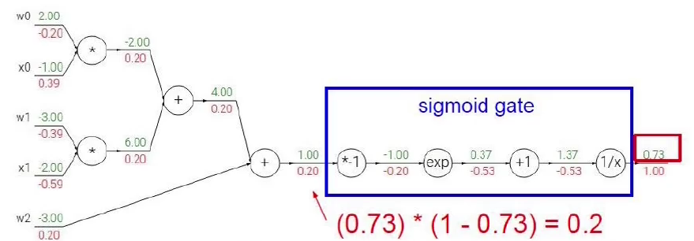
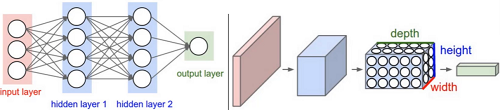
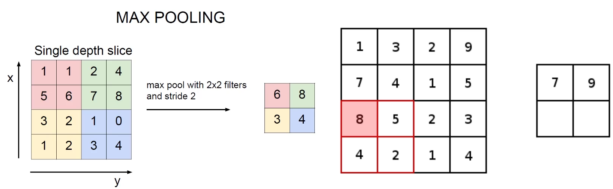
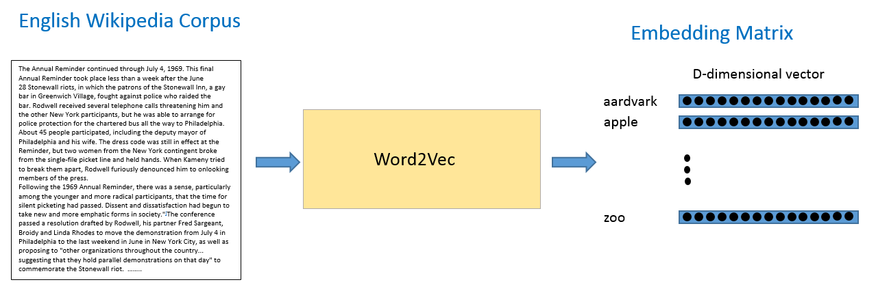

# 深度学习

深度学习是机器学习的一个分支。 许多传统机器学习算法学习能力有限，数据量的增加并不能持续增加学到的知识总量，而深度学习系统可以通过访问更多数据来提升性能，即“更多经验”的机器代名词。机器通过深度学习获得足够经验后，即可用于特定的任务，如驾驶汽车、识别田地作物间的杂草、确诊疾病、检测机器故障等。

## TensorFlow 简单原理

tensorflow会将所有的属性进行包装, 同时也提供不同的transformer. 本文主要使用的就是tensorflow.

**Tensor**: tensorflow的数据, 名为张量. 指的是在tensorflow中运行的数据. 多维数据, tensorflow的基本思路就是针对张量进行操作(flow). Tensor可以为值/向量/矩阵/多维数据.
**operation**: tensorflow的运算节点. 所有的操作都是operation. 类似于算子
**图(graph)**: 整个程序的结构, 类似于storm的节点运算图结构, 在tensorflow1.0中使用的是静态图结构, 因此数据的导入导出需要使用到多个工具进行操作. 在tensorflow2.0中使用的是动态图结构, 更加灵活, 因此很多操作也就简化了. 只是2.0并不完全向下兼容.
**session**: tensorflow运算程序的图, 在2.0中基本弃用

tensorflow简单的操作

```python
import numpy as np
import tensorflow as tf

x = [[1.]]  # 定义一个1行一列的数组
m = tf.matmul(x, x)  # 得到tf封装的Tensor tf.Tensor([[1.]], shape=(1, 1), dtype=float32)
print(m)  # 由于使用的是tensorflow2.0, 动态图的因素, 可以直接打印架构

x = tf.constant([[1, 9], [3, 6]])
print(x)
# tf.Tensor(
# [[1 9]
#  [3 6]], shape=(2, 2), dtype=int32)

print(x.numpy())  # 也可以转换为numpy直接获取
# [[1 9]
#  [3 6]]

x = tf.cast(x, tf.float32)  # 类型转换
print(x)
# tf.Tensor(
# [[1. 9.]
#  [3. 6.]], shape=(2, 2), dtype=float32)

x_1 = np.ones([2, 2])  # 一个2x2的矩阵
x_2 = tf.multiply(x_1, 2)  # 简单的乘法操作
print(x_2)
# [[2. 2.]
#  [2. 2.]], shape=(2, 2), dtype=float64)

```

## 原理结构

深度学习的基本思路就是特征处理. 主要应用领域是计算机视觉和自然语言. 主要目的就是提取合适的特征.

特征工程的作用:

- 数据特征决定了模型的上限
- 预处理和特征提取是核心
- 算法与参数选择决定了如何逼近这个上限

常用的开源数据集

>**CIFAR数据集**
>CIFAR数据集是一个知名的图像识别数据集。CIFAR-10包含10个类别，50,000个训练图像，彩色图像大小：32x32，10,000个测试图像。CIFAR-100与CIFAR-10类似，包含100个类，每类有600张图片，其中500张用于训练，100张用于测试；这100个类分组成20个超类。图像类别均有明确标注。CIFAR对于图像分类算法测试来说是一个非常不错的中小规模数据集。
>
>**Open Image**
>Open Image是一个包含~900万张图像URL的数据集，里面的图片通过标签注释被分为6000多类。该数据集中的标签要比ImageNet（1000类）包含更真实生活的实体存在，它足够让我们从头开始训练深度神经网络。
>
> **Mnist**
> Mnist数据集:深度学习领域的“Hello World!”，入门必备！MNIST是一个手写数字数据库，它有60000个训练样本集和10000个测试样本集，每个样本图像的宽高为28*28。
>
> **ImageNet**
> ImageNet数据集:对深度学习的浪潮起了巨大的推动作用。深度学习领域大牛Hinton在2012年发表的论文《ImageNet Classification with Deep Convolutional Neural Networks》在计算机视觉领域带来了一场“革命”，此论文的工作正是基于Imagenet数据集。
> Imagenet数据集有1400多万幅图片，涵盖2万多个类别；其中有超过百万的图片有明确的类别标注和图像中物体位置的标注，具体信息如下：
>
> - Total number of non-empty synsets: 21841
> - Total number of images: 14,197,122  
> - Number of images with bounding box annotations: 1,034,908
> - Number of synsets with SIFT features: 1000
> - Number of images with SIFT features: 1.2 million
>
> **COCO**
> COCO(Common Objects in Context):是一个新的图像识别、分割和图像语义数据集。COCO数据集由微软赞助，其对于图像的标注信息不仅有类别、位置信息，还有对图像的语义文本描述，COCO数据集的开源使得近两三年来图像分割语义理解取得了巨大的进展，也几乎成为了图像语义理解算法性能评价的“标准”数据集。COCO数据集具有如下特点：
>
> - Object segmentation
> - Recognition in Context
> - Multiple objects per image
> - More than 300,000 images
> - More than 2 Million instances
> - 80 object categories
> - 5 captions per image
> - Keypoints on 100,000 people

## 神经网络基础

### 前向传播 (Forward propagation)

**损失函数(lose function)**, 损失函数是当得到一个结果以后才能进行评估的.

$$L_i = \sum_{j\neq{y_i}}max(0,s_j-{s_{y_i}}+1)$$

> 损失 = 错误类别 - 正确类别 + 1, 损失最低为0
> 将每一个损失相加获取当前分类的损失值


比如我们存在3个类别, 数据得分会进行计算.比如我们计算第一张本来应该为cat, 但是错误类别为car, 因此我们用car的错误类别得分`5.1`减去cat的类别`3.2`然后加一个常量1, 获得car针对于cat的损失为`2.9`. 然后frag对cat的损失为frag的得分`-1.7`减去cat的`3.2`会得到一个负数, 因此不计算. 最终当前图片的损失值为`2.9`, 以此类推.


*需要注意的是常量1是损失函数的delta容忍程度. 如果损失差距过小的话可能也会是错误的结果.*

> **正则化**
> 如果两个模型的损失函数值相同, 两个模型的效果未必一样. 尤其是出现过拟合的情况.
>
> $$L=\frac{1}{n}\sum_{i=1}^{N}\sum_{j\neq{y_i}}max(0,f(x_i;W)_j-f(x_i;W)_{y_i} + 1)+\lambda{R}(W)$$
>
> 其中的$\lambda{R}(W)$就是正则化的惩罚项. 通常情况下,正则化的惩罚项使用平方数$R(W)=\sum_{k}\sum_{l}W^2_{k,l}$处理就可以了
>
> *神经网络是一个极其强大的模型, 对于强大的模型, 存在的过拟合风险就越大.*

#### softmax 分类器

在数学，尤其是概率论和相关领域中，Softmax函数，或称归一化指数函数，是逻辑函数的一种推广。

当我们获取了损失值以后我们希望可以将我们的数值转变成一个概率. 对于概率的比较就更加的直观并且更容易计算. 因此我我们可以引入sigmoid函数帮助我们, Sigmoid函数:

$${S(x)={\frac{1}{1+e^{-x}}}={\frac{e^{x}}{e^{x}+1}}=1-S(-x)}$$

假设我们对输入进行计算, 得出了如下的得分. 然后获得$e^x$也就是e的x次幂的映射, 这个结果就是放大差异(函数图像是指数图像). 最后再进行的分值占总体得分的百分比, 从而得到一个得分值的概率. 最后使用损失值方程进行计算得到我们想要的损失值: `0.89`

损失值: $L_i=-logP(Y=y_i|X=x_i)$


> 综上所述, 我们可以得到归一化函数: $P(Y=k|X=x_i)={\frac{e^{s_{k}}}{\sum_{j}e^{s_{j}}}}{\text{ where }}s=f(x_i;W)$
> **也就是我们的前向传播的损失值计算公式**
> 通过损失值我们就可以使用梯度下降算法, 也就是反向传播


### 反向传播(Back propagation)

通过前向传播得到了损失值, 就可以进行梯度下降的计算了, 但是首先需要看一下神经网络如何使用$W_i$, 也就是参数矩阵.

在神经网络中, 每一层的$\theta$(也就是上面的$w_i$)都会给当前的x值进行计算. 比如我们存在多层运算:

1. 第一层运算的时候我们给$x$进行运算, 得到了$(w_1x)$
2. 第二层运算的时候我们得到了$((w_1x)w_2)$
3. 之后运算都基于前一层计算结果$[w_1w_2x]w_3$
4. 知道所有的计算都被运算$[w_1w_2...w_{n-1}x]w_n$

梯度下降公式: $J(\theta_{0},\theta_{1})=\frac{1}{2m}\sum_{i=1}^{m}(h_\theta(x_i)-y_i)$

#### 原理

当我们对一个数值进行包装性质的操作的时候, 我们可以反向计算出最后一次计算节点对我们最终结果的影响. 比如在下图中, 我们得到了最终结果`-12`, 我们可以尝试查看数值z对我们最终结果的影响有多大(通过求出z的偏导$\frac{\partial{f}}{\partial{z}}$).

而x和y的计算, 我们假设x+y的结果为q. 因此, 如果我们相对x求偏导, 我们可以计算出x的贡献: $\frac{\partial{f}}{\partial{q}}\cdot\frac{\partial{q}}{\partial{x}}$. 同理可以得到y的偏导.


在神经网络中的反向传播, 我们是逐层进行计算的. 也被称为**链式法则**.


>逐层的计算梯度
>
>
>
> 通过上图我们计算出来结果为0.73而返回的损失值为1. *绿色的数值是我们一步一步计算出来的数值. 红色的数值就是我们的梯度损失值.*
>
> 1. 最后一步的计算方程为$\frac{1}{x}$, 导数为$-\frac{1}{x^2}$, 那么结果就为$-\frac{1}{1.37}=-0.53$, 最后一步的梯度就为`-0.53`
> 2. $x+1$ 的偏导数为常数 $1$, 那么结果就是上一层梯度结果乘以本层导数, 就是 $-0.53 * 1 = -0.53$
> 3. $e^x$ 的偏导还是 $e^x$, 因此我们本层导数结果为$e^{-1}$, 本层的梯度结果就是$e^{-1} * -0.53 = 0.1949$, 这里向上取整了
> 4. 继续求偏导...
> 5. 当遇到多元素梯度, 以红框为例, 上一个梯度结果为`0.20`我们本层的运算为$x_0*w_0$的乘法运算. 对于$w_0$而言, 乘法的导数是取x的常量$x_0$也就是`-1.0`, 因此$-1.0*w$导数就是$-1.0$, $w_0$的梯度结果就是$-1.0 *0.20 = -0.20$. 对于$x_0$而言, 乘法的导数是取w的常量$w_0$也就是`2.0`, 因此$2.0*x$导数就是$2$, $x_0$的梯度结果就是$2.0 *0.20 = 0.4$.
>
> 从而计算出所有节点的全部结果. 在反向传播的时候我们可以对一个整体部分求偏导.
> 
>
> 实际计算的时候我们会对矩阵进行求偏导, 工具会完成计算.

反向传播门单元

- 加法门单元: 多元素均等
- 乘法门单元: 计算题都的时候直接将数值进行互换, 同时附加上一层梯度.
- max单元: 直接赋值当前梯度给max的输入


### 模型架构


层次性: 一层一层的数据进行计算
神经元: 节点, 第一层的输入就是特征
全连接: 每一个节点都连接到前一层或者后一层的节点. 每一条线代表的就是一个权重$w$. 因此输入的特征层和隐层1的箭头就是一个`3x4`的权重矩阵, 通过运算得到一个`1x4`的输出结果. 隐层2的输入就是隐层1的输出, 箭头就是一个$4x4$的权重矩阵, 然后进行计算.
非线性: 当每一层计算出结果来以后会进行一次非线性函数变换. sigmod函数就是一个非线性函数, 或者max函数, 这个函数会在每一次矩阵计算结束以后, 也就是神经元上计算. 结果也就是$x_n=W_n[sigmod(W_{n-1}*x_{n-1})]$

特点: 神经元越多, 过拟合可能性就越大. 速度也就会比较慢. <https://cs.stanford.edu/people/karpathy/convnetjs/demo/classify2d.html>

#### 激活函数

当矩阵计算结束以后, 会进行非线性的激活函数, 常见的激活函数为sigmoid,Relu,Tanh等

sigmoid: $\frac{1}{1+e^{-x}}$, 计算准确性比较高, 但是近些年不常用了, 因为需要计算梯度的原因, sigmoid计算梯度的效率很低, 尤其是大数或者小数的时候, 此时可能会出现梯度消失的现象, 也就是梯度结果为0. 一旦出现梯度消失的情况, 后续层的梯度计算结果都为0.
Relu: $max(0,x)$, 用的比较多, **比较实用**, 梯度的计算很容易, 并且不存在梯度消失的情况.
Tanh: $\frac{e^{x}-e^{-x}}{e^{x}+e^{-x}}$, sigmoid和tanh激活函数有共同的缺点：即在z很大或很小时，梯度几乎为零，因此使用梯度下降优化算法更新网络很慢。

#### 标准化, 初始化

不同的预处理结果会是的模型的效果发生很大的差异


神经网络初始化的参数需要初始化, 通常我们都是用随机策略来进行参数初始化 `W=0.01*np.random.randn(D,H)`

#### drop-out

> dropout是一个七伤拳的问题, 主要处理过拟合
> 在训练的时候随机杀死神经元. 每一次迭代的时候都进行一次随机杀死神经元操作.

drop-out训练过程每层随机比例杀死. 在测试的时候, 直接使用整体神经网络进行测试. 主要目的就是为了防止模型过于复杂.


## 神经网络代码

tensorflow2将大量使用Keras构建模型. <https://tensorflow.google.cn/api_docs/python/tf>

常用的部分参数

- activation：激活函数的选择，一般常用relu
- kernel_initializer, bias_initializer：权重与偏置参数的初始化方法，有时候不收敛换种初始化就突然好使了. 思考一下混沌理论, 无论多么细微的初始化差异会在大数据运算后呈现完全不同的结果. 所以如果出现不收敛的问题需要尝试不同的初始化方法来进行收敛.
- kernel_regularizer, bias_regularizer：要不要加入正则化，
- inputs：输入，可以自己指定，也可以让网络自动选
- units：神经元个数

> 在tensorflow1.0中, 如果需要搭建神经网络, 需要构建多个参数矩阵, 比如3x3x3x1的神经网络节点, 我们则需要2个3x3的矩阵和一个3x1的numpy矩阵,同时需要配置权重参数. 而在tensorflow2.0中, 不需要设置任何初始权重参数.

### 数据预测

```python
# 处理时间数据
import datetime

import matplotlib.pyplot as plt
import numpy as np
import pandas as pd
from sklearn import preprocessing
from tensorflow import keras
import tensorflow as tf
# 不同版本的引用会不一样, 其他版本使用tensorflow.keras
# 也可以直接使用tf.keras.layers
from tensorflow.python.keras import layers

"""
搭建神经网络进行气温预测
"""
# 导入数据, actual就是数据
#
#    year  month  day  week  temp_2  temp_1  average  actual  friend
# 0  2016      1    1   Fri      45      44       44      45      24
# 1  2016      1    2   Sat      46      45       44      45      24
# 2  2016      1    3   Sun      47      46       44      45      24
# 3  2016      1    4   Mon      48      47       44      45      24
# 4  2016      1    5  Tues      49      48       44      45      24
features = pd.read_csv('E:\\Workspace\\ml\\code-ml\\ml\\python\\csv\\temps.csv')
print(features.head())

years = features['year']
month = features['month']
day = features['day']
# zip方法: 将多个list压制为元祖: a=[a,b,c]; b=[1,2,3]; zip(a,b)=[(a,1),(b,2),(c,3)]
# 通过for循环list, 然后返回值构建新的list, 返回的元祖赋值到(year,month,day)中
# 通过string创建返回值"2016-1-2"等等的列表
dates = [str(int(years)) + '-' + str(int(month)) + '-' + str(int(day)) for years, month, day in zip(years, month, day)];
dates = [datetime.datetime.strptime(date, '%Y-%m-%d') for date in dates]

################################# 数据可视化展示 #############################

# matplotlib 也提供了几种我们可以直接来用的内建样式
# 导入 matplotlib.style 模块 - 探索 matplotlib.style.available 的内容，里面包括了所有可用的内建样式
# 这些样式可以帮我们改变背景颜色, 改变网格, 消除毛刺等等. 这里我们制定了fivethirtyeight的样式
plt.style.use('fivethirtyeight')
# 设置布局, 获取四格图像的subplot, 2x2的图像矩阵
fig, ((ax1, ax2), (ax3, ax4)) = plt.subplots(nrows=2, ncols=2, figsize=(10, 10))
fig.autofmt_xdate(rotation=45)
# 标签值
ax1.plot(dates, features['actual'])
ax1.set_xlabel(''), ax1.set_ylabel('Temperature'), ax1.set_title('Max Temp')
# 昨天
ax2.plot(dates, features['temp_1'])
ax2.set_xlabel(''), ax2.set_ylabel('Temperature'), ax2.set_title('Previous Max Temp')
# 前天
ax3.plot(dates, features['temp_2'])
ax3.set_xlabel('Date'), ax3.set_ylabel('Temperature'), ax3.set_title('Two Days Prior Max Temp')
# 朋友预测
ax4.plot(dates, features['friend'])
ax4.set_xlabel('Date'), ax4.set_ylabel('Temperature'), ax4.set_title('Friend Estimate')

plt.tight_layout(pad=2)
# plt.show() # 展示一下

################################### 建模 ###############################
# 1. 特征工程
# 将数据进行特征修改, 将weekday改为数字. 有多种处理方式, 这里使用的是独热处理
features = pd.get_dummies(features)
print(features.head(5))
#    year  month  day  temp_2  temp_1  average  actual  friend  week_Fri  week_Mon  week_Sat  week_Sun  week_Thurs  week_Tues  week_Wed
# 0  2016      1    1      45      45     45.6      45      29         1         0         0         0           0          0         0
# 1  2016      1    2      44      45     45.7      44      61         0         0         1         0           0          0         0
# 2  2016      1    3      45      44     45.8      41      56         0         0         0         1           0          0         0
# 3  2016      1    4      44      41     45.9      40      53         0         1         0         0           0          0         0
# 4  2016      1    5      41      40     46.0      44      41         0         0         0         0           0          1         0

# 处理x和y
labels = np.array(features['actual'])  # y值
features = features.drop('actual', axis=1)  # 删除actual column, drop()方法默认删除行, axis表示这里删除的是列
# 获取column的名称单独保存到另一个参数中.
# columns参数获取全部的column名称, 同样可以使用index和values获取需要的数据, index是行坐标, values是全部数据
feature_list = list(features.columns)
features = np.array(features)  # 将feature的DataFrame类型转换为ndArray类型

# 对数据进行预处理, 还是之前sklearn的standardscaler
input_features = preprocessing.StandardScaler().fit_transform(features)
# print(input_features)
# [[ 0.         -1.5678393  -1.65682171 ... -0.40482045 -0.41913682 -0.40482045]
#  [ 0.         -1.5678393  -1.54267126 ... -0.40482045 -0.41913682 -0.40482045]
#  [ 0.         -1.5678393  -1.4285208  ... -0.40482045 -0.41913682 -0.40482045]
#  ...

# 2. 构建模型
# 这里我们使用的是dense mode全连接层, 其中也包含卷积层cropping等等
# <https://tensorflow.google.cn/api_docs/python/tf/keras>
# tf.keras.layers.Dense(
#     units,
#     activation=None,
#     use_bias=True,
#     kernel_initializer='glorot_uniform',
#     bias_initializer='zeros',
#     kernel_regularizer=None,
#     bias_regularizer=None,
#     activity_regularizer=None,
#     kernel_constraint=None,
#     bias_constraint=None,
#     **kwargs
# )
model = tf.keras.Sequential()  # 创建模型
model.add(layers.Dense(16))  # 第一层16个神经元, 也就是16个特征
model.add(layers.Dense(32))  # 第二层32个神经元
model.add(layers.Dense(1))  # 输出单元1

# 初始化网络模型
# model.compile(optimizer='sgd', loss='mse')
# optimizer 优化迭代器. 损失函数的迭代器. 这里可以使用上面的简写, adam也是常用的迭代器.
# loss 损失函数, mse是非常常见的损失函数, 不同损失函数对最终结果影响很大.
model.compile(optimizer=tf.keras.optimizers.SGD(0.001), loss='mean_squared_error')

# 训练, tensorflow1.0中需要创建session等等, 在tensorflow2.0中只需要基础属性就可以了
# validation_split 就是测试集分解
# epochs 运算迭代的次数, 这里制定了迭代10次
# batch_size 每一次优化器迭代多少个样本, 这里选择的是64个样本, 越大越好64/128/256
model.fit(input_features, labels, validation_split=0.25, epochs=10, batch_size=64)
# Epoch 10/10
# 5/5 [==============================] - 0s 6ms/step - loss: 50.4199 - val_loss: 724.1822
# 可以看到在训练集中的损失值为724.182, 但是训练集的损失为50.4199, 说明模型出现了过拟合的状态.

model.summary()
# Model: "sequential"
# -----------------------------------------------------------------
#  Layer (type)                Output Shape              Param #
# =================================================================
#  module_wrapper (ModuleWrapp  (None, 16)               240  er)  一共14个特征, 第一层有16个神经元, 总共16x14=224, 再加上偏置函数16为240
#  module_wrapper_1 (ModuleWra  (None, 32)               544  pper) 32*16=512, 再加上32个偏置函数总共544
#  module_wrapper_2 (ModuleWra  (None, 1)                33  pper) 32 * 1 + 1 = 33
# =================================================================
# Total params: 817
# Trainable params: 817
# Non-trainable params: 0


# 3. 重新构建模型, 尝试不同的结果
# 使用random_normal初始化函数, 高斯分布
model = tf.keras.Sequential()
model.add(layers.Dense(16, kernel_initializer='random_normal'))
model.add(layers.Dense(32, kernel_initializer='random_normal'))
model.add(layers.Dense(1, kernel_initializer='random_normal'))
model.compile(optimizer=tf.keras.optimizers.SGD(0.001), loss='mean_squared_error')
model.fit(input_features, labels, validation_split=0.25, epochs=10, batch_size=64)
# 好一丢丢, 但是复杂的数据可能会出现不同的结果
# Epoch 10/10
# 5/5 [==============================] - 0s 6ms/step - loss: 53.7003 - val_loss: 692.4907

# 使用正则化修正, L2的正则化, lambda的值设置为0.03
model = tf.keras.Sequential()
model.add(layers.Dense(16, kernel_initializer='random_normal', kernel_regularizer=tf.keras.regularizers.l2(0.03)))
model.add(layers.Dense(32, kernel_initializer='random_normal', kernel_regularizer=tf.keras.regularizers.l2(0.03)))
model.add(layers.Dense(1, kernel_initializer='random_normal', kernel_regularizer=tf.keras.regularizers.l2(0.03)))
model.compile(optimizer=tf.keras.optimizers.SGD(0.001), loss='mean_squared_error')
model.fit(input_features, labels, validation_split=0.25, epochs=100, batch_size=64)
# 正则化会非常稳定
# Epoch 10/10
# 5/5 [==============================] - 0s 6ms/step - loss: 37.9034 - val_loss: 583.6664
# Epoch 100/100
# 5/5 [==============================] - 0s 6ms/step - loss: 52.9017 - val_loss: 31.6005

##########################################结果预测####################################
# 放入测试集
predict = model.predict(input_features)  # 这里不应该把预测结果直接放入, 因为测试集会完美符合, 但是, 时间有限只能上车了
print(predict.shape)
# 转换日期
dates = [str(int(year)) + '-' + str(int(month)) + '-' + str(int(day)) for year, month, day in zip(years, month, day)]
dates = [datetime.datetime.strptime(date, '%Y-%m-%d') for date in dates]
# 创建一个表格来存日期和其对应的标签数值
true_data = pd.DataFrame(data={'date': dates, 'actual': labels})
# 同理，再创建一个来存日期和其对应的模型预测值
months = features[:, feature_list.index('month')]
days = features[:, feature_list.index('day')]
years = features[:, feature_list.index('year')]
test_dates = [str(int(year)) + '-' + str(int(month)) + '-' + str(int(day)) for year, month, day in
              zip(years, months, days)]
test_dates = [datetime.datetime.strptime(date, '%Y-%m-%d') for date in test_dates]
predictions_data = pd.DataFrame(data={'date': test_dates, 'prediction': predict.reshape(-1)})

# 真实值
plt.plot(true_data['date'], true_data['actual'], 'b-', label='actual')
# 预测值
plt.plot(predictions_data['date'], predictions_data['prediction'], 'ro', label='prediction')
plt.xticks(rotation='60')
plt.legend()

# 图名
plt.xlabel('Date'), plt.ylabel('Maximum Temperature (F)'), plt.title('Actual and Predicted Values')
plt.show()
```

数据的分布


### 分类

使用手写输出的分类模型, 让他可以给出一个分类的结果

```python
# 处理时间数据
import gzip
from pathlib import Path
import pickle

from matplotlib import pyplot
import requests
import tensorflow as tf
# 不同版本的引用会不一样, 其他版本使用tensorflow.keras
# 也可以直接使用tf.keras.layers
from tensorflow.python.keras import layers

"""
分类任务
"""
DATA_PATH = Path("data")
PATH = DATA_PATH / "mnist"
print(PATH)  # data\mnist

PATH.mkdir(parents=True, exist_ok=True)  # 创建文件夹
URL = 'https://github.com/mnielsen/neural-networks-and-deep-learning/raw/master/data/'
FILENAME = 'mnist.pkl.gz'

# url下载到本地
if not (PATH / FILENAME).exists():
    print("downloading...")
    content = requests.get(URL + FILENAME).content
    (PATH / FILENAME).open("wb").write(content)

# 解压缩, 然后抽取train和test
with gzip.open((PATH / FILENAME).as_posix(), "rb") as f:
    print("unzipping...")
    ((x_train, y_train), (x_valid, y_valid), _) = pickle.load(f, encoding="latin-1")

pyplot.imshow(x_train[0].reshape((28, 28)))
pyplot.show()
print(x_train.shape)  # 展示一波
print(y_train[0])  # 5, 这里的y不是onehot类型,属于单一输出

############################ 模型构建 ############################
# 数据是一个28*28的图片, 得到的784个pixel
model = tf.keras.Sequential()
model.add(layers.Dense(32, activation='relu'))
model.add(layers.Dense(32, activation='relu'))
model.add(layers.Dense(10, activation='softmax'))  # 分为10类

# 由于输入的结果值y属于属性方法, 而不是onehot类型, 我们可以使用不同的损失函数
# 比如 CategoricalCrossentropy 需要一个onehot形式 (we expect labels to be provided in a one_hot representation.)
# 损失函数可能会变得非常离谱, 所以如果损失值出现问题, 检查损失函数
model.compile(optimizer=tf.keras.optimizers.Adam(0.001),
              loss=tf.keras.losses.SparseCategoricalCrossentropy(),
              metrics=[tf.keras.metrics.SparseCategoricalAccuracy()])  # 展示准确率, 准确率的计算metric
model.fit(x_train, y_train,
          validation_split=0.25, epochs=5, batch_size=64,
          validation_data=(x_valid, y_valid))
```

### 数据处理

tensorflow中数据大部分为矢量数据, 设计初衷也是使用矢量数据作为数据源的.

TensorFlow 1.X中的常见使用模式是“水槽”策略，其中所有可能的计算的合集被预先排列，然后通过 session.run() 评估选择的张量。在TensorFlow 2.0中，用户应将其代码重构为较小的函数，这些函数根据需要调用。通常，没有必要用 tf.function 来修饰这些较小的函数，仅使用 tf.function 来修饰高级计算 - 例如，训练的一个步骤或模型的正向传递。

```python
import gzip
from pathlib import Path
import pickle

import numpy as np
import requests
import tensorflow as tf
from tensorflow.python.keras import layers

DATA_PATH = Path("data")
PATH = DATA_PATH / "mnist"
print(PATH)  # data\mnist

PATH.mkdir(parents=True, exist_ok=True)  # 创建文件夹
URL = 'https://github.com/mnielsen/neural-networks-and-deep-learning/raw/master/data/'
FILENAME = 'mnist.pkl.gz'

if not (PATH / FILENAME).exists():
    print("downloading...")
    content = requests.get(URL + FILENAME).content
    (PATH / FILENAME).open("wb").write(content)

with gzip.open((PATH / FILENAME).as_posix(), "rb") as f:
    print("unzipping...")
    ((x_train, y_train), (x_valid, y_valid), _) = pickle.load(f, encoding="latin-1")
model = tf.keras.Sequential()
model.add(layers.Dense(32, activation='relu'))
model.add(layers.Dense(32, activation='relu'))
model.add(layers.Dense(10, activation='softmax'))
model.compile(optimizer=tf.keras.optimizers.Adam(0.001),
              loss=tf.keras.losses.SparseCategoricalCrossentropy(),
              metrics=[tf.keras.metrics.SparseCategoricalAccuracy()])

"""
数据集, 以及常用函数
"""
input_data = np.arange(16)
print(input_data)  # [ 0  1  2  3  4  5  6  7  8  9 10 11 12 13 14 15]

# 直接将ndarray类型的数据传入tensorflow, 得到的flow数据是可以遍历的
dataset = tf.data.Dataset.from_tensor_slices(input_data)
for data in dataset:
    print(data)
    # tf.Tensor(0, shape=(), dtype=int32)
    # tf.Tensor(1, shape=(), dtype=int32)
    # tf.Tensor(2, shape=(), dtype=int32)
    # ...

# repeat操作
# 将dataset中的数据repeat一份, 同样序列
dataset = tf.data.Dataset.from_tensor_slices(input_data)
dataset = dataset.repeat(2)
for data in dataset:
    print(data)
    # tf.Tensor(0, shape=(), dtype=int32)
    # tf.Tensor(1, shape=(), dtype=int32)
    # ...
    # tf.Tensor(15, shape=(), dtype=int32)
    # tf.Tensor(0, shape=(), dtype=int32)
    # tf.Tensor(1, shape=(), dtype=int32)
    # ...
    # tf.Tensor(15, shape=(), dtype=int32)

# batch 操作, 批量操作, 将数据分批打包
dataset = tf.data.Dataset.from_tensor_slices(input_data)
dataset = dataset.batch(4)  # 每4个组成一个batch
for data in dataset:
    print(data)
    # tf.Tensor([0 1 2 3], shape=(4,), dtype=int32)
    # tf.Tensor([4 5 6 7], shape=(4,), dtype=int32)
    # tf.Tensor([ 8  9 10 11], shape=(4,), dtype=int32)
    # tf.Tensor([12 13 14 15], shape=(4,), dtype=int32)

# shuffle操作, 打乱顺序
# buffer_size 缓存区, 随机构建的时候使用缓存区进行抽取, 然后从缓存区中随机抽取构建序列. 类似于随机滑动窗口.
# 比如buffer_size为10, 那么就将1-10放入缓存区, 然后随机抽取, 抽取一个以后将11放入随机抽取.
# 此时, 11绝对不会出现在第一个位置, 而第一个位置也必然只能是1-10中的一个
# 因此, 如果buffer_size为1的时候就是不进行乱序操作, 而buffer_size为数据长度相同时就是全局随机排列.
dataset = tf.data.Dataset.from_tensor_slices(input_data).shuffle(buffer_size=10).batch(4)
for data in dataset:
    print(data)
    # tf.Tensor([ 1  0 11  6], shape=(4,), dtype=int32)
    # tf.Tensor([13  5 15  2], shape=(4,), dtype=int32)
    # tf.Tensor([ 8  7  3 14], shape=(4,), dtype=int32)
    # tf.Tensor([10  9  4 12], shape=(4,), dtype=int32)

# 基于数据集的重新训练
train = tf.data.Dataset.from_tensor_slices((x_train, y_train)).batch(32).repeat()
valid = tf.data.Dataset.from_tensor_slices((x_valid, y_valid)).batch(32).repeat()
model.fit(train, epochs=5, steps_per_epoch=100, validation_data=valid, validation_steps=100)
```

### NN案例

```python
import matplotlib.pyplot as plt
from tensorflow import keras

# 下载服装数据集
fashion_mnist = keras.datasets.fashion_mnist

(train_images, train_labels), (test_images, test_labels) = fashion_mnist.load_data()

# 输出类别,我们输出的类别
class_names = ['T-shirt/top', 'Trouser', 'Pullover', 'Dress', 'Coat',
               'Sandal', 'Shirt', 'Sneaker', 'Bag', 'Ankle boot']

print(train_images.shape)  # (60000, 28, 28)
print(len(train_labels))  # 60000
print(test_images.shape)  # (10000, 28, 28)

plt.figure()
plt.imshow(train_images[0])
plt.colorbar()  # 添加颜色热度
plt.grid(False)  # 关闭网格
# plt.show()

#### 处理图像, 需要注意的是, 预处理需要从测试集和预测同时使用
#train_images = train_images / 255.0
#test_images = test_images / 255.0

# 展示图像
plt.figure(figsize=(10, 10))
for i in range(25):
    plt.subplot(5, 5, i + 1)
    plt.xticks([])
    plt.yticks([])
    plt.grid(False)
    plt.imshow(train_images[i], cmap=plt.cm.binary)
    plt.xlabel(class_names[train_labels[i]])
# plt.show()

## 训练模型
model = keras.Sequential([
    keras.layers.Flatten(input_shape=(28, 28)),  # 将图像进行拉伸, 成为784的feature, 同时定义输入层
    keras.layers.Dense(128, activation='relu'),
    keras.layers.Dense(10, activation='softmax')
])
model.compile(optimizer='adam',
              loss='sparse_categorical_crossentropy',
              metrics=['accuracy'])
model.fit(train_images, train_labels, epochs=10)
```

### 评估

```python
####评估模型
# 指定测试集的x和测试集的y就可以了, 直接出结果
test_loss, test_acc = model.evaluate(test_images, test_labels, verbose=2)
print('\nTest accuracy:', test_acc)  # Test accuracy: 0.8847000002861023

predictions = model.predict(test_images)
print(predictions.shape)  # (10000, 10)
print(predictions[0])
# [7.6147963e-08 5.5699688e-11 2.4855829e-10 6.9418427e-09 4.1508761e-09
#  2.9993954e-04 1.7000576e-07 5.8553129e-02 2.8515702e-08 9.4114667e-01]

print(np.argmax(predictions[0]))  # 9
```

### 模型的保存和使用

保存模型的时候会保存权重参数和网络的结构

```python
### 模型的保存
model.save('fashion_model.h5')


# 将网络模型输入到文件中
config_json = model.to_json()
# '{"class_name": "Sequential", "config": {"name": "sequential_1", "layers": [{"class_name": "Flatten", "config": {"name": "flatten", "trainable": true, "batch_input_shape": [null, 28, 28], "dtype": "float32", "data_format": "channels_last"}}, {"class_name": "Dense", "config": {"name": "dense_3", "trainable": true, "dtype": "float32", "units": 128, "activation": "relu", "use_bias": true, "kernel_initializer": {"class_name": "GlorotUniform", "config": {"seed": null}}, "bias_initializer": {"class_name": "Zeros", "config": {}}, "kernel_regularizer": null, "bias_regularizer": null, "activity_regularizer": null, "kernel_constraint": null, "bias_constraint": null}}, {"class_name": "Dense", "config": {"name": "dense_4", "trainable": true, "dtype": "float32", "units": 10, "activation": "softmax", "use_bias": true, "kernel_initializer": {"class_name": "GlorotUniform", "config": {"seed": null}}, "bias_initializer": {"class_name": "Zeros", "config": {}}, "kernel_regularizer": null, "bias_regularizer": null, "activity_regularizer": null, "kernel_constraint": null, "bias_constraint": null}}]}, "keras_version": "2.2.4-tf", "backend": "tensorflow"}'
with open('config.json', 'w') as json:
    json.write(config_json)

# 获取权重参数
weights = model.get_weights()
print(weights)
# 也可以存入文件
model.save_weights("fashion.weights")
```

读取模型:

```python
from tensorflow import keras

# 读取模型
model = keras.model.load_model('fashion_model.h5')
fashion_mnist = keras.datasets.fashion_mnist
(train_images, train_labels), (test_images, test_labels) = fashion_mnist.load_data()
predictions = model.predict(test_images)
print(predictions.shape)  # (10000, 10)


# 读取json模型
model = keras.models.model_from_json(config_json) # config_json是json字符串
model.summary()

# 读取权重
model.load_weights('feshion.weights')
```

---

## 卷积神经网络 Convolutional Neural Networks

卷积神经网络 – CNN 最擅长的就是图片的处理。它受到人类视觉神经系统的启发。目前 CNN 已经得到了广泛的应用，比如：人脸识别、自动驾驶、美图秀秀、安防等很多领域。

CNN 有2大特点：

- 能够有效的将大数据量的图片降维成小数据量
- 能够有效的保留图片特征，符合图片处理的原则

卷积神经网络相比于传统神经网络, 传统神经网络的输入回事一个一维的数据类型, 卷积神经网络是一个多维的类型. 输出的数据直接是三维的，还多了深度



输入层、卷积层、池化层、全连接层:


针对不同的区域特征进行不同的权重分析. 不同的特征进行分析, 对图像进行分割.

### 卷积原理

通过卷积, 将一个5x5的矩阵转化为一个3x3的权重矩阵结果.


> 比如一个猫的图，眼睛鼻子特征和周围环境特征的重要性明显不一样，需要区别对待。先把图像进行分割（最左边），分割成多个小区域，提取其中一个小区域（第二个5×5×3），蓝色图的右下角3×3矩阵，大字体的值是X的值，而小字体的值是w权重，会不断循环获取最优的w权重和对应的值，并输出右边绿色的14（特征值）。


最终我们要多所有的颜色通道进行计算然后相加. 每一个卷积核(filter)的大小必须相同. 从而获取相同形状的输出数据.


> input是输入，W0是第一层的权重，W1是第二层的权重，Output是输出

我们以input三个块（RGB三颜色）左上角3×3矩阵值 和 第二层W1来计算，内积是乘法再相加。

- 先来第一个（R颜色）左上角3×3：[0,0,0],[0,0,1],[0,0,1] 和 权重 [-1,-1,0],[-1,1,0],[-1,1,0]
  `(0*(-1) + 0*(-1) + 0*0)` + `(0*(-1) + 0*1 + 1*0)` + `(0*(-1) + 0*1 + 1*0)` = 0 得出R颜色的左上角矩阵的值为0；

- 第二个（G颜色） 左上角3×3矩阵值 和 第二层W1来计算
  `(0*1 + 0*(-1) + 0*0)` + `(0*(-1) + 1*0 + 1*(-1))` + `(0*(-1) + 0*0 + 2*0)` = -1

- 第三个（B颜色） 左上角3×3矩阵值 和 第二层W1来计算
  `((-1)*0 + 0*0 + 1)` + `(0*1 + 2*0 + 0*1)` + `(0*0 + 0*(-1) + 0*0)` = 0

- 最后再把三者结果相加并加上bias b1（偏值b）
  0 + (-1) + 0 + 0 = -1
  这级得到了output（0[:,:,1]）中左上角的结果 -1。

然后分别计算出W0和W1的输出卷积, 也叫特征图 Feature Map, 也叫activation map. 要注意加上bias, 就是直接相加得出结果. 对于W1和W0都有自己的bias.

通过多个卷积参数据帧可以得到多个卷积层


**卷积的深度处理**: 卷积层不一定会是单一的.也可以是非常复杂的深度迭代处理.

对于卷积的处理,我们需要对某些特征图进行迭代卷积, 而不是单纯的针对一个卷积处理. 当我们得到一个大范围的卷积图以后我们可以对结果进行细粒度的处理, 从而得到我们需要的特征


堆叠多个特征得到一个卷积层以后可以将卷积层继续堆叠进行更深层次的,更高维度的特征提取.


**步长（移动多少个单元格）**：

针对不同的任务可以选择不同的步长

- 步长为1的卷积：
    
    移动一个步长，得到红色绿色特征值，移动的步长越小，特征值越多

- 步长为2的卷积：
    
    移动两个步长，得到特征值越少

- 一般图像识别的用步长为1的，而部分文本任务, 有的时候可以选择更多的步长. 而且步长为1的任务时间可能会很久, 但大部分时候我们还是会选择步长为1

**卷积核尺寸**：选择区域的大小，如上面是3×3的矩阵，可以选择4×4、5×5的，核尺寸越小，越细粒度提取，特征越多。针对一个输入我们可以定义多个特征提取filter, 然后获取不同粒度, 不同尺度的feature map. 当获得了多个activation map, 我们可以将其堆叠到一起, 从而获得丰富的特征.

**边缘填充**：

+pad表示+1边缘，原本数据只有蓝色背景的部分（中间部分），而周围都是边缘增加的0，为什么这么做，滑动窗口时，边缘数据点明显滑动少，中间多，那能说明中间的就重要吗，为了使边缘的数据点也滑动多几次，就增加了这个边缘填充。文本分类中，有的文本有100个字，有的120字，不同长度无法训练，所以也会对其填充20个字，变成同样120的长度。

**卷积核个数**：最终计算的结果，要得到多少个特征图，个数多少，特征图多少。


卷积结果计算公式:

长度: $h_2=\frac{H_1-F_H-2P}{S} + 1$
宽度: $W_2=\frac{W_1-F_W-2P}{S} + 1$

> W1,H1表示输入的宽度,长度; W2,H2表示的是特征图的宽度和长度; F表示卷积核长和宽的大小; S表示滑动窗口的步长; P表示便捷填充
>
> 假设输入数据为`32x32`的RGB图像, 用10个5x5x3的filter来进行卷积, 规定步长为1, 边界填充2.
> 输出结果宽高都为 $\frac{32-5+2*2}{1}+1=32$ 所以输出10个32x32的卷积图.

**卷积参数共享原则**：即input使用的W部分的参数是共享的，卷积网络比之前的全连接大大减少了参数，不再需要每个对应的W。

### 池化层

卷积神经网络中同时存在一个池化层的理论, 主要目的就是为了压缩数据, down sampling 下采样. 主要目的就是减少长宽以减少数据量的体积


**最大池化MAX POOLING**：除了max pooling 还存在一个average pooling, 但是需要注意的是, 池化层的主要对象是卷积层, 卷积层的数据是已经抽取过一次的数据了, 而能表现特征的数据则是较大的数据. 大部分场景average pooling已经被淘汰.




- 如上图，从可选中，选出最大的值。为什么选择最大的值，因为前面是有权重W相乘的，还记得前面的W0和W1吗，如果计算完成得到的结果最大，那说明该结果是最重要的，所以这里选最大的，即挑最重要的。
- 体积也从上图的2×2矩阵变成4×4的矩阵
- 除了最大池化还有平均池化，不过平均池化基本没人用，既然有最好的结果，就应该拿最好的。
- 池化层没有结果任何计算，只是选最大的

### 整体结构

每一个卷积层都会伴随relu的激活函数, 最后会使用full connect全连接层进行计算, 因此池化层的最后一部会是flatten数据.


只有带参数的才能算层，Relu和池化不算


经典的神经网络历史:

1. Alexnet, 2012年开发的, 一个很原始的卷积网络, 使用的核等工具并不完善.
    

2. vgg神经网络, 2014年开发. 改进比较高. 所有的卷积核都是3x3的, 而vgg为16层网络. vgg在每次pooling的时候会将特征数量翻倍, 从而弥补池化层带来的特征损失. vgg的效果相比于alexnet的效率提升15%. 但是alex相比于vgg速度会快很多, 模型训练很多时候是以天为单位.
    

3. 残差网络ResNet, 2015年. 传统的神经网络出现了瓶颈, 当网络层叠加到16层以后, 性能并不会提升, 学习深度也不会增加. 下面是一组很早前测试的图
    
    左边的训练集和右边的预测集都是20层的反而比56层的好，那么说明多出的36层起负作用。因此提出了解决方案
    
    > 我们还是跟原来一样增加层数，但在此基础上增加残差，也就是如果多的一层网络效果并不比上一层好，那么依然使用上一层的结果，可以看到X直接跳过了两层，这样就能保证了效果一定是越来越好的。如何做到这一步的方法就是将权重全部置为0, 而只使用上一层传递过来的x参数. 至少不会比原来差.
    >
    > 传统神经网络和Resnet的对比
    > 

### 感受野 Receptive Field

表示网络内部的不同位置的神经元对原图像的感受范围的大小。神经元之所以无法对原始图像的所有信息进行感知，是因为在这些网络结构中普遍使用卷积层和pooling层，在层与层之间均为局部相连（通过sliding filter）。神经元感受野的值越大表示其能接触到的原始图像范围就越大，也意味着他可能蕴含更为全局、语义层次更高的特征；而值越小则表示其所包含的特征越趋向于局部和细节。因此感受野的值可以大致用来判断每一层的抽象层次。

当前卷积层的一个点可以感受到初始值变化. 比如第二张图的中心点可以感受第一张图绿色范围的变化, 第三张图的粉色可以感受到第二张图的粉色家绿色的变化. 以此类推, 第三张图可以感受到第一张图5x5的变化.


在感受野理论中3个3x3的核的感受野和一个7x7的感受野结果一样. 但是还是使用了3x3的核.

> 假设输入大小都是 $h*w*c$, 并且都是用c个卷积核,可以算出来所需的参数:
> $7*7\text{的卷积核需要的参数} = c*(7*7*c)=49c^2$
> $3个3*3\text{的卷积核需要的参数} = 3*c*(3*3*c)=27c^2$
>
> 因此堆叠小的卷积核所需的参数更少, 并且卷积过程越多, 特征提取就会细致, 加入的非线性变换(Relu)也会随着增多, 还会增大权重参数个数, 这个就是VGG网络的基本出发点, 用小的卷积核来完成特征提取

### 图像识别任务

猫狗识别

- 数据预处理：图像数据处理，准备训练和验证数据集
- 卷积网络模型：构建网络架构
- 过拟合问题：观察训练和验证效果，针对过拟合问题提出解决方法
- 数据增强：图像数据增强方法与效果
- 迁移学习：深度学习必备训练策略

<https://www.kaggle.com/datasets/shaunthesheep/microsoft-catsvsdogs-dataset>

构建卷积神经网络模型, 几层都可以, 如果用CPU训练，可以把输入设置的更小一些，一般输入大小更主要的决定了训练速度

api文档: <https://www.tensorflow.org/api_docs/python/tf/keras/layers/Conv2D>

卷积层, 常用的参数: tf.keras.layers.Conv2D

- `filters`: 卷积特征图的个数, 用多少个卷积核来做. 输出特征图的个数
- `kernel_size`: 核的大小, 3x3 还是 5x5
- `strides`: 步长, 默认(1, 1)
- `padding`: 是否启用边界填充, 默认 'valid',

不同于fit()一次性加载所有的train数据集，遍历一遍就可以作为一轮epoch的结束，generator是可以从给定的数据集中“无限”生成数据的，并且因为一次只加载数据集的一部分（generator就是为了解决数据集过大无法一次性加载到内存的问题），所以他并不知道什么时候才是一轮epoch的结束。同样的，batch_size也没有作为参数传递给fit_generator()，所以必须有机制来判断：

1. 什么时候结束一轮epoch
2. batch_size是多少。

这时候steps_per_epoch就顺理成章的出现了。这个参数实际上就是指定了每一轮epoch需要执行多少steps，也就是多少steps，才能认为一轮epoch结束。那么衍生问题就是，一个step是怎么度量？其实就是规定每个step加载多少数据，也就是batch_size。他们的关系如下：

steps_per_epoch=len(x_train)/batch_size

一句话概括，就是对于整个训练数据集，generator要在多少步内完成一轮遍历（epoch），从而也就规定了每步要加载多少数据（batch_size）。需要注意的是generator每一个批次都会从硬盘读取数据. 因此, 大型数据的io可能会很小,需要自己自定义generator

```python
import os

from keras.preprocessing.image import ImageDataGenerator
import tensorflow as tf

"""
猫狗训练模型
在kaggle网站下载猫狗图片, 然后将前10000张图片作为训练集, 后2500张图片作为测试集, 放入文件夹中
<https://www.kaggle.com/datasets/shaunthesheep/microsoft-catsvsdogs-dataset>
文件架结构: 
 dogs-and-cats
   - train
     - cat
     - dog
   - validation
     - cat
     - dog 
"""
# 数据所在文件夹
base_dir = 'E:\\Workspace\\ml\\code-ml\\ml\\python\\data\\dogs-and-cats'
train_dir = os.path.join(base_dir, 'train')
validation_dir = os.path.join(base_dir, 'validation')
# 训练集
train_cats_dir = os.path.join(train_dir, 'cat')
train_dogs_dir = os.path.join(train_dir, 'dog')
# 验证集
validation_cats_dir = os.path.join(validation_dir, 'cat')
validation_dogs_dir = os.path.join(validation_dir, 'dog')

# 查看模型类型. 如果想使用gpu那么需要安装gpu版本. pip install tensorflow-gpu
print("Num GPUs Available: ", len(tf.config.experimental.list_physical_devices('GPU')))
print("Num CPUs Available: ", len(tf.config.experimental.list_physical_devices('CPU')))

# 构建模型
model = tf.keras.models.Sequential([
    # 如果训练慢，可以把数据设置的更小一些
    # 这里的input shape是将数据resize到目标大小
    # 这里是最终得到32个特征图, 使用3x3的核, relu激活函数
    tf.keras.layers.Conv2D(32, (3, 3), activation='relu', input_shape=(64, 64, 3)),
    tf.keras.layers.MaxPooling2D(2, 2),  # 池化 一般都是2x2

    tf.keras.layers.Conv2D(64, (3, 3), activation='relu'),
    tf.keras.layers.MaxPooling2D(2, 2),

    tf.keras.layers.Conv2D(128, (3, 3), activation='relu'),
    tf.keras.layers.MaxPooling2D(2, 2),

    # 为全连接层准备, 平铺为一个向量
    tf.keras.layers.Flatten(),

    # 创建全连接层
    tf.keras.layers.Dense(512, activation='relu'),
    # 二分类sigmoid就够了
    tf.keras.layers.Dense(1, activation='sigmoid')
])

model.summary()
# Model: "sequential"
# ______________________________________________________________________
#  Layer (type)                     Output Shape              Param #
# ====================================================================== 32个3x3x3的核
#  conv2d (Conv2D)                  (None, 62, 62, 32)        896   -> 3x3x3 * 32 + 32 = 896
#  max_pooling2d (MaxPooling2D)     (None, 31, 31, 32)        0
#  conv2d_1 (Conv2D)                (None, 29, 29, 64)        18496
#  max_pooling2d_1 (MaxPooling2D)   (None, 14, 14, 64)        0
#  conv2d_2 (Conv2D)                (None, 12, 12, 128)       73856
#  max_pooling2d_2 (MaxPooling2D)   (None, 6, 6, 128)         0
#  flatten (Flatten)                (None, 4608)              0
#  dense (Dense)                    (None, 512)               2359808
#  dense_1 (Dense)                  (None, 1)                 513
# =================================================================
# Total params: 2,453,569
# Trainable params: 2,453,569
# Non-trainable params: 0
# _________________________________________________________________

# 配置训练器
model.compile(loss='binary_crossentropy',  # 二分类损失计算
              optimizer=tf.keras.optimizers.Adam(learning_rate=1e-4),
              metrics=['acc'])  # 由于是二分类, 直接使用准确率作为评估标准

# 数据的归一化
#
# 数据预处理:
# - 读进来的数据会被自动转换成tensor(float32)格式，分别准备训练和验证
# - 图像数据归一化（0-1）区间
train_datagen = ImageDataGenerator(rescale=1. / 255)
test_datagen = ImageDataGenerator(rescale=1. / 255)

# 创建生成器, 回一个batch一个batch的读取数据. 目标大小必须是64x64的
# 生成器的原因是不会将数据读入内存
train_generator = train_datagen.flow_from_directory(
    train_dir,  # 文件夹路径
    target_size=(64, 64),  # 指定resize成的大小
    batch_size=20,
    class_mode='binary')  # 如果one-hot就是categorical，二分类用binary就可以
validation_generator = test_datagen.flow_from_directory(
    validation_dir,
    target_size=(64, 64),
    batch_size=20,
    class_mode='binary')
# Found 20002 images belonging to 2 classes.
# Found 4998 images belonging to 2 classes.

# 训练网络模型
# 直接fit也可以，但是通常咱们不能把所有数据全部放入内存，fit_generator相当于一个生成器，动态产生所需的batch数据
# steps_per_epoch相当给定一个停止条件，因为生成器会不断产生batch数据，说白了就是它不知道一个epoch里需要执行多少个step
# 如果2000个训练数据, 如果batch是20, 那么会有100次才能完成epoch. 最好自己计算
history = model.fit_generator(
    train_generator,
    steps_per_epoch=100,  # 2000 images = batch_size * steps
    epochs=201,
    validation_data=validation_generator,
    validation_steps=25,  # 1000 images = batch_size * steps
    verbose=2)

# 此处, 训练集的结果为0.98, 拟合程度很高, 但是测试集中, 拟合程度却很低, 只有0.84, 说明模型过拟合了
# Epoch 201/201
# 100/100 - 7s - loss: 0.0486 - acc: 0.9870 - val_loss: 0.5077 - val_acc: 0.8480 - 7s/epoch - 70ms/step

model.save('dog_cat_model.h5')

## 展示结果
import matplotlib.pyplot as plt

acc = history.history['acc']
val_acc = history.history['val_acc']
loss = history.history['loss']
val_loss = history.history['val_loss']

epochs = range(len(acc))

plt.subplot(121).plot(epochs, acc, 'bo', label='Training accuracy')
plt.subplot(121).plot(epochs, val_acc, 'b', label='Validation accuracy')
plt.subplot(121).set_title('Training and validation accuracy')

plt.subplot(122).plot(epochs, loss, 'bo', label='Training Loss')
plt.subplot(122).plot(epochs, val_loss, 'b', label='Validation Loss')
plt.subplot(122).set_title('Training and validation loss')

plt.legend()

plt.show()
```


training lose 持续下降, 但是测试集并没有下降甚至无法收敛, 因此出现了过拟合

---

## 模型的处理方法/工具

模型中有很多过拟合或者欠拟合的问题, 我们可以通过不同的优化处理进行修改

### 数据增强

一般处理过拟合的方法有多重, 比如修改数据, 还有修改模型. 其中可以增强数据类型来进行对于数据的修改

在深度学习的样本中, 我们可以通过旋转,折叠等操作将所有的数据进行翻倍.

使用`keras.proprocessing.image`的api可以对输入的图片进行操作, 同时还可以使用opencv对图片进行旋转折叠等操作. 只不过keras对图像的处理比较简单, 虽然不如opencv那样强大, 但是可以进行针对训练数据的处理.

```python
import glob
import os

from PIL import Image
from keras.preprocessing import image
import matplotlib.pyplot as plt
import numpy as np

"""
将图像进行操作, 变为多个图像
"""


# 展示结果
def print_result(path):
    names = glob.glob(path)
    fig = plt.figure(figsize=(12, 16))
    for i in range(3):
        img = Image.open(names[i])
        sub_img = fig.add_subplot(131 + i)
        sub_img.imshow(img)
    plt.show()


img_path = 'E:\\Workspace\\ml\\code-ml\\ml\\python\\data\\img\\superman\\*'
in_path = 'E:\\Workspace\\ml\\code-ml\\ml\\python\\data\\img\\'
out_path = 'E:\\Workspace\\ml\\code-ml\\ml\\python\\data\\output\\'
name_list = glob.glob(img_path)
# print_result(img_path) # 展示一下原始数据

### 指定转换后所有图像都变为相同大小
# - in_path 源路径
# - batch_size 批数量
# - shuffle 是否随机化
# - save_to_dir 存储路径位置
# - save_prefix 存储文件增加前缀
# - target_size 转换后的统一大小
datagen = image.ImageDataGenerator()
gen_data = datagen.flow_from_directory(in_path, batch_size=1, shuffle=False,
                                       save_to_dir=out_path + 'resize',
                                       save_prefix='gen', target_size=(224, 224))

# 生成操作
for i in range(3):
    gen_data.next()
print_result(out_path + 'resize\\*')
```


**角度变换**:

```python
### 角度变换
# 删除之前输出文件剩余的文件
del_list = os.listdir(out_path + 'rotation_range')
for f in del_list:
    file_path = os.path.join(out_path + 'rotation_range', f)
    if os.path.isfile(file_path):
        os.remove(file_path)
# 图像旋转45度的生成器
datagen = image.ImageDataGenerator(rotation_range=45)
# 获取可迭代数据
gen = image.ImageDataGenerator()
data = gen.flow_from_directory(in_path, batch_size=1, class_mode=None, shuffle=True, target_size=(224, 224))
np_data = np.concatenate([data.next() for i in range(data.n)])
# 数据转换
datagen.fit(np_data)  # 将resize的图像放入生成器中
# 构建输入生成器
gen_data = datagen.flow_from_directory(in_path, batch_size=1, shuffle=False,
                                       save_to_dir=out_path + 'rotation_range', save_prefix='gen',
                                       target_size=(224, 224))
# 生成角度旋转后的数据
for i in range(3):
    gen_data.next()
print_result(out_path + 'rotation_range\\*')
```


**平移操作**: 随着平移变换的时候, 出来的黑色结果可能就是越界了

```python
#### 图片平移操作
remove_files_in_folder(out_path + 'shift')
# 数据高度平移，数据宽度平移, 传入的是相对长度宽度的比例值
datagen = image.ImageDataGenerator(width_shift_range=0.3, height_shift_range=0.3)
# 预处理数据
gen = image.ImageDataGenerator()
data = gen.flow_from_directory(in_path, batch_size=1, class_mode=None, shuffle=True, target_size=(224, 224))
np_data = np.concatenate([data.next() for i in range(data.n)])
datagen.fit(np_data)
# 生成数据
gen_data = datagen.flow_from_directory(in_path, batch_size=1, shuffle=False, save_to_dir=out_path + 'shift',
                                       save_prefix='gen', target_size=(224, 224))
for i in range(3):
    gen_data.next()
print_result(out_path + 'shift\\*')
```


**缩放**:

```python
### 图片缩放操作
remove_files_in_folder(out_path + 'zoom')
# 随机缩放幅度 （图像的部分区域）
datagen = image.ImageDataGenerator(zoom_range=0.5)

# 预处理数据
gen = image.ImageDataGenerator()
data = gen.flow_from_directory(in_path, batch_size=1, class_mode=None, shuffle=True, target_size=(224, 224))
np_data = np.concatenate([data.next() for i in range(data.n)])

datagen.fit(np_data)
gen_data = datagen.flow_from_directory(in_path, batch_size=1, shuffle=False, save_to_dir=out_path + 'zoom',
                                       save_prefix='gen', target_size=(224, 224))
for i in range(3):
    gen_data.next()
print_result(out_path + 'zoom\\*')
```


**颜色通道变换**:

```python
"""
颜色通道变换
"""
remove_files_in_folder(out_path + 'channel')
# 随机通道偏移的幅度
datagen = image.ImageDataGenerator(channel_shift_range=15)
# 预处理数据
gen = image.ImageDataGenerator()
data = gen.flow_from_directory(in_path, batch_size=1, class_mode=None, shuffle=True, target_size=(224, 224))
np_data = np.concatenate([data.next() for i in range(data.n)])
# 生成数据
datagen.fit(np_data)
gen_data = datagen.flow_from_directory(in_path, batch_size=1, shuffle=False, save_to_dir=out_path + 'channel',
                                       save_prefix='gen', target_size=(224, 224))
for i in range(3):
    gen_data.next()
# print_result(out_path + 'channel\\*')

```


**翻转**: 随机翻转

```python
"""
翻转
"""
remove_files_in_folder(out_path + 'horizontal')
# 进行水平翻转
datagen = image.ImageDataGenerator(horizontal_flip=True)
# 预处理数据
gen = image.ImageDataGenerator()
data = gen.flow_from_directory(
    in_path,
    batch_size=1,
    class_mode=None,
    shuffle=True,
    target_size=(224, 224)
)
np_data = np.concatenate([data.next() for i in range(data.n)])
# 生成数据
datagen.fit(np_data)
gen_data = datagen.flow_from_directory(in_path, batch_size=1, shuffle=False, save_to_dir=out_path + 'horizontal',
                                       save_prefix='gen', target_size=(224, 224))
for i in range(3):
    gen_data.next()
print_result(out_path + 'horizontal\\*')
```


**rescale**: 归一化, 将归一化的数值直接处理为0-1之间的数据, 而不是0-255

```python
"""
rescale变换
"""
remove_files_in_folder(out_path + 'rescale')
# 归一化到 0~1的数据返回
datagen = image.ImageDataGenerator(rescale=1 / 255)
# 预处理数据
gen = image.ImageDataGenerator()
data = gen.flow_from_directory(in_path, batch_size=1, class_mode=None, shuffle=True, target_size=(224, 224))
np_data = np.concatenate([data.next() for i in range(data.n)])
datagen.fit(np_data)
# 生成数据
gen_data = datagen.flow_from_directory(in_path, batch_size=1, shuffle=False, save_to_dir=out_path + 'rescale',
                                       save_prefix='gen', target_size=(224, 224))
for i in range(3):
    gen_data.next()
print_result(out_path + 'rescale\\*')
```


**填充, 填充方法**:

```python
"""
## 填充方法
 - 'constant': kkkkkkkk|abcd|kkkkkkkk (cval=k)
 - 'nearest': aaaaaaaa|abcd|dddddddd
 - 'reflect': abcddcba|abcd|dcbaabcd
 - 'wrap': abcdabcd|abcd|abcdabcd
"""
remove_files_in_folder(out_path + 'fill_mode')
datagen = image.ImageDataGenerator(fill_mode='wrap', zoom_range=[4, 4])
gen = image.ImageDataGenerator()
data = gen.flow_from_directory(in_path, batch_size=1, class_mode=None, shuffle=True, target_size=(224, 224))
np_data = np.concatenate([data.next() for i in range(data.n)])
datagen.fit(np_data)
gen_data = datagen.flow_from_directory(in_path, batch_size=1, shuffle=False, save_to_dir=out_path + 'fill_mode',
                                       save_prefix='gen', target_size=(224, 224))
for i in range(3):
    gen_data.next()
# print_result(out_path + 'fill_mode\\*')

#### 使用最近点进行填充
remove_files_in_folder(out_path + 'nearest')
datagen = image.ImageDataGenerator(fill_mode='nearest', zoom_range=[4, 4])
gen = image.ImageDataGenerator()
data = gen.flow_from_directory(in_path, batch_size=1, class_mode=None, shuffle=True, target_size=(224, 224))
np_data = np.concatenate([data.next() for i in range(data.n)])
datagen.fit(np_data)
gen_data = datagen.flow_from_directory(in_path, batch_size=1, shuffle=False, save_to_dir=out_path+'nearest',save_prefix='gen', target_size=(224, 224))
for i in range(3):
    gen_data.next()
print_result(out_path+'nearest\\*')
```


使用数据变换generator后, 对输入输出数据进行学习

```python
import os
import warnings

warnings.filterwarnings("ignore")
import tensorflow as tf
from keras.preprocessing.image import ImageDataGenerator

"""
变换操作后继续计算
"""
# 数据所在文件夹
base_dir = 'E:\\Workspace\\ml\\code-ml\\ml\\python\\data\\dogs-and-cats'
train_dir = os.path.join(base_dir, 'train')
validation_dir = os.path.join(base_dir, 'validation')
# 训练集
train_cats_dir = os.path.join(train_dir, 'cat')
train_dogs_dir = os.path.join(train_dir, 'dog')
# 验证集
validation_cats_dir = os.path.join(validation_dir, 'cat')
validation_dogs_dir = os.path.join(validation_dir, 'dog')

model = tf.keras.models.Sequential([
    tf.keras.layers.Conv2D(32, (3, 3), activation='relu', input_shape=(64, 64, 3)),
    tf.keras.layers.MaxPooling2D(2, 2),

    #     tf.keras.layers.Dropout(0.5), 防止过拟合 随机部分神经元权重为0
    tf.keras.layers.Conv2D(64, (3, 3), activation='relu'),
    tf.keras.layers.MaxPooling2D(2, 2),

    tf.keras.layers.Conv2D(128, (3, 3), activation='relu'),
    tf.keras.layers.MaxPooling2D(2, 2),

    # 全连接
    tf.keras.layers.Flatten(),
    tf.keras.layers.Dense(512, activation='relu'),
    tf.keras.layers.Dense(1, activation='sigmoid')
])

model.compile(loss='binary_crossentropy',
              optimizer=tf.keras.optimizers.Adam(lr=1e-4),
              metrics=['acc'])

train_datagen = ImageDataGenerator(
    rescale=1. / 255,
    rotation_range=40,
    width_shift_range=0.2,
    height_shift_range=0.2,
    shear_range=0.2,
    zoom_range=0.2,
    horizontal_flip=True,
    fill_mode='nearest')

test_datagen = ImageDataGenerator(rescale=1. / 255)

train_generator = train_datagen.flow_from_directory(
    train_dir,
    target_size=(64, 64),
    batch_size=20,
    class_mode='binary')

validation_generator = test_datagen.flow_from_directory(
    validation_dir,
    target_size=(64, 64),
    batch_size=20,
    class_mode='binary')

history = model.fit_generator(
    train_generator,
    steps_per_epoch=100,  # 2000 images = batch_size * steps
    epochs=20,
    validation_data=validation_generator,
    validation_steps=50,  # 1000 images = batch_size * steps
    verbose=2)
```

### Resnet残差网络

网络结构


残差网络中存在identity模块和convolution模块. 在identity模块中, 输入x在shortcut中直接和卷积相加. 因此, **卷积的结果特征个数需要和输入的数据特征数量相同**.

而在Convolution模块中, 使用了特殊的convolution模块. 因此**三次卷积后的结果需要和convolution模块的卷积结果相加的时候特征数量相同**就可以了. 具体做法就是使用一个1x1的卷积核, 使用n种数量的卷积filter(n个1x1的卷积核)进行卷积, 最终就可以得到一个特征数为n的特征结果. 从而匹配卷积特征数量.


源代码可以参考calmisential大神的 <https://github.com/calmisential/TensorFlow2.0_ResNet>

### 迁移学习

迁移学习(transfer learning)通俗来讲，就是运用已有的知识来学习新的知识，核心是找到已有知识和新知识之间的相似性，用成语来说就是举一反三。由于直接对目标域从头开始学习成本太高，我们故而转向运用已有的相关知识来辅助尽快地学习新知识。从数据层面来讲, 就是使用别人训练好的对特征的提取为我所用.

当使用迁移学习的尽量使用目标学习相似的, 而不是差异很大的模型.


在使用训练模型的方法上有两种:

1. 直接使用训练模型的参数作为初始化参数
2. 在原始模型的基础上叠加更多的卷积层进行训练

全连接层也会重新进行训练

在tensorflow中存在很多已经训练好的模型, 封存在`tf.keras.applications`包中. 其中Resnet也是其中之一<https://tensorflow.google.cn/api_docs/python/tf/keras/applications/resnet> 如果需要的话可以直接导入.

**调用resnet进行机器学习**:

```python
import os
import warnings

from keras import Model, layers
from keras.applications.resnet import ResNet101
from keras.optimizer_v2.adam import Adam
from keras.preprocessing.image import ImageDataGenerator

warnings.filterwarnings("ignore")
import tensorflow as tf

"""
迁移学习
"""
# 数据所在文件夹
base_dir = 'E:\\Workspace\\ml\\code-ml\\ml\\python\\data\\dogs-and-cats'
train_dir = os.path.join(base_dir, 'train')
validation_dir = os.path.join(base_dir, 'validation')
# 训练集
train_cats_dir = os.path.join(train_dir, 'cat')
train_dogs_dir = os.path.join(train_dir, 'dog')
# 验证集
validation_cats_dir = os.path.join(validation_dir, 'cat')
validation_dogs_dir = os.path.join(validation_dir, 'dog')

# 导入模型
# 模型都存放于tf.keras.applications.resnet中 , 当前版本也可以直接调用keras.applications.resnet
# 这里是下载数据的全部参数, 包括所有的数据参数集
# 下载好的数据会保存在C:\Users\<用户名>\.keras\models文件夹中, 第一次下载的时候会展示一个网址,可以手动下载.
pre_trained_model = ResNet101(
    input_shape=(75, 75, 3),  # 输入大小, 在网页要求中,输入大小的长宽必须高于32. 当然不同的网络要求是不一样的
    include_top=False,  # 不要最后的全连接层, 这里说的是要不要提取别人模型的FC, 一般我们都是自己训练全连接
    weights='imagenet'  # 使用什么样的权重, imagenet就是获得冠军的权重
)

# 可以选择训练哪些层, 这里循环所有的层, 然后不更新所有的层
for layer in pre_trained_model.layers:
    layer.trainable = False


## callback的作用
# 相当于一个监视器，在训练过程中可以设置一些自定义项，比如提前停止，改变学习率等
# callbacks = [
#   如果连续两个epoch还没降低就停止：
#   tf.keras.callbacks.EarlyStopping(patience=2, monitor='val_loss'),
#   可以动态改变学习率：
#   tf.keras.callbacks.LearningRateScheduler
#   保存模型：
#   tf.keras.callbacks.ModelCheckpoint
#   自定义方法：
#   tf.keras.callbacks.Callback
# ]

# 自定义方法, 集成tf.keras.callbacks.Callback
class myCallback(tf.keras.callbacks.Callback):
    def on_epoch_end(self, epoch, logs={}):
        if (logs.get('acc') > 0.95):
            print("\nReached 95% accuracy so cancelling training!")
            self.model.stop_training = True


# 为全连接层准备
# 可以直接获取我们所需要的哪一层 get_layer = pre_trained_model.get_layer(<层的名字>)
# 然后将那一层放入我们的输入或者中间层等等
x = layers.Flatten()(pre_trained_model.output)  # 将resnet层结果的输出作为放入
# 加入全连接层，这个需要重头训练的
x = layers.Dense(1024, activation='relu')(x)  # 将x作为输入放入全连接层
x = layers.Dropout(0.2)(x)
# 输出层
x = layers.Dense(1, activation='sigmoid')(x)
# 构建模型序列
model = Model(pre_trained_model.input, x)

model.compile(optimizer=Adam(lr=0.001),
              loss='binary_crossentropy',
              metrics=['acc'])

train_datagen = ImageDataGenerator(rescale=1. / 255.,
                                   rotation_range=40,
                                   width_shift_range=0.2,
                                   height_shift_range=0.2,
                                   shear_range=0.2,
                                   zoom_range=0.2,
                                   horizontal_flip=True)

test_datagen = ImageDataGenerator(rescale=1.0 / 255.)

train_generator = train_datagen.flow_from_directory(train_dir,
                                                    batch_size=20,
                                                    class_mode='binary',
                                                    target_size=(75, 75))

validation_generator = test_datagen.flow_from_directory(validation_dir,
                                                        batch_size=20,
                                                        class_mode='binary',
                                                        target_size=(75, 75))

# 训练模型
# 加入Callback()模块
callbacks = myCallback()
history = model.fit_generator(
    train_generator,
    validation_data=validation_generator,
    steps_per_epoch=50,
    epochs=20,
    validation_steps=25,
    verbose=2,
    callbacks=[callbacks])

# 绘图展示

import matplotlib.pyplot as plt

acc = history.history['acc']
val_acc = history.history['val_acc']
loss = history.history['loss']
val_loss = history.history['val_loss']

epochs = range(len(acc))

plt.subplot(121).plot(epochs, acc, 'b', label='Training accuracy')
plt.subplot(121).plot(epochs, val_acc, 'r', label='Validation accuracy')
plt.subplot(121).set_title('Training and validation accuracy')
plt.subplot(121).legend()

plt.subplot(122).plot(epochs, loss, 'b', label='Training Loss')
plt.subplot(122).plot(epochs, val_loss, 'r', label='Validation Loss')
plt.subplot(122).set_title('Training and validation loss')
plt.subplot(122).legend()

plt.show()
```


### TFRecords 数据的序列化工具

为了高效地读取数据，可以将数据进行序列化存储，这样也便于网络流式读取数据。TFRecord是一种比较常用的存储二进制序列数据的方法

- tf.Example类是一种将数据表示为{"string": value}形式的meassage类型，Tensorflow经常使用tf.Example来写入、读取TFRecord数据

通常情况下，tf.Example中可以使用以下几种格式：

- tf.train.BytesList: 可以使用的类型包括 string和byte
- tf.train.FloatList: 可以使用的类型包括 float和double
- tf.train.Int64List: 可以使用的类型包括 enum,bool, int32, uint32, int64

```python
import numpy as np
import tensorflow as tf

"""
tfrecords序列化
"""


## 对于不同的类型构建数据
def _bytes_feature(value):
    """Returns a bytes_list from a string/byte."""
    if isinstance(value, type(tf.constant(0))):
        value = value.numpy()  # BytesList won't unpack a string from an EagerTensor.
    return tf.train.Feature(bytes_list=tf.train.BytesList(value=[value]))


def _float_feature(value):
    """Return a float_list form a float/double."""
    return tf.train.Feature(float_list=tf.train.FloatList(value=[value]))


def _int64_feature(value):
    """Return a int64_list from a bool/enum/int/uint."""
    return tf.train.Feature(int64_list=tf.train.Int64List(value=[value]))


# 不同数据的函数进行转换
# tf.train.BytesList
print(_bytes_feature(b'test_string'))
print(_bytes_feature('test_string'.encode('utf8')))

# tf.train.FloatList
print(_float_feature(np.exp(1)))  # value: 2.7182817459106445

# tf.train.Int64List
print(_int64_feature(True))  # int64_list {value: 1}
print(_int64_feature(1))  # int64_list {value: 1}


# tfrecord的制作方法
def serialize_example(feature0, feature1, feature2, feature3):
    """
    创建tf.Example
    """
    # 转换成相应类型
    feature = {
        'feature0': _int64_feature(feature0),
        'feature1': _int64_feature(feature1),
        'feature2': _bytes_feature(feature2),
        'feature3': _float_feature(feature3),
    }
    # 使用tf.train.Example来创建, 将feature作为参数传入
    example_proto = tf.train.Example(features=tf.train.Features(feature=feature))
    # SerializeToString方法返回转换为二进制的字符串
    return example_proto.SerializeToString()


# 数据量, 定义一个数据样本, 10000
n_observations = int(1e4)

# Boolean feature, 随机创建10000个 False 或者 true, 作为feature0
feature0 = np.random.choice([False, True], n_observations)

# Integer feature, 创建10000个 0-4的整形数据
feature1 = np.random.randint(0, 5, n_observations)

# String feature 然后将0-4的整形数据转换为字符串
strings = np.array([b'cat', b'dog', b'chicken', b'horse', b'goat'])
feature2 = strings[feature1]

# Float feature
feature3 = np.random.randn(n_observations)

filename = 'tfrecord-1'

# 写入tfrecord-1中, 打开文件io, 然后写入数据
with tf.io.TFRecordWriter(filename) as writer:
    # 写入循环10000次的4个feature传入序列化方法, 序列化方法会将4个特征序列化为二进制写入文件
    for i in range(n_observations):
        example = serialize_example(feature0[i], feature1[i], feature2[i], feature3[i])
        writer.write(example)

# 文件中含有的就是二进制的文件
filenames = [filename]

# 读取, 读取出来的时候就是处理好了的数据样本
raw_dataset = tf.data.TFRecordDataset(filenames)
print(raw_dataset)  # <TFRecordDatasetV2 element_spec=TensorSpec(shape=(), dtype=tf.string, name=None)>
```

使用数据集

```python
import glob
import os

import matplotlib.image as mpimg
import matplotlib.pyplot as plt
import tensorflow as tf

"""
将目标图像数据封装成tfrecord的数据
"""

# 展示数据
image_path = 'E:\\Workspace\\ml\\code-ml\\ml\\python\\data\\sample\\'
images = glob.glob(image_path + '*.png')

for fname in images:
    image = mpimg.imread(fname)
    f, (ax1) = plt.subplots(1, 1, figsize=(8, 8))
    f.subplots_adjust(hspace=.2, wspace=.05)

    ax1.imshow(image)
    ax1.set_title('Image', fontsize=20)
    # plt.show()

image_labels = {
    'dog': 0,
    'kangaroo': 1,
}

# 打开一张图像, 制定一个标签
# 读数据，binary格式
image_string = open('E:\\Workspace\\ml\\code-ml\\ml\\python\\data\\sample\\dog.png', 'rb').read()
label = image_labels['dog']


def _bytes_feature(value):
    """Returns a bytes_list from a string/byte."""
    if isinstance(value, type(tf.constant(0))):
        value = value.numpy()  # BytesList won't unpack a string from an EagerTensor.
    return tf.train.Feature(bytes_list=tf.train.BytesList(value=[value]))


def _float_feature(value):
    """Return a float_list form a float/double."""
    return tf.train.Feature(float_list=tf.train.FloatList(value=[value]))


def _int64_feature(value):
    """Return a int64_list from a bool/enum/int/uint."""
    return tf.train.Feature(int64_list=tf.train.Int64List(value=[value]))


# 创建图像数据的Example, 保存哪些image
def image_example(image_string, label):
    # 通过tfdecode工具 获取image shape
    image_shape = tf.image.decode_png(image_string).shape

    # 储存多个feature, 同时储存原始数据
    feature = {
        'height': _int64_feature(image_shape[0]),
        'width': _int64_feature(image_shape[1]),
        'depth': _int64_feature(image_shape[2]),
        'label': _int64_feature(label),
        'image_raw': _bytes_feature(image_string),
    }

    return tf.train.Example(features=tf.train.Features(feature=feature))


# 打印部分信息 打印feature标签
image_example_proto = image_example(image_string, label)
for line in str(image_example_proto).split('\n')[:15]:
    print(line)
print('...')
# features {
#   feature {
#     key: "depth"
#     value {
#       int64_list {
#         value: 3
#       }
#     }
#   }
#   feature {
#     key: "height"
#     value {
#       int64_list {
#         value: 576
#       }
# ...


# 制作 `images.tfrecords`.
image_path = 'E:\\Workspace\\ml\\code-ml\\ml\\python\\data\\sample\\'
images = glob.glob(image_path + '*.png')  # 获取全部图片的路径
record_file = 'images.tfrecord'
counter = 0

# 打开tfrecord文件io, 写入tfrecord数据
with tf.io.TFRecordWriter(record_file) as writer:
    for fname in images:
        # 对于每一个文件, 打开文件io
        with open(fname, 'rb') as f:
            image_string = f.read()  # 读取文件
            label = image_labels[os.path.basename(fname).replace('.png', '')]  # 读取标签, 删除文件名的ext

            # `tf.Example` 获取features
            tf_example = image_example(image_string, label)

            # 将`tf.example` 写入 TFRecord
            writer.write(tf_example.SerializeToString())

            # logging
            counter += 1
            print('Processed {:d} of {:d} images.'.format(
                counter, len(images)))

# Wrote 2 images to images.tfrecord
print(' Wrote {} images to {}'.format(counter, record_file))

# 加载tfrecord数据
raw_train_dataset = tf.data.TFRecordDataset('images.tfrecord')
# <TFRecordDatasetV2 element_spec=TensorSpec(shape=(), dtype=tf.string, name=None)>
print(raw_train_dataset)
# example数据都进行了序列化, 还需要解析一下之前写入的序列化string
#  使用tf.io.parse_single_example(example_proto,feature_description)可以解析一条example

# 解析的格式需要跟之前创建example时一致, 和上面输入的一致
image_feature_description = {
    'height': tf.io.FixedLenFeature([], tf.int64),
    'width': tf.io.FixedLenFeature([], tf.int64),
    'depth': tf.io.FixedLenFeature([], tf.int64),
    'label': tf.io.FixedLenFeature([], tf.int64),
    'image_raw': tf.io.FixedLenFeature([], tf.string),
}


def parse_tf_example(example_proto):
    # 解析出来, example_proto就是序列化的原始数据, image_feature_description就是解析后的数据结构
    parsed_example = tf.io.parse_single_example(example_proto, image_feature_description)

    # 预处理
    x_train = tf.image.decode_png(parsed_example['image_raw'], channels=3)
    x_train = tf.image.resize(x_train, (416, 416))  # resize一下
    x_train /= 255.

    lebel = parsed_example['label']
    y_train = lebel

    return x_train, y_train  # 返回x和y


# 使用map方法调用parse操作, 将所有的数据进行parse操作
train_dataset = raw_train_dataset.map(parse_tf_example)
# <MapDataset element_spec=(TensorSpec(shape=(416, 416, 3), dtype=tf.float32, name=None), TensorSpec(shape=(), dtype=tf.int64, name=None))>
print(train_dataset)

"""
制作训练集
"""
num_epochs = 10
# 构建一个batch数据,2条, 重复10次
train_ds = train_dataset.shuffle(buffer_size=10000).batch(2).repeat(num_epochs)
print(train_ds)

# 打印一下batch数据
for batch, (x, y) in enumerate(train_ds):
    print(batch, x.shape, y)
    # 0 (2, 416, 416, 3) tf.Tensor([0 1], shape=(2,), dtype=int64)
    # 1 (2, 416, 416, 3) tf.Tensor([0 1], shape=(2,), dtype=int64)
    # 2 (2, 416, 416, 3) tf.Tensor([0 1], shape=(2,), dtype=int64)
    # 3 (2, 416, 416, 3) tf.Tensor([1 0], shape=(2,), dtype=int64)
    # 4 (2, 416, 416, 3) tf.Tensor([0 1], shape=(2,), dtype=int64)
    # 5 (2, 416, 416, 3) tf.Tensor([0 1], shape=(2,), dtype=int64)
    # 6 (2, 416, 416, 3) tf.Tensor([0 1], shape=(2,), dtype=int64)
    # 7 (2, 416, 416, 3) tf.Tensor([0 1], shape=(2,), dtype=int64)
    # 8 (2, 416, 416, 3) tf.Tensor([1 0], shape=(2,), dtype=int64)
    # 9 (2, 416, 416, 3) tf.Tensor([0 1], shape=(2,), dtype=int64)

# 定义一个模型
model = tf.keras.Sequential([
    tf.keras.layers.Flatten(),
    tf.keras.layers.Dense(2, activation='softmax')
])

# 训练规则
model.compile(optimizer='adam',
              loss=tf.keras.losses.SparseCategoricalCrossentropy(),
              metrics=['accuracy'])

# 训练
model.fit(train_ds, epochs=num_epochs)
```

## RNN 递归神经网络 (Recurrent neural network)

常规神经网络并不能考虑时间序列的特征（比如前天+昨天+今天或者带有前后关联的特征），现在每个特征都是独立考虑的，那么如果有这样的特征，网络应该怎么学呢.


在rnn网络中, 隐层是可以携带之前数据计算过的结果附加进入当前计算的节点, 每次迭代都会附加上一次计算的结果.


类似现在有X0、X1、X2 ... Xt，假设X0就是本月的1号，X1就是2号以此类推，Xt就是昨天，这样是不是就是一个时间序列。X输入后有了h，h是中间的结果，每个h保证能联合前一个的h。

### LSTM网络

RNN的问题在于，每一次的h考虑前一个，当h到最后的时候，它考虑n-1个的h. 但是当rnn的计算过于庞大的时候, 计算的数据量就会非常不精确. 因此我们需要一个机制来过滤到一些不需要的机制.


通过一个控制参数C来决定什么样的特征可以被保留下来什么样的特征需要被过滤.


同时还需要一种门单元来决定数据的通过与过滤, 一般用sigmoid函数


通过对信息的过滤来对模型的复杂度进行控制

### 词向量模型 word2vec

在机器学习中,我们需要将词语转换成数据来帮助机器学习进行学习, 当词语在句子中更换顺序意义就可能完全不同, 而且在学习的过程当中我们还要考虑词语在意义上具有相同意思的词语. 如果用二维空间表示词语的话, 相似的词应该可以被分类出来的.

word2vec主要面对的是nlp任务, 也就是自然语言处理.

**如何将文本向量化,** 我们还需要考虑如何解决上面的问题. 比如我们以一个人作为距离, 只用身高或体重，还是综合各项指标呢? 很显然必须适用综合指标来表示一个人. 因此词语的维度也需要用多个, 谷歌给出的概念模型是词语需要使用`50-300`个维度来进行定义. 更高的维度会出现更高的计算复杂度.


只要有了向量，就可以用不同的方法来计算相似度。


通常，数据的维度越高，能提供的信息也就越多，从而计算结果的可靠性就更值得信赖了。


如何描述语言的特征呢？通常都在词的层面上构建特征。Word2Vec就是把词转成50个向量: `[0.50451,0.68607,...,-0.51042]`

假设现在已经拿到一份训练好的词向量，其中每个词都表示50维的向量,如果在热度图中显示，结果如下：


从结果中可以发现，相似的词在特征表达中比较相似，也就是说明词的特征是有实际意义的！


如上图的男人和男孩有相当部分的区域颜色是相似的，只是有的浅了点，有的深了点。同样的地方，对比水，它们之间相差的就非常远，颜色基本没有关联。

在词向量中, 输入和输出代表的意义是什么呢


我们输入两个词, 然后得到输出. 然后在字典中获得最相近的词. 类似一个分类任务.


可以将Thou和shalt的词的特征向量从词库中抽取出来. 而词库是从大表中随机初始化出来的. 因此, **在神经网络的向后传播中, 词库的权重也会相应的更新**


数据的源头, 随即在网站上抽取语句. 一切可用的文本都可以是一个可用的数据.


在英文中已经分好词了, 但是在中文中我们需要进行分词然后训练. 当数据构建完毕就可以对数据进行训练了. 此时我们定义一个滑动窗口, 输入就是前面几个词, 输出就是最后一个词. 当窗口每次滑动的时候, 输出的数据就会向前移动一次, 变为后面词的输入. 通过窗口的扫描将训练数据扫描出来.


#### CBOW (continue back of words) 与Skipgram模型

CBOW：根据上下文预测中间内容


Skipgram：根据中间内容预测上下文, 输出的结果就会有很多


根据输入判定输出, 根据上下文判定输出. 使用gensim工具包来进行判定输出


根据数据训练的不同, 输出数据的结果也会有些许的不同. 在下图的训练数据中, 输出的结果就会有很多种可能性. 在窗口滑动的时候, 输入输出数据是有差异的


训练的本质就是一个分类的工作, 最终预测的词也会带有结果概率，而前面我们讲到如SoftMax用到会将最大的值提取出来，如果我们的语料库非常大，比如5万字，那么要给出5万字的概率，而SoftMax也得计算这5万. 训练时间就会机器的庞大

**训练过程**:通过前向传播训练处error值, 然后通过error值反向传播计算权重. 此处的计算不止会计算权重, 同时还会更新节点输入数据.


### 复杂度解决方案(负采样)

当输入一个单词,我们会计算输出单词是什么的结果计算十分庞大, 我们可以换个思虑, 输入一个词A然后从数据库中挑出另一个词B, 计算B出现的概率是多少. 这样计算的压力就会被输入平摊, 从而变相解决计算压力问题.


但是此时, 由于我们得输入输出的目标都是true/false, 训练集构建出来的标签全为1，无法进行较好的训练. 这样相当于告诉模型，只要往1预测，那么一定能效果好，类似风控场景中，正负样本非常悬殊甚至达到1：1万的情况。此时神经网络发现目标样本全都是1, 神经网络的预测结果也就不存在0的可能性(训练集缺少错误反馈).


因此,我们是不能直接训练的，我们会“构造”一些正样本，而这里是1太多，需要构建一些负样本。(负采样模型 native samples) 从而构建一个全新的数据及. 一个1天假负采样的个数一般是5个(也就是一个1,五个0). Gensim默认参数也是5个.


添加了native samples以后的训练集:


初始化向量, embedding中储存的就是所有词的词向量, context中存储的事output结果, 在更新的过程中只更新embedding中的数据.


通过embedding和context中获取输入输出


将输入输出送入神经网络, 通过神经网络返回传播来计算更新, 计算出error结果, 然后反向更新. 此时不光更新权重参数矩阵W，也会更新输入数据. 结果更新到输入和输出数据中。更新输出数据是为了输出本次的预测结果，而更新输入数据，是为了维护我们将一直使用的语料库大表，使得我们的语料库的词向量等越来越准确。


> 最终训练的结果是词向量模型

### word2vec案例

在一个窗口中, 选择一个词作为输入, 随机选择多个窗口中的词作为输出. 在构建过程中, 特征工程是重要的环节, 而模型的构建和计算则是比较简单的过程.

给定一个句子作为输入:

1. 将所有的词标记初始化索引
2. 对获取的语言库进行数据清洗, 比如词频过少则不使用等等

```python
import collections
import random
import zipfile

import numpy as np
import tensorflow as tf

"""
word2vec随机采样模型
输入一个词, 预测上下文:
    打: 今天, 篮球 
"""

# 训练参数
learning_rate = 0.1
batch_size = 128
num_steps = 3000000  # 学习多少次
display_step = 10000  # 每10000次打印一次损失值
eval_step = 200000  # 每200000次测试效果

# 测试样例, 计算一下欧氏距离. 查看每一个测试样例附近的词大概是什么
eval_words = ['nine', 'of', 'going', 'hardware', 'american', 'britain']

# Word2Vec 参数
embedding_size = 200  # 词向量维度, 官方设定为300没有什么特定值可以根据需求修改, 一般50-300
max_vocabulary_size = 50000  # 语料库词语
min_occurrence = 10  # 最小词频, 小于10的都去掉
skip_window = 3  # 左右窗口大小, 上下文窗口, 左窗口为3右窗口也为3, 窗口大小为7
num_skips = 2  # 一次制作多少个输入输出对, 针对于一个窗口定义输出2个
num_sampled = 64  # 负采样, 在50000个语料库中选择64个采样, 然后再64个中做分类操作.

# 加载训练数据，其实什么数据都行
data_path = 'E:\\Workspace\\ml\\code-ml\\ml\\python\\data\\text8.zip'  # 维基百科下载的文本文档zip <http://mattmahoney.net/dc/text8.zip>
with zipfile.ZipFile(data_path) as f:
    text_words = f.read(f.namelist()[0]).lower().split()

# 查看一共多少个词
print(len(text_words))  # 17005207

# 创建一个计数器，计算每个词出现了多少次
# 'UNK' unknown, 不存在与语料表中的词设置为-1
count = [('UNK', -1)]
# 基于词频返回max_vocabulary_size个常用词, 也就是获取50000个最常用的词
count.extend(collections.Counter(text_words).most_common(max_vocabulary_size - 1))

print(count[0:10])
# [('UNK', -1), (b'the', 1061396), (b'of', 593677), (b'and', 416629), (b'one', 411764), (b'in', 372201), (b'a', 325873), (b'to', 316376), (b'zero', 264975), (b'nine', 250430)]

# 剔除掉出现次数少于'min_occurrence'的词
# 从后到前的每一个index: 49999->49998->49997...
for i in range(len(count) - 1, -1, -1):  # 从start到end每次step多少
    if count[i][1] < min_occurrence:  # 只获取大于10的
        count.pop(i)
    else:
        # 判断时，从小到大排序的，所以跳出时候剩下的都是满足条件的
        break

# 计算语料库大小
vocabulary_size = len(count)
# 每个词都分配一个ID, i就是id
word2id = dict()
for i, (word, _) in enumerate(count):
    word2id[word] = i

print(word2id)

"""
将原始文件所有的词转换为id
"""
data = list()
unk_count = 0
for word in text_words:
    # 全部转换成id
    index = word2id.get(word, 0)
    if index == 0:
        unk_count += 1
    data.append(index)
count[0] = ('UNK', unk_count)
id2word = dict(zip(word2id.values(), word2id.keys()))  # 配置一个返结构, 通过id获取word的map结构

print("Words count:", len(text_words))  # Words count: 17005207
print("Unique words:", len(set(text_words)))  # Unique words: 253854
print("Vocabulary size:", vocabulary_size)  # Vocabulary size: 47135
print("Most common words:", count[:10])
# Most common words: [('UNK', 444176), (b'the', 1061396), (b'of', 593677), (b'and', 416629), (b'one', 411764), (b'in', 372201), (b'a', 325873), (b'to', 316376), (b'zero', 264975), (b'nine', 250430)]

"""
构建训练数据
"""
data_index = 0


def next_batch(batch_size, num_skips, skip_window):  # 构建输入/输出数据
    global data_index
    assert batch_size % num_skips == 0
    assert num_skips <= 2 * skip_window
    batch = np.ndarray(shape=(batch_size), dtype=np.int32)  # 获取batch为ndarrray格式
    labels = np.ndarray(shape=(batch_size, 1), dtype=np.int32)
    # get window size (words left and right + current one).
    span = 2 * skip_window + 1  # 获取窗口大小, 7为窗口大小，左3右3中间1
    buffer = collections.deque(maxlen=span)  # 创建一个长度为7的队列
    if data_index + span > len(data):  # 如果数据被滑完一遍了, 那么重新开始
        data_index = 0

    # 队列里存的是当前窗口，例如deque([5234, 3081, 12, 6, 195, 2, 3134], maxlen=7)
    buffer.extend(data[data_index:data_index + span])
    data_index += span  # 当前指针向前7步

    ## num_skips表示取多少组不同的词作为输出, 此例为2. 因此循环只需要循环32次
    for i in range(batch_size // num_skips):
        context_words = [w for w in range(span) if w != skip_window]  # buffer中上下文索引就是[0, 1, 2, 4, 5, 6]
        words_to_use = random.sample(context_words, num_skips)  # 在上下文里随机选2个候选词

        # 遍历每一个候选词，用其当做输出也就是标签
        for j, context_word in enumerate(words_to_use):
            batch[i * num_skips + j] = buffer[skip_window]  # 输入, 当前窗口的中间词, 即buffer中的index=3的词
            labels[i * num_skips + j, 0] = buffer[context_word]  # 用当前随机出来的候选词当做标签

        # 窗口滑动动作, 通过队列进行控制
        if data_index == len(data):
            buffer.extend(data[0:span])
            data_index = span
        else:
            # 之前已经传入7个词了，窗口要右移了
            # 例如原来为[5234, 3081, 12, 6, 195, 2, 3134]，现在为[3081, 12, 6, 195, 2, 3134, 46]
            buffer.append(data[data_index])
            data_index += 1

    # 输出batch和label
    data_index = (data_index + len(data) - span) % len(data)
    return batch, labels


# Embedding层操作, 创建一个容器, 每一个词都有200个向量
# with关键字: 打开流, 方法结束后自动关闭
with tf.device('/cpu:0'):
    embedding = tf.Variable(tf.random.normal([vocabulary_size, embedding_size]))  # 维度：47135, 200
    nce_weights = tf.Variable(tf.random.normal([vocabulary_size, embedding_size]))  # 负采样层
    nce_biases = tf.Variable(tf.zeros([vocabulary_size]))  # 偏置参数


# 通过tf.nn.embedding_lookup函数将索引转换成词向量
def get_embedding(x):
    with tf.device('/cpu:0'):
        # 输入x, 从embedding表中获取x的200个向量
        x_embed = tf.nn.embedding_lookup(embedding, x)
        return x_embed


# 损失函数定义
# - 先分别计算出正样本和采样出的负样本对应的output和label
# - 再通过 sigmoid cross entropy来计算output和label的loss
def nce_loss(x_embed, y):
    with tf.device('/cpu:0'):
        y = tf.cast(y, tf.int64)
        loss = tf.reduce_mean(
            tf.nn.nce_loss(weights=nce_weights,
                           biases=nce_biases,
                           labels=y,
                           inputs=x_embed,
                           num_sampled=num_sampled,  # 采样出多少个负样本
                           num_classes=vocabulary_size))
        return loss


# Evaluation.
# 评估模块, 测试观察模块
# 通过一个词的向量,获取离这个词距离近的词有哪些
def evaluate(x_embed):
    with tf.device('/cpu:0'):
        # Compute the cosine similarity between input data embedding and every embedding vectors
        x_embed = tf.cast(x_embed, tf.float32)  # 获取某一个词的向量
        x_embed_norm = x_embed / tf.sqrt(tf.reduce_sum(tf.square(x_embed)))  # 归一化
        embedding_norm = embedding / tf.sqrt(tf.reduce_sum(tf.square(embedding), 1, keepdims=True), tf.float32)  # 全部向量的
        cosine_sim_op = tf.matmul(x_embed_norm, embedding_norm, transpose_b=True)  # 计算余弦相似度
        return cosine_sim_op


# 优化器SGD
optimizer = tf.optimizers.SGD(learning_rate)


# 迭代优化
def run_optimization(x, y):
    with tf.device('/cpu:0'):
        # 获取词向量, 然后通过x和y计算损失值
        with tf.GradientTape() as g:
            emb = get_embedding(x)
            loss = nce_loss(emb, y)  # 调用nn的nce lose方法计算损失值

        # 通过损失值计算梯度
        gradients = g.gradient(loss, [embedding, nce_weights, nce_biases])

        # 更新大表
        optimizer.apply_gradients(zip(gradients, [embedding, nce_weights, nce_biases]))


# 待测试的几个词
x_test = np.array([word2id[w.encode('utf-8')] for w in eval_words])

# 训练, 迭代
for step in range(1, num_steps + 1):
    batch_x, batch_y = next_batch(batch_size, num_skips, skip_window)  # 获取x和y
    run_optimization(batch_x, batch_y)

    if step % display_step == 0 or step == 1:
        loss = nce_loss(get_embedding(batch_x), batch_y)
        print("step: %i, loss: %f" % (step, loss))  # 如果到了打印的位置打印当前损失

    # Evaluation, 从上面定义的几个单词中获取8个相似的单词
    if step % eval_step == 0 or step == 1:
        print("Evaluation...")
        sim = evaluate(get_embedding(x_test)).numpy()
        for i in range(len(eval_words)):
            top_k = 8  # 返回前8个最相似的
            nearest = (-sim[i, :]).argsort()[1:top_k + 1]
            log_str = '"%s" nearest neighbors:' % eval_words[i]
            for k in range(top_k):
                log_str = '%s %s,' % (log_str, id2word[nearest[k]])
            print(log_str)
```

输入出结果:

```text
step: 1, loss: 518.769836
Evaluation...
"nine" nearest neighbors: b'duckworth', b'dyson', b'colspan', b'transporting', b'johns', b'metastability', b'webelements', b'cashier',
"of" nearest neighbors: b'antiderivative', b'diagnostics', b'reduces', b'lucrative', b'oils', b'astray', b'rosicrucians', b'dependable',
"going" nearest neighbors: b'enrolled', b'indecisive', b'overfishing', b'partake', b'giambattista', b'foci', b'descendant', b'mcnally',
"hardware" nearest neighbors: b'pickled', b'hein', b'tome', b'subclasses', b'cuyp', b'embryo', b'atkinson', b'murmansk',
"american" nearest neighbors: b'schwann', b'bassoons', b'macedonia', b'doubled', b'shattered', b'hide', b'floating', b'rader',
"britain" nearest neighbors: b'fennel', b'childless', b'traffic', b'survivals', b'herbivorous', b'mammalia', b'informational', b'bastille',
step: 10000, loss: 88.785706
step: 20000, loss: 63.120361
step: 30000, loss: 48.168465
step: 40000, loss: 27.085285
step: 50000, loss: 40.907837
step: 60000, loss: 40.043476
step: 70000, loss: 18.333157
step: 80000, loss: 20.223839
step: 90000, loss: 52.501362
step: 100000, loss: 40.428589
step: 110000, loss: 29.830326
step: 120000, loss: 13.602106
step: 130000, loss: 24.001730
step: 140000, loss: 20.666660
step: 150000, loss: 12.510315
step: 160000, loss: 19.904987
step: 170000, loss: 12.477271
step: 180000, loss: 17.105728
step: 190000, loss: 10.938063
step: 200000, loss: 17.237946
Evaluation...
"nine" nearest neighbors: b'eight', b'four', b'five', b'seven', b'six', b'three', b'one', b'two',
"of" nearest neighbors: b'the', b'a', b'and', b'from', b'with', b'which', b'in', b'on',
"going" nearest neighbors: b'or', b'so', b'time', b'it', b'called', b'were', b'them', b'are',
"hardware" nearest neighbors: b'released', b'consists', b'ii', b'money', b'go', b'called', b'users', b'i',
"american" nearest neighbors: UNK, b'and', b'in', b'after', b'over', b's', b'from', b'during',
"britain" nearest neighbors: b'system', b'of', b'and', b'was', b'a', b'in', UNK, b'or',
step: 210000, loss: 11.393901
step: 220000, loss: 17.395878
step: 230000, loss: 10.875864
step: 240000, loss: 7.261205
step: 250000, loss: 8.457432
step: 260000, loss: 11.481018
step: 270000, loss: 10.930603
step: 280000, loss: 6.793111
step: 290000, loss: 8.947457
step: 300000, loss: 11.043756
step: 310000, loss: 12.757200
step: 320000, loss: 11.351669
step: 330000, loss: 10.175523
step: 340000, loss: 10.216687
step: 350000, loss: 13.323555
step: 360000, loss: 9.333199
step: 370000, loss: 7.152289
step: 380000, loss: 7.728229
step: 390000, loss: 8.894929
step: 400000, loss: 10.100024
Evaluation...
"nine" nearest neighbors: b'eight', b'seven', b'six', b'one', b'five', b'four', b'three', b'two',
"of" nearest neighbors: b'a', b'and', b'while', b'by', b'which', b'with', b'the', b'is',
"going" nearest neighbors: b'what', b'use', b'now', b'example', b'the', b'so', b'not', b'them',
"hardware" nearest neighbors: b'often', b'known', b'it', b'called', b'used', b'state', b'ii', b'also',
"american" nearest neighbors: b'british', b's', b'in', b'since', UNK, b'after', b'during', b'including',
"britain" nearest neighbors: b'language', b'history', b'great', b'british', b'of', b'other', b'in', b'see',
step: 410000, loss: 6.928526
step: 420000, loss: 14.643464
step: 430000, loss: 8.727778
step: 440000, loss: 6.891757
step: 450000, loss: 5.787784
step: 460000, loss: 14.055860
step: 470000, loss: 7.150936
step: 480000, loss: 23.706144
step: 490000, loss: 6.202986
step: 500000, loss: 12.671327
step: 510000, loss: 9.678516
step: 520000, loss: 7.677407
step: 530000, loss: 8.467987
step: 540000, loss: 7.610392
step: 550000, loss: 18.183550
step: 560000, loss: 7.089861
step: 570000, loss: 6.655185
step: 580000, loss: 8.760665
step: 590000, loss: 6.357024
step: 600000, loss: 5.570970
Evaluation...
"nine" nearest neighbors: b'eight', b'seven', b'six', b'one', b'four', b'five', b'three', b'two',
"of" nearest neighbors: b'the', b'and', b'in', b'with', b'its', b'a', b'including', b'or',
"going" nearest neighbors: b'example', b'known', b'which', b'form', b'like', b'against', b'as', b'them',
"hardware" nearest neighbors: b'be', b'now', b'generally', b'often', b'usually', b'it', b'called', b'used',
"american" nearest neighbors: b'english', b'french', b's', b'john', b'german', b'british', b'early', b'after',
"britain" nearest neighbors: b'great', b'language', b'history', b'time', b'law', b'a', b'general', b'an',
step: 610000, loss: 3.697189
step: 620000, loss: 6.319092
step: 630000, loss: 6.466635
step: 640000, loss: 9.919453
step: 650000, loss: 7.462639
step: 660000, loss: 7.942593
step: 670000, loss: 6.078468
step: 680000, loss: 4.652905
step: 690000, loss: 6.822548
step: 700000, loss: 6.428604
step: 710000, loss: 12.157837
step: 720000, loss: 5.978033
step: 730000, loss: 9.133469
step: 740000, loss: 6.429355
step: 750000, loss: 14.054431
step: 760000, loss: 7.872660
step: 770000, loss: 9.714106
step: 780000, loss: 7.571863
step: 790000, loss: 10.177783
step: 800000, loss: 6.089715
Evaluation...
"nine" nearest neighbors: b'eight', b'seven', b'six', b'five', b'four', b'three', b'one', b'two',
"of" nearest neighbors: b'and', b'the', b'from', b'first', b'became', b'while', b'in', b'by',
"going" nearest neighbors: b'them', b'this', b'form', b'so', b'given', b'like', b'from', b'still',
"hardware" nearest neighbors: b'now', b'generally', b'called', b'if', b'is', b'usually', b'information', b'all',
"american" nearest neighbors: b'english', b'born', b'b', b'british', b'd', b'french', b'john', b'german',
"britain" nearest neighbors: b'island', b'great', b'language', b'british', b'history', b'anti', b'group', b'from',
step: 810000, loss: 7.086026
step: 820000, loss: 6.397358
step: 830000, loss: 6.981447
step: 840000, loss: 5.522614
step: 850000, loss: 7.011298
step: 860000, loss: 6.432653
step: 870000, loss: 5.807035
step: 880000, loss: 9.288496
step: 890000, loss: 7.443755
step: 900000, loss: 5.816575
step: 910000, loss: 8.081479
step: 920000, loss: 6.584167
step: 930000, loss: 7.606981
step: 940000, loss: 6.950311
step: 950000, loss: 8.331427
step: 960000, loss: 6.020232
step: 970000, loss: 6.565285
step: 980000, loss: 4.728923
step: 990000, loss: 6.745917
step: 1000000, loss: 4.814928
Evaluation...
"nine" nearest neighbors: b'seven', b'eight', b'six', b'four', b'five', b'three', b'one', b'two',
"of" nearest neighbors: b'the', b'first', b'including', b'following', b'under', b'and', b'from', b'became',
"going" nearest neighbors: b'without', b'them', b'example', b'up', b'time', b'form', b'these', b'would',
"hardware" nearest neighbors: b'groups', b'generally', b'way', b'support', b'now', b'information', b'upon', b'usually',
"american" nearest neighbors: b'b', b'd', b'born', UNK, b'english', b'john', b'nine', b'french',
"britain" nearest neighbors: b'great', b'island', b'language', b'british', b'from', b'history', b'and', b'under',
step: 1010000, loss: 5.392444
step: 1020000, loss: 5.205351
step: 1030000, loss: 9.292734
step: 1040000, loss: 5.379562
step: 1050000, loss: 7.475125
step: 1060000, loss: 5.272719
step: 1070000, loss: 9.305258
step: 1080000, loss: 5.808556
step: 1090000, loss: 5.272906
step: 1100000, loss: 5.952962
step: 1110000, loss: 7.969510
step: 1120000, loss: 6.574446
step: 1130000, loss: 5.869005
step: 1140000, loss: 5.472371
step: 1150000, loss: 5.341187
step: 1160000, loss: 5.658729
step: 1170000, loss: 7.171733
step: 1180000, loss: 6.545910
step: 1190000, loss: 5.744531
step: 1200000, loss: 5.844097
Evaluation...
"nine" nearest neighbors: b'eight', b'seven', b'six', b'four', b'three', b'five', b'one', b'two',
"of" nearest neighbors: b'the', b'and', b'including', b'in', b'by', b'from', b'under', b'its',
"going" nearest neighbors: b'very', b'how', b'without', b'them', b'against', b'when', b'way', b'like',
"hardware" nearest neighbors: b'now', b'also', b'information', b'groups', b'usually', b'water', b'which', b'generally',
"american" nearest neighbors: b'born', b'john', b'd', b'b', b'german', UNK, b'british', b'english',
"britain" nearest neighbors: b'in', b'great', b'british', b'island', b'today', b'see', b'under', b'people',
step: 1210000, loss: 5.624634
step: 1220000, loss: 6.528633
step: 1230000, loss: 6.432630
step: 1240000, loss: 6.008477
step: 1250000, loss: 5.636484
step: 1260000, loss: 6.839955
step: 1270000, loss: 5.529184
step: 1280000, loss: 7.769947
step: 1290000, loss: 5.620362
step: 1300000, loss: 7.210409
step: 1310000, loss: 5.749698
step: 1320000, loss: 5.996649
step: 1330000, loss: 5.485536
step: 1340000, loss: 6.106355
step: 1350000, loss: 6.140479
step: 1360000, loss: 8.180002
step: 1370000, loss: 5.219302
step: 1380000, loss: 5.387230
step: 1390000, loss: 5.244849
step: 1400000, loss: 7.595073
Evaluation...
"nine" nearest neighbors: b'eight', b'seven', b'six', b'four', b'five', b'three', b'one', b'two',
"of" nearest neighbors: b'and', b'the', b'in', b'including', b'with', b'while', b'its', b'modern',
"going" nearest neighbors: b'how', b'little', b'them', b'way', b'without', b'good', b'a', b'will',
"hardware" nearest neighbors: b'information', b'particular', b'development', b'usually', b'all', b'then', b'developed', b'without',
"american" nearest neighbors: b'english', b'french', b'german', b'born', b'british', b'john', b'david', b'film',
"britain" nearest neighbors: b'great', b'british', b'under', b'society', b'europe', b'members', b'northern', b'today',
step: 1410000, loss: 7.689567
step: 1420000, loss: 4.363595
step: 1430000, loss: 5.411828
step: 1440000, loss: 6.055007
step: 1450000, loss: 4.950352
step: 1460000, loss: 6.006861
step: 1470000, loss: 6.618644
step: 1480000, loss: 6.618516
step: 1490000, loss: 5.181019
step: 1500000, loss: 5.066319
step: 1510000, loss: 6.809780
step: 1520000, loss: 6.084437
step: 1530000, loss: 5.020923
step: 1540000, loss: 6.115832
step: 1550000, loss: 6.648023
step: 1560000, loss: 5.013407
step: 1570000, loss: 6.857292
step: 1580000, loss: 4.520889
step: 1590000, loss: 6.533360
step: 1600000, loss: 6.117688
Evaluation...
"nine" nearest neighbors: b'eight', b'seven', b'six', b'four', b'five', b'three', b'one', b'two',
"of" nearest neighbors: b'the', b'and', b'in', b'modern', b'from', b'following', b'including', b'with',
"going" nearest neighbors: b'for', b'way', b'how', b'without', b'out', b'them', b'person', b'good',
"hardware" nearest neighbors: b'particular', b'information', b'as', b'type', b'usually', b'development', b'called', b'using',
"american" nearest neighbors: b'english', b'born', b'british', b'german', b'john', b'french', b'b', b'david',
"britain" nearest neighbors: b'northern', b'great', b'army', b'japanese', b'in', b'and', b'history', b'major',
step: 1610000, loss: 6.370320
step: 1620000, loss: 5.635594
step: 1630000, loss: 5.632633
step: 1640000, loss: 5.654937
step: 1650000, loss: 7.111594
step: 1660000, loss: 7.369643
step: 1670000, loss: 4.779853
step: 1680000, loss: 6.221420
step: 1690000, loss: 5.504124
step: 1700000, loss: 6.675940
step: 1710000, loss: 5.373605
step: 1720000, loss: 5.565422
step: 1730000, loss: 5.824562
step: 1740000, loss: 5.933037
step: 1750000, loss: 5.604187
step: 1760000, loss: 11.878824
step: 1770000, loss: 5.242226
step: 1780000, loss: 5.533129
step: 1790000, loss: 4.901168
step: 1800000, loss: 7.268243
Evaluation...
"nine" nearest neighbors: b'eight', b'seven', b'six', b'five', b'four', b'three', b'two', b'one',
"of" nearest neighbors: b'the', b'in', b'including', b'following', b'from', b'under', b'first', b'and',
"going" nearest neighbors: b'place', b'little', b'person', b'when', b'a', b'this', b'about', b'without',
"hardware" nearest neighbors: b'particular', b'program', b'type', b'systems', b'group', b'using', b'information', b'system',
"american" nearest neighbors: b'd', b'b', b'born', b'robert', UNK, b'actor', b'english', b'john',
"britain" nearest neighbors: b'army', b'northern', b'france', b'under', b'great', b'in', b'british', b'europe',
step: 1810000, loss: 5.569201
step: 1820000, loss: 5.296423
step: 1830000, loss: 6.523313
step: 1840000, loss: 4.936106
step: 1850000, loss: 5.425677
step: 1860000, loss: 6.437876
step: 1870000, loss: 5.150045
step: 1880000, loss: 6.129296
step: 1890000, loss: 6.029078
step: 1900000, loss: 5.178263
step: 1910000, loss: 5.313687
step: 1920000, loss: 5.174937
step: 1930000, loss: 6.724725
step: 1940000, loss: 5.151616
step: 1950000, loss: 5.578555
step: 1960000, loss: 6.664192
step: 1970000, loss: 4.957329
step: 1980000, loss: 5.797670
step: 1990000, loss: 6.740125
step: 2000000, loss: 5.725582
Evaluation...
"nine" nearest neighbors: b'eight', b'seven', b'six', b'four', b'three', b'five', b'one', b'two',
"of" nearest neighbors: b'the', b'with', b'and', b'including', b'in', b'group', b'through', b'while',
"going" nearest neighbors: b'when', b'little', b'place', b'without', b'how', b'our', b'way', b'good',
"hardware" nearest neighbors: b'particular', b'systems', b'program', b'system', b'any', b'information', b'individual', b'using',
"american" nearest neighbors: b'born', b'john', b'd', b'actor', b'robert', b'william', b'james', b'german',
"britain" nearest neighbors: b'army', b'northern', b'british', b'germany', b'france', b'europe', b'people', b'in',
step: 2010000, loss: 5.079206
step: 2020000, loss: 5.375823
step: 2030000, loss: 5.397436
step: 2040000, loss: 6.629772
step: 2050000, loss: 5.353717
step: 2060000, loss: 4.977887
step: 2070000, loss: 5.250505
step: 2080000, loss: 4.639343
step: 2090000, loss: 4.481306
step: 2100000, loss: 5.309723
step: 2110000, loss: 5.421005
step: 2120000, loss: 7.126668
step: 2130000, loss: 5.899568
step: 2140000, loss: 6.795108
step: 2150000, loss: 5.405334
step: 2160000, loss: 5.526014
step: 2170000, loss: 5.253217
step: 2180000, loss: 5.499288
step: 2190000, loss: 5.192966
step: 2200000, loss: 6.526386
Evaluation...
"nine" nearest neighbors: b'eight', b'seven', b'six', b'four', b'three', b'five', b'one', b'two',
"of" nearest neighbors: b'the', b'and', b'in', b'through', b'including', b'group', b'with', b'include',
"going" nearest neighbors: b'little', b'how', b'them', b'cross', b'good', b'way', b'without', b'started',
"hardware" nearest neighbors: b'systems', b'particular', b'information', b'program', b'structure', b'production', b'various', b'also',
"american" nearest neighbors: b'canadian', b'english', b'german', b'french', b'british', b'russian', b'italian', b'author',
"britain" nearest neighbors: b'under', b'army', b'germany', b'british', b'india', b'northern', b'europe', b'france',
step: 2210000, loss: 4.588424
step: 2220000, loss: 6.223514
step: 2230000, loss: 5.226709
step: 2240000, loss: 6.537718
step: 2250000, loss: 5.367044
step: 2260000, loss: 4.816441
step: 2270000, loss: 9.208767
step: 2280000, loss: 6.432084
step: 2290000, loss: 5.640635
step: 2300000, loss: 6.102204
step: 2310000, loss: 6.322445
step: 2320000, loss: 5.074736
step: 2330000, loss: 5.751809
step: 2340000, loss: 5.651554
step: 2350000, loss: 6.366224
step: 2360000, loss: 5.765306
step: 2370000, loss: 6.206840
step: 2380000, loss: 6.478382
step: 2390000, loss: 5.513199
step: 2400000, loss: 6.461519
Evaluation...
"nine" nearest neighbors: b'eight', b'seven', b'six', b'four', b'three', b'five', b'one', b'two',
"of" nearest neighbors: b'the', b'and', b'including', b'in', b'following', b'from', b'whose', b'includes',
"going" nearest neighbors: b'them', b'little', b'way', b'good', b'this', b'person', b'out', b'how',
"hardware" nearest neighbors: b'program', b'using', b'source', b'systems', b'individual', b'particular', b'for', b'structure',
"american" nearest neighbors: b'actor', b'english', b'canadian', b'born', b'd', b'british', b'author', b'writer',
"britain" nearest neighbors: b'germany', b'northern', b'india', b'army', b'france', b'europe', b'throughout', b'established',
step: 2410000, loss: 6.182904
step: 2420000, loss: 5.182799
step: 2430000, loss: 5.310043
step: 2440000, loss: 5.363068
step: 2450000, loss: 5.273558
step: 2460000, loss: 5.177701
step: 2470000, loss: 6.011008
step: 2480000, loss: 5.918395
step: 2490000, loss: 5.210176
step: 2500000, loss: 5.937407
step: 2510000, loss: 5.334987
step: 2520000, loss: 5.536352
step: 2530000, loss: 6.892713
step: 2540000, loss: 5.098528
step: 2550000, loss: 4.935811
step: 2560000, loss: 5.124426
step: 2570000, loss: 5.785954
step: 2580000, loss: 5.292683
step: 2590000, loss: 6.465687
step: 2600000, loss: 5.438844
Evaluation...
"nine" nearest neighbors: b'eight', b'seven', b'six', b'five', b'four', b'three', b'two', b'one',
"of" nearest neighbors: b'the', b'and', b'first', b'became', b'with', b'from', b'in', b'by',
"going" nearest neighbors: b'little', b'put', b'started', b'without', b'good', b'this', b'long', b'so',
"hardware" nearest neighbors: b'source', b'program', b'using', b'money', b'particular', b'information', b'systems', b'production',
"american" nearest neighbors: b'actor', b'd', b'b', b'born', b'english', b'canadian', b'writer', b'author',
"britain" nearest neighbors: b'europe', b'germany', b'france', b'army', b'india', b'throughout', b'northern', b'under',
step: 2610000, loss: 8.241434
step: 2620000, loss: 5.883458
step: 2630000, loss: 5.183064
step: 2640000, loss: 4.867446
step: 2650000, loss: 5.183759
step: 2660000, loss: 7.073436
step: 2670000, loss: 5.824453
step: 2680000, loss: 5.526841
step: 2690000, loss: 6.368338
step: 2700000, loss: 6.172505
step: 2710000, loss: 5.272530
step: 2720000, loss: 5.366050
step: 2730000, loss: 5.566924
step: 2740000, loss: 6.107131
step: 2750000, loss: 4.969476
step: 2760000, loss: 5.911208
step: 2770000, loss: 6.151473
step: 2780000, loss: 5.911109
step: 2790000, loss: 4.900894
step: 2800000, loss: 5.164389
Evaluation...
"nine" nearest neighbors: b'eight', b'seven', b'six', b'five', b'four', b'three', b'one', b'two',
"of" nearest neighbors: b'the', b'in', b'and', b'under', b'following', b'including', b'from', b'part',
"going" nearest neighbors: b'little', b'put', b'so', b'started', b'continued', b'without', b'once', b'our',
"hardware" nearest neighbors: b'system', b'program', b'source', b'systems', b'production', b'structure', b'money', b'network',
"american" nearest neighbors: b'actor', b'canadian', b'writer', b'born', b'actress', b'singer', b'author', b'd',
"britain" nearest neighbors: b'germany', b'france', b'europe', b'throughout', b'northern', b'india', b'army', b'japan',
step: 2810000, loss: 6.132377
step: 2820000, loss: 6.519563
step: 2830000, loss: 7.231228
step: 2840000, loss: 6.764692
step: 2850000, loss: 5.680940
step: 2860000, loss: 5.670230
step: 2870000, loss: 6.081702
step: 2880000, loss: 5.715457
step: 2890000, loss: 6.256303
step: 2900000, loss: 5.212278
step: 2910000, loss: 4.934502
step: 2920000, loss: 5.986211
step: 2930000, loss: 4.754829
step: 2940000, loss: 6.480421
step: 2950000, loss: 4.691878
step: 2960000, loss: 6.049757
step: 2970000, loss: 5.541557
step: 2980000, loss: 5.760254
step: 2990000, loss: 5.582548
step: 3000000, loss: 5.615257
Evaluation...
"nine" nearest neighbors: b'eight', b'seven', b'six', b'four', b'five', b'three', b'one', b'two',
"of" nearest neighbors: b'and', b'the', b'including', b'in', b'modern', b'includes', b'within', b'group',
"going" nearest neighbors: b'put', b'little', b'so', b'out', b'long', b'without', b'them', b'once',
"hardware" nearest neighbors: b'program', b'systems', b'using', b'computer', b'source', b'system', b'techniques', b'money',
"american" nearest neighbors: b'canadian', b'english', b'british', b'irish', b'australian', b'author', b'french', b'german',
"britain" nearest neighbors: b'france', b'throughout', b'europe', b'japan', b'northern', b'germany', b'established', b'india',
```

### 基于tensorflow构建文本分类, rnn的文本分类

数据集来源: <http://ai.stanford.edu/~amaas/data/sentiment/>

- 数据集构建：影评数据集进行情感分析（分类任务）
- 词向量模型：加载训练好的词向量或者自己训练都可以
- 序列网络模型：训练RNN模型进行识别


RNN模型所需数据解读：


**特征工程**: 通过生成多个batch然后根据batch进行数据的训练. 每一个batch包含以下三个维度

- 我们还是将每一个滑动窗口定义为一个batch.
- 同时定义一个max length属性, 如果长度过长, 多余的属性就不算在考虑之内.
- 词向量的特征数量

embedding层

- 可以基于网络来训练，也可以直接加载别人训练好的，一般都是加载预训练模型
- 这里有一些常用的：<https://nlp.stanford.edu/projects/glove/>

<https://www.kaggle.com/datasets/watts2/glove6b50dtxt?resource=download>

> *注意所有的输入样本必须都是相同shape（文本长度，词向量维度等）*



> **使用生成器**:
> 生成器其实是一种特殊的迭代器，但是不需要像迭代器一样实现__iter__和__next__方法，只需要使用关键字yield就可以。使用一个斐波那契数列为例:
>
> ```python
> def fib():
>     prev, curr = 0, 1
>     while True:
>         yield curr
>         curr, prev = prev + curr, curr
> 
> f = fib()
> for i in range(10):
>     print(next(f))
> ```
>
> 上面的 fib 函数中没有 return 关键字。当运行 f = fib() 的时候，它返回的是一个生成器对象。在调用 fib() 的时候并不会运行 fib 函数中的代码，只有在调用 next() 的时候才会真正运行其中的代码。
>
> *注: yield的返回值是none*

**自定义网络模型**:

- 定义好都有哪些层
- 前向传播走一遍就行了


> 双向LSTM的特征就是将数据flow两次
> 对于数据的拼接是直接将特征的数量进行拼接, 比如图中, 特征的数量为3x3x3, 那么最终拼接出来的前向和后向的特征向量就是6x6x6

```python
from collections import Counter
import logging
from pathlib import Path
import time

import numpy as np
import tensorflow as tf

folder_path = 'E:\\Workspace\\ml\\code-ml\\ml\\python\\data\\text-class\\'
train_file = folder_path + 'train.txt'
test_file = folder_path + 'test.txt'
vocab_folder = folder_path + 'vocab'
vocab_word_file = vocab_folder + "\\" + 'word.txt'
vec_pre_trained = folder_path + 'glove.6B.50d.txt'
vec_words_npy_file = folder_path + "words.npy"

# 下载数据影评数据, 也可以手动下载
(x_train, y_train), (x_test, y_test) = tf.keras.datasets.imdb.load_data()

print(x_train.shape)  # (25000,)
# tensorflow中已经将数据修改为词向量. 可以直接使用计算.
print(x_train[0])
# [1, 14, 22, 16, 43, 530, 973, 1622, 1385, 65, 458, 4468, 66, 3941,...]

# 下载原始的索引表, 索引表是字典序列
_word2idx = tf.keras.datasets.imdb.get_word_index()
word2idx = {w: i + 3 for w, i in _word2idx.items()}
# 文本的特征字符flag
word2idx['<pad>'] = 0
word2idx['<start>'] = 1
word2idx['<unk>'] = 2
idx2word = {i: w for w, i in word2idx.items()}


# 排序方法
def sort_by_len(x, y):
    x, y = np.asarray(x), np.asarray(y)
    idx = sorted(range(len(x)), key=lambda i: len(x[i]))
    return x[idx], y[idx]


# 排序后重新定义
x_train, y_train = sort_by_len(x_train, y_train)
x_test, y_test = sort_by_len(x_test, y_test)


# 将重新排序和定以后的数据写入本地文件, 以便后来使用
def write_file(f_path, xs, ys):
    with open(f_path, 'w', encoding='utf-8') as f:
        for x, y in zip(xs, ys):
            f.write(str(y) + '\t' + ' '.join([idx2word[i] for i in x][1:]) + '\n')


write_file(train_file, x_train, y_train)
write_file(test_file, x_test, y_test)

print("File write completed.")

# 创建语料表, 基于词频来进行统计
counter = Counter()
# 打开文档, 读取全部语句和词频
with open(train_file, encoding='utf-8') as f:
    for line in f:
        line = line.rstrip()
        label, words = line.split('\t')
        words = words.split(' ')
        counter.update(words)

# 如果词频出现小于10, 那么久无视掉
words = ['<pad>'] + [w for w, freq in counter.most_common() if freq >= 10]
print('Vocab Size:', len(words))

# 创建文件夹, 准备存放语料库
Path(vocab_folder).mkdir(exist_ok=True)

# 语料库写入文件
with open(vocab_word_file, 'w', encoding='utf-8') as f:
    for w in words:
        f.write(w + '\n')

print("Word write completed.")

# 新的word2id映射表
word2idx = {}
with open(vocab_word_file, encoding='utf-8') as f:
    # 打开文件, 读取每一行, 然后放入字典, 行数就是id
    for i, line in enumerate(f):
        line = line.rstrip()
        word2idx[line] = i

"""
embedding层, 可以基于网络来训练，也可以直接加载别人训练好的，一般都是加载预训练模型
"""
# 做了一个大表，里面有20598个不同的词，【20599*50】
embedding = np.zeros((len(word2idx) + 1, 50))  # + 1 表示如果不在语料表中，就都是unknow
# 读取别人训练好的模型文件, 这里是一个50维的训练模型
# 输出的结果就是一个 id - vec 的词典
with open(vec_pre_trained, encoding='utf-8') as f:  # 下载好的
    count = 0
    # 遍历所有的word, 然后切分
    for i, line in enumerate(f):
        if i % 100000 == 0:
            print('- At line {}'.format(i))  # 打印处理了多少数据
        line = line.rstrip()
        sp = line.split(' ')
        word, vec = sp[0], sp[1:]
        if word in word2idx:
            count += 1
            # 转换成索引,然后获取位置
            embedding[word2idx[word]] = np.asarray(vec, dtype='float32')  # 将词转换成对应的向量

# 打印处理的结果
# [19676 / 20598] words have found pre-trained values
print("[%d / %d] words have found pre-trained values" % (count, len(word2idx)))
np.save(vec_words_npy_file, embedding)
print('Saved ' + vec_words_npy_file)

"""
构建训练数据
数据生成器 

将tensor沿其第一个维度切片，返回一个含有N个样本的数据集，
这样做的问题就是需要将整个数据集整体传入，然后切片建立数据集类对象，比较占内存:
tf.data.Dataset.from_tensor_slices(tensor)

从一个生成器中不断读取样本:
tf.data.Dataset.from_generator(data_generator,output_data_type,output_data_shape)
"""


# 定义一个生成器函数
# f_path: 数据文件的路径
# params: 参数(word2idx,max_len)
# 生成器其实是一种特殊的迭代器，但是不需要像迭代器一样实现__iter__和__next__方法，只需要使用关键字yield就可以。
# 一般不需要将所有的数据都放入生成器, 因为还要考虑到数据的io问题
def data_generator(f_path, params):
    with open(f_path, encoding='utf-8') as f:  # 打开训练数据
        print('Reading', f_path)
        for line in f:
            line = line.rstrip()
            label, text = line.split('\t')  # 切分x和y
            text = text.split(' ')
            # 在之前封装好的word2idx中获取对应的id
            x = [params['word2idx'].get(w, len(word2idx)) for w in text]  # 得到当前词所对应的ID
            if len(x) >= params['max_len']:  # 截断操作
                x = x[:params['max_len']]
            else:
                x += [0] * (params['max_len'] - len(x))  # 补齐操作, 用0补齐也就是<pad>
            y = int(label)
            yield x, y


# 数据集
# is_training: 是否训练, 在验证或者测试的时候可以设置为false
# params: 参数{max_len:最大长度, train_path:训练集的路径, num_samples, batch_size,test_path}
def dataset(is_training, params):
    _shapes = ([params['max_len']], ())
    _types = (tf.int32, tf.int32)
    if is_training:
        # 使用from_generator获取数据
        ds = tf.data.Dataset.from_generator(
            lambda: data_generator(params['train_path'], params),
            output_shapes=_shapes,  # 输出的数据形式
            output_types=_types, )  # 输出的数据类型
        ds = ds.shuffle(params['num_samples'])
        ds = ds.batch(params['batch_size'])
        ds = ds.prefetch(tf.data.experimental.AUTOTUNE)  # 设置缓存序列，根据可用的CPU动态设置并行调用的数量，说白了就是加速
    else:
        ds = tf.data.Dataset.from_generator(
            lambda: data_generator(params['test_path'], params),  # 获取训练集数据
            output_shapes=_shapes,
            output_types=_types, )
        ds = ds.batch(params['batch_size'])
        ds = ds.prefetch(tf.data.experimental.AUTOTUNE)
    return ds


"""
自定义网络模型

创建一个简单的模型. 在init方法中定义当前模型使用的所有layer
然后再call方法中调用, 可以执行前向传播的过程. model就定义好了. 
这里并没有反向传播, 因为模型继承了keras的model, 反向传播会自动计算.
"""


# 函数集成tensorflow的model模型
class Model(tf.keras.Model):
    # 初始化方法, 把我们需要的网络层放入计算中
    def __init__(self, params):
        super().__init__()
        self.params = params

        # 词嵌入层
        self.embedding = tf.Variable(np.load(vec_words_npy_file),
                                     dtype=tf.float32,
                                     name='pretrained_embedding',
                                     trainable=False, )
        # 定义drop out层, 防止过拟合
        self.drop1 = tf.keras.layers.Dropout(params['dropout_rate'])
        self.drop2 = tf.keras.layers.Dropout(params['dropout_rate'])
        self.drop3 = tf.keras.layers.Dropout(params['dropout_rate'])

        # rnn层, 会很慢, 因为rnn的层不是并行的. Bidirectional就是双向rnn
        # 第一个参数, 传入多少个节点
        # 第二个参数, 当前层是否获取序列(w), 一般上一层结果会成为下一层的输入, 因此最后一层不需要返回序列
        self.rnn1 = tf.keras.layers.Bidirectional(tf.keras.layers.LSTM(params['rnn_units'], return_sequences=True))
        self.rnn2 = tf.keras.layers.Bidirectional(tf.keras.layers.LSTM(params['rnn_units'], return_sequences=True))
        self.rnn3 = tf.keras.layers.Bidirectional(tf.keras.layers.LSTM(params['rnn_units'], return_sequences=False))

        # 全连接层
        self.drop_fc = tf.keras.layers.Dropout(params['dropout_rate'])
        # 由于是双向rnn因此得到两倍的节点数量
        self.fc = tf.keras.layers.Dense(2 * params['rnn_units'], tf.nn.elu)

        self.out_linear = tf.keras.layers.Dense(2)

    def call(self, inputs, training=False):
        if inputs.dtype != tf.int32:
            inputs = tf.cast(inputs, tf.int32)

        batch_sz = tf.shape(inputs)[0]
        rnn_units = 2 * self.params['rnn_units']

        # 1. embedding层中获取词向量表, 然后通过计算inputs, 转换为向量
        # 输出的长度会是batchSize x max_len x 50 (因为有50个维度)
        x = tf.nn.embedding_lookup(self.embedding, inputs)

        # 2. 输入到rnn中
        x = self.drop1(x, training=training)
        x = self.rnn1(x)

        x = self.drop2(x, training=training)
        x = self.rnn2(x)

        x = self.drop3(x, training=training)
        x = self.rnn3(x)

        # 3. 输入到全连接中中
        x = self.drop_fc(x, training=training)
        x = self.fc(x)

        x = self.out_linear(x)
        return x


# ========================================版本2=====================================
# 和上面的模型使用的是同样的处理思路, 但是使用的是不同的call方法. 相比与上面的方法速度更快
#  rnn3的return_sequences置为true,因为不需要获取最后一个序列, 因为压缩以后的结果会是一个, 毕竟最后得到的也是特征
class Model(tf.keras.Model):
    def __init__(self, params):
        super().__init__()

        self.embedding = tf.Variable(np.load(vec_words_npy_file),
                                     dtype=tf.float32,
                                     name='pretrained_embedding',
                                     trainable=False, )

        self.drop1 = tf.keras.layers.Dropout(params['dropout_rate'])
        self.drop2 = tf.keras.layers.Dropout(params['dropout_rate'])
        self.drop3 = tf.keras.layers.Dropout(params['dropout_rate'])

        self.rnn1 = tf.keras.layers.Bidirectional(tf.keras.layers.LSTM(params['rnn_units'], return_sequences=True))
        self.rnn2 = tf.keras.layers.Bidirectional(tf.keras.layers.LSTM(params['rnn_units'], return_sequences=True))
        self.rnn3 = tf.keras.layers.Bidirectional(tf.keras.layers.LSTM(params['rnn_units'], return_sequences=True))

        self.drop_fc = tf.keras.layers.Dropout(params['dropout_rate'])
        self.fc = tf.keras.layers.Dense(2 * params['rnn_units'], tf.nn.elu)

        self.out_linear = tf.keras.layers.Dense(2)

    def call(self, inputs, training=False):
        if inputs.dtype != tf.int32:
            inputs = tf.cast(inputs, tf.int32)

        batch_sz = tf.shape(inputs)[0]
        rnn_units = 2 * params['rnn_units']

        x = tf.nn.embedding_lookup(self.embedding, inputs)

        # 相比与上面的方法, 添加了reduce_max方法, 返回x个最大特征
        # 这里就是一个特征压缩, 为了更快的处理
        x = tf.reshape(x, (batch_sz * 10 * 10, 10, 50))
        x = self.drop1(x, training=training)
        x = self.rnn1(x)
        x = tf.reduce_max(x, 1)

        x = tf.reshape(x, (batch_sz * 10, 10, rnn_units))
        x = self.drop2(x, training=training)
        x = self.rnn2(x)
        x = tf.reduce_max(x, 1)

        x = tf.reshape(x, (batch_sz, 10, rnn_units))
        x = self.drop3(x, training=training)
        x = self.rnn3(x)
        x = tf.reduce_max(x, 1)

        x = self.drop_fc(x, training=training)
        x = self.fc(x)

        x = self.out_linear(x)
        return x


# 设置参数
params = {
    'vocab_path': vocab_word_file,  # 定义文件路径
    'train_path': train_file,
    'test_path': test_file,
    'num_samples': 25000,
    'num_labels': 2,
    'batch_size': 32,
    'max_len': 1000,
    'rnn_units': 200,
    'dropout_rate': 0.2,
    'clip_norm': 10.,  # 当梯度波动过大时让其控制在一个最大的范围内, 不要太大
    'num_patience': 3,
    'lr': 3e-4,
}


# 判断是否提前停止, 传入准确率, 如果准确率已经达标了那么久可以提前停止了
# 如果连续3次学习没有进步则停下来
def is_descending(history: list):
    history = history[-(params['num_patience'] + 1):]
    for i in range(1, len(history)):
        if history[i - 1] <= history[i]:
            return False
    return True


# id映射, 从本地文件中读取语料表
word2idx = {}
with open(params['vocab_path'], encoding='utf-8') as f:
    for i, line in enumerate(f):
        line = line.rstrip()
        word2idx[line] = i
params['word2idx'] = word2idx
params['vocab_size'] = len(word2idx) + 1

# 构建模型
model = Model(params)
model.build(input_shape=(None, None))  # 设置输入的大小，或者fit时候也能自动找到
# pprint.pprint([(v.name, v.shape) for v in model.trainable_variables])

# 学习率的衰减, 我们希望学习率不要保持在一个值 如果这个值过大的时候可能很难收敛
# 链接：https://tensorflow.google.cn/api_docs/python/tf/keras/optimizers/schedules/ExponentialDecay?version=stable
# return initial_learning_rate * decay_rate ^ (step / decay_steps)
decay_lr = tf.optimizers.schedules.ExponentialDecay(params['lr'], 1000, 0.95)  # 相当于加了一个指数衰减函数
optim = tf.optimizers.Adam(params['lr'])  # 优化器
global_step = 0  # 当前迭代次数

history_acc = []
best_acc = .0  # 当前最好的准确率

t0 = time.time()
logger = logging.getLogger('tensorflow')
logger.setLevel(logging.INFO)

"""
====================================================================
开始训练
====================================================================
"""
while True:
    # 训练模型
    # 获取数据
    for texts, labels in dataset(is_training=True, params=params):
        # 梯度带，记录所有在上下文中的操作，并且通过调用.gradient()获得任何上下文中计算得出的张量的梯度
        with tf.GradientTape() as tape:
            logits = model(texts, training=True)  # 前向传播获得预测结果logits
            # 计算损失值, 通过损失函数softmax
            loss = tf.nn.sparse_softmax_cross_entropy_with_logits(labels=labels, logits=logits)
            # 获取平均损失值
            loss = tf.reduce_mean(loss)

        # 更新学习率, 衰减学习率
        optim.lr.assign(decay_lr(global_step))
        # 将损失值和模型的参数数据放入梯度带中, 这里做的就是获取默认数值
        grads = tape.gradient(loss, model.trainable_variables)
        grads, _ = tf.clip_by_global_norm(grads, params['clip_norm'])  # 阶段梯度, 将梯度限制一下，有的时候回更新太猛，防止过拟合
        optim.apply_gradients(zip(grads, model.trainable_variables))  # 更新梯度, 将更新的梯度放入模型中

        # 每50次打印结果
        if global_step % 50 == 0:
            logger.info("Step {} | Loss: {:.4f} | Spent: {:.1f} secs | LR: {:.6f}".format(
                global_step, loss.numpy().item(), time.time() - t0, optim.lr.numpy().item()))
            t0 = time.time()
        global_step += 1

    # 验证集效果
    m = tf.keras.metrics.Accuracy()

    # 在模型中获取数据, 由于是训练所以is_training设置为false
    for texts, labels in dataset(is_training=False, params=params):
        logits = model(texts, training=False)  # 由于是测试, 直接获取预测值, 不需要进行训练, 不训练模型就不修改
        y_pred = tf.argmax(logits, axis=-1)  # 返回的是准确率, 通过softmax获取最终预测的类别
        m.update_state(y_true=labels, y_pred=y_pred)  # 计算准确率

    # 展示准确率
    acc = m.result().numpy()
    logger.info("Evaluation: Testing Accuracy: {:.3f}".format(acc))
    history_acc.append(acc)

    if acc > best_acc:
        best_acc = acc
    logger.info("Best Accuracy: {:.3f}".format(best_acc))

    # 如果准确率没有上升, 那么停止, 如果准确率超过了我们需要的值 也让他停下来
    if len(history_acc) > params['num_patience'] and is_descending(history_acc):
        logger.info("Testing Accuracy not improved over {} epochs, Early Stop".format(params['num_patience']))
        break

# ...
# INFO:tensorflow:Step 10800 | Loss: 0.2654 | Spent: 77.7 secs | LR: 0.000172
# INFO:tensorflow:Step 10850 | Loss: 0.1829 | Spent: 77.7 secs | LR: 0.000172
# INFO:tensorflow:Step 10900 | Loss: 0.2204 | Spent: 77.7 secs | LR: 0.000172
# Reading ./data/test.txt
# INFO:tensorflow:Evaluation: Testing Accuracy: 0.863
# INFO:tensorflow:Best Accuracy: 0.879
# INFO:tensorflow:Testing Accuracy not improved over 3 epochs, Early Stop
```

## 实战

预测任务

### CNN进行文本分类

在cnn中也是可以进行文本分类的. 只要输入数据结构一致就可以实行文本分类


> 可以将7个词转化为5维的向量, 每一个向量跟一个词都是对应起来的. 然后构建一个1x5的卷积核. 而这个卷积核可以将每一个词进行卷积最终形成一个7x1的卷积. 此时词与词之间的顺序其实是没有关系的.
> 因此可以构建一个2x5的卷积核, 或者更多, 我们可以获得3x5, 4x5, ...的卷积核获得不同的卷积特征提取. 从而得到多个特征图. 卷积核越小获得的特征就越多


> 当获得了大量的特征以后可以进行池化, 传统的pooling就是单纯的max核心进行池化. 此时就可以获得一个特征点. 最终我们将所有的特征拼接为一个特征. 此时我们就可以根据全连接层进行二分类.

1. 文本数据预处理，必须都是相同长度，相同向量维度
2. 构建卷积模型，注意卷积核大小的设计
3. 将卷积后的特征图池化成一个特征
4. 将多种特征拼接在一起，准备完成分类任务

```python
from keras import layers
from keras.preprocessing.sequence import pad_sequences
import matplotlib.pyplot as plt
from tensorflow import keras

"""
卷积神经网络文本分类
使用的是影评的数据进行训练
"""
num_features = 3000
sequence_length = 300  # 文章的长度, 不满300得用0填充
embedding_dimension = 100
(x_train, y_train), (x_test, y_test) = keras.datasets.imdb.load_data(num_words=num_features)
print(x_train.shape)  # (25000,)
print(x_test.shape)  # (25000,)
print(y_train.shape)  # (25000,)
print(y_test.shape)  # (25000,)

# 填充操作
x_train = pad_sequences(x_train, maxlen=sequence_length)
x_test = pad_sequences(x_test, maxlen=sequence_length)
print(x_train.shape)  # (25000, 300)
print(x_test.shape)  # (25000, 300)
print(y_train.shape)  # (25000,)
print(y_test.shape)  # (25000,)

# 多种卷积核，相当于单词数, 3个词,四个词,五个词的卷积核
filter_sizes = [3, 4, 5]


# 卷积
def convolution():
    inn = layers.Input(shape=(sequence_length, embedding_dimension, 1))  # 3维的, 获取上一层的输出作为这里的输入
    cnns = []
    for size in filter_sizes:  # 遍历卷积核
        # 创建卷积核, 我们针对每一个卷积创建64个特征图, 也就是64个卷积核
        conv = layers.Conv2D(filters=64, kernel_size=(size, embedding_dimension),
                             strides=1, padding='valid', activation='relu')(inn)
        # 需要将多种卷积后的特征图池化成一个特征
        # 由于我们定义的步长为1, 同时没有padding, 所以最终结果将是一个("总长度" - 卷积核大小 - 1)的一维向量
        # 然后使用2位pooling得到一个单一的值
        # 由于我们针对每一个 100 * size的卷积核, 我们使用64个不同的特征图. 因此我们最终得到64个一维向量. 然后通过pooling得到64个值
        pool = layers.MaxPool2D(pool_size=(sequence_length - size + 1, 1), padding='valid')(conv)
        cnns.append(pool)  # 将每一个卷积64个pooling后的值append到list中
    # 将得到的特征拼接在一起, 形成一个3*64=192个输出特征
    outt = layers.concatenate(cnns)

    model = keras.Model(inputs=inn, outputs=outt)
    return model


def cnn_mulfilter():
    model = keras.Sequential([
        layers.Embedding(input_dim=num_features, output_dim=embedding_dimension,
                         input_length=sequence_length),  # 将所有的词都映射为向量
        layers.Reshape((sequence_length, embedding_dimension, 1)),  # 变为3维的操作, 用1来填充
        convolution(),  # 卷积
        layers.Flatten(),
        layers.Dense(10, activation='relu'),  # 全连接
        layers.Dropout(0.2),
        layers.Dense(1, activation='sigmoid')
    ])
    model.compile(optimizer=keras.optimizers.Adam(),
                  loss=keras.losses.BinaryCrossentropy(),
                  metrics=['accuracy'])
    return model


model = cnn_mulfilter()
model.summary()
# Model: "sequential"
# _________________________________________________________________
#  Layer (type)                Output Shape              Param #
# =================================================================
#  embedding (Embedding)       (None, 300, 100)          300000   # 300个词100个维度
#  reshape (Reshape)           (None, 300, 100, 1)       0
#  model (Functional)          (None, 1, 1, 192)         76992  # 自定义模型卷积pooling后得到 3*64的特征
#  flatten (Flatten)           (None, 192)               0
#  dense (Dense)               (None, 10)                1930
#  dropout (Dropout)           (None, 10)                0
#  dense_1 (Dense)             (None, 1)                 11
# =================================================================
# Total params: 378,933
# Trainable params: 378,933
# Non-trainable params: 0
# _________________________________________________________________

history = model.fit(x_train, y_train, batch_size=64, epochs=5, validation_split=0.1)
# Epoch 1/5
# 352/352 [==============================] - 33s 93ms/step - loss: 0.5019 - accuracy: 0.7399 - val_loss: 0.3359 - val_accuracy: 0.8568
# ...

plt.plot(history.history['accuracy'])
plt.plot(history.history['val_accuracy'])
plt.legend(['training', 'valiation'], loc='upper left')
plt.show()
```


### RNN实现时间序列预测任务

数据集: 气温数据, 多种指标. 从2009年到2016年的多维数据
任务目标: 预测未来某一时间点的气温/未来某一时间片段的气温

测试数据来源: <https://www.kaggle.com/datasets/stytch16/jena-climate-2009-2016>

根据前n个输入预测第n+1输出结果

```python
import matplotlib as mpl
import matplotlib.pyplot as plt
import numpy as np
import pandas as pd
import tensorflow as tf

"""
时间序列预测任务
数据来源 <https://www.kaggle.com/datasets/stytch16/jena-climate-2009-2016>
"""

folder = "E:\\Workspace\\ml\\code-ml\\ml\\python\\data\\forcast-temp\\"
csv_file = folder + 'jena_climate_2009_2016_.csv'

mpl.rcParams['figure.figsize'] = (8, 6)
mpl.rcParams['axes.grid'] = False

df = pd.read_csv(csv_file)
print(df.head())


#              Date Time  p (mbar)  T (degC)  Tpot (K)  Tdew (degC)  rh (%)  ...  sh (g/kg)  H2OC (mmol/mol)  rho (g/m**3)  wv (m/s)  max. wv (m/s)  wd (deg)
# 0  01.01.2009 00:10:00    996.52     -8.02    265.40        -8.90    93.3  ...       1.94             3.12       1307.75      1.03           1.75     152.3
# 1  01.01.2009 00:20:00    996.57     -8.41    265.01        -9.28    93.4  ...       1.89             3.03       1309.80      0.72           1.50     136.1
# 2  01.01.2009 00:30:00    996.53     -8.51    264.91        -9.31    93.9  ...       1.88             3.02       1310.24      0.19           0.63     171.6
# 3  01.01.2009 00:40:00    996.51     -8.31    265.12        -9.07    94.2  ...       1.92             3.08       1309.19      0.34           0.50     198.0
# 4  01.01.2009 00:50:00    996.51     -8.27    265.15        -9.04    94.1  ...       1.92             3.09       1309.00      0.32           0.63     214.3

### 根据输入构建时间序列数据:
# - dataset: 表示输入的数据集，里面可以是一个或者多个列特征
# - start_index: 从哪里开始获取序列
# - history_size: 表示序列窗口的大小, 下一个就是输出
# - indices = range(i-history_size, i)表示窗口序列索引，i表示每个窗口的起始位置，即(0,0+history_size)(1,1+history_size)...
# - target_size: 表示要预测的结果是窗口后的第几个时间点，0则表示下一时间点的预测结果，取其当做标签.
def univariate_data(dataset, start_index, end_index, history_size, target_size):
    data = []
    labels = []
    # start_index当做指针指定给到序列最后一个位置
    start_index = start_index + history_size
    if end_index is None:
        end_index = len(dataset) - target_size

    for i in range(start_index, end_index):
        # 这里做的是减法, 从第i-序列长度的位置到i, 返回序列长度的列表
        indices = range(i - history_size, i)
        # Reshape data from (history_size,) to (history_size, 1)
        # 根据indices中记录的index数据读取序列长度的数据, 封装为ndarray的形式
        data.append(np.reshape(dataset[indices], (history_size, 1)))
        # labels集合添加目标值, 也就是当前指针位置的目标值offset位置
        labels.append(dataset[i + target_size])
    # data就是x, labels就是y
    return np.array(data), np.array(labels)


# 前30w个样本数据当做训练集,剩余的当做验证集
TRAIN_SPLIT = 300000
# 随机种子
tf.random.set_seed(13)


## 获取从-length到0的列表
def create_time_steps(length):
    time_steps = []
    for i in range(-length, 0, 1):
        time_steps.append(i)
    return time_steps


# 展示绘图
def show_plot(plot_data, delta, title):
    labels = ['History', 'True Future', 'Model Prediction']
    marker = ['.-', 'rx', 'go']
    time_steps = create_time_steps(plot_data[0].shape[0])
    if delta:
        future = delta
    else:
        future = 0

    plt.title(title)
    for i, x in enumerate(plot_data):
        if i:
            plt.plot(future, plot_data[i], marker[i], markersize=10, label=labels[i])
        else:
            plt.plot(time_steps, plot_data[i].flatten(), marker[i], label=labels[i])
    plt.legend()
    plt.xlim([time_steps[0], (future + 5) * 2])
    plt.xlabel('Time-Step')
    return plt


"""
1. 只选择某一个指标进行预测
"""


def single_standard_forcast():
    # 只选一个温度特征
    uni_data = df['T (degC)']
    uni_data.index = df['Date Time']
    uni_data.head()
    # Date Time
    # 01.01.2009 00:10:00   -8.02
    # 01.01.2009 00:20:00   -8.41
    # 01.01.2009 00:30:00   -8.51
    # 01.01.2009 00:40:00   -8.31
    # 01.01.2009 00:50:00   -8.27
    # Name: T (degC), dtype: float64
    uni_data.plot(subplots=True)  # 展示特征

    uni_data = uni_data.values

    # 标准化操作, 只基于训练集进行计算
    uni_train_mean = uni_data[:TRAIN_SPLIT].mean()  # 获取均值
    uni_train_std = uni_data[:TRAIN_SPLIT].std()  # 获取标准差

    # 将取值控制在一个范围
    uni_data = (uni_data - uni_train_mean) / uni_train_std
    univariate_past_history = 20  # 指定窗口大小
    univariate_future_target = 0

    # 调用刚刚设计的方法, 从数据中获取训练集和验证的数据
    x_train_uni, y_train_uni = univariate_data(uni_data, 0, TRAIN_SPLIT,
                                               univariate_past_history,
                                               univariate_future_target)
    x_val_uni, y_val_uni = univariate_data(uni_data, TRAIN_SPLIT, None,
                                           univariate_past_history,
                                           univariate_future_target)

    print(x_train_uni.shape)  # (299980, 20, 1)
    print(y_train_uni.shape)  # (299980,)
    print('Single window of past history')
    print(x_train_uni[0])
    print('\n Target temperature to predict')
    print(y_train_uni[0])

    show_plot([x_train_uni[0], y_train_uni[0]], 0, 'Sample Example')

    def baseline(history):
        return np.mean(history)

    show_plot([x_train_uni[0], y_train_uni[0], baseline(x_train_uni[0])], 0, 'Baseline Prediction Example')

    # 构建RNN模型进行预测
    BATCH_SIZE = 256
    BUFFER_SIZE = 10000
    # 构建训练数据
    train_univariate = tf.data.Dataset.from_tensor_slices((x_train_uni, y_train_uni))
    train_univariate = train_univariate.cache().shuffle(BUFFER_SIZE).batch(BATCH_SIZE).repeat()

    val_univariate = tf.data.Dataset.from_tensor_slices((x_val_uni, y_val_uni))
    val_univariate = val_univariate.batch(BATCH_SIZE).repeat()

    # 构建LSTM 模型
    simple_lstm_model = tf.keras.models.Sequential([
        # 构建lstm层, 构建8维的向量, 输出到全连接层
        tf.keras.layers.LSTM(8, input_shape=x_train_uni.shape[-2:]),
        tf.keras.layers.Dense(1)
    ])

    # 构建损失函数进行训练
    simple_lstm_model.compile(optimizer='adam', loss='mae')

    # 输出预测结果的维度
    for x, y in val_univariate.take(1):
        print(simple_lstm_model.predict(x).shape)  # (256, 1), 我们定义的batch是256

    # 为了训练的能快点，一个epoch训练200次
    EVALUATION_INTERVAL = 200
    EPOCHS = 10

    simple_lstm_model.fit(train_univariate,
                          epochs=EPOCHS,
                          steps_per_epoch=EVALUATION_INTERVAL,
                          validation_data=val_univariate,
                          validation_steps=50)

    # 展示训练结果
    for x, y in val_univariate.take(3):
        plot = show_plot([x[0].numpy(), y[0].numpy(),
                          simple_lstm_model.predict(x)[0]], 0, 'Simple LSTM model')
        plot.show()


"""
多特征效果, 使用3个不同的特征进行预测
"""


def multi_standard_forcast():
    # 使用3个属性
    features_considered = ['p (mbar)', 'T (degC)', 'rho (g/m**3)']
    features = df[features_considered]
    features.index = df['Date Time']  # 尺度
    print(features.head())
    #                      p (mbar)  T (degC)  rho (g/m**3)
    # Date Time
    # 01.01.2009 00:10:00    996.52     -8.02       1307.75
    # 01.01.2009 00:20:00    996.57     -8.41       1309.80

    features.plot(subplots=True)

    # 标准化信息
    dataset = features.values
    data_mean = dataset[:TRAIN_SPLIT].mean(axis=0)
    data_std = dataset[:TRAIN_SPLIT].std(axis=0)
    dataset = (dataset - data_mean) / data_std

    # 时间窗口数据制作
    # 只预测接下来一个时间点的结果
    def multivariate_data(dataset, target, start_index, end_index, history_size,
                          target_size, step, single_step=False):
        data = []
        labels = []

        start_index = start_index + history_size
        if end_index is None:
            end_index = len(dataset) - target_size

        for i in range(start_index, end_index):
            # 每隔step个取一次数据, 这边是每隔6个取一个数字, 也就是每小时取一个
            indices = range(i - history_size, i, step)  # 索引为range(0, 720, 6)，range(1, 721, 6) range(2, 722, 6)
            data.append(dataset[indices])

            # 预测结果为一个时间点, 也就是未来时间点的目标值
            if single_step:
                labels.append(target[i + target_size])  # （720+72）（721+72）
            else:  # 预测结果是一个片段, 也就是一个list
                labels.append(target[i:i + target_size])

        return np.array(data), np.array(labels)

    # 选择训练窗口为5天的数据，5 * 24 乘 6=720条记录
    # step=6表示每6隔6个时间点实际取一次数据，即窗口大小：720/6=120 ，索引为range(0, 720, 6)，range(0, 720, 6)
    # 要预测的结果（标签）为12小时后的温度值，即12*6=72,72个时间点后的结果
    past_history = 720
    future_target = 72
    STEP = 6

    def single_time_forecast():
        x_train_single, y_train_single = multivariate_data(dataset, dataset[:, 1], 0,
                                                           TRAIN_SPLIT, past_history,
                                                           future_target, STEP,
                                                           single_step=True)
        x_val_single, y_val_single = multivariate_data(dataset, dataset[:, 1],
                                                       TRAIN_SPLIT, None, past_history,
                                                       future_target, STEP,
                                                       single_step=True)

        print(x_train_single.shape)
        print(y_train_single.shape)
        # 构建训练数据
        BATCH_SIZE = 256
        BUFFER_SIZE = 10000
        train_data_single = tf.data.Dataset.from_tensor_slices((x_train_single, y_train_single))
        train_data_single = train_data_single.cache().shuffle(BUFFER_SIZE).batch(BATCH_SIZE).repeat()

        val_data_single = tf.data.Dataset.from_tensor_slices((x_val_single, y_val_single))
        val_data_single = val_data_single.batch(BATCH_SIZE).repeat()

        print(train_data_single)

        # 训练方法和单一训练时一样的, 只不过使用的不同的输出
        # 预测的是某个时间点的预测, 输出就是一个神经元输出分类
        single_step_model = tf.keras.models.Sequential()
        single_step_model.add(tf.keras.layers.LSTM(32, input_shape=x_train_single.shape[-2:]))
        single_step_model.add(tf.keras.layers.Dense(1))
        single_step_model.compile(optimizer=tf.keras.optimizers.RMSprop(), loss='mae')

        for x, y in val_data_single.take(1):
            print(single_step_model.predict(x).shape)
        # 训练
        EVALUATION_INTERVAL = 200
        EPOCHS = 10
        single_step_history = single_step_model.fit(train_data_single, epochs=EPOCHS,
                                                    steps_per_epoch=EVALUATION_INTERVAL,
                                                    validation_data=val_data_single,
                                                    validation_steps=50)

        # 绘图
        def plot_train_history(history, title):
            loss = history.history['loss']
            val_loss = history.history['val_loss']
            epochs = range(len(loss))
            plt.figure()
            plt.plot(epochs, loss, 'b', label='Training loss')
            plt.plot(epochs, val_loss, 'r', label='Validation loss')
            plt.title(title)
            plt.legend()
            plt.show()

        # 展示结果
        plot_train_history(single_step_history, 'Single Step Training and validation loss')

        for x, y in val_data_single.take(3):
            plot = show_plot([x[0][:, 1].numpy(), y[0].numpy(),
                              single_step_model.predict(x)[0]], 12,
                             'Single Step Prediction')
            plot.show()

    # 预测接下来一个时间段的结果
    def multi_time_forecast():
        future_target = 72
        x_train_multi, y_train_multi = multivariate_data(dataset, dataset[:, 1], 0,
                                                         TRAIN_SPLIT, past_history,
                                                         future_target, STEP)
        x_val_multi, y_val_multi = multivariate_data(dataset, dataset[:, 1],
                                                     TRAIN_SPLIT, None, past_history,
                                                     future_target, STEP)

        print(x_train_multi.shape)
        print(y_train_multi.shape)

        BATCH_SIZE = 256
        BUFFER_SIZE = 10000
        train_data_multi = tf.data.Dataset.from_tensor_slices((x_train_multi, y_train_multi))
        train_data_multi = train_data_multi.cache().shuffle(BUFFER_SIZE).batch(BATCH_SIZE).repeat()

        val_data_multi = tf.data.Dataset.from_tensor_slices((x_val_multi, y_val_multi))
        val_data_multi = val_data_multi.batch(BATCH_SIZE).repeat()

        # 数据展示
        def multi_step_plot(history, true_future, prediction):
            plt.figure(figsize=(12, 6))
            num_in = create_time_steps(len(history))
            num_out = len(true_future)

            plt.plot(num_in, np.array(history[:, 1]), label='History')
            plt.plot(np.arange(num_out) / STEP, np.array(true_future), 'bo', label='True Future')
            if prediction.any():
                plt.plot(np.arange(num_out) / STEP, np.array(prediction), 'ro', label='Predicted Future')
            plt.legend(loc='upper left')
            plt.show()

        for x, y in train_data_multi.take(1):
            multi_step_plot(x[0], y[0], np.array([0]))

        # 创建模型
        multi_step_model = tf.keras.models.Sequential()
        # 第一层得到32个神经元
        multi_step_model.add(tf.keras.layers.LSTM(32,
                                                  return_sequences=True,  # 返回序列, 因为要作为下一次迭代的输入
                                                  input_shape=x_train_multi.shape[-2:]))
        multi_step_model.add(tf.keras.layers.LSTM(16, activation='relu'))
        multi_step_model.add(tf.keras.layers.Dense(72))  # 全连接层, 预测的结果需要时一个序列
        multi_step_model.compile(optimizer=tf.keras.optimizers.RMSprop(clipvalue=1.0), loss='mae')

        for x, y in val_data_multi.take(1):
            print(multi_step_model.predict(x).shape)

        EVALUATION_INTERVAL = 200
        EPOCHS = 10
        multi_step_history = multi_step_model.fit(train_data_multi, epochs=EPOCHS,
                                                  steps_per_epoch=EVALUATION_INTERVAL,
                                                  validation_data=val_data_multi,
                                                  validation_steps=50)

        # 绘图
        def plot_train_history(history, title):
            loss = history.history['loss']
            val_loss = history.history['val_loss']
            epochs = range(len(loss))
            plt.figure()
            plt.plot(epochs, loss, 'b', label='Training loss')
            plt.plot(epochs, val_loss, 'r', label='Validation loss')
            plt.title(title)
            plt.legend()
            plt.show()

        # 展示预测结果
        plot_train_history(multi_step_history, 'Multi-Step Training and validation loss')

        for x, y in val_data_multi.take(3):
            multi_step_plot(x[0], y[0], multi_step_model.predict(x)[0])

    # single_time_forecast()  # 单一时间点预测
    multi_time_forecast()  # 时间区间走势预测


# single_standard_forcast()
multi_standard_forcast()
```

3个属性的数据分布:


使用3各属性对单时间点预测的数据结果


根据时间的数据走势:


根据3个特征进行走势的预测:


