# 机器学习

基于python的machine learning笔记

使用到的库和框架: `Scikit learn`, `Tensorflow`

环境搭建: `pip install Scikit-learn`

引用: `import sklearn`

[toc]

## 特征抽取

特征抽取就是将数据进行特征化, 数字化

sklearn中存在着大量的特征抽取方法. 以字符串为例, 抽取两个字符串的文字特征属性:

```python
from sklearn.feature_extraction.text import CountVectorizer

# 实例化
vector = CountVectorizer()
# 转换数据
res = vector.fit_transform(["life is short , i like python", "life is too long, i dislike python"])

print(vector.get_feature_names())
# ['dislike', 'is', 'life', 'like', 'long', 'python', 'short', 'too']

print(res.toarray())
# [[0 1 1 1 0 1 1 0]
#  [1 1 1 0 1 1 0 1]]

print(type(res))  # <class 'scipy.sparse._csr.csr_matrix'>
```

特征抽取api: `sklearn.feature_extraction`

### 字典特征抽取

* `DictVectorizer` : 字典数据特征抽取 `DictVectorizer(sparse=True,...)`. 如果数据已经是有类别的数据, 需要先转换为字典类型然后才能读取数据
  * fit_transform(x): 字典或者饱汉子点的迭代器转换成一个sparse矩阵
  * inverse_transform(x): 传入array数组或者矩阵, 返回转换之前的数据格式
  * get_feature_names(): 返回类别名称
  * transform(x): 按照原先的标准转换

```python
from sklearn.feature_extraction import DictVectorizer


def dictVec():
    """
    字典抽取数据
    :return:
    """
    # 实例化
    dict = DictVectorizer(sparse=False)
    data = dict.fit_transform([{'city': '北京', 'temperature': 100},
                               {'city': '上海', 'temperature': 60},
                               {'city': '深圳', 'temperature': 30}])
    print(data)
    # sparse = true
    #   (0, 1) 1.0
    #   (0, 3) 100.0
    #   (1, 0) 1.0
    #   (1, 3) 60.0
    #   (2, 2) 1.0
    #   (2, 3) 30.0
    # sparse = false , 也就是ndarray的类型
    # 也被称为one hot编码
    # [[  0.   1.   0. 100.]
    #  [  1.   0.   0.  60.]
    #  [  0.   0.   1.  30.]]

    print(dict.inverse_transform(data))
    # 转换成之前的数据, 但是转换成特征值的类型
    # [{'city=北京': 1.0, 'temperature': 100.0}, {'city=上海': 1.0, 'temperature': 60.0}, {'city=深圳': 1.0, 'temperature': 30.0}]

    print(dict.get_feature_names_out())  # ['city=上海', 'city=北京', 'city=深圳', 'temperature']
    return None


if __name__ == '__main__':
    dictVec()

```

### 文本特征抽取

* 文本特征抽取: `sklearn.feature_extration.text.CountVectorizer`
  * fit_transform(x) 文本或者包含字符的可迭代对象转换成一个矩阵输出
  * inverse_transform(x) 数组或者sparse矩阵转换成之前的数据格式
  * get_feature_names() 获取单词列表
  * 默认不支持中文需要安装jieba进行分词然后才能进行统计
    * `pip install jieba`

#### 第一种方法

```python
def countVec():
    """
    对文本进行特征值化
    统计所有文章的词, 重复的只计算一次, 作为headers
    针对这个列表, 每一个文章统计单词个数, 每一个文章统计一次, 对于单个字母不统计(字母不会反映文章主题)

    默认不支持中文抽取, 优先进行中文分词
    :return: 
    """
    cv = CountVectorizer()

    data = cv.fit_transform(["life is is short,i like python", "life is too long,i dislike python"])
    print(data.toarray())
    # [[0 2 1 1 0 1 1 0]
    #  [1 1 1 0 1 1 0 1]]

    print(cv.get_feature_names_out())
    # ['dislike' 'is' 'life' 'like' 'long' 'python' 'short' 'too']

    return None


def cutword():
    con1 = jieba.cut("1、今天很残酷，明天更残酷，后天很美好，但绝对大部分是死在明天晚上，所以每个人不要放弃今天。")
    con2 = jieba.cut("2、我们看到的从很远星系来的光是在几百万年之前发出的，这样当我们看到宇宙时，我们是在看它的过去。")
    con3 = jieba.cut("3、如果只用一种方式了解某样事物，你就不会真正了解它。了解事物真正含义的秘密取决于如何将其与我们所了解的事物相联系。")

    # 转换成列表
    content1 = list(con1)
    print(content1)
    content2 = list(con2)
    print(content2)
    content3 = list(con3)
    print(content3)

    # 转换成字符串
    c1 = " ".join(content1)
    c2 = " ".join(content2)
    c3 = " ".join(content3)
    return c1, c2, c3


def chinese_vec():
    """
    中文文本抽取
    :return:
    """
    cv = CountVectorizer()
    c1, c2, c4 = cutword()
    data = cv.fit_transform([c1, c2, c4])
    print(cv.get_feature_names_out())
    # ['一种', '不会', '不要', '之前', '了解', '事物', '今天', '光是在', '几百万年', '发出', '取决于', '只用', '后天', '含义', '大部分', '如何', '如果', '宇宙',
    #  '我们', '所以', '放弃', '方式', '明天', '星系', '晚上', '某样', '残酷', '每个', '看到', '真正', '秘密', '绝对', '美好', '联系', '过去', '这样']

    print(data.toarray())
    # [[0 0 1 0 0 0 2 0 0 0 0 0 1 0 1 0 0 0 0 1 1 0 2 0 1 0 2 1 0 0 0 1 1 0 0 0]
    #  [0 0 0 1 0 0 0 1 1 1 0 0 0 0 0 0 0 1 3 0 0 0 0 1 0 0 0 0 2 0 0 0 0 0 1 1]
    #  [1 1 0 0 4 3 0 0 0 0 1 1 0 1 0 1 1 0 1 0 0 1 0 0 0 1 0 0 0 2 1 0 0 1 0 0]]
```

#### 第二种方法

tfidf文本分类. 文本特征抽取分类.

* TF Term frequency, 词频

$$tf_{i,j} = \frac{n_{i,j}}{\sum_kn_{k,j}}$$

* IDF inverse document frequency, 逆文档频率
$$idf_i = lg\frac{|D|}{|\{j:t_i \in d_j\}|}$$
$|D|$：语料库中的文件总数
$|\{j:t_{i}\in d_{j}\}|$：包含词语$t_{{i}}$的文件数目（即$n_{{i,j}}\neq 0$的文件数目）如果词语不在资料中，就导致分母为零，因此一般情况下使用${1+|\{j:t_{i}\in d_{j}\}|}$.

也就是log(总文档数/该词出现的文档数量)

sklearn的类: `sklearn.feature_extraction.text.TfidfVectorizer`

```python
def tfidf_vec():
    tfidf_vector = TfidfVectorizer()
    c1, c2, c3 = cutword()
    data = tfidf_vector.fit_transform(["life is is short,i like python", "life is too long,i dislike python"])
    print(tfidf_vector.get_feature_names_out(data))
    print(data.toarray())
    # 输出结果 -> 数值表示的是重要性
    # ['dislike' 'is' 'life' 'like' 'long' 'python' 'short' 'too']
    # [[0.         0.63402146 0.31701073 0.44554752 0.         0.31701073
    #   0.44554752 0.        ]
    #  [0.47042643 0.33471228 0.33471228 0.         0.47042643 0.33471228
    #   0.         0.47042643]]
```

### 特征预处理 (数据)

对数据进行预处理: 通过特定的数学统计方法, 将数据转换为算法要求的数据. 目的使得一个特征对最终结果不会造成过大的影响.

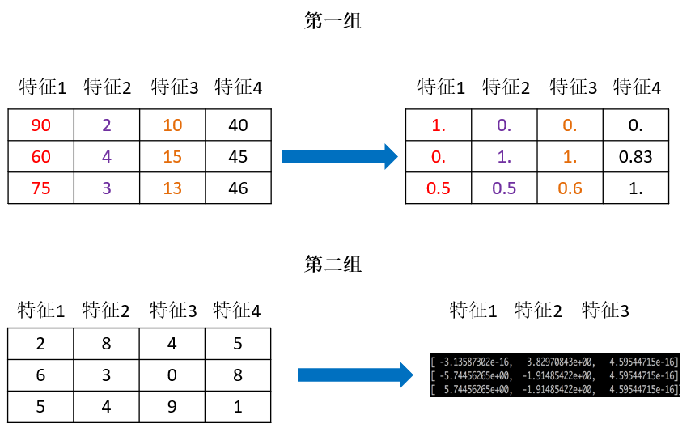

针对于sklearn的预处理方法都存储在`sklearn. preprocessing`中

#### 归一化 Normalization

如果需要多个特征同等重要的时候就可以用归一化. 但是归一化对异常点的处理比较困难.

公式:

$$X' = \frac{x - min}{max - min}$$ $$X'' = X' * (mx-mi) + mi$$

作用于每一列，max为一列的最大值，min为一列的最小值,那么X’’
为最终结果，mx，mi分别为指定区间值默认mx为1,mi为0

相对于上图中第一组数据的第一行第一列和第一行第二列的数据为
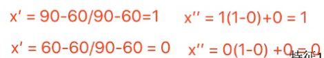

**sklearn归一化API:  `sklearn.preprocessing.MinMaxScaler`**

```python
from sklearn.preprocessing import MinMaxScaler
def normalization():
    """
    归一化
    :return:
    """
    normalizer = MinMaxScaler()
    data = normalizer.fit_transform([[90, 2, 10, 40],
                                     [60, 4, 15, 45],
                                     [75, 3, 13, 46]])
    print(data)
    # [[1.         0.         0.         0.        ]
    #  [0.         1.         1.         0.83333333]
    #  [0.5        0.5        0.6        1.        ]]

    normalizer = MinMaxScaler(feature_range=(2, 3))
    data = normalizer.fit_transform([[90, 2, 10, 40],
                                     [60, 4, 15, 45],
                                     [75, 3, 13, 46]])
    print(data)
    # [[3.         2.         2.         2.        ]
    #  [2.         3.         3.         2.83333333]
    #  [2.5        2.5        2.6        3.        ]]
    return None
```

*注意在特定场景下最大值最小值是变化的，另外，最大值与最小值非常容易受异常点影响，所以这种方法鲁棒性较差，只适合传统精确小数据场景。*

---

#### 标准化

通过对原始数据进行变换把数据变换到均值为0,方差为1范围内

**公式:**

$$X' = \frac{x - mean}{\sigma}$$

作用于每一列，mean为平均值，𝜎为标准差(考量数据的稳定性)

std成为方差:

$$𝑠𝑡𝑑=\frac{((𝑥1−𝑚𝑒𝑎𝑛)^2+(𝑥2−𝑚𝑒𝑎𝑛)^2+…)}{(𝑛(每个特征的样本数))}，\sigma = \sqrt{std}$$

sklearn特征化API: `scikit-learn.preprocessing.StandardScaler`

```python
from sklearn.preprocessing import StandardScaler
def standarlization():
    """
    标准化缩放
    :return:
    """
    std = StandardScaler()
    data = std.fit_transform([[1., -1., 3.],
                              [2., 4., 2.],
                              [4., 6., -1.]])
    print(data)
    # [[-1.06904497 -1.35873244  0.98058068]
    #  [-0.26726124  0.33968311  0.39223227]
    #  [ 1.33630621  1.01904933 -1.37281295]]
    return None
```

#### 缺失值的处理方法

如果每列或者行数据缺失值达到一定的比例，建议放弃整行或者整列

可以通过缺失值每行或者每列的平均值、中位数来填充

sklearn缺失值API: `sklearn.preprocessing.Imputer`

*注意: 新版本中不存在这个类, 在低版本中存在, 包版本中可以使用SimpleImputer. 同时sklearn.impute中存在其他的imputer类可以使用*

```python
from sklearn.impute import SimpleImputer
def imputer():
    """
    缺失值处理
    :return:
    """
    # 替换策略:
    # "mean"，使用该列的平均值替换缺失值。仅用于数值数据；
    # "median"，使用该列的中位数替换缺失值。仅用于数值数据；
    # "most_frequent"，使用每个列中最常见的值替换缺失值。可用于非数值数据；
    # "constant"，用fill_value替换缺失值。可用于非数值数据
    imp = SimpleImputer(missing_values=np.nan, strategy='mean')
    data = imp.fit_transform([[1, 2],
                              [np.nan, 3],
                              [7, 6]])
    print(data)
    # [[1. 2.]
    #  [4. 3.]
    #  [7. 6.]]
    return None
```

#### 数据降维

数据降维的意思是减少数据特征的数量

特征降维的原因:

* 冗余：部分特征的相关度高，容易消耗计算性能

* 噪声：部分特征对预测结果有负影响

**方差过滤**

特征过滤的方法 `sklearn.feature_selection.VarianceThreshold`

```python
def variance():
    """
    删除低方差的特征
    """
    var = VarianceThreshold(threshold=0.00001)  # 删除方差低于0.00001的数据
    data = var.fit_transform([[0, 2, 0, 3],
                              [0, 1, 4, 3],
                              [0, 1, 1, 3]])
    print(data)
    # [[2 0]
    #  [1 4]
    #  [1 1]]
    return None
```

**主成分分析 (PCA)**

本质：PCA是一种分析、简化数据集的技术

目的：是数据维数压缩，尽可能降低原数据的维数（复杂度），损失少量信息。

作用：可以削减回归分析或者聚类分析中特征的数量

PCA的数学定义是：一个正交化线性变换，把数据变换到一个新的坐标系统中，使得这一数据的任何投影的第一大方差在第一个坐标（称为第一主成分）上，第二大方差在第二个坐标（第二主成分）上，依次类推

n_components: 一般用小数, 说明保留的特征数据. 把部分数据减少到90%. 如果使用整数的话, 就表明需要降到多少个特征, 一般不用

```python
def pca():
    """
    主成分分析进行数据降维
    :return:
    """
    p = PCA(n_components=0.9)
    data = p.fit_transform([[2, 8, 4, 5],
                            [6, 3, 0, 8],
                            [5, 4, 9, 1]])
    print(data)
    # [[ 1.28620952e-15  3.82970843e+00]
    #  [ 5.74456265e+00 -1.91485422e+00]
    #  [-5.74456265e+00 -1.91485422e+00]]
    return None
```

## 机器学习模型

针对不同的数据需要使用不同的数据类型. *只要记住一点，离散型是区间内不可分，连续型是区间内可分*

* 离散型数据：由记录不同类别个体的数目所得到的数据，又称计数数据，所有这些数据全部都是整数，而且不能再细分，也不能进一步提高他们的精确度。
* 连续型数据：变量可以在某个范围内取任一数，即变量的取值可以是连续的，如，长度、时间、质量值等，这类整数通常是非整数，含有小数部分。

机器学习的分类

* 监督学习 (特征值加目标值)
  * 分类(目标值离散型数据) k-近邻算法、贝叶斯分类、决策树与随机森林、逻辑回归、神经网络
  * 回归(目标值连续型数据) 线性回归、岭回归
  * 标注 隐马尔可夫模型
* 无监督学习 (只有特征值)
  * 聚类 k-means

1. 明确数据需要做什么
2. 处理数据
3. 特征工程, 处理特征
4. 找到合适的算法进行预测
5. 评估计算结果模型 (如果成功,那么部署,如果没成功,可以调整参数或者换算法,重新尝试特征工程)
6. 使用, 以api形式提供

监督学习（英语：Supervised learning），可以由输入数据中学到或建立一个模型，并依此模式推测新的结果。输入数据是由输入特征值和目标值所组成。函数的输出可以是一个连续的值（称为回归），或是输出是有限个离散值（称作分类）。

无监督学习（英语：Supervised learning），可以由输入数据中学到或建立一个模型，并依此模式推测新的结果。输入数据是由输入特征值所组成。

### 数据划分

通常情况下训练集的数据和测试集的数据划分为7:3或者3:1. 可以使用python样本划分工具.

数据集划分api `sklearn.model_selection.train_test_split`

load*和fetch*返回的数据类型datasets.base.Bunch(字典格式)

* data：特征数据数组，是 [n_samples * n_features] 的二维 numpy.ndarray 数组
* target：标签数组，是 n_samples 的一维 numpy.ndarray 数组
* DESCR：数据描述
* feature_names：特征名,新闻数据，手写数字、回归数据集没有
* target_names：标签名,回归数据集没有

分类数据集的格式

sklearn.datasets.load_iris() 加载并返回鸢尾花数据集, 一组测试数据. 分类类型数据

```python
from sklearn.datasets import load_iris

li = load_iris()
print("获取特征值")
print(li.data)
# 获取特征值
# [[5.1 3.5 1.4 0.2]
#  [4.9 3.  1.4 0.2]
#  [4.7 3.2 1.3 0.2]
# ...

print("目标值")
print(li.target)
# 目标值
# [0 0 0 0 0 0 0 0 0 0 0 0 0 0 0 0 0 0 0 0 0 0 0 0 0 0 0 0 0 0 0 0 0 0 0 0 0
#  0 0 0 0 0 0 0 0 0 0 0 0 0 1 1 1 1 1 1 1 1 1 1 1 1 1 1 1 1 1 1 1 1 1 1 1 1
#  1 1 1 1 1 1 1 1 1 1 1 1 1 1 1 1 1 1 1 1 1 1 1 1 1 1 2 2 2 2 2 2 2 2 2 2 2
#  2 2 2 2 2 2 2 2 2 2 2 2 2 2 2 2 2 2 2 2 2 2 2 2 2 2 2 2 2 2 2 2 2 2 2 2 2
#  2 2]

print(li.DESCR)
# 展示花的特征
```

sklearn.datasets.load_digits() 加载并返回数字数据集

#### 数据集分割

API: `sklearn.model_selection.train_test_split(*arrays, **options)`

* x 数据集的特征值
* y 数据集的标签值
* test_size 测试集的大小，一般为float
* random_state 随机数种子,不同的种子会造成不同的随机采样结果。相同的种子采样结果相同。
* return  训练集特征值，测试集特征值，训练标签，测试标签 (默认随机取)

```python
# 返回值:训练集x_train,y_train. 测试集x_test,y_test
x_train, x_test, y_train, y_test = train_test_split(li.data, li.target, test_size=0.25)
print("训练集特征值和目标值", x_train, y_train)
print("测试集特征值和目标值", x_test, y_test)
```

下载一个用于分类的大数据集, 这里会下载一个测试数据集在python的home目录中(*注意:数据量超大, 没事别浪*):

`sklearn.datasets.fetch_20newsgroups(data_home=None,subset=‘train’)`

subset: 'train'或者'test','all'，可选，选择要加载的数据集.训练集的“训练”，测试集的“测试”，两者的“全部”

可以使用命令`datasets.clear_data_home(data_home=None)`来清除目录下的数据

```python
news = fetch_20newsgroups(subset='all')
print(news.data)
print(news.target)
```

下载一个用于回归的大数据集

`sklearn.datasets.load_boston()` 加载并返回波士顿房价数据集
`sklearn.datasets.load_diabetes()` 加载和返回糖尿病数据集

```python
lb = load_boston()
print(lb.data)  # 特征值
print(lb.target)  # 目标值
print(lb.DESCR)
```

#### 转换器, 预估器

**转换器**

```python
from sklearn.preprocessing import StandardScaler

s = StandardScaler()
s.fit_transform([[1, 2, 3], [4, 5, 6]])

ss = StandardScaler();
ss.fit([[1, 2, 3], [4, 5, 6]])
print(ss.transform([[1, 2, 3], [4, 5, 6]]))
# [[-1. -1. -1.]
#  [ 1.  1.  1.]]

# fit_transform = fit + transform

ss.fit([[1, 2, 3], [4, 5, 7]])  # 此处运算的标准差和方差
print(ss.transform([[1, 2, 3], [4, 5, 6]]))  # 由于标准差fit计算出来的不一样,因此结果不同
# [[-1.  -1.  -1. ]
#  [ 1.   1.   0.5]]

# 也可以通过数据切分划分数据
# 缩小数据, 通过query查询数据
data = data.query("x > 1.0 & x < 1.25 & y > 2.5 & < 2.75")
```

**估计器**

在sklearn中，估计器(estimator)是一个重要的角色，分类器和回归器都属于estimator，是一类实现了算法的API

1、用于分类的估计器：

* sklearn.neighbors k-近邻算法
* sklearn.naive_bayes 贝叶斯
* sklearn.linear_model.LogisticRegression 逻辑回归
* sklearn.tree 决策树与随机森林

2、用于回归的估计器：

* sklearn.linear_model.LinearRegression 线性回归
* sklearn.linear_model.Ridge 岭回归

#### 评估标准:精确率(Precision)与召回率(Recall)

精确率：预测结果为正例样本中真实为正例的比例（查得准）
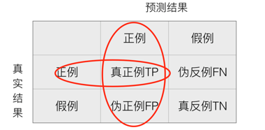

召回率：真实为正例的样本中预测结果为正例的比例（查的全，对正样本的区分能力）
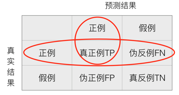

$$F1 = \frac{2TP}{2TP + FN + FP} = \frac{2 \cdot Precision \cdot Recall}{Precision + Recall}$$

> 比如: 池塘里有1400条鱼, 300只虾, 300只鳖. 最终捕获了700条鱼,200只虾, 300只鳖. 我们计算鱼捕获的概率:
> $正确率 = \frac{700}{700+200+100} = 0.7 $
> $召回率 = \frac{700}{1400} = 0.5$
> $F值 = 0.7*0.5* \frac{2}{0.7+0.5} = 0.583$
> 因此可以看出,准确率和召回率很多时候是冲突的, 整体概率的精准就会丢失召回率的获取. 不同场景需要的是不同的标准. 但是大部分时候需要同时考虑

分类评估的api`sklearn.metrics.classification_report`

`sklearn.metrics.classification_report(y_true, y_pred, target_names=None)`

* y_true：真实目标值
* y_pred：估计器预测目标值
* target_names：目标类别名称
* return：每个类别精确率与召回率

```python
print("每个类别的精确率和召回率\n", classification_report(y_test, y_predict, target_names=news.target_names))
# 每个类别的精确率和召回率
#                            precision    recall  f1-score   support
#
#              alt.atheism       0.89      0.77      0.83       201
#            comp.graphics       0.93      0.78      0.85       256
#  comp.os.ms-windows.misc       0.86      0.81      0.84       261
# comp.sys.ibm.pc.hardware       0.74      0.85      0.79       255
#    comp.sys.mac.hardware       0.88      0.86      0.87       231
# ...
```

##### 交叉验证, 网格搜索(超参数搜索)

交叉验证：将拿到的数据，分为训练和验证集。以下图为例：将数据分成5份，其中一份作为验证集。然后经过5次(组)的测试，每次都更换不同的验证集。即得到5组模型的结果，**取平均值作为最终结果**。由于分为了5组所以称为5折交叉验证, 也可以使用4折交叉验证。
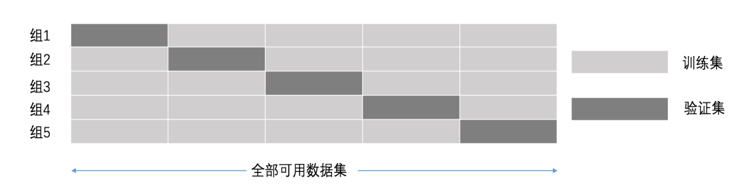

网格搜索: 通常情况下，有很多参数是需要手动指定的（如k-近邻算法中的K值），这种叫超参数。但是手动过程繁杂，所以需要对模型预设几种超参数组合。**每组超参数都采用交叉验证来进行评估**。最后选出最优参数组合建立模型。最常用的交叉验证为10折交叉验证.
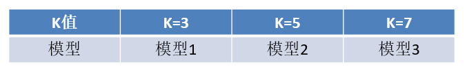

api: `sklearn.model_selection.GridSearchCV`

`sklearn.model_selection.GridSearchCV(estimator, param_grid=None,cv=None)`对估计器的指定参数值进行详尽搜索

* estimator：估计器对象
* param_grid：估计器参数(dict){“n_neighbors”:[1,3,5]}
* cv：指定几折交叉验证
* fit：输入训练数据
* score：准确率

结果分析：

* best_score_:在交叉验证中测试的最好结果
* best_estimator_：最好的参数模型
* cv_results_:每次交叉验证后的测试集准确率结果和训练集准确率结果

```python
# 使用网格搜索, 需要注意的是不需要给参数否则参数会固定
knn = KNeighborsClassifier()

# 构造参数的值进行搜索
param = {"n_neighbors": [3, 5, 10]}

# 进行网格搜索
gc = GridSearchCV(knn, param_grid=param, cv=2)
gc.fit(x_train, y_train)

# 预测准确率
print("在测试集上的准确率:", gc.score(x_test, y_test))
print("在交叉验证当中最好的结果:", gc.best_score_)
print("最好的模型(参数):", gc.best_estimator_)
print("每个超参数每次交叉验证的结果", gc.cv_results_)
# 在测试集上的准确率: 0.4739952718676123
# 在交叉验证当中最好的结果: 0.44774590163934425
# 最好的模型(参数): KNeighborsClassifier(n_neighbors=10)
# 每个超参数每次交叉验证的结果 ...
```

### 分类

分类是一种基于一个或多个自变量确定因变量所属类别的技术。

#### k近邻算法

定义：如果一个样本在特征空间中的k个最相似(即特征空间中最邻近)的样本中的大多数属于某一个类别，则该样本也属于这个类别。

> *来源：KNN算法最早是由Cover和Hart提出的一种分类算法*

两个样本的距离可以通过如下公式计算，又叫欧式距离.相似的样本特征之间的距离会很近.与其距离最近的点最相似. 比如说，a(a1,a2,a3),b(b1,b2,b3), 那么距离就是:

$$\sqrt{((𝑎1−𝑏1)^2+(𝑎2−𝑏2)^2+(𝑎3−𝑏3)^2)}$$

因此, **k近邻算法会需要做标准化处理**

Api: `sklearn.neighbors.KNeighborsClassifier(n_neighbors=5,algorithm='auto')`

* n_neighbors：int,可选（默认= 5），k_neighbors查询默认使用的邻居数

* algorithm：{‘auto’，‘ball_tree’，‘kd_tree’，‘brute’}，可选用于计算最近邻居的算法：‘ball_tree’将会使用 BallTree，‘kd_tree’将使用 KDTree。‘auto’将尝试根据传递给fit方法的值来决定最合适的算法。 (不同实现方式影响效率)

```python
import pandas as pd
from sklearn.model_selection import train_test_split
from sklearn.neighbors import KNeighborsClassifier
from sklearn.preprocessing import StandardScaler


def knn_alg():
    """
    k近邻算法
    k-nearest neighbors algorithm
    """
    # 读取数据
    data = pd.read_csv("E:\\Workspace\\ml\\machine-learning-python\\data\\FBlocation\\train.csv")

    # 缩小数据, 通过query查询数据
    data = data.query("x > 1.0 & x < 1.25 & y > 2.5 & y < 2.75")

    # 对时间进行处理
    time_value = pd.to_datetime(data['time'], unit='s')

    # 把日期格式转换成字典格式
    time_value = pd.DatetimeIndex(time_value)
    print(time_value)
    # DatetimeIndex(['1970-01-01 18:09:40', '1970-01-10 02:11:10',
    #                '1970-01-05 15:08:02', '1970-01-06 23:03:03',
    #                '1970-01-09 11:26:50', '1970-01-02 16:25:07',
    #                ...

    # 添加feature
    data['day'] = time_value.day
    data['hour'] = time_value.hour
    data['weekday'] = time_value.weekday
    # data.loc[:, 'day'] = time_value.day
    # data.loc[:, 'hour'] = time_value.hour
    # data.loc[:, 'weekday'] = time_value.weekday
    print(data)
    #             row_id       x       y  accuracy    time    place_id  day  hour  weekday
    # 600            600  1.2214  2.7023        17   65380  6683426742    1    18        3
    # 957            957  1.1832  2.6891        58  785470  6683426742   10     2        5

    # 从data中删除时间特征, 1表示列, 0表示行
    data = data.drop(['time'], axis=1)
    print(data)
    #             row_id       x       y  accuracy    place_id  day  hour  weekday
    # 600            600  1.2214  2.7023        17  6683426742    1    18        3
    # 957            957  1.1832  2.6891        58  6683426742   10     2        5

    # 把签到数量少于n个的位置删除
    place_count = data.groupby('place_id').count()

    # place_count.row_id就成了count的返回值了, 然后把大于3的index保留住, 也就是过滤掉了小于3的id, 也就是count
    # 然后reset_index()就是把index变为一个列,此处就是place_id,也就是刚刚的groupby的名称设置为一个列
    tf = place_count[place_count.row_id > 3].reset_index()

    # data中的place_id是否在tf.place_id中也就是在data中删除小于3的特征值
    data = data[data['place_id'].isin(tf.place_id)]

    # 取出数据当中的目标值和特征值
    y = data['place_id']
    x = data.drop(['place_id'], axis=1)
    x = x.drop(['row_id'], axis=1)

    print(x)

    # 分割数据
    x_train, x_test, y_train, y_test = train_test_split(x, y, test_size=0.25)

    # 特征工程(standarlize)
    std = StandardScaler()
    # 对训练集和测试集的特征值进行标准化
    x_train = std.fit_transform(x_train)
    x_test = std.fit_transform(x_test)

    # 算法, 计算最近的5个点
    knn = KNeighborsClassifier(n_neighbors=5)

    knn.fit(x_train, y_train)

    # 得出预测结果
    y_predict = knn.predict(x_test)

    print("预测的目标签到位置: ", y_predict)

    # 准确率
    print("预测的准确率", knn.score(x_test, y_test))

    return None


if __name__ == '__main__':
    knn_alg()

```

优缺点:

* 简单，易于理解，易于实现，无需估计参数，无需训练

* k值取很小：容易受异常点影响
* k值取很大：容易受最近数据太多导致比例变化
* 时间复杂度很高, 性能很差, 懒惰算法，对测试样本分类时的计算量大，内存开销大
* 必须指定K值，K值选择不当则分类精度不能保证

#### 朴素贝叶斯算法

概率定义为一件事情发生的可能性.

特点: 没有参数, 不需要调整参数

优点：

* 朴素贝叶斯模型发源于古典数学理论，有稳定的分类效率。
* 对缺失数据不太敏感，算法也比较简单，常用于文本分类。
* 分类准确度高，速度快

缺点：需要知道先验概率P(F1,F2,…|C)，因此在某些时候会由于假设的先验模型的原因导致预测效果不佳。

##### 概率理论

联合概率：包含多个条件，且所有条件同时成立的概率, 记作：$𝑃(𝐴,𝐵)$, 也就是 $P(A,B) = P(A) * P(B)$

条件概率：就是事件A在另外一个事件B已经发生条件下的发生概率, 记作：$𝑃(𝐴|𝐵)$ 也就是B的条件下A的概率

B存在的情况下发生$A_1$和$A_2$的概率：$P(A_1,A_2|B) = P(A_1|B)P(A_2|B)$
注意：此条件概率的成立的前提是由于A1,A2相互独立的结果, 不存在相互影响

贝叶斯公式
$${\displaystyle P(C\mid W)={\frac {P(C)P(W\mid C)}{P(W)}}}$$

> W为给定文档的特征值(频数统计, 预测的文档), C为文档类别
> 所以公式可以理解为: 该类文章总体出现的概率 * 每一个词在该类文章中出现的概率 / 每一个词在所有文章中出现的概率

公式可以写作

$$ P(C \mid F_1,F_2, ...)={\frac {P(F_1,F_2,... \mid C)P(C)}{P(F_1,F_2,...)}}$$

> **拉普拉斯平滑**
> 由于给定的数值可能为0, 一旦出现, 所有的概率结果计算都会为0. 所以可以使用拉普拉斯平滑系数放入计算中
> $${\hat {\theta }}_{i}也就是P(F_1 | C)={\frac {x_{i}+\alpha }{N+\alpha m}}\qquad (i=1,\ldots ,m),$$
> 此处的$\alpha$为指定的系数, 一般为1, $m$为训练文档中统计出的特征词个数
> 此时的函数就变为了 文章特征词数 + $\alpha$/文章词数 + $(\alpha * 特征词种类)$ X (其他的特征计算)...

##### 代码实现

朴素贝叶斯api: `sklearn.naive_bayes.MultinomialNB(alpha = 1.0)` 此处的1.0就是拉普拉斯平滑系数. 默认1.0

```python
from sklearn.datasets import fetch_20newsgroups
from sklearn.feature_extraction.text import TfidfVectorizer
from sklearn.model_selection import train_test_split
from sklearn.naive_bayes import MultinomialNB


def bayes_algorithom():
    """
    朴素贝叶斯分类算法
    :return:
    """
    # 下载新闻数据
    news = fetch_20newsgroups(subset='all')

    # 进行数据分隔, 25%的测试数据
    x_train, x_test, y_train, y_test = train_test_split(news.data, news.target, test_size=0.25)

    # 对数据及进行特征抽取
    tf = TfidfVectorizer()  # 使用文本特征抽取
    x_train = tf.fit_transform(x_train)  # 针对每篇文章的词进行统计
    x_test = tf.transform(x_test)  # 使用同样的特征抽取测试集, 并进行统计, 这样特征数量是相同的

    print(tf.get_feature_names_out())

    # 进行朴素贝叶斯算法进行预测
    mlt = MultinomialNB(alpha=1.0)
    print(x_train.toarray())
    mlt.fit(x_train, y_train)

    # 得出准确率
    y_predict = mlt.predict(x_test)
    print("预测的文章类别为: ", y_predict)
    print("准确率为: ", mlt.score(x_test, y_test))
    # 预测的文章类别为:  [13 10  7 ... 15 15 10]
    # 准确率为:  0.8552631578947368

    return None


if __name__ == '__main__':
    bayes_algorithom()
```

#### 决策树

决策树思想的来源非常朴素，程序设计中的条件分支结构就是if-then结构，最早的决策树就是利用这类结构分割数据的一种分类学习方法.

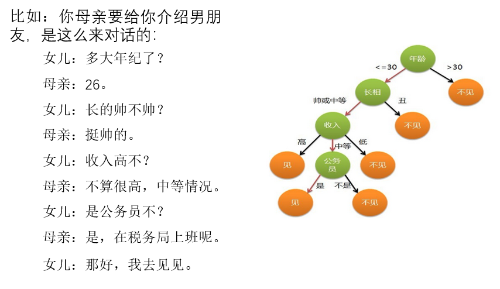

在决策树中每一个节点的位置就是优先级, 高优先级的节点会被优先计算, 然后才会进入下一个分类节点

> 在信息论中, 使用binary search可以获取信息单位. 比如:
> 32个小球中搜索，log32=5比特
> 64个小球中搜索，log64=6比特

从而计算信息熵为 $H = -(P_1logP_1 + P_2logP_2 + ... + P_{32}logP_{32})$, **信息和消除不确定是相联系的**. 数学公式也就是
$$ H(x) = -{\sum}_{x \in X} P(x) log P(x) $$

信息增益: 当得知一个特征条件, 减少的信息熵的大小: $g(D,A) = H(D) - H(D|A)$

特征A对训练集数据D的信息增益$g(D,A)$ 等于集合D的信息熵$H(D)$减去特征A给定条件下信息条件熵$H(D|A)$.

信息熵的计算公式:
$$H(D)=-\sum^{K}_{k=1}\frac{|C_k|}{|D|}log\frac{|C_k|}{|D|}$$

条件熵的计算公式:
$$H(D|A)=-\sum^{n}_{i=1}\frac{|D_i|}{|D|}H(D_i)=-\sum^{n}_{i=1}\frac{|D_i|}{|D|}\sum^{K}_{k=1}\frac{|D_{ik}|}{|D_i|}log\frac{|D_{ik}|}{|D_i|} $$

举例:
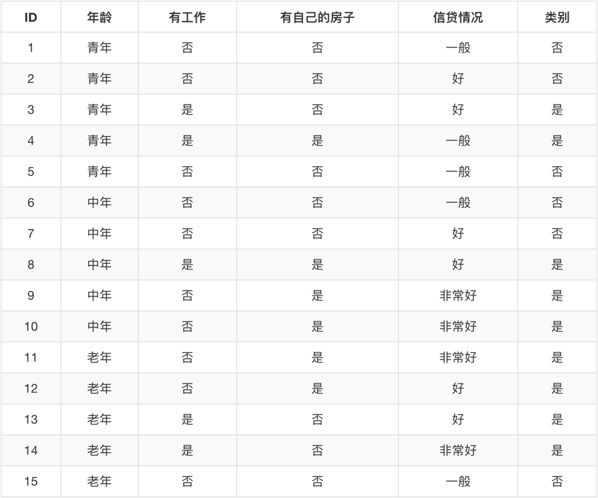

1. 针对特征`类别`计算信息熵. 此处的类别是最终分类结果.

    一共有15个特征总数, 9个`是`6个`否`
    $H(类别) = -(\frac{9}{15} log\frac{9}{15} + \frac{6}{15} log\frac{6}{15}) = 0.971$

2. 在类别`特征`信息熵结果下, 计算`年龄`特征的信息增益,

    $g(D,年龄) = H(D) - H(D'|年龄)$

    * 年龄总共存在3各类别, 青年/中年/老年, 需要分别求出然后求和
    * H(D) 就是我们之前求出来的`类别`的信息熵, 计算出来结果就是0.971
    * 青年中年和老年的占比都为$\frac{5}{15}$也就是$\frac{1}{3}$
        $$g(D,年龄) = 0.971 - [\frac{1}{3}(青年) + \frac{1}{3}(中年) + \frac{1}{3}(老年)]$$
    * H(青年) = 当年龄全都是`青年`的时候, `类别`的信息熵. 当年龄为`青年`的时候类别3个`否`1个`是`
        $$H(青年) = -(\frac{2}{5}log\frac{2}{5} + \frac{3}{5}log\frac{3}{5})$$
        $$H(中年) = -(\frac{2}{5}log\frac{2}{5} + \frac{3}{5}log\frac{3}{5})$$
        $$H(老年) = -(\frac{4}{5}log\frac{4}{5} + \frac{1}{5}log\frac{1}{5})$$

3. 通过计算我们发现, g(类别,工作),g(类别,房子),g(类别,信贷)的计算结果最终为:`0.324`,`0.420`,`0.363`. 因此`有房子`的信息增益计算结果为最大. 因此`有房子`就为树的根节点, 也就是第一个判断节点

>
> 决策树同时还存在其他的计算
>> id3: 信息增益, 最大准则, 也就是上面的运算策略
>> c4.5: 信息增益比重, 最大准则
>> cart:
>>> 回归树: 平方误差取最小
>>> 分类树: 基尼系数 取最小, 在sklearn中可以选择划分的原则. 划分更加仔细

决策树api:

```python
class sklearn.tree.DecisionTreeClassifier(criterion=’gini’, max_depth=None,random_state=None)
```

分类器:

* criterion:默认是`gini`系数，也可以选择信息增益的熵`entropy`
* max_depth:树的深度大小
* random_state:随机数种子

method:

* decision_path:返回决策树的路径

```python
# 决策树
# 决策树存在一个升级版叫做随机森林
import pandas as pd
from sklearn.feature_extraction import DictVectorizer
from sklearn.model_selection import train_test_split
from sklearn.tree import DecisionTreeClassifier, export_graphviz


def discussion_tree_alg():
    """
    泰坦尼克号的数据分类
    https://biostat.app.vumc.org/wiki/pub/Main/DataSets/titanic.txt

    1: 存活
    0: 死亡
    """
    print("决策树选择过程")
    # 读取数据
    data = pd.read_csv("E:\\Workspace\\ml\\machine-learning-python\\data\\titanic.txt")
    print(data)

    # 处理数据, 找出特征值和目标值
    x = data[['pclass', 'age', 'sex']]  # 特征值的列
    print(x)
    y = data['survived']  # 结果集

    # 处理缺失值 inplace表示替换. 把平均值填入age中
    x['age'].fillna(x['age'].mean(), inplace=True)

    # 分割数据集, 训练集, 测试集
    x_train, x_test, y_train, y_test = train_test_split(x, y, test_size=0.25)

    # 特征工程处理
    dict = DictVectorizer(sparse=False)
    # to_dict() 就是将样本转换为字典类型, orient="records"表示每一行为一个字典
    x_train = dict.fit_transform(x_train.to_dict(orient="records"))
    x_test = dict.fit_transform(x_test.to_dict(orient="records"))
    print(dict.get_feature_names())
    print(x_train)
    print(x_test)
    # ['age', 'pclass=1st', 'pclass=2nd', 'pclass=3rd', 'sex=female', 'sex=male']
    # [[31.19418104  0.          0.          1.          1.          0.        ]
    #  [39.          1.          0.          0.          1.          0.        ]
    #  [ 1.          0.          1.          0.          1.          0.        ]
    #  ...
    #  [18.          0.          1.          0.          1.          0.        ]
    #  [45.          0.          1.          0.          1.          0.        ]
    #  [ 9.          0.          0.          1.          1.          0.        ]]

    # 用决策树进行预测
    dec = DecisionTreeClassifier()
    # dec = DecisionTreeClassifier(max_depth=5)  # 深度为5
    dec.fit(x_train, y_train)

    print("预测的准确率:")
    print(dec.score(x_test, y_test))

    return None


if __name__ == '__main__':
    discussion_tree_alg()

```

1. 展示决策树的路径图api `sklearn.tree.export_graphviz()` 该函数能够导出DOT格式, api为: `tree.export_graphviz(estimator,out_file='tree.dot’,feature_names=[‘’,’’])`

```python
export_graphviz(dec, out_file="./tree.dot",
                feature_names=['age', 'pclass=1st', 'pclass=2nd', 'pclass=3rd', 'sex=female', 'sex=male'])
```

2. 导出工具:(能够将dot文件转换为pdf、png), 安装graphviz:
    ubuntu:sudo apt-get install graphviz
    Mac:brew install graphviz
    Windows: <https://graphviz.org/download/>

    在shell中执行`dot -Tpng tree.dot -o tree.png`
    然后就可以在目录下找到tree.png文件 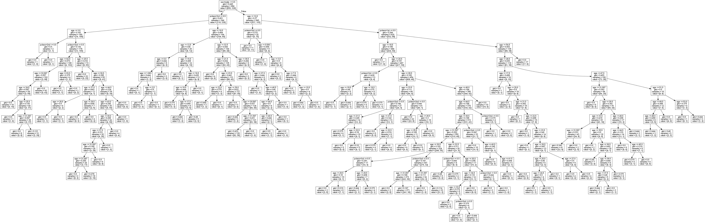

> 需要注意的是, 上图所示的使用的就是基尼系数.由于基尼系数是强分类, 创建庞大的分类树, 基尼系数可能出现过拟合的问题. 此种问题的解决方案就是随机森林.

决策树优点：

* 简单的理解和解释，树木可视化。
* 需要很少的数据准备，其他技术通常需要数据归一化，

决策树缺点：

* 决策树学习者可以创建不能很好地推广数据的过于复杂的树，这被称为过拟合。
* 决策树可能不稳定，因为数据的小变化可能会导致完全不同的树被生成

解决方案:

* 减枝cart算法. 当样本数少于一定数目的时候或者满足一定条件的时候会对树进行剪枝. 主要针对叶子结点.
* 随机森林

#### 随机森林

集成学习的方法. 集成学习通过建立几个模型组合的来解决单一预测问题。它的工作原理是生成多个分类器/模型，各自独立地学习和作出预测。这些预测最后结合成单预测，因此优于任何一个单分类的做出预测。

随机森林的结果就是多个决策树的投票. 建立多个决策树的过程:

单个树的建立过程(n个样本, m个特征):

1. 随机在n个样本当中抽取一个样本, 在抽取样本的池子不变的情况下重复n次. 因此样本高概率存在重复.
2. 随机在m个特征中获取$m_1$个特征

因此,每个决策树的特征和样本不同

随机森林api: `class sklearn.ensemble.RandomForestClassifier(n_estimators=10, criterion=’gini’, max_depth=None, bootstrap=True, random_state=None)` 可以看到这里的包包含的是`ensemble`类型, 也就是集成学习. (这里还是使用的是基尼系数, 也是推荐的)

随机森林分类器:

* n_estimators：integer，optional（default = 10） 森林里的树木数量, 可以使用120,200,300,500,800,1200
* criteria：string，可选（default =“gini”）分割特征的测量方法
* max_depth：integer或None，可选（默认=无）树的最大深度, 推荐: 5,8,15,25,30
* max_features="auto" 每个决策树的最大特征数量
  * auto: max_features=sqrt(n_features)
  * sqrt: max_features=sqrt(n_features)
  * log2: max_features=log2(n_features)
  * none: max_features=n_features
* bootstrap：boolean，optional（default = True）是否在构建树时使用放回抽样

```python
import pandas as pd
from sklearn.ensemble import RandomForestClassifier
from sklearn.feature_extraction import DictVectorizer
from sklearn.model_selection import train_test_split, GridSearchCV


def discussion_tree_alg():
    """
    泰坦尼克号的数据分类
    https://biostat.app.vumc.org/wiki/pub/Main/DataSets/titanic.txt

    1: 存活
    0: 死亡
    """
    print("决策树选择过程")
    # 读取数据
    data = pd.read_csv("E:\\Workspace\\ml\\machine-learning-python\\data\\titanic.txt")
    print(data)

    # 处理数据, 找出特征值和目标值
    x = data[['pclass', 'age', 'sex']]  # 特征值的列
    print(x)
    y = data['survived']  # 结果集

    # 处理缺失值 inplace表示替换. 把平均值填入age中
    x['age'].fillna(x['age'].mean(), inplace=True)

    # 分割数据集, 训练集, 测试集
    x_train, x_test, y_train, y_test = train_test_split(x, y, test_size=0.25)

    # 特征工程处理
    dict = DictVectorizer(sparse=False)
    # to_dict() 就是将样本转换为字典类型, orient="records"表示每一行为一个字典
    x_train = dict.fit_transform(x_train.to_dict(orient="records"))
    x_test = dict.fit_transform(x_test.to_dict(orient="records"))
    print(dict.get_feature_names_out())
    print(x_train)
    print(x_test)
    # ['age', 'pclass=1st', 'pclass=2nd', 'pclass=3rd', 'sex=female', 'sex=male']
    # [[31.19418104  0.          0.          1.          1.          0.        ]
    #  [39.          1.          0.          0.          1.          0.        ]
    #  [ 1.          0.          1.          0.          1.          0.        ]
    #  ...
    #  [18.          0.          1.          0.          1.          0.        ]
    #  [45.          0.          1.          0.          1.          0.        ]
    #  [ 9.          0.          0.          1.          1.          0.        ]]

    # 使用随机森林
    # (n_estimators=10, criterion=’gini’, max_depth=None, bootstrap=True, random_state=None)
    rfc = RandomForestClassifier()  # 默认数据

    # 网格搜索与交叉验证
    print("正在进行网格参数调优...");
    params = {"n_estimators": [120, 200, 300, 500, 800, 1200], "max_depth": [5, 8, 15, 25, 30]}
    gc = GridSearchCV(rfc, param_grid=params, cv=2)  # 网格交叉验证, 配置交叉验证为2

    gc.fit(x_train, y_train)

    print("预测准确率")
    print(gc.score(x_test, y_test))
    print("选择的参数模型:")
    print(gc.best_params_)

    # 预测准确率
    # 0.8297872340425532
    # 选择的参数模型:
    # {'max_depth': 5, 'n_estimators': 300}

    return None


if __name__ == '__main__':
    discussion_tree_alg()

```

随机森林特点

* 在当前所有算法中，具有极好的准确率
* 能够有效地运行在大数据集上
* 能够处理具有高维特征的输入样本，而且不需要降维
* 能够评估各个特征在分类问题上的重要性
* 对于缺省值问题也能够获得很好得结果

### 回归

在大数据分析中，回归分析是一种预测性的建模技术，它研究的是因变量（目标）和自变量（预测器）之间的关系。这种技术通常用于预测分析，时间序列模型以及发现变量之间的因果关系。

#### 线性回归

损失函数:

$$J(\theta) = (h_w(x_1) - y_1)^2 + (h_w(x_2) - y_2)^2 + ... + (h_w(x_m) - y_m)^2 = \sum_{i=1}^{m}(h_w(x_i) - y_i)^2$$

线性回归的目标就是通过不停的迭代找到损失函数最低的值

> 最小二乘法 - *正规方程* 线性回归的另一种求解方法.
>
> 求解: $w = (X^TX)^{-1}X^Ty$ 此处X为特征值的矩阵, y为目标值的矩阵.
>
> 就是"特征矩阵X的转置矩阵"乘以"特诊矩阵"本身, 对其进行逆矩阵操作, 结果再乘以"特征矩阵的转置矩阵", 最后再乘以结果矩阵y. 结果将会是一个特征本身数量的单行矩阵.
>
> *但是这种方法复杂度相当高. 求解速度也很慢.* 其主要原因是大量的矩阵运算操作.

梯度下降(**常用**)

迭代公式:
$$w_1 := -w_1 - \alpha\frac{\partial cost(w_0 + w_1 x_1)}{\partial w_1}$$
$$w_0 := -w_0 - \alpha\frac{\partial cost(w_0 + w_1 x_1)}{\partial w_1}$$

此处$\alpha$为学习速率, 需要手动指定. $\frac{\partial cost(w_0 + w_1 x_1)}{\partial w_1}$ 则是学习方向.

梯度下降公式:
$$w_j := w_j - \alpha\frac{1}{m}\sum^{m}_{i=1}(\sum^{n}_{j=0}w_jx^{(i)}_j-y^{(i)})x^{(i)}_j$$

线性回归api:
`sklearn.linear_model.LinearRegression` 正规方程, coef_：回归系数
`sklearn.linear_model.SGDRegressor` 梯度下降, coef_：回归系数

区分正规方程和梯度下降的性能是不同的, 一般数据为100k以上就使用梯度下降

使用波士顿放假数据案例 `from sklearn.datasets import load_boston`, 或者从官网下载 <http://lib.stat.cmu.edu/datasets/boston> *需要注意的是, load_boston数据可能存在不准确等问题, 在未来可能会被移除. 因此可以使用 `housing = fetch_california_housing()`*

```python
from sklearn.datasets import fetch_california_housing
from sklearn.linear_model import LinearRegression, SGDRegressor
from sklearn.model_selection import train_test_split
from sklearn.preprocessing import StandardScaler


def linear_regression():
    """
    线性回归直接预测房屋价格
    :return:
    """
    # 获取数据
    data = fetch_california_housing()
    print(data.feature_names)
    # ['MedInc', 'HouseAge', 'AveRooms', 'AveBedrms', 'Population', 'AveOccup', 'Latitude', 'Longitude']
    print(data.data)
    print(data.target)  # [4.526 3.585 3.521 ... 0.923 0.847 0.894]

    # 分割数据集
    x_train, x_test, y_train, y_test = train_test_split(data.data, data.target, test_size=0.25)

    # 标准化
    # 特征值都必须进行标准化处理, 实例化两个标准化api
    std_x = StandardScaler()
    x_train = std_x.fit_transform(x_train)
    x_test = std_x.fit_transform(x_test)

    # 需要注意的是在0.19版本以后, 标准化只能作用在多维数组上, 不能作用在一维数组上
    std_y = StandardScaler()
    # y_train = std_y.fit_transform(y_train)
    y_train = std_y.fit_transform(y_train.reshape(-1, 1))
    # y_test = std_y.fit_transform(y_test)
    y_test = std_y.fit_transform(y_test.reshape(-1, 1))

    # 预测
    # ==========================正规方程求解方式===========================
    lr = LinearRegression()
    lr.fit(x_train, y_train)
    print("模型参数: ", lr.coef_)  # 获取全部的w值, 也就是回归系数

    # 测试集进行预测
    y_predict = lr.predict(x_test)
    # 使用反转标准化
    # print("测试集中每个样本的预测结果:", std_y.inverse_transform(y_predict))

    # ===========================梯度下降=================================
    sgd = SGDRegressor()
    sgd.fit(x_train, y_train)
    print("模型参数: ", sgd.coef_)
    y_sgd_predict = sgd.predict(x_test)
    print("测试集中每个样本的预测结果:", y_sgd_predict)

    return None


if __name__ == '__main__':
    linear_regression()

```

回归性能的评估: 均方误差(Mean Squared Error)MSE
$$MSE = \frac{1}{m}\sum_{i=1}^{m}(y^i - \overline{y})^2$$

均方误差api: `sklearn.metrics.mean_squared_error(y_true,y_pred)`

均方误差回归损失, 真实值，预测值为标准化之前的值

* y_true:真实值
* y_pred:预测值
* return:浮点数结果

```python
    # 预测
    # ==========================正规方程求解方式===========================
    lr = LinearRegression()
    lr.fit(x_train, y_train)
    print("模型参数: ", lr.coef_)  # 获取全部的w值, 也就是回归系数

    # 测试集进行预测
    y_predict = lr.predict(x_test)
    # 使用反转标准化
    print("测试集中每个样本的预测结果:", std_y.inverse_transform(y_predict))
    print("均方误差", mean_squared_error(y_test, std_y.inverse_transform(y_predict)))
    # 均方误差 0.5281526459634236

    # ===========================梯度下降=================================
    sgd = SGDRegressor()
    sgd.fit(x_train, y_train)
    print("模型参数: ", sgd.coef_)
    y_sgd_predict = sgd.predict(x_test).reshape(-1, 1)  # sgd 返回一维数组
    print("测试集中每个样本的预测结果:", y_sgd_predict)
    print("均方误差", mean_squared_error(y_test, std_y.inverse_transform(y_sgd_predict)))
    # 均方误差 0.5325275391867944
```

#### 拟合性问题

对于线性回归来说, 过拟合和欠拟合主要还是针对feature的数量来解决的

过拟合：一个假设在训练数据上能够获得比其他假设更好的拟合， 但是在训练数据外的数据集上却不能很好地拟合数据，此时认为这个假设出现了过拟合的现象。(模型过于复杂)

欠拟合：一个假设在训练数据上不能获得更好的拟合， 但是在训练数据外的数据集上也不能很好地拟合数据，此时认为这个假设出现了欠拟合的现象。(模型过于简单)

拟合的结果一般使用交叉验证结果现象判断. 大部分情况下如果训练集符合的都不好那就是欠拟合, 如果训练集完美测试集表现不好那么就是过拟合. 一般使用岭回归解决过拟合.

特征选择:

* 过滤式: 低方差特征
* 嵌入式: 正则化, 决策树, 随机森林
  * 正则化: 更新某个特征的$\theta$增大或者减小, 查看对模型准确的要求. Ridge, 岭回归

#### 岭回归

岭回归：回归得到的回归系数更符合实际，更可靠。另外，能让估计参数的波动范围变小，变的更稳定。在存在病态数据偏多的研究中有较大的实用价值。

岭回归的api: `sklearn.linear_model.Ridge(alpha=1.0)`
具有l2正则化的线性最小二乘法

* alpha:正则化力度
* coef_:回归系数

```python
# ===========================岭回归==================================
ridge = Ridge(alpha=1.0)
ridge.fit(x_train, y_train)
print("模型参数: ", ridge.coef_)
y_r_predict = ridge.predict(x_test)
print("测试集中每个样本的预测结果:", y_r_predict)
print("均方误差", mean_squared_error(y_test, std_y.inverse_transform(y_r_predict)))

# 网格搜索与交叉验证
print("正在进行网格参数调优...");
params = {"alpha": [0.001, 0.005, 0.01, 0.03, 0.07, 0.1, 0.5, 0.7, 1, 10, 50, 100, 500]}
gc = GridSearchCV(ridge, param_grid=params, cv=2)
gc.fit(x_train, y_train)
print("预测准确率")
print(gc.score(x_test, y_test))
print("选择的参数模型:")
print(gc.best_params_)
```

#### 逻辑回归

逻辑回归是解决二分类问题的利器. 使用线性回归的公式回归方法作为逻辑回归的公式回归方法.

sigmoid函数

$${S(x)={\frac {1}{1+e^{-x}}}={\frac {e^{x}}{e^{x}+1}}=1-S(-x)}$$

作用公式:

$$h_\theta(x) = g(\theta^Tx) = \frac{1}{1+e^{-\theta^Tx}}$$

与线性回归原理相同,但由于是分类问题，损失函数不一样，只能通过梯度下降求解

对数似然损失函数：

$$cost(h_\theta(x),y) = \left\{\begin{matrix} & - log(h_\theta(x)) & & if & y = 1 \\ & - log(1 - h_\theta(x))) & & if & y = 0 \end{matrix}\right.$$

损失函数图像:
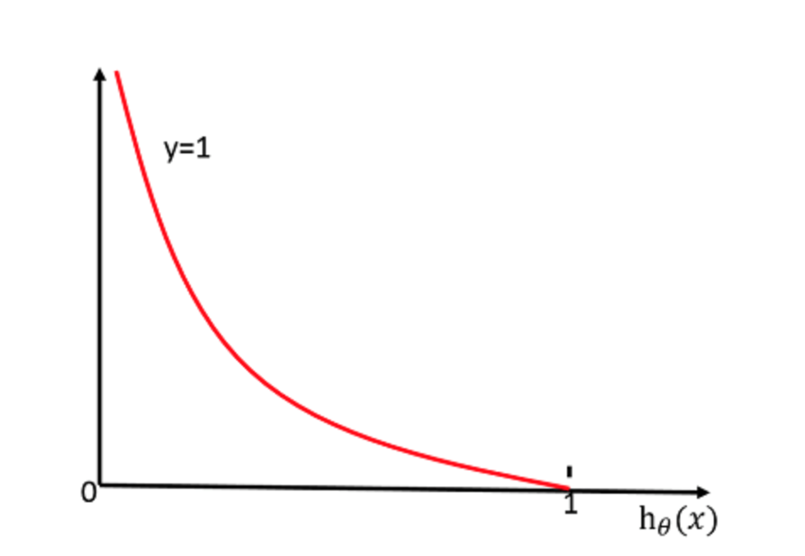
当y=0的时候的图像:
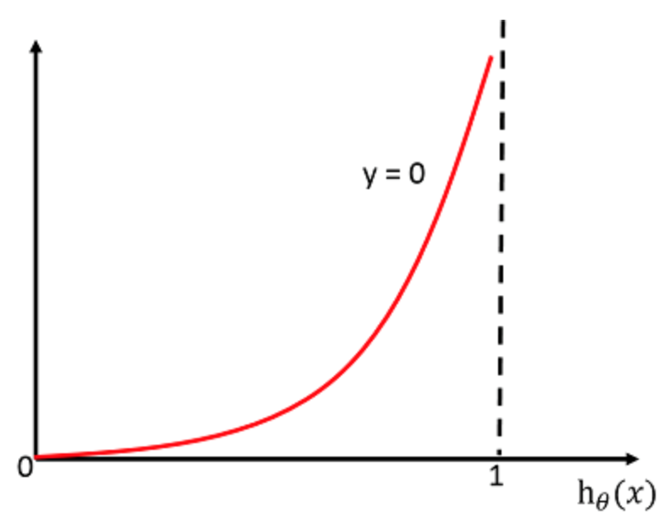

完整的损失函数:
$$cost(h_\theta(x),y) = -\sum_{i=1}^{m}-y_{i} log(h_\theta(x)) - (1 - y_{i}) log(1 - h_\theta(x))$$

案例:
假设有4样本结果为true,false,false,true, 最终函数运算结果为 0.6,0.1,0.51,0.7. 最终结果将会是1,0,1,1, 也就是true,false,true,true. 损失为 -(1log(0.6) + 0log(0.1) + 0log(0.51) + 1log(0.7))

梯度下降:

> 需要注意的是均方误差只有一个最低点, 不存在局部最低点. 但是对数损失存在多个局部最小值. 没有绝对的解决方案, 有一些处理方法尽量改善, 但无法完全解决.
>
> 1. 多次比较最小值
> 2. 求解的过程中调整学习率

逻辑回归api: `sklearn.linear_model.LogisticRegression(penalty='l2', C = 1.0)` 逻辑回归中自带正则化, 解决过拟合的问题

* coef_：回归系数
* penalty: 正则化规则, l2的形式
* c: 正则化的力度

测试数据: <https://archive.ics.uci.edu/ml/machine-learning-databases/breast-cancer-wisconsin/> 可以查看breast-cancer-wisconsin.names 文件来获取细节

整理反例的类型定义是以概率配置的 概率小的就是正例. *注意:下载文件下载下来以后不是csv格式的,需要定义列名*

```python
import numpy as np
import pandas as pd
from sklearn.linear_model import LogisticRegression
from sklearn.metrics import classification_report
from sklearn.model_selection import train_test_split
from sklearn.preprocessing import StandardScaler


def logistic_regression():
    """
    逻辑分类二分类进行癌症预测, 根据细胞特征
    :return:
    """
    # 读取数据
    """
    pd.read_csv(’’,names=column_names)
        column_names：指定类别名字,['Sample code number','Clump Thickness', 'Uniformity of Cell Size','Uniformity of Cell Shape','Marginal Adhesion','Single Epithelial Cell Size','Bare Nuclei','Bland Chromatin','Normal Nucleoli','Mitoses','Class']
        return:数据
        
        replace(to_replace=’’,value=)：返回数据
        dropna():返回数据
    """
    # 构造列名
    column_names = ['Sample code number', 'Clump Thickness', 'Uniformity of Cell Size', 'Uniformity of Cell Shape',
                    'Marginal Adhesion', 'Single Epithelial Cell Size', 'Bare Nuclei', 'Bland Chromatin',
                    'Normal Nucleoli', 'Mitoses', 'Class']
    data = pd.read_csv(
        "https://archive.ics.uci.edu/ml/machine-learning-databases/breast-cancer-wisconsin/breast-cancer-wisconsin.data",
        names=column_names)
    print(data)

    # 对缺失值进行处理, 把?换成np.nan
    data = data.replace(to_replace='?', value=np.nan)
    data = data.dropna()  # 删除所有的nan, 这里可以针对每一列进行均值配置, 也可以比较懒, 直接drop

    # 数据分隔
    # train_test_split(data[column_names[1:10]], data['Class'], test_size=0.25)
    # 特征值为第二列到第10列, 结果值为第11列
    x_train, x_test, y_train, y_test = train_test_split(data[column_names[1:10]], data[column_names[10]],
                                                        test_size=0.25)

    # 进行标准化处理, 由于是分类算法, 不需要进行结果标准化
    std = StandardScaler()
    x_train = std.fit_transform(x_train)
    x_test = std.fit_transform(x_test)

    # 逻辑回归
    logr = LogisticRegression()  # 默认 penalty="l2",C=1.0,
    logr.fit(x_train, y_train)

    print(logr.coef_)
    print("准确率:", logr.score(x_test, y_test))
    # [[1.49159213 0.46667743 0.92893529 0.75838182 0.12238663 1.18111883 0.75582525 0.30524351 0.85741416]]
    # 准确率: 0.9590643274853801

    # 计算一下召回率, 这里指定y值的结果, 2代表良性, 4代表恶性
    y_pred = logr.predict(x_test)
    print("召回率:", classification_report(y_test, y_pred, labels=[2, 4], target_names=["良性", "恶性"]))
    # 召回率:            precision recall    f1-score   support
    #
    #         良性       0.95      0.98      0.96       106
    #         恶性       0.97      0.91      0.94        65
    #
    #     accuracy                           0.95       171
    #    macro avg       0.96      0.94      0.95       171
    # weighted avg       0.95      0.95      0.95       171
    return None


if __name__ == '__main__':
    logistic_regression()

```

### 聚类

k-mean 非监督学习算法

1. 随机设置K个特征空间内的点作为初始的聚类中心, 也就是所有样本最终划分k个类别 (如果k不明确,那么就是超参数). 随机抽取三个样本, 当做三个类别的中心点
2. 对于其他每个点计算到K个中心的距离，未知的点选择最近的一个聚类中心点作为标记类别, 获取每个样本点到三个中心点最近的距离, 然后对其分类
3. 接着对着标记的聚类，重新计算出每个聚类的中心点位置, 然后获取平均值
4. 如果计算得出的新中心点与原中心点一样，那么结束
5. 如果不同, 将新的中心点作为新的中心点, 重新进行第二步过程

聚类api:`sklearn.cluster.KMeans(n_clusters=8,init=‘k-means++’)`

* n_clusters:开始的聚类中心数量
* init:初始化方法，默认为'k-means ++’
* labels_:默认标记的类型，可以和真实值比较（不是值比较）

评估标准: 轮廓系数
公式: $sc_i = \frac{b_i-a_i}{max(b_i,a_i)}$ 对于每一个样本都有一个系数.

当一个模型建立后

1. 计算第一个样本到第一个样本所在的类别中所有其他样本的距离, 取平均值作为$a_i$
2. 计算第一个样本到另一个类别中的所有样本的平均距离$b_1$, 然后在计算样本另一个**类别**的平均距离$b_2$, 以此类推, 有n个类别的时候, 计算出n个平均距离从$b_1$到$b_n$. 然后获取最小的b值, 比如$b_2$, 作为$b_i$用来进行上方的公式计算.
3. 将$a_i$和$b_i$代入公式

* $b_i 大于 a_i$ 的时候, 结果就会趋近于1, 也是理想模型. 反之结果会趋近于-1, 也是比较差的模型或者无法完美分类

评分api: `sklearn.metrics.silhouette_score(X, labels)` 计算所有样本的平均轮廓系数

* X：特征值
* labels：被聚类标记的目标值

```python
import os

import matplotlib.pyplot as plt
from sklearn.cluster import KMeans
from sklearn.datasets import fetch_california_housing
from sklearn.metrics import silhouette_score


def clusters():
    os.environ['OMP_NUM_THREADS'] = "1"
    os.environ['OPENBLAS_NUM_THREADS'] = "1"
    """
    聚类, 分为4个类别
    :return:
    """
    data = fetch_california_housing()
    x = data.data
    print(x)

    km = KMeans(n_clusters=8)
    km.fit(x)  # 进行分析

    predict = km.predict(x)
    print(predict)  # [2 0 2 ... 2 2 0]

    # 画个图
    plt.figure(figsize=(10, 10))
    # 建立4个颜色的列表
    colored = ['orange', 'green', 'blue', 'purple', 'cyan', 'magenta', 'yellow', 'red']
    color = [colored[i] for i in predict]  # 遍历predict, 每一个定义为colored[i], 组成新的array放入color

    plt.scatter(x[:, 1], x[:, 2], color=color)
    # plt.show()

    # 聚类评估
    print(silhouette_score(x, predict))  # 0.5242608023536229 大于0.5 会是比较不错的模型

    return None


if __name__ == '__main__':
    clusters()
```

### 模型的保存和加载

在训练完以后, 可以对模型进行保存和加载, 将来模型使用的时候可以直接调用. 就是一个序列化和读取的工具, 文件后缀为pkl.

保存加载的api:`from sklearn.externals import joblib`

* 保存: `joblib.dump(rf,'test.pkl')`
* 加载: `estimator=joblib.load('test.pkl')`

导出训练模型:

```python
import joblib
from sklearn.datasets import fetch_california_housing
from sklearn.linear_model import SGDRegressor
from sklearn.model_selection import train_test_split
from sklearn.preprocessing import StandardScaler


def linear_regression():
    """
    线性回归直接预测房屋价格
    :return:
    """
    # 获取数据
    data = fetch_california_housing()
    x_train, x_test, y_train, y_test = train_test_split(data.data, data.target, test_size=0.25)
    std_x = StandardScaler()
    x_train = std_x.fit_transform(x_train)

    std_y = StandardScaler()
    y_train = std_y.fit_transform(y_train.reshape(-1, 1))

    sgd = SGDRegressor()
    sgd.fit(x_train, y_train)

    # 保存训练模型
    joblib.dump(sgd, "./export/test.pkl")

    return None


if __name__ == '__main__':
    linear_regression()

```

读取模型:

```python
import joblib


def modal_import():
    modal = joblib.load("./export/test.pkl")
    print(modal.coef_)
    return None


if __name__ == '__main__':
    modal_import()
```
