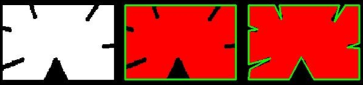

# 计算机视觉

主要使用opencv

同时需要安装opencv-contrib-python(类似扩展包), 也可以安装其他版本. 如果需要whl文件可以去<https://www.lfd.uci.edu/~gohlke/pythonlibs/#opencv>

```batch
E:\Workspace\ml\code-ml\ml>pip install opencv-python
E:\Workspace\ml\code-ml\ml>pip install opencv-contrib-python
E:\Workspace\ml\code-ml\ml>python
>>> import cv2
>>> cv2.__version__
'4.5.5'
```

## 图像理论

计算机中把数据转换为RGB矩阵, 比如R中的每一个数据都是一个pixel的颜色亮度. 每一个颜色都为`通道`. 在RGB就是三通道, 黑白图片就是单通道, 也叫灰度图. 在当前图片的宽高为500 x 500最终的数据就是`[500 x 500 x 3]`.


## opencv简单操作

图像处理, 可以读取图像然后通过opencv对图像进行数据转换.

### 图片基本操作

```python
import cv2
import matplotlib.pyplot as plt

"""
1. 图片的基本操作
"""

# 需要注意的是cv2默认读取图片格式是BGR而不是rgb格式,因此读取颜色的时候要注意
img = cv2.imread('E:\Workspace\ml\code-ml\ml\python\computer-vision\data\cat.jpg')
print(img)  # 一个numpy中ndarray的结构[h,w,c], type是uint8, 因为最小值为0, 最大值为255


# [[[183 157 150]
#   [193 167 160]
#   [203 177 170]
#   ...

# # 展示图片
# cv2.imshow('image', img)  # 第一个参数表示的是标题
# # 图片会马上关闭, 需要安排等待时间, 毫秒, 0表示手动终止
# cv2.waitKey(0)
# cv2.destroyAllWindows()  # 终止的时候直接关闭窗口
def cv_show(title, cv_image):
    cv2.imshow(title, cv_image)
    cv2.waitKey(0)
    cv2.destroyAllWindows()


print(img.shape)  # 展示数据的维度(h,w,c)
# (259, 194, 3)

# 读取灰度图像, 黑白图像
img = cv2.imread('E:\Workspace\ml\code-ml\ml\python\computer-vision\data\cat.jpg', cv2.IMREAD_GRAYSCALE)
print(img.shape)  # (259, 194)
# cv_show("gray",img)

# 保存图片
cv2.imwrite('testCat.png', img)

print(type(img))  # 属性
print(img.size)  # 大小
print(img.dtype)  # dtype uint8

cat = img[0:50, 0:50]  # 截取图片x:0-50 y:0-50
# cv_show("cat", cat)

# 将三个通道导出到3个变量中
img = cv2.imread('E:\Workspace\ml\code-ml\ml\python\computer-vision\data\cat.jpg')
b, g, r = cv2.split(img)
print(b)
print(r.shape)  # (259, 194)

# 复制一个图像, 将绿色蓝色定义为0, 也就是删除其他颜色的比重
red_img = img.copy()
red_img[:, :, 0] = 0
red_img[:, :, 1] = 0
# cv_show("R", red_img)

green_img = img.copy()
green_img[:, :, 0] = 0
green_img[:, :, 2] = 0
# cv_show("R", green_img)

blue_image = img.copy()
blue_image[:, :, 1] = 0
blue_image[:, :, 2] = 0
# cv_show("R", blue_image)

# 便捷填充, 将图像扩大
top_size, bottom_size, left_size, right_size = (50, 50, 50, 50)
# 定义五种不同的填充方法, 分别使用不同的常量定义. 按照什么样的方式进行填充
# copyMakeBorder: 复制图像并添加border
# BORDER_REPLICATE: 复制, 将最边缘的像素点填充到当前行和列
# BORDER_REFLECT: 反射, 将像素点反向填充,图像像素类似: fedcba|abcdefg|hgfedcb
# BORDER_REFLECT101: 另一种反射 gfedcb|abcdefgh|gfedcba
# BORDER_WRAP: 包装: cdefgh|abcdefgh|abcdefg
# BORDER_CONSTANT: 常量填充, 这个就是颜色
replicate = cv2.copyMakeBorder(img, top_size, bottom_size, left_size, right_size, borderType=cv2.BORDER_REPLICATE)
reflect = cv2.copyMakeBorder(img, top_size, bottom_size, left_size, right_size, borderType=cv2.BORDER_REFLECT)
reflect101 = cv2.copyMakeBorder(img, top_size, bottom_size, left_size, right_size, cv2.BORDER_REFLECT101)
wrap = cv2.copyMakeBorder(img, top_size, bottom_size, left_size, right_size, cv2.BORDER_WRAP)
constant = cv2.copyMakeBorder(img, top_size, bottom_size, left_size, right_size, borderType=cv2.BORDER_CONSTANT,
                              value=0)

plt.subplot(231), plt.imshow(img, 'gray'), plt.title('ORIGINAL')
plt.subplot(232), plt.imshow(replicate, 'gray'), plt.title('BORDER_REPLICATE')
plt.subplot(233), plt.imshow(reflect, 'gray'), plt.title('BORDER_REFLECT')
plt.subplot(234), plt.imshow(reflect101, 'gray'), plt.title('BORDER_REFLECT101')
plt.subplot(235), plt.imshow(wrap, 'gray'), plt.title('BORDER_WRAP')
plt.subplot(236), plt.imshow(constant, 'gray'), plt.title('BORDER_CONSTANT')

plt.show()

```


### 图像的融合处理

```python
import cv2
import matplotlib.pyplot as plt

"""
3. 图像的数值计算
"""

cat = cv2.imread('E:\Workspace\ml\code-ml\ml\python\computer-vision\data\cat.jpg')
dog = cv2.imread('E:\Workspace\ml\code-ml\ml\python\computer-vision\data\dog.jpg')

cat2 = cat + 10  # 相当于整体灰度增加, 每一个像素点的颜色都加10
print(cat[:5, :, 0])
print(cat2[:5, :, 0])
# 两个图片叠加一下,只打印前5行, 这里注意当相加的时候超过255的会从0计算. 注意相加维度必须相同
# 原因是类型是uint8最大就是255
print((cat + cat2)[:5, :, 0])

# cv2的相加属性, 超过255的都视为255
print(cv2.add(cat, cat2)[:5, :, 0])  # [[ 255,255,255 ... 255,255]]

# 图像融合, 简单的数值相加
# print(cat + dog)  # Error operands could not be broadcast together with shapes (259,194,3) (198,255,3) # 形状不同无法相加
print(cat.shape)  # (259, 194, 3)
dog2 = cv2.resize(dog, (194, 259))  # 对图像进行resize
print(dog2.shape)  # (259, 194, 3)
print(cat + dog2)

# 图像resize进行倍数压缩, 图像的x轴乘以3
res = cv2.resize(dog, (0, 0), fx=3, fy=1)
plt.imshow(res)
res = cv2.resize(dog, (0, 0), fx=1.5, fy=0.5)  # 横轴乘以1.5倍, 纵轴减半
plt.imshow(res)

# 图像融合
# 将cat的所有像素属性乘以0.4, dog的所有像素属性乘以0.5, 然后叠加最后所有像素加上6
res = cv2.addWeighted(cat, 0.4, dog2, 0.5, 6)
plt.imshow(res)
```

### 视频简单处理

理论上处理视频就是把每一帧提取出来进行计算,因此数据就会出现一种迭代的情况

```python
import cv2

"""
1. 视频的基本操作
在cv中, 图像就是多帧的图片集合. 在学习中, 我们需要将视频的每一帧进行计算
"""
vc = cv2.VideoCapture('E:\Workspace\ml\code-ml\ml\python\computer-vision\data\opencv.mp4')
print(vc)  # <VideoCapture 000001C13D647B10>

# 对视频进行读取, isOpened表示是否可以打开, 如果打开的话 是否可以播放等等
# 然后对于每一帧进行获取. 这里的vc可以看做是一个迭代器, 对其进行迭代
if vc.isOpened():
    # read()方法表示读取一帧进行迭代, 返回两个值, 第一个值表示的是是否读取成功, 第二个值表示的是读取的结果
    # 读取出来的frame图像就是image图像
    open, frame = vc.read()
else:
    open = False

while open:
    ret, frame = vc.read()
    if frame is None:  # 当图片结束的时候, 读取的帧就是空帧, 当读取到空的时候跳出循环
        break
    if ret == True:  # 当读取成功的时候我们进行展示
        gray = cv2.cvtColor(frame, cv2.COLOR_RGB2GRAY)  # 将图像进行灰度处理, 获得灰度处理的图像变量"gray"
        cv2.imshow('result', gray)  # 展示这个图像
        # 当这个图像等待0.01秒, 进入下一个图像,或者退出字节为27,这里表示的是退出按键为esc的时候退出循环
        if cv2.waitKey(10) & 0xFF == 27:
            break
vc.release()  # 释放视频
cv2.destroyAllWindows()
```

### 阈值处理, 平滑处理

阈值函数`ret,dst = cv2.threshold(src,thresh,maxval,type)`

* src： 输入图，只能输入单通道图像，通常来说为灰度图
* thresh： 阈值, 一般为127为界来进行判断
* dst： 输出图
* maxval： 当像素值超过了阈值（或者小于阈值，根据type来决定），所赋予的值, 一般为255
* type：二值化操作的类型，包含以下5种类型： cv2.THRESH_BINARY； cv2.THRESH_BINARY_INV； cv2.THRESH_TRUNC； cv2.THRESH_TOZERO；cv2.THRESH_TOZERO_INV
  * cv2.THRESH_BINARY（二值）： 超过阈值部分取maxval（最大值），否则取0
  * cv2.THRESH_BINARY_INV： THRESH_BINARY的反转
  * cv2.THRESH_TRUNC ：大于阈值部分设为阈值，否则不变
  * cv2.THRESH_TOZERO ：大于阈值部分不改变，否则设为0
  * cv2.THRESH_TOZERO_INV：THRESH_TOZERO的反转

```python
cat = cv2.imread('E:\Workspace\ml\code-ml\ml\python\computer-vision\data\cat.jpg')
dog = cv2.imread('E:\Workspace\ml\code-ml\ml\python\computer-vision\data\dog.jpg')

cat_gray = cv2.cvtColor(cat, cv2.COLOR_RGB2GRAY)

ret, thresh1 = cv2.threshold(cat_gray, 127, 255, cv2.THRESH_BINARY)  # 大于127的都为白否则都是黑
ret, thresh2 = cv2.threshold(cat_gray, 127, 255, cv2.THRESH_BINARY_INV)  # 和上面的相反
ret, thresh3 = cv2.threshold(cat_gray, 127, 255, cv2.THRESH_TRUNC)  # 大于127的都为127, 否则不变
ret, thresh4 = cv2.threshold(cat_gray, 127, 255, cv2.THRESH_TOZERO)  # 大于127的不变, 否则变为0
ret, thresh5 = cv2.threshold(cat_gray, 127, 255, cv2.THRESH_TOZERO_INV)  # 色差翻转, 和上面的颜色翻转

titles = ['Original Image', 'BINARY', 'BINARY_INV', 'TRUNC', 'TOZERO', 'TOZERO_INV']
images = [cat_gray, thresh1, thresh2, thresh3, thresh4, thresh5]

for i in range(6):
    plt.subplot(2, 3, i + 1), plt.imshow(images[i], 'gray')
    plt.title(titles[i])
    plt.xticks([]), plt.yticks([])
# plt.show()
```

阈值处理结果


```python
"""
平滑处理. 当图片存在噪音的时候可以对图片进行平滑处理
"""
img = cv2.imread('E:\Workspace\ml\code-ml\ml\python\computer-vision\data\lenaNoise.png')
cv_show("image", img)

# 均值滤波, 简单的平均卷及操作
# 其原理就是, 所有的点点变换为周围点的均值
# 方法就是构建3x3的全1矩阵然后矩阵相乘最终求平均值 也就是相加对除
# 整个图将会变得模糊
blur = cv2.blur(img, (3, 3))  # 每个点相对于3x3的矩阵进行运算
# cv_show("blur", blur)

# 方框滤波
# 基本和均值一样, 可以选择归一化, 一旦进行了归一化均值就和方框是一样的
# 当越界现象就会直接使用255
box = cv2.boxFilter(img, -1, (3, 3), normalize=False)  # 每个点相对于3x3的矩阵进行运算
# cv_show("box", box)

# 高斯滤波
# 高斯模糊的卷积核里的数值是满足高斯分布，相当于更重视中间的
# 越接近取值就越相似, 原理就是使用矩阵, 创建一个从0.0到1.0的权重型矩阵, 中心就是本pixel,
#   当出现与本属性相似的值的时候权重就高, 否则如果数值相差较大权重就地, 然后使用权重矩阵与数据矩阵相乘
gaus = cv2.GaussianBlur(img, (5, 5), 1)
# cv_show("gaus", gaus)

# 中值滤波
# 相当于用中值代替, 去周围像素点的中间值对比
median = cv2.medianBlur(img, 5)
# cv_show("median", median)

# 展示所有的
res = np.hstack((img, blur, gaus, median))  # 横向拼接
# res = np.vstack((img, blur, gaus, median))  # 竖着拼接
# print (res)
cv2.imshow('median vs average', res)
cv2.waitKey(0)
cv2.destroyAllWindows()
```

平滑处理数据结果


### 图像形态操作

**腐蚀操作**: 腐蚀原理：腐蚀：局部最小值（与膨胀相反）

1. 定义一个卷积核B，核可以是任何的形状和大小，且拥有一个单独定义出来的参考点 - 锚点（anchorpoint）, 通常和为带参考点的正方形或者圆盘，可将核称为模板或掩膜
2. 将核乙与图像甲进行卷积，计算核乙覆盖区域的像素点最小值
3. 将这个最小值赋值给参考点指定的像素

因此，图像中的高亮区域逐渐减小。


```python
# 腐蚀操作
img = cv2.imread('E:\Workspace\ml\code-ml\ml\python\computer-vision\data\dg.png')
cv_show("dige", img)

kernel = np.ones((5, 5), np.uint8)
erosion = cv2.erode(img, kernel, iterations=1)
cv_show("erosion", erosion)
```


可以对一个图像进行多次腐蚀迭代 `erosion = cv2.erode(img, kernel, iterations=3)`


**膨胀操作**: 膨胀就是求局部最大值的操作。

按数学方面来说，膨胀或者腐蚀操作就是将图像（或图像的一部分区域，我们称之为A）与核（我们称之为B）进行卷积。

核可以是任何的形状和大小，它拥有一个单独定义出来的参考点，我们称其为锚点（anchorpoint）。多数情况下，核是一个小的中间带有参考点和实心正方形或者圆盘，其实，我们可以把核视为模板或者掩码。

而膨胀就是求局部最大值的操作，核B与图形卷积，即计算核B覆盖的区域的像素点的最大值，并把这个最大值赋值给参考点指定的像素。这样就会使图像中的高亮区域逐渐增长。如下图所示，这就是膨胀操作的初衷。


```python
# 膨胀, 相对于腐蚀属于逆运算
kernel = np.ones((5, 5), np.uint8)
dilate = cv2.dilate(erosion, kernel, iterations=1)
cv_show("dilate", dilate)
```

**开运算（Open Operation）**：先腐蚀后膨胀的过程

* 消除小物体
* 在纤细处分离物体
* 平滑较大的边界并不明显改变其面积

**闭运算（Closing Openration）**: 先膨胀后腐蚀

* 排除小型黑洞（黑斑）

```python
# 开：先腐蚀，再膨胀
img = cv2.imread('E:\Workspace\ml\code-ml\ml\python\computer-vision\data\dg.png')
kernel = np.ones((5, 5), np.uint8)
opening = cv2.morphologyEx(img, cv2.MORPH_OPEN, kernel)
cv_show("opening", opening)

# 闭：先膨胀，再腐蚀
img = cv2.imread('E:\Workspace\ml\code-ml\ml\python\computer-vision\data\dg.png')
kernel = np.ones((5, 5), np.uint8)
closing = cv2.morphologyEx(img, cv2.MORPH_CLOSE, kernel)
cv_show("closing", closing)
```

**梯度运算**:梯度=膨胀-腐蚀

```python
# 梯度=膨胀-腐蚀
pie = cv2.imread('E:\Workspace\ml\code-ml\ml\python\computer-vision\data\pie.png')
kernel = np.ones((7, 7), np.uint8)
dilate = cv2.dilate(pie, kernel, iterations=5)
erosion = cv2.erode(pie, kernel, iterations=5)

res = np.hstack((dilate, erosion))
cv_show("res", res)
gradient = cv2.morphologyEx(pie, cv2.MORPH_GRADIENT, kernel)
cv_show("gradient", gradient)
```


**礼帽与黑帽**: 礼帽 = 原始输入-开运算结果; 黑帽 = 闭运算-原始输入

```python
# 礼帽
img = cv2.imread('E:\Workspace\ml\code-ml\ml\python\computer-vision\data\dg.png')
tophat = cv2.morphologyEx(img, cv2.MORPH_TOPHAT, kernel)
cv_show('tophat', tophat)
```


```python
# 黑帽
img = cv2.imread('E:\Workspace\ml\code-ml\ml\python\computer-vision\data\dg.png')
blackhat = cv2.morphologyEx(img, cv2.MORPH_BLACKHAT, kernel)
cv_show('blackhat', blackhat)
```


### 图像梯度-算子

图像梯度-Sobel算子. 在像素层面一个圆会出现锯齿. 对于每个像素点的处理右减左, 下减上

$$G_x = \begin{bmatrix}-1&0&+1\\-2&0&+2\\-1&0&+1\end{bmatrix} * A $$
$$G_y = \begin{bmatrix}-1&-2&-1\\0&0&0\\+1&+2&+1\end{bmatrix} * A $$

算自公式 `dst = cv2.Sobel(src, ddepth, dx, dy, ksize)`

* ddepth:图像的深度, 通常情况下指定为-1, 输入深度和输出深度一样
* dx和dy分别表示水平和竖直方向
* ksize是Sobel算子的大小, 指定的和是多大的, 也就是矩阵大小

```python
import cv2
import numpy as np


def cv_show(title, cv_image):
    cv2.imshow(title, cv_image)
    cv2.waitKey(0)
    cv2.destroyAllWindows()


"""
6. 图像算子
"""

img = cv2.imread('E:\Workspace\ml\code-ml\ml\python\computer-vision\data\pie.png')
cv_show('image', img)

# 当计算矩阵的时候会使用右边减左边的操作, 因此此时中心的颜色为白色, 右边的颜色为黑色, 因此左侧的圆弧就会出现.
# 但是在右侧的圆弧中,由于右边减左边的操作是黑色减白色, 因此数据就会出现负数的情况(白色为255). 因此我们可以对数据进行absolute处理
sobelx = cv2.Sobel(img, cv2.CV_64F, 1, 0, ksize=3)
# 进行绝对值处理
sobelx1 = cv2.Sobel(img, cv2.CV_64F, 1, 0, ksize=3)
sobelx1 = cv2.convertScaleAbs(sobelx1)

sobelx2 = cv2.Sobel(img, cv2.CV_64F, 0, 1, ksize=3)
sobelx2 = cv2.convertScaleAbs(sobelx2)

# 直接设定进行计算的结果并不准确, 不推荐直接计算
sobelx3 = cv2.Sobel(img, cv2.CV_64F, 1, 1, ksize=3)
sobelx3 = cv2.convertScaleAbs(sobelx3)

res = np.hstack((img, sobelx, sobelx1, sobelx2, sobelx3))  # 展示
cv_show('show', res)
```


```python
# 由于不推荐直接计算, 我们会进行叠加计算
img = cv2.imread('E:\Workspace\ml\code-ml\ml\python\computer-vision\data\lena.png', cv2.IMREAD_GRAYSCALE)
cv_show('img', img)
sobelx = cv2.Sobel(img, cv2.CV_64F, 1, 0, ksize=3)
sobelx = cv2.convertScaleAbs(sobelx)
sobely = cv2.Sobel(img, cv2.CV_64F, 0, 1, ksize=3)
sobely = cv2.convertScaleAbs(sobely)
sobelxy = cv2.addWeighted(sobelx, 0.5, sobely, 0.5, 0)
cv_show('sobelxy', sobelxy)
```


**图像梯度**: scharr算子,最大的特点是数值存在差异.

$$G_x = \begin{bmatrix}-3&0&+3\\-10&0&+10\\-3&0&+3\end{bmatrix} * A \quad and \quad G_y = \begin{bmatrix}-3&-10&-3\\0&0&0\\+3&+10&+3\end{bmatrix}* A $$

**图像梯度**: laplacian算子, 提出了二阶导数的概念. 但是由于变化率的概念, 对特殊点极为敏感. 因此很多时候需要和其他工具同时使用.
$$G_x = \begin{bmatrix}0&1&0\\1&-4&1\\0&1&0\end{bmatrix}$$

```python
# 不同算子的差异
img = cv2.imread('E:\Workspace\ml\code-ml\ml\python\computer-vision\data\Lenna.jpg', cv2.IMREAD_GRAYSCALE)
sobelx = cv2.Sobel(img, cv2.CV_64F, 1, 0, ksize=3)
sobely = cv2.Sobel(img, cv2.CV_64F, 0, 1, ksize=3)
sobelx = cv2.convertScaleAbs(sobelx)
sobely = cv2.convertScaleAbs(sobely)
sobelxy = cv2.addWeighted(sobelx, 0.5, sobely, 0.5, 0)

# Scharr算子更加的敏感
scharrx = cv2.Scharr(img, cv2.CV_64F, 1, 0) 
scharry = cv2.Scharr(img, cv2.CV_64F, 0, 1)
scharrx = cv2.convertScaleAbs(scharrx)
scharry = cv2.convertScaleAbs(scharry)
scharrxy = cv2.addWeighted(scharrx, 0.5, scharry, 0.5, 0)

laplacian = cv2.Laplacian(img, cv2.CV_64F)
laplacian = cv2.convertScaleAbs(laplacian)

res = np.hstack((sobelxy, scharrxy, laplacian))
cv_show('res', res)

```


### 边缘检测

Canny边缘检测

1. 使用高斯滤波器，以平滑图像，滤除噪声。
2. 计算图像中每个像素点的梯度强度和方向。
3. 应用非极大值（Non-Maximum Suppression）抑制，以消除边缘检测带来的杂散响应。
4. 应用双阈值（Double-Threshold）检测来确定真实的和潜在的边缘。
5. 通过抑制孤立的弱边缘最终完成边缘检测

高斯滤波器, 当所有像素点都进行了滤波就完成了平滑处理


梯度和方向, 使用的是sobel算子, 算出x和y方向


非极大值抑制.

1. 方法1: 尝试和附近的点的梯度进行对比. 首先算出当前点梯度的方向, 然后延着方向获取dTemp1和dTemp2, g1,g2,g3,g4都是真实的像素点, dtemp1和dtemp2就是两个运算用的点. 针对点dTemp1计算到达g1和g2的距离, 然后除以g1g2的长度求出两个分数, 然后通过公式算出两个点的参考值, 然后和c对比, 决定是否把c定义为差值.

2. 方法2: 直接尝试画8个方向的梯度计算


双阈值检测. 对多个点进行边界检测, 同时进行边界界定标记. 大于一个值定义为边界小于一个值定义为普通点. 处在中间的点我们尝试延伸, 如果可以延伸到边界点的话就标记为边界,如果不能就标记为普通


```python
import cv2
import numpy as np


def cv_show(title, cv_image):
    cv2.imshow(title, cv_image)
    cv2.waitKey(0)
    cv2.destroyAllWindows()


"""
7. 边界检测
"""

img = cv2.imread('E:\Workspace\ml\code-ml\ml\python\computer-vision\data\Lenna.jpg')
cv_show('image', img)

# minVal和maxVal
v1 = cv2.Canny(img, 80, 150)
v2 = cv2.Canny(img, 50, 100)

res = np.hstack((v1, v2))
cv_show('res', res)

img = cv2.imread("E:\Workspace\ml\code-ml\ml\python\computer-vision\data\car.jpg", cv2.IMREAD_GRAYSCALE)

v1 = cv2.Canny(img, 120, 250)
v2 = cv2.Canny(img, 50, 100)

res = np.hstack((v1, v2))
cv_show('res', res)

```


### 图像金字塔与图像轮廓

#### 轮廓

**cv2.findContours(img,mode,method)**
mode:轮廓检测模式

* RETR_EXTERNAL：只检索最外面的轮廓
* RETR_LIST:检索所有的轮廓，并将其保存到一条链表当中
* RETR_CCOMP：检索所有的轮廓，并将他们组织为两层：顶层是各部分的外部边界，第二层是空洞的边界
* RETR_RREE（最常用）:检索所有的轮廓，并重构嵌套轮廓的整个层次

method：轮廓逼近的方法

* CHAIN_APPROX_NONE：以Freeman链码的方式输出轮廓，所有其他的方法输出多边形（顶点的序列）
* CHAIN_APPROX_SIMPLE：压缩水平的，垂直的和斜着的，也就是说，函数只保留他们的终点部分

```python
# 读取数据, 转换为灰度图, 可以更好地进行边缘检测
img = cv2.imread("E:\Workspace\ml\code-ml\ml\python\computer-vision\data\contours.png")
gray = cv2.cvtColor(img, cv2.COLOR_BGR2GRAY)
ret, thresh = cv2.threshold(gray, 127, 255, cv2.THRESH_BINARY)
# cv_show(thresh, 'thresh')

# 绘制轮廓, 需要注意旧版中可以获得原图像作为返回值的第一个值, 新版中被省略
# binary, contours, hierarchy = cv2.findContours(thresh, cv2.RETR_TREE, cv2.CHAIN_APPROX_NONE)
# cv_show(binary, 'binary')  # 和上面的图像相同
contours, hierarchy = cv2.findContours(thresh, cv2.RETR_TREE, cv2.CHAIN_APPROX_NONE)
print(contours)  # 轮廓的信息

# 绘制轮廓
# 传入绘制图像, 轮廓, 轮廓索引, 轮廓颜色模式, 线条厚度
# 轮廓索引是包括内圈,外圈以及不同轮廓的索引, -1表示展示全部
draw_img = img.copy()  # 需要注意, 轮廓会直接绘制在原图上
res = cv2.drawContours(draw_img, contours, -1, (0, 0, 255), 2)
cv_show(draw_img, 'draw_img')

# 轮廓特征计算
# 获取轮廓的特征
cnt = contours[0]
print(cv2.contourArea(cnt))  # 计算面积
print(cv2.arcLength(cnt, True))  # 计算周长, true表示计算闭合的

```


轮廓近似. 我们可以做一个近似的轮廓. 而不是麻麻赖赖的不圆润. 原理就是针对两个点AB连成一条线, 在线段AB中如果存在一个点到AB弦的垂线距离过远, 那么就在ab中做一个新的点.


```python
# 轮廓近似
# 生成轮廓
img = cv2.imread("E:\Workspace\ml\code-ml\ml\python\computer-vision\data\contours2.png")
gray = cv2.cvtColor(img, cv2.COLOR_BGR2GRAY)
ret, thresh = cv2.threshold(gray, 127, 255, cv2.THRESH_BINARY)
contours, hierarchy = cv2.findContours(thresh, cv2.RETR_TREE, cv2.CHAIN_APPROX_NONE)
cnt = contours[0]

draw_img = img.copy()
res = cv2.drawContours(draw_img, [cnt], -1, (0, 0, 255), 2)
cv_show(res, 'res')

# 阈值是0.1倍的周长, 也就是垂线的阈值, 越小的话边框越精细
epsilon = 0.1 * cv2.arcLength(cnt, True)
approx = cv2.approxPolyDP(cnt, epsilon, True)
draw_img = img.copy()
res = cv2.drawContours(draw_img, [approx], -1, (0, 0, 255), 2)
cv_show(res, 'res')
```


也可以外接图形

```python
# 创建一个外接矩形, 起始绘图点, 长宽, 颜色, 笔刷粗细
x, y, w, h = cv2.boundingRect(cnt)
outer_rec = img.copy()
img = cv2.rectangle(outer_rec, (x, y), (x + w, y + h), (0, 255, 0), 2)
cv_show(outer_rec, "outer_rec")

img = cv2.imread("E:\Workspace\ml\code-ml\ml\python\computer-vision\data\contours.png")
gray = cv2.cvtColor(img, cv2.COLOR_BGR2GRAY)
ret, thresh = cv2.threshold(gray, 127, 255, cv2.THRESH_BINARY)
contours, hierarchy = cv2.findContours(thresh, cv2.RETR_TREE, cv2.CHAIN_APPROX_NONE)
cnt = contours[0]  # 0外接,1内切,2+换其他图

x, y, w, h = cv2.boundingRect(cnt)
img = cv2.rectangle(img, (x, y), (x + w, y + h), (0, 255, 0), 2)
cv_show(img, "img")

area = cv2.contourArea(cnt)
x, y, w, h = cv2.boundingRect(cnt)
react_area = w * h
extent = float(area) / react_area
print('轮廓面积与边界矩形比:', extent)
```


外接圆的简单实现, 但是外接圆是与外界方形的中心, 所以不实用

```python
# 外接圆
(x, y), radius = cv2.minEnclosingCircle(cnt)
center = (int(x), int(y))
radius = int(radius)
circle_image = img.copy()
circle_image = cv2.circle(circle_image, center, radius, (0, 255, 0), 2)
cv_show(circle_image, "img")
```


#### 图像金字塔

高斯金字塔


高斯采样的方法, **向下采样**(缩小)
$$
\frac{1}{16}\begin{bmatrix}
{1}&4&6&4&1\\
{4}&16&24&16&4\\
{6}&24&36&24&6\\
{4}&16&24&16&4\\
{1}&4&6&4&1\\
\end{bmatrix}
$$

* 将$G_i$和高斯内核卷积
* 将所有的偶数行和列去除

高斯金字塔:**向上采样**(放大)

$$
\begin{bmatrix}
10&30\\
59&96\\
\end{bmatrix}
=>
\begin{bmatrix}
10&0&30&0\\
0&0&0&0\\
59&0&96&0\\
0&0&0&0\\
\end{bmatrix}
$$

1. 将图像在每个方向扩大到原来的两倍, 新增的行以0填充
2. 使用先前同样的内核(乘以4)与放大后的图像卷积, 获得近似的值

```python
"""
高斯金字塔
"""
img = cv2.imread("E:\Workspace\ml\code-ml\ml\python\computer-vision\data\\fun.jpg")
cv_show(img, 'img')
print(img.shape)

# 向上采样, 扩大
up = cv2.pyrUp(img)
cv_show(up, 'up')
print(up.shape)

# 向下采样
down = cv2.pyrDown(img)
cv_show(down, 'down')
print(down.shape)

# 原始采样修改
up = cv2.pyrUp(img)
up_down = cv2.pyrDown(up)
print(up_down.shape)
up_down = np.hstack((img, up_down, img - up_down))  # 尝试一下减法
cv_show(up_down, 'up_down')
```


拉普拉斯金字塔: $L_i = G_i - PyrUp(PyrDown(G_i))$


1. 低通滤波
2. 缩小尺寸
3. 放大尺寸
4. 图像相减

```python
# 拉普拉斯金字塔
down = cv2.pyrDown(img)
down_up = cv2.pyrUp(down)
# 注意这里可能会出现图像大小不同的情况
lv_1 = img - down_up
cv_show(lv_1, 'lv_1')
```

#### 模板匹配

相对于不同的图像可能需要进行对比. 或者图像的部分对比. 主要还是像素进行匹配.
<https://docs.opencv.org/3.4/df/dfb/group__imgproc__object.html#ga3a7850640f1fe1f58fe91a2d7583695d>

模板匹配和卷积原理很像，模板在原图像上从原点开始滑动，计算模板与（图像被模板覆盖的地方）的差别程度，这个差别程度的计算方法在opencv里有6种，然后将每次计算的结果放入一个矩阵里，作为结果输出。假如原图形是AxB大小，而模板是axb大小，则输出结果的矩阵是$(A-a+1)*(B-b+1)$。

TM_SQDIFF：计算平方不同，计算出来的值越小，越相关
TM_CCORR：计算相关性，计算出来的值越大，越相关
TM_CCOEFF：计算相关系数，计算出来的值越大，越相关
TM_SQDIFF_NORMED：计算归一化平方不同，计算出来的值越接近0，越相关
TM_CCORR_NORMED：计算归一化相关性，计算出来的值越接近1，越相关
TM_CCOEFF_NORMED：计算归一化相关系数，计算出来的值越接近1，越相关

模板匹配会找出最亮的一个点, 然后进行匹配.所以左侧的图片中最亮的一部分就会被定义为最适合方框的位置. 基本上带有归一化的结果都不会差.

```python
"""
模板匹配
"""
img = cv2.imread("E:\Workspace\ml\code-ml\ml\python\computer-vision\data\Lenna.jpg")
template = cv2.imread("E:\Workspace\ml\code-ml\ml\python\computer-vision\data\lena-cut.jpg")
h, w = template.shape[:2]
print(img.shape)  # (316, 316, 3)
print(template.shape)  # (125, 101, 3)

methods = ['cv2.TM_CCOEFF', 'cv2.TM_CCOEFF_NORMED', 'cv2.TM_CCORR',
           'cv2.TM_CCORR_NORMED', 'cv2.TM_SQDIFF', 'cv2.TM_SQDIFF_NORMED']

res = cv2.matchTemplate(img, template, cv2.TM_CCORR)
print(res.shape)  # (192, 216)

# opencv中给出了这个函数,可以找到最大最小的位置和最大最小值
# 表示用当前方式给出的结果. 由于我们给定的计算方法结果是使用的归一化, 因此minloc其实是计算出来的位置, 因此我们可以调取
min_val, max_val, min_loc, max_loc = cv2.minMaxLoc(res)
print(min_val, max_val, min_loc, max_loc)  # 0.0008121237624436617 0.40212324261665344 (120, 113) (41, 191)

fig, axs = plt.subplots(3, 4)

for m_index in range(len(methods)):
    m = methods[m_index]
    img2 = img.copy()
    # 匹配方法的真值
    method = eval(m)
    print(m_index, method)
    res = cv2.matchTemplate(img, template, method)
    min_val, max_val, min_loc, max_loc = cv2.minMaxLoc(res)

    # 如果是平方差匹配TM_SQDIFF或归一化平方差匹配TM_SQDIFF_NORMED，取最小值
    if method in [cv2.TM_SQDIFF, cv2.TM_SQDIFF_NORMED]:
        top_left = min_loc
    else:
        top_left = max_loc
    bottom_right = (top_left[0] + w, top_left[1] + h)

    # 画矩形
    cv2.rectangle(img2, top_left, bottom_right, 255, 2)

    # 绘图, 放入plot中
    # plt.subplot(121), plt.imshow(res, cmap='gray')
    # plt.xticks([]), plt.yticks([])  # 隐藏坐标轴
    # plt.subplot(122), plt.imshow(img2, cmap='gray')
    # plt.xticks([]), plt.yticks([])
    # plt.suptitle(m)
    # plt.show()
    sub_set_index = m_index % 2
    sub_set_index_first = sub_set_index * 2
    sub_set_index_second = sub_set_index * 2 + 1
    print(int(m_index / 2), sub_set_index_first, sub_set_index_second)

    axs[int(m_index / 2), sub_set_index_first].imshow(res, cmap='gray')
    axs[int(m_index / 2), sub_set_index_first].set_xticks([])
    axs[int(m_index / 2), sub_set_index_first].set_yticks([])
    axs[int(m_index / 2), sub_set_index_first].set_title(m)
    axs[int(m_index / 2), sub_set_index_second].imshow(img2, cmap='gray')
    axs[int(m_index / 2), sub_set_index_second].set_xticks([])
    axs[int(m_index / 2), sub_set_index_second].set_yticks([])
    axs[int(m_index / 2), sub_set_index_second].set_title(m)

plt.show()
```


```python
# 多模板匹配
img_rgb = cv2.imread('E:\Workspace\ml\code-ml\ml\python\computer-vision\data\mario.jpg')
img_gray = cv2.cvtColor(img_rgb, cv2.COLOR_BGR2GRAY)
template = cv2.imread('E:\Workspace\ml\code-ml\ml\python\computer-vision\data\mario-coin.jpg', cv2.IMREAD_GRAYSCALE)
h, w = template.shape[:2]

res = cv2.matchTemplate(img_gray, template, cv2.TM_CCOEFF_NORMED)  # 返回每一个窗口的结果值
threshold = 0.8
# 取匹配程度大于%80的坐标
loc = np.where(res >= threshold)
for pt in zip(*loc[::-1]):  # *号表示可选参数
    bottom_right = (pt[0] + w, pt[1] + h)
    cv2.rectangle(img_rgb, pt, bottom_right, (0, 0, 255), 1)

cv2.imshow('img_rgb', img_rgb)
cv2.waitKey(0)
```


### 傅里叶变换, 直方图

像素点向直方图转换

cv2.calcHist(images,channels,mask,histSize,ranges)
> hist是个256x1的数组, 每一个值代表了与次灰度对应的像素数目

* images: 原图像(图像格式为 uint8 或 float32)。当传入函数时应该用中括号 [] 括起来,例如:[img]。
* channels: 同样需要用中括号括起来,它会告诉函数我们要统计那幅图像的直方图。如果输入图像是灰度图,它的值就是 [0];如果是彩色图像的话,传入的参数可以是 [0],[1],[2] 它们分别对应着通道 B,G,R。
* mask: 掩模图像。要统计整幅图像的直方图就把它设为 None。但是如果你想统计图像某一部分的直方图的话,你就需要制作一个掩模图像,并使用它。
* histSize:BIN 的数目。也应该用中括号括起来,例如:[256]。
* ranges: 像素值范围,通常为 [0,256]

```python
img = cv2.imread('E:\Workspace\ml\code-ml\ml\python\computer-vision\data\cat.jpg', 0)  # 0表示灰度图.
hist = cv2.calcHist([img], [0], None, [256], [0, 256])
print(hist.shape)

plt.hist(img.ravel(), 256)
plt.show()
```


```python
img = cv2.imread('E:\Workspace\ml\code-ml\ml\python\computer-vision\data\cat.jpg')
color = ('b', 'g', 'r')  # 这里的格式是bgr的格式绘图进入plotlib顺序不一样, 因此在这里定义
for i, col in enumerate(color):
    histr = cv2.calcHist([img], [i], None, [256], [0, 256])
    plt.plot(histr, color=col)
    plt.xlim([0, 256])
plt.show()
```


掩码

要统计图像某个局部区域的直方图只需要构建一副掩模图像。将要统计的部分设置成白色,其余部分为黑色,就构成了一副掩模图像。然后把这个掩模图像传给函数就可以了。
