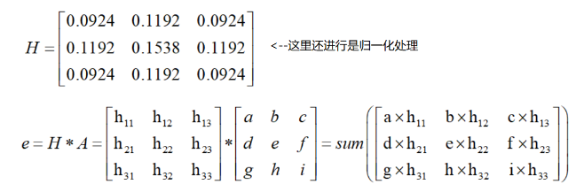
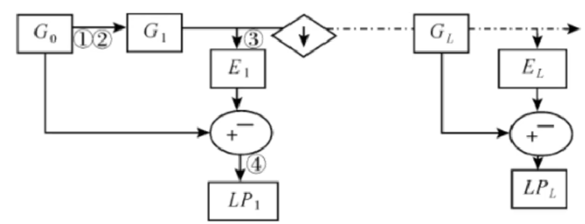
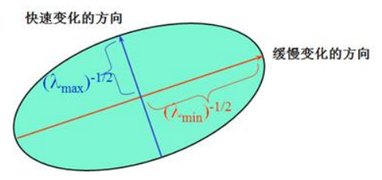
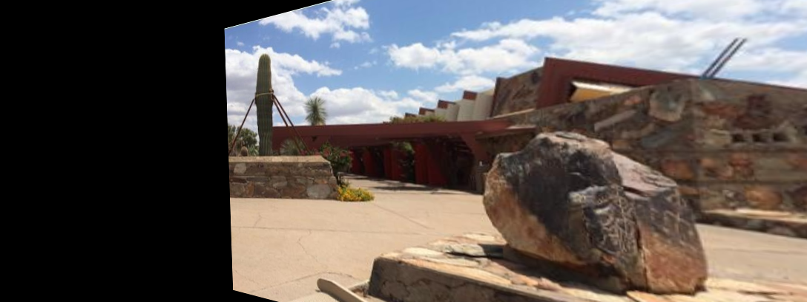

# 计算机视觉

主要使用opencv

同时需要安装opencv-contrib-python(类似扩展包), 也可以安装其他版本. 如果需要whl文件可以去<https://www.lfd.uci.edu/~gohlke/pythonlibs/#opencv>

```batch
E:\Workspace\ml\code-ml\ml>pip install opencv-python
E:\Workspace\ml\code-ml\ml>pip install opencv-contrib-python
E:\Workspace\ml\code-ml\ml>python
>>> import cv2
>>> cv2.__version__
'4.5.5'
```

## 图像理论

计算机中把数据转换为RGB矩阵, 比如R中的每一个数据都是一个pixel的颜色亮度. 每一个颜色都为`通道`. 在RGB就是三通道, 黑白图片就是单通道, 也叫灰度图. 在当前图片的宽高为500 x 500最终的数据就是`[500 x 500 x 3]`.


## opencv简单操作

图像处理, 可以读取图像然后通过opencv对图像进行数据转换.

### 图片基本操作

```python
import cv2
import matplotlib.pyplot as plt

"""
1. 图片的基本操作
"""

# 需要注意的是cv2默认读取图片格式是BGR而不是rgb格式,因此读取颜色的时候要注意
img = cv2.imread('E:\Workspace\ml\code-ml\ml\python\computer-vision\data\cat.jpg')
print(img)  # 一个numpy中ndarray的结构[h,w,c], type是uint8, 因为最小值为0, 最大值为255


# [[[183 157 150]
#   [193 167 160]
#   [203 177 170]
#   ...

# # 展示图片
# cv2.imshow('image', img)  # 第一个参数表示的是标题
# # 图片会马上关闭, 需要安排等待时间, 毫秒, 0表示手动终止
# cv2.waitKey(0)
# cv2.destroyAllWindows()  # 终止的时候直接关闭窗口
def cv_show(title, cv_image):
    cv2.imshow(title, cv_image)
    cv2.waitKey(0)
    cv2.destroyAllWindows()


print(img.shape)  # 展示数据的维度(h,w,c)
# (259, 194, 3)

# 读取灰度图像, 黑白图像
img = cv2.imread('E:\Workspace\ml\code-ml\ml\python\computer-vision\data\cat.jpg', cv2.IMREAD_GRAYSCALE)
print(img.shape)  # (259, 194)
# cv_show("gray",img)

# 保存图片
cv2.imwrite('testCat.png', img)

print(type(img))  # 属性
print(img.size)  # 大小
print(img.dtype)  # dtype uint8

cat = img[0:50, 0:50]  # 截取图片x:0-50 y:0-50
# cv_show("cat", cat)

# 将三个通道导出到3个变量中
img = cv2.imread('E:\Workspace\ml\code-ml\ml\python\computer-vision\data\cat.jpg')
b, g, r = cv2.split(img)
print(b)
print(r.shape)  # (259, 194)

# 复制一个图像, 将绿色蓝色定义为0, 也就是删除其他颜色的比重
red_img = img.copy()
red_img[:, :, 0] = 0
red_img[:, :, 1] = 0
# cv_show("R", red_img)

green_img = img.copy()
green_img[:, :, 0] = 0
green_img[:, :, 2] = 0
# cv_show("R", green_img)

blue_image = img.copy()
blue_image[:, :, 1] = 0
blue_image[:, :, 2] = 0
# cv_show("R", blue_image)

# 便捷填充, 将图像扩大
top_size, bottom_size, left_size, right_size = (50, 50, 50, 50)
# 定义五种不同的填充方法, 分别使用不同的常量定义. 按照什么样的方式进行填充
# copyMakeBorder: 复制图像并添加border
# BORDER_REPLICATE: 复制, 将最边缘的像素点填充到当前行和列
# BORDER_REFLECT: 反射, 将像素点反向填充,图像像素类似: fedcba|abcdefg|hgfedcb
# BORDER_REFLECT101: 另一种反射 gfedcb|abcdefgh|gfedcba
# BORDER_WRAP: 包装: cdefgh|abcdefgh|abcdefg
# BORDER_CONSTANT: 常量填充, 这个就是颜色
replicate = cv2.copyMakeBorder(img, top_size, bottom_size, left_size, right_size, borderType=cv2.BORDER_REPLICATE)
reflect = cv2.copyMakeBorder(img, top_size, bottom_size, left_size, right_size, borderType=cv2.BORDER_REFLECT)
reflect101 = cv2.copyMakeBorder(img, top_size, bottom_size, left_size, right_size, cv2.BORDER_REFLECT101)
wrap = cv2.copyMakeBorder(img, top_size, bottom_size, left_size, right_size, cv2.BORDER_WRAP)
constant = cv2.copyMakeBorder(img, top_size, bottom_size, left_size, right_size, borderType=cv2.BORDER_CONSTANT,
                              value=0)

plt.subplot(231), plt.imshow(img, 'gray'), plt.title('ORIGINAL')
plt.subplot(232), plt.imshow(replicate, 'gray'), plt.title('BORDER_REPLICATE')
plt.subplot(233), plt.imshow(reflect, 'gray'), plt.title('BORDER_REFLECT')
plt.subplot(234), plt.imshow(reflect101, 'gray'), plt.title('BORDER_REFLECT101')
plt.subplot(235), plt.imshow(wrap, 'gray'), plt.title('BORDER_WRAP')
plt.subplot(236), plt.imshow(constant, 'gray'), plt.title('BORDER_CONSTANT')

plt.show()

```


### 图像的融合处理

```python
import cv2
import matplotlib.pyplot as plt

"""
3. 图像的数值计算
"""

cat = cv2.imread('E:\Workspace\ml\code-ml\ml\python\computer-vision\data\cat.jpg')
dog = cv2.imread('E:\Workspace\ml\code-ml\ml\python\computer-vision\data\dog.jpg')

cat2 = cat + 10  # 相当于整体灰度增加, 每一个像素点的颜色都加10
print(cat[:5, :, 0])
print(cat2[:5, :, 0])
# 两个图片叠加一下,只打印前5行, 这里注意当相加的时候超过255的会从0计算. 注意相加维度必须相同
# 原因是类型是uint8最大就是255
print((cat + cat2)[:5, :, 0])

# cv2的相加属性, 超过255的都视为255
print(cv2.add(cat, cat2)[:5, :, 0])  # [[ 255,255,255 ... 255,255]]

# 图像融合, 简单的数值相加
# print(cat + dog)  # Error operands could not be broadcast together with shapes (259,194,3) (198,255,3) # 形状不同无法相加
print(cat.shape)  # (259, 194, 3)
dog2 = cv2.resize(dog, (194, 259))  # 对图像进行resize
print(dog2.shape)  # (259, 194, 3)
print(cat + dog2)

# 图像resize进行倍数压缩, 图像的x轴乘以3
res = cv2.resize(dog, (0, 0), fx=3, fy=1)
plt.imshow(res)
res = cv2.resize(dog, (0, 0), fx=1.5, fy=0.5)  # 横轴乘以1.5倍, 纵轴减半
plt.imshow(res)

# 图像融合
# 将cat的所有像素属性乘以0.4, dog的所有像素属性乘以0.5, 然后叠加最后所有像素加上6
res = cv2.addWeighted(cat, 0.4, dog2, 0.5, 6)
plt.imshow(res)
```

### 视频简单处理

理论上处理视频就是把每一帧提取出来进行计算,因此数据就会出现一种迭代的情况

```python
import cv2

"""
1. 视频的基本操作
在cv中, 图像就是多帧的图片集合. 在学习中, 我们需要将视频的每一帧进行计算
"""
vc = cv2.VideoCapture('E:\Workspace\ml\code-ml\ml\python\computer-vision\data\opencv.mp4')
print(vc)  # <VideoCapture 000001C13D647B10>

# 对视频进行读取, isOpened表示是否可以打开, 如果打开的话 是否可以播放等等
# 然后对于每一帧进行获取. 这里的vc可以看做是一个迭代器, 对其进行迭代
if vc.isOpened():
    # read()方法表示读取一帧进行迭代, 返回两个值, 第一个值表示的是是否读取成功, 第二个值表示的是读取的结果
    # 读取出来的frame图像就是image图像
    open, frame = vc.read()
else:
    open = False

while open:
    ret, frame = vc.read()
    if frame is None:  # 当图片结束的时候, 读取的帧就是空帧, 当读取到空的时候跳出循环
        break
    if ret == True:  # 当读取成功的时候我们进行展示
        gray = cv2.cvtColor(frame, cv2.COLOR_RGB2GRAY)  # 将图像进行灰度处理, 获得灰度处理的图像变量"gray"
        cv2.imshow('result', gray)  # 展示这个图像
        # 当这个图像等待0.01秒, 进入下一个图像,或者退出字节为27,这里表示的是退出按键为esc的时候退出循环
        if cv2.waitKey(10) & 0xFF == 27:
            break
vc.release()  # 释放视频
cv2.destroyAllWindows()
```

### 阈值处理, 平滑处理

阈值函数`ret,dst = cv2.threshold(src,thresh,maxval,type)`

* src： 输入图，只能输入单通道图像，通常来说为灰度图
* thresh： 阈值, 一般为127为界来进行判断
* dst： 输出图
* maxval： 当像素值超过了阈值（或者小于阈值，根据type来决定），所赋予的值, 一般为255
* type：二值化操作的类型，包含以下5种类型： cv2.THRESH_BINARY； cv2.THRESH_BINARY_INV； cv2.THRESH_TRUNC； cv2.THRESH_TOZERO；cv2.THRESH_TOZERO_INV
  * cv2.THRESH_BINARY（二值）： 超过阈值部分取maxval（最大值），否则取0
  * cv2.THRESH_BINARY_INV： THRESH_BINARY的反转
  * cv2.THRESH_TRUNC ：大于阈值部分设为阈值，否则不变
  * cv2.THRESH_TOZERO ：大于阈值部分不改变，否则设为0
  * cv2.THRESH_TOZERO_INV：THRESH_TOZERO的反转

```python
cat = cv2.imread('E:\Workspace\ml\code-ml\ml\python\computer-vision\data\cat.jpg')
dog = cv2.imread('E:\Workspace\ml\code-ml\ml\python\computer-vision\data\dog.jpg')

cat_gray = cv2.cvtColor(cat, cv2.COLOR_RGB2GRAY)

ret, thresh1 = cv2.threshold(cat_gray, 127, 255, cv2.THRESH_BINARY)  # 大于127的都为白否则都是黑
ret, thresh2 = cv2.threshold(cat_gray, 127, 255, cv2.THRESH_BINARY_INV)  # 和上面的相反
ret, thresh3 = cv2.threshold(cat_gray, 127, 255, cv2.THRESH_TRUNC)  # 大于127的都为127, 否则不变
ret, thresh4 = cv2.threshold(cat_gray, 127, 255, cv2.THRESH_TOZERO)  # 大于127的不变, 否则变为0
ret, thresh5 = cv2.threshold(cat_gray, 127, 255, cv2.THRESH_TOZERO_INV)  # 色差翻转, 和上面的颜色翻转

titles = ['Original Image', 'BINARY', 'BINARY_INV', 'TRUNC', 'TOZERO', 'TOZERO_INV']
images = [cat_gray, thresh1, thresh2, thresh3, thresh4, thresh5]

for i in range(6):
    plt.subplot(2, 3, i + 1), plt.imshow(images[i], 'gray')
    plt.title(titles[i])
    plt.xticks([]), plt.yticks([])
# plt.show()
```

阈值处理结果


```python
"""
平滑处理. 当图片存在噪音的时候可以对图片进行平滑处理
"""
img = cv2.imread('E:\Workspace\ml\code-ml\ml\python\computer-vision\data\lenaNoise.png')
cv_show("image", img)

# 均值滤波, 简单的平均卷及操作
# 其原理就是, 所有的点点变换为周围点的均值
# 方法就是构建3x3的全1矩阵然后矩阵相乘最终求平均值 也就是相加对除
# 整个图将会变得模糊
blur = cv2.blur(img, (3, 3))  # 每个点相对于3x3的矩阵进行运算
# cv_show("blur", blur)

# 方框滤波
# 基本和均值一样, 可以选择归一化, 一旦进行了归一化均值就和方框是一样的
# 当越界现象就会直接使用255
box = cv2.boxFilter(img, -1, (3, 3), normalize=False)  # 每个点相对于3x3的矩阵进行运算
# cv_show("box", box)

# 高斯滤波
# 高斯模糊的卷积核里的数值是满足高斯分布，相当于更重视中间的
# 越接近取值就越相似, 原理就是使用矩阵, 创建一个从0.0到1.0的权重型矩阵, 中心就是本pixel,
#   当出现与本属性相似的值的时候权重就高, 否则如果数值相差较大权重就地, 然后使用权重矩阵与数据矩阵相乘
gaus = cv2.GaussianBlur(img, (5, 5), 1)
# cv_show("gaus", gaus)

# 中值滤波
# 相当于用中值代替, 去周围像素点的中间值对比
median = cv2.medianBlur(img, 5)
# cv_show("median", median)

# 展示所有的
res = np.hstack((img, blur, gaus, median))  # 横向拼接
# res = np.vstack((img, blur, gaus, median))  # 竖着拼接
# print (res)
cv2.imshow('median vs average', res)
cv2.waitKey(0)
cv2.destroyAllWindows()
```

平滑处理数据结果


### 图像形态操作

**腐蚀操作**: 腐蚀原理：腐蚀：局部最小值（与膨胀相反）

1. 定义一个卷积核B，核可以是任何的形状和大小，且拥有一个单独定义出来的参考点 - 锚点（anchorpoint）, 通常和为带参考点的正方形或者圆盘，可将核称为模板或掩膜
2. 将核乙与图像甲进行卷积，计算核乙覆盖区域的像素点最小值
3. 将这个最小值赋值给参考点指定的像素

因此，图像中的高亮区域逐渐减小。


```python
# 腐蚀操作
img = cv2.imread('E:\Workspace\ml\code-ml\ml\python\computer-vision\data\dg.png')
cv_show("dige", img)

kernel = np.ones((5, 5), np.uint8)
erosion = cv2.erode(img, kernel, iterations=1)
cv_show("erosion", erosion)
```


可以对一个图像进行多次腐蚀迭代 `erosion = cv2.erode(img, kernel, iterations=3)`


**膨胀操作**: 膨胀就是求局部最大值的操作。

按数学方面来说，膨胀或者腐蚀操作就是将图像（或图像的一部分区域，我们称之为A）与核（我们称之为B）进行卷积。

核可以是任何的形状和大小，它拥有一个单独定义出来的参考点，我们称其为锚点（anchorpoint）。多数情况下，核是一个小的中间带有参考点和实心正方形或者圆盘，其实，我们可以把核视为模板或者掩码。

而膨胀就是求局部最大值的操作，核B与图形卷积，即计算核B覆盖的区域的像素点的最大值，并把这个最大值赋值给参考点指定的像素。这样就会使图像中的高亮区域逐渐增长。如下图所示，这就是膨胀操作的初衷。


```python
# 膨胀, 相对于腐蚀属于逆运算
kernel = np.ones((5, 5), np.uint8)
dilate = cv2.dilate(erosion, kernel, iterations=1)
cv_show("dilate", dilate)
```

**开运算（Open Operation）**：先腐蚀后膨胀的过程

* 消除小物体
* 在纤细处分离物体
* 平滑较大的边界并不明显改变其面积

**闭运算（Closing Openration）**: 先膨胀后腐蚀

* 排除小型黑洞（黑斑）

```python
# 开：先腐蚀，再膨胀
img = cv2.imread('E:\Workspace\ml\code-ml\ml\python\computer-vision\data\dg.png')
kernel = np.ones((5, 5), np.uint8)
opening = cv2.morphologyEx(img, cv2.MORPH_OPEN, kernel)
cv_show("opening", opening)

# 闭：先膨胀，再腐蚀
img = cv2.imread('E:\Workspace\ml\code-ml\ml\python\computer-vision\data\dg.png')
kernel = np.ones((5, 5), np.uint8)
closing = cv2.morphologyEx(img, cv2.MORPH_CLOSE, kernel)
cv_show("closing", closing)
```

**梯度运算**:梯度=膨胀-腐蚀

```python
# 梯度=膨胀-腐蚀
pie = cv2.imread('E:\Workspace\ml\code-ml\ml\python\computer-vision\data\pie.png')
kernel = np.ones((7, 7), np.uint8)
dilate = cv2.dilate(pie, kernel, iterations=5)
erosion = cv2.erode(pie, kernel, iterations=5)

res = np.hstack((dilate, erosion))
cv_show("res", res)
gradient = cv2.morphologyEx(pie, cv2.MORPH_GRADIENT, kernel)
cv_show("gradient", gradient)
```


**礼帽与黑帽**: 礼帽 = 原始输入-开运算结果; 黑帽 = 闭运算-原始输入

```python
# 礼帽
img = cv2.imread('E:\Workspace\ml\code-ml\ml\python\computer-vision\data\dg.png')
tophat = cv2.morphologyEx(img, cv2.MORPH_TOPHAT, kernel)
cv_show('tophat', tophat)
```


```python
# 黑帽
img = cv2.imread('E:\Workspace\ml\code-ml\ml\python\computer-vision\data\dg.png')
blackhat = cv2.morphologyEx(img, cv2.MORPH_BLACKHAT, kernel)
cv_show('blackhat', blackhat)
```


### 图像梯度-算子

图像梯度-Sobel算子. 在像素层面一个圆会出现锯齿. 对于每个像素点的处理右减左, 下减上


算自公式 `dst = cv2.Sobel(src, ddepth, dx, dy, ksize)`

* ddepth:图像的深度, 通常情况下指定为-1, 输入深度和输出深度一样
* dx和dy分别表示水平和竖直方向
* ksize是Sobel算子的大小, 指定的和是多大的, 也就是矩阵大小

```python
import cv2
import numpy as np


def cv_show(title, cv_image):
    cv2.imshow(title, cv_image)
    cv2.waitKey(0)
    cv2.destroyAllWindows()


"""
6. 图像算子
"""

img = cv2.imread('E:\Workspace\ml\code-ml\ml\python\computer-vision\data\pie.png')
cv_show('image', img)

# 当计算矩阵的时候会使用右边减左边的操作, 因此此时中心的颜色为白色, 右边的颜色为黑色, 因此左侧的圆弧就会出现.
# 但是在右侧的圆弧中,由于右边减左边的操作是黑色减白色, 因此数据就会出现负数的情况(白色为255). 因此我们可以对数据进行absolute处理
sobelx = cv2.Sobel(img, cv2.CV_64F, 1, 0, ksize=3)
# 进行绝对值处理
sobelx1 = cv2.Sobel(img, cv2.CV_64F, 1, 0, ksize=3)
sobelx1 = cv2.convertScaleAbs(sobelx1)

sobelx2 = cv2.Sobel(img, cv2.CV_64F, 0, 1, ksize=3)
sobelx2 = cv2.convertScaleAbs(sobelx2)

# 直接设定进行计算的结果并不准确, 不推荐直接计算
sobelx3 = cv2.Sobel(img, cv2.CV_64F, 1, 1, ksize=3)
sobelx3 = cv2.convertScaleAbs(sobelx3)

res = np.hstack((img, sobelx, sobelx1, sobelx2, sobelx3))  # 展示
cv_show('show', res)
```


```python
# 由于不推荐直接计算, 我们会进行叠加计算
img = cv2.imread('E:\Workspace\ml\code-ml\ml\python\computer-vision\data\lena.png', cv2.IMREAD_GRAYSCALE)
cv_show('img', img)
sobelx = cv2.Sobel(img, cv2.CV_64F, 1, 0, ksize=3)
sobelx = cv2.convertScaleAbs(sobelx)
sobely = cv2.Sobel(img, cv2.CV_64F, 0, 1, ksize=3)
sobely = cv2.convertScaleAbs(sobely)
sobelxy = cv2.addWeighted(sobelx, 0.5, sobely, 0.5, 0)
cv_show('sobelxy', sobelxy)
```


**图像梯度**: scharr算子,最大的特点是数值存在差异.


**图像梯度**: laplacian算子, 提出了二阶导数的概念. 但是由于变化率的概念, 对特殊点极为敏感. 因此很多时候需要和其他工具同时使用.


```python
# 不同算子的差异
img = cv2.imread('E:\Workspace\ml\code-ml\ml\python\computer-vision\data\Lenna.jpg', cv2.IMREAD_GRAYSCALE)
sobelx = cv2.Sobel(img, cv2.CV_64F, 1, 0, ksize=3)
sobely = cv2.Sobel(img, cv2.CV_64F, 0, 1, ksize=3)
sobelx = cv2.convertScaleAbs(sobelx)
sobely = cv2.convertScaleAbs(sobely)
sobelxy = cv2.addWeighted(sobelx, 0.5, sobely, 0.5, 0)

# Scharr算子更加的敏感
scharrx = cv2.Scharr(img, cv2.CV_64F, 1, 0) 
scharry = cv2.Scharr(img, cv2.CV_64F, 0, 1)
scharrx = cv2.convertScaleAbs(scharrx)
scharry = cv2.convertScaleAbs(scharry)
scharrxy = cv2.addWeighted(scharrx, 0.5, scharry, 0.5, 0)

laplacian = cv2.Laplacian(img, cv2.CV_64F)
laplacian = cv2.convertScaleAbs(laplacian)

res = np.hstack((sobelxy, scharrxy, laplacian))
cv_show('res', res)

```


### 边缘检测

Canny边缘检测

1. 使用高斯滤波器，以平滑图像，滤除噪声。
2. 计算图像中每个像素点的梯度强度和方向。
3. 应用非极大值（Non-Maximum Suppression）抑制，以消除边缘检测带来的杂散响应。
4. 应用双阈值（Double-Threshold）检测来确定真实的和潜在的边缘。
5. 通过抑制孤立的弱边缘最终完成边缘检测

高斯滤波器, 当所有像素点都进行了滤波就完成了平滑处理


梯度和方向, 使用的是sobel算子, 算出x和y方向


非极大值抑制.

1. 方法1: 尝试和附近的点的梯度进行对比. 首先算出当前点梯度的方向, 然后延着方向获取dTemp1和dTemp2, g1,g2,g3,g4都是真实的像素点, dtemp1和dtemp2就是两个运算用的点. 针对点dTemp1计算到达g1和g2的距离, 然后除以g1g2的长度求出两个分数, 然后通过公式算出两个点的参考值, 然后和c对比, 决定是否把c定义为差值.

2. 方法2: 直接尝试画8个方向的梯度计算


双阈值检测. 对多个点进行边界检测, 同时进行边界界定标记. 大于一个值定义为边界小于一个值定义为普通点. 处在中间的点我们尝试延伸, 如果可以延伸到边界点的话就标记为边界,如果不能就标记为普通


```python
import cv2
import numpy as np


def cv_show(title, cv_image):
    cv2.imshow(title, cv_image)
    cv2.waitKey(0)
    cv2.destroyAllWindows()


"""
7. 边界检测
"""

img = cv2.imread('E:\Workspace\ml\code-ml\ml\python\computer-vision\data\Lenna.jpg')
cv_show('image', img)

# minVal和maxVal
v1 = cv2.Canny(img, 80, 150)
v2 = cv2.Canny(img, 50, 100)

res = np.hstack((v1, v2))
cv_show('res', res)

img = cv2.imread("E:\Workspace\ml\code-ml\ml\python\computer-vision\data\car.jpg", cv2.IMREAD_GRAYSCALE)

v1 = cv2.Canny(img, 120, 250)
v2 = cv2.Canny(img, 50, 100)

res = np.hstack((v1, v2))
cv_show('res', res)

```


### 图像金字塔与图像轮廓

#### 轮廓

**cv2.findContours(img,mode,method)**
mode:轮廓检测模式

* RETR_EXTERNAL：只检索最外面的轮廓
* RETR_LIST:检索所有的轮廓，并将其保存到一条链表当中
* RETR_CCOMP：检索所有的轮廓，并将他们组织为两层：顶层是各部分的外部边界，第二层是空洞的边界
* RETR_RREE（最常用）:检索所有的轮廓，并重构嵌套轮廓的整个层次

method：轮廓逼近的方法

* CHAIN_APPROX_NONE：以Freeman链码的方式输出轮廓，所有其他的方法输出多边形（顶点的序列）
* CHAIN_APPROX_SIMPLE：压缩水平的，垂直的和斜着的，也就是说，函数只保留他们的终点部分

```python
# 读取数据, 转换为灰度图, 可以更好地进行边缘检测
img = cv2.imread("E:\Workspace\ml\code-ml\ml\python\computer-vision\data\contours.png")
gray = cv2.cvtColor(img, cv2.COLOR_BGR2GRAY)
ret, thresh = cv2.threshold(gray, 127, 255, cv2.THRESH_BINARY)
# cv_show(thresh, 'thresh')

# 绘制轮廓, 需要注意旧版中可以获得原图像作为返回值的第一个值, 新版中被省略
# binary, contours, hierarchy = cv2.findContours(thresh, cv2.RETR_TREE, cv2.CHAIN_APPROX_NONE)
# cv_show(binary, 'binary')  # 和上面的图像相同
contours, hierarchy = cv2.findContours(thresh, cv2.RETR_TREE, cv2.CHAIN_APPROX_NONE)
print(contours)  # 轮廓的信息

# 绘制轮廓
# 传入绘制图像, 轮廓, 轮廓索引, 轮廓颜色模式, 线条厚度
# 轮廓索引是包括内圈,外圈以及不同轮廓的索引, -1表示展示全部
draw_img = img.copy()  # 需要注意, 轮廓会直接绘制在原图上
res = cv2.drawContours(draw_img, contours, -1, (0, 0, 255), 2)
cv_show(draw_img, 'draw_img')

# 轮廓特征计算
# 获取轮廓的特征
cnt = contours[0]
print(cv2.contourArea(cnt))  # 计算面积
print(cv2.arcLength(cnt, True))  # 计算周长, true表示计算闭合的

```


轮廓近似. 我们可以做一个近似的轮廓. 而不是麻麻赖赖的不圆润. 原理就是针对两个点AB连成一条线, 在线段AB中如果存在一个点到AB弦的垂线距离过远, 那么就在ab中做一个新的点.


```python
# 轮廓近似
# 生成轮廓
img = cv2.imread("E:\Workspace\ml\code-ml\ml\python\computer-vision\data\contours2.png")
gray = cv2.cvtColor(img, cv2.COLOR_BGR2GRAY)
ret, thresh = cv2.threshold(gray, 127, 255, cv2.THRESH_BINARY)
contours, hierarchy = cv2.findContours(thresh, cv2.RETR_TREE, cv2.CHAIN_APPROX_NONE)
cnt = contours[0]

draw_img = img.copy()
res = cv2.drawContours(draw_img, [cnt], -1, (0, 0, 255), 2)
cv_show(res, 'res')

# 阈值是0.1倍的周长, 也就是垂线的阈值, 越小的话边框越精细
epsilon = 0.1 * cv2.arcLength(cnt, True)
approx = cv2.approxPolyDP(cnt, epsilon, True)
draw_img = img.copy()
res = cv2.drawContours(draw_img, [approx], -1, (0, 0, 255), 2)
cv_show(res, 'res')
```


也可以外接图形

```python
# 创建一个外接矩形, 起始绘图点, 长宽, 颜色, 笔刷粗细
x, y, w, h = cv2.boundingRect(cnt)
outer_rec = img.copy()
img = cv2.rectangle(outer_rec, (x, y), (x + w, y + h), (0, 255, 0), 2)
cv_show(outer_rec, "outer_rec")

img = cv2.imread("E:\Workspace\ml\code-ml\ml\python\computer-vision\data\contours.png")
gray = cv2.cvtColor(img, cv2.COLOR_BGR2GRAY)
ret, thresh = cv2.threshold(gray, 127, 255, cv2.THRESH_BINARY)
contours, hierarchy = cv2.findContours(thresh, cv2.RETR_TREE, cv2.CHAIN_APPROX_NONE)
cnt = contours[0]  # 0外接,1内切,2+换其他图

x, y, w, h = cv2.boundingRect(cnt)
img = cv2.rectangle(img, (x, y), (x + w, y + h), (0, 255, 0), 2)
cv_show(img, "img")

area = cv2.contourArea(cnt)
x, y, w, h = cv2.boundingRect(cnt)
react_area = w * h
extent = float(area) / react_area
print('轮廓面积与边界矩形比:', extent)
```


外接圆的简单实现, 但是外接圆是与外界方形的中心, 所以不实用

```python
# 外接圆
(x, y), radius = cv2.minEnclosingCircle(cnt)
center = (int(x), int(y))
radius = int(radius)
circle_image = img.copy()
circle_image = cv2.circle(circle_image, center, radius, (0, 255, 0), 2)
cv_show(circle_image, "img")
```


#### 图像金字塔

高斯金字塔


高斯采样的方法, **向下采样**(缩小)


* 将$G_i$和高斯内核卷积
* 将所有的偶数行和列去除

高斯金字塔:**向上采样**(放大)


1. 将图像在每个方向扩大到原来的两倍, 新增的行以0填充
2. 使用先前同样的内核(乘以4)与放大后的图像卷积, 获得近似的值

```python
"""
高斯金字塔
"""
img = cv2.imread("E:\Workspace\ml\code-ml\ml\python\computer-vision\data\\fun.jpg")
cv_show(img, 'img')
print(img.shape)

# 向上采样, 扩大
up = cv2.pyrUp(img)
cv_show(up, 'up')
print(up.shape)

# 向下采样
down = cv2.pyrDown(img)
cv_show(down, 'down')
print(down.shape)

# 原始采样修改
up = cv2.pyrUp(img)
up_down = cv2.pyrDown(up)
print(up_down.shape)
up_down = np.hstack((img, up_down, img - up_down))  # 尝试一下减法
cv_show(up_down, 'up_down')
```


拉普拉斯金字塔: $L_i = G_i - PyrUp(PyrDown(G_i))$



1. 低通滤波
2. 缩小尺寸
3. 放大尺寸
4. 图像相减

```python
# 拉普拉斯金字塔
down = cv2.pyrDown(img)
down_up = cv2.pyrUp(down)
# 注意这里可能会出现图像大小不同的情况
lv_1 = img - down_up
cv_show(lv_1, 'lv_1')
```

#### 模板匹配

相对于不同的图像可能需要进行对比. 或者图像的部分对比. 主要还是像素进行匹配.
<https://docs.opencv.org/3.4/df/dfb/group__imgproc__object.html#ga3a7850640f1fe1f58fe91a2d7583695d>

模板匹配和卷积原理很像，模板在原图像上从原点开始滑动，计算模板与（图像被模板覆盖的地方）的差别程度，这个差别程度的计算方法在opencv里有6种，然后将每次计算的结果放入一个矩阵里，作为结果输出。假如原图形是AxB大小，而模板是axb大小，则输出结果的矩阵是$(A-a+1)*(B-b+1)$。

TM_SQDIFF：计算平方不同，计算出来的值越小，越相关
TM_CCORR：计算相关性，计算出来的值越大，越相关
TM_CCOEFF：计算相关系数，计算出来的值越大，越相关
TM_SQDIFF_NORMED：计算归一化平方不同，计算出来的值越接近0，越相关
TM_CCORR_NORMED：计算归一化相关性，计算出来的值越接近1，越相关
TM_CCOEFF_NORMED：计算归一化相关系数，计算出来的值越接近1，越相关

模板匹配会找出最亮的一个点, 然后进行匹配.所以左侧的图片中最亮的一部分就会被定义为最适合方框的位置. 基本上带有归一化的结果都不会差.

```python
"""
模板匹配
"""
img = cv2.imread("E:\Workspace\ml\code-ml\ml\python\computer-vision\data\Lenna.jpg")
template = cv2.imread("E:\Workspace\ml\code-ml\ml\python\computer-vision\data\lena-cut.jpg")
h, w = template.shape[:2]
print(img.shape)  # (316, 316, 3)
print(template.shape)  # (125, 101, 3)

methods = ['cv2.TM_CCOEFF', 'cv2.TM_CCOEFF_NORMED', 'cv2.TM_CCORR',
           'cv2.TM_CCORR_NORMED', 'cv2.TM_SQDIFF', 'cv2.TM_SQDIFF_NORMED']

res = cv2.matchTemplate(img, template, cv2.TM_CCORR)
print(res.shape)  # (192, 216)

# opencv中给出了这个函数,可以找到最大最小的位置和最大最小值
# 表示用当前方式给出的结果. 由于我们给定的计算方法结果是使用的归一化, 因此minloc其实是计算出来的位置, 因此我们可以调取
min_val, max_val, min_loc, max_loc = cv2.minMaxLoc(res)
print(min_val, max_val, min_loc, max_loc)  # 0.0008121237624436617 0.40212324261665344 (120, 113) (41, 191)

fig, axs = plt.subplots(3, 4)

for m_index in range(len(methods)):
    m = methods[m_index]
    img2 = img.copy()
    # 匹配方法的真值
    method = eval(m)
    print(m_index, method)
    res = cv2.matchTemplate(img, template, method)
    min_val, max_val, min_loc, max_loc = cv2.minMaxLoc(res)

    # 如果是平方差匹配TM_SQDIFF或归一化平方差匹配TM_SQDIFF_NORMED，取最小值
    if method in [cv2.TM_SQDIFF, cv2.TM_SQDIFF_NORMED]:
        top_left = min_loc
    else:
        top_left = max_loc
    bottom_right = (top_left[0] + w, top_left[1] + h)

    # 画矩形
    cv2.rectangle(img2, top_left, bottom_right, 255, 2)

    # 绘图, 放入plot中
    # plt.subplot(121), plt.imshow(res, cmap='gray')
    # plt.xticks([]), plt.yticks([])  # 隐藏坐标轴
    # plt.subplot(122), plt.imshow(img2, cmap='gray')
    # plt.xticks([]), plt.yticks([])
    # plt.suptitle(m)
    # plt.show()
    sub_set_index = m_index % 2
    sub_set_index_first = sub_set_index * 2
    sub_set_index_second = sub_set_index * 2 + 1
    print(int(m_index / 2), sub_set_index_first, sub_set_index_second)

    axs[int(m_index / 2), sub_set_index_first].imshow(res, cmap='gray')
    axs[int(m_index / 2), sub_set_index_first].set_xticks([])
    axs[int(m_index / 2), sub_set_index_first].set_yticks([])
    axs[int(m_index / 2), sub_set_index_first].set_title(m)
    axs[int(m_index / 2), sub_set_index_second].imshow(img2, cmap='gray')
    axs[int(m_index / 2), sub_set_index_second].set_xticks([])
    axs[int(m_index / 2), sub_set_index_second].set_yticks([])
    axs[int(m_index / 2), sub_set_index_second].set_title(m)

plt.show()
```


```python
# 多模板匹配
img_rgb = cv2.imread('E:\Workspace\ml\code-ml\ml\python\computer-vision\data\mario.jpg')
img_gray = cv2.cvtColor(img_rgb, cv2.COLOR_BGR2GRAY)
template = cv2.imread('E:\Workspace\ml\code-ml\ml\python\computer-vision\data\mario-coin.jpg', cv2.IMREAD_GRAYSCALE)
h, w = template.shape[:2]

res = cv2.matchTemplate(img_gray, template, cv2.TM_CCOEFF_NORMED)  # 返回每一个窗口的结果值
threshold = 0.8
# 取匹配程度大于%80的坐标
loc = np.where(res >= threshold)
for pt in zip(*loc[::-1]):  # *号表示可选参数
    bottom_right = (pt[0] + w, pt[1] + h)
    cv2.rectangle(img_rgb, pt, bottom_right, (0, 0, 255), 1)

cv2.imshow('img_rgb', img_rgb)
cv2.waitKey(0)
```


### 傅里叶变换, 直方图

像素点向直方图转换

cv2.calcHist(images,channels,mask,histSize,ranges)
> hist是个256x1的数组, 每一个值代表了与次灰度对应的像素数目

* images: 原图像(图像格式为 uint8 或 float32)。当传入函数时应该用中括号 [] 括起来,例如:[img]。
* channels: 同样需要用中括号括起来,它会告诉函数我们要统计那幅图像的直方图。如果输入图像是灰度图,它的值就是 [0];如果是彩色图像的话,传入的参数可以是 [0],[1],[2] 它们分别对应着通道 B,G,R。
* mask: 掩模图像。要统计整幅图像的直方图就把它设为 None。但是如果你想统计图像某一部分的直方图的话,你就需要制作一个掩模图像,并使用它。
* histSize:BIN 的数目。也应该用中括号括起来,例如:[256]。
* ranges: 像素值范围,通常为 [0,256]

```python
img = cv2.imread('E:\Workspace\ml\code-ml\ml\python\computer-vision\data\cat.jpg', 0)  # 0表示灰度图.
hist = cv2.calcHist([img], [0], None, [256], [0, 256])
print(hist.shape)

plt.hist(img.ravel(), 256)
plt.show()
```


```python
img = cv2.imread('E:\Workspace\ml\code-ml\ml\python\computer-vision\data\cat.jpg')
color = ('b', 'g', 'r')  # 这里的格式是bgr的格式绘图进入plotlib顺序不一样, 因此在这里定义
for i, col in enumerate(color):
    histr = cv2.calcHist([img], [i], None, [256], [0, 256])
    plt.plot(histr, color=col)
    plt.xlim([0, 256])
plt.show()
```


掩码

要统计图像某个局部区域的直方图只需要构建一副掩模图像。将要统计的部分设置成白色,其余部分为黑色,就构成了一副掩模图像。然后把这个掩模图像传给函数就可以了。

```python
# 创建一个掩码, 默认为None
# 掩码就是一个黑或者白的像素属性
img = cv2.imread('E:\Workspace\ml\code-ml\ml\python\computer-vision\data\cat.jpg')
mask = np.zeros(img.shape[:2], np.uint8)  # 创建需要使用同样的大小
mask[50:200, 50:150] = 255  # 需要把需要展示的指定为白色
cv_show(mask, 'mask')

# 这里就类似于一个截取动作
img = cv2.imread('E:\Workspace\ml\code-ml\ml\python\computer-vision\data\cat.jpg')
masked_img = cv2.bitwise_and(img, img, mask=mask)
hist_full = cv2.calcHist([img], [0], None, [256], [0, 256])  # 不待掩码的时候
hist_mask = cv2.calcHist([img], [0], mask, [256], [0, 256])
plt.subplot(221), plt.imshow(img, 'gray')
plt.subplot(222), plt.imshow(mask, 'gray')
plt.subplot(223), plt.imshow(masked_img, 'gray')
plt.subplot(224), plt.plot(hist_full), plt.plot(hist_mask)
plt.xlim([0, 256])
plt.show()
```


直方图均衡化

**原理：** 想象一下如果一副图像中的大多是像素点的像素值都集中在一个像素值范围之内会怎样呢?例如,如果一幅图片整体很亮,那所有的像素值应该都会很高。但是一副高质量的图像的像素值分布应该很广泛。所以你应该把它的直方图做一个横向拉伸(如下图),这就是直方图均衡化要做的事情。通常情况下这种操作会改善图像的对比度。直方图均衡化后面潜在的数学原理是一个分布（输入的亮度直方图）被映射到另一个分布（一个更宽，理想统一的亮度值分布），映射函数是一个累积分布函数。对于连续分布，结果将是准确的均衡化。在equalizeHist中，原始图像及目标图像必须是单通道，大小相同的8位图像，对于彩色图像，必须先将每个通道分开，再分别进行直方图均衡化处理，然后将通道合并形成新的图像。

需要注意的是均衡化以后, 整体图相会变得更加鲜艳. 但是图像会丢失部分细节, 比如变得更亮达到过分曝光.因此可以使用自适应均衡化.


```python
# 直方图的均衡化
img = cv2.imread("E:\Workspace\ml\code-ml\ml\python\computer-vision\data\cat.jpg", 0)
plt.subplot(221).hist(img.ravel(), 256)
plt.subplot(223).imshow(img)

equ = cv2.equalizeHist(img)
plt.subplot(222).hist(equ.ravel(), 256)
plt.subplot(224).imshow(equ)
plt.show()
```

整体均衡化


```python


# 自适应均衡化
img = cv2.imread("E:\Workspace\ml\code-ml\ml\python\computer-vision\data\car.jpg", 0)
equ = cv2.equalizeHist(img) # 普通的均衡化图片
clahe = cv2.createCLAHE(clipLimit=2.0, tileGridSize=(8, 8))  # 切分为8*8的格子
res_clahe = clahe.apply(img)  # 尝试自适应均衡化
res = np.hstack((img, equ, res_clahe)) 
cv_show(res, 'res')
```

自适应均衡化, 主要尝试解决丢失细节的问题, 比如过度曝光


**2D直方图**: 在 2D 直方图中我们就要考虑两个图像特征。对于彩色图像的直方图通常情况下我们需要考虑每个的色调(Hue)和饱和度(Saturation)。根据这两个特征绘制 2D 直方图。

使用函数 cv2.calcHist()，函数的参数要做如下修改:

* channels=[0,1] 因为我们需要同时处理 H 和 S 两个通道。
* bins=[180,256]H 通道为 180,S 通道为 256。
* range=[0,180,0,256]H 的取值范围在 0 到 180,S 的取值范围在 0 到 256。

```python
img = cv2.imread("E:\Workspace\ml\code-ml\ml\python\computer-vision\data\car.jpg")
hsv = cv2.cvtColor(img, cv2.COLOR_BGR2HSV)
hist = cv2.calcHist([hsv], [0, 1], None, [180, 256], [0, 180, 0, 256])
plt.imshow(hist, interpolation='nearest')  # nearest插值参数
plt.show()
```

**直方图反向投影**: 反向投影可以用来做图像分割，寻找感兴趣区间。它会输出与输入图像大小相同的图像，每一个像素值代表了输入图像上对应点属于目标对象的概率，简言之，输出图像中像素值越高的点越可能代表想要查找的目标。直方图投影经常与camshift（追踪算法）算法一起使用。算法实现的方法，首先要为包含我们感兴趣区域的图像建立直方图（样例要找一片草坪，其他的不要）。被查找的对象最好是占据整个图像（图像里全是草坪）。最好使用颜色直方图，物体的颜色信息比灰度图像更容易被分割和识别。再将颜色直方图投影到输入图像查找目标，也就是找到输入图像中每一个像素点的像素值在直方图中对应的概率，这样就得到一个概率图像，最后设置适当的阈值对概率图像进行二值化。

OpenCV 提供的函数 cv2.calcBackProject() 可以用来做直方图反向投影。它的参数与函数 cv2.calcHist 的参数基本相同。其中的一个参数是我们要查找目标的直方图。同样再使用目标的直方图做反向投影之前我们应该先对其做归一化处理。返回的结果是一个概率图像,我们再使用一个圆盘形卷积核对其做卷操作,最后使用阈值进行二值化。

```python
#roi图片，就想要找的的图片
roi = cv2.imread('1.jpg')
hsv = cv2.cvtColor(roi,cv2.COLOR_BGR2HSV)

#目标搜索图片
target = cv2.imread('2.jpg')
hsvt = cv2.cvtColor(target,cv2.COLOR_BGR2HSV)

#计算目标直方图
roihist = cv2.calcHist([hsv],[0,1],None,[180,256],[0,180,0,256])
#归一化，参数为原图像和输出图像，归一化后值全部在2到255范围
cv2.normalize(roihist,roihist,0,255,cv2.NORM_MINMAX)
dst = cv2.calcBackProject([hsvt],[0,1],roihist,[0,180,0,256],1)

#卷积连接分散的点
disc = cv2.getStructuringElement(cv2.MORPH_ELLIPSE,(5,5))
dst = cv2.filter2D(dst,-1,disc)

ret,thresh = cv2.threshold(dst,50,255,0)
#使用merge变成通道图像
thresh = cv2.merge((thresh,thresh,thresh))

#蒙板
res = cv2.bitwise_and(target,thresh)
#矩阵按列合并,就是把target,thresh和res三个图片横着拼在一起
res = np.hstack((target,thresh,res))

cv2.imwrite('res.jpg',res)
#显示图像
cv2.imshow(res,'res')
cv2.waitKey(0)
```

**傅里叶变换** 是一种线性积分变换，用于信号在时域（或空域）和频域之间的变换

我们生活在时间的世界中，早上7;00起来吃早饭，8:00去挤地铁，9:00开始上班... 以时间为参照就是时域分析。但在频域中一切都是静止的. <https://zhuanlan.zhihu.com/p/19763358>


傅里叶变换的作用:

* 高频：变化剧烈的灰度分量，例如边界
* 低频：变化缓慢的灰度分量，例如一片大海

滤波

* 低通滤波器：只保留低频，会使得图像模糊
* 高通滤波器：只保留高频，会使图像细节增强

> opencv中主要就是cv2.dft()和cv2.idft(),输入图像需要先转换成np。float32格式。
> 得到的结果中频率为0 的部分会在左上角，通常要转换到中心位置，可以通过shift变换来实现。
> cv2.dft()返回的结果是双通道的（实部、虚部），通常还需要转换成图像格式才能展示（0,255）。

```python
"""
傅里叶变换
"""

# DFT 变换
img = cv2.imread('E:\Workspace\ml\code-ml\ml\python\computer-vision\data\Lenna.jpg', 0)  # 读取灰度图像
img_float32 = np.float32(img)  # 输入图像先转换成32格式, 这是opencv的要求.

# 1. 执行傅里叶变换, 得到一个频谱图
dft = cv2.dft(img_float32, flags=cv2.DFT_COMPLEX_OUTPUT)
# 2. 在numpy中有fftshift方法, 执行shift操作将低频的值拉到中心
dft_shift = np.fft.fftshift(dft)

# 再次转换一下 使用映射公式, 对两个通道进行转换magnitude方法可以直接对通道进行操作
# 但是结果有点小, 我们需要扩展到0-255的区间, 下面的公式就是直接映射到0-255区间的公式: 20 * np.log
# 从而获得DFT的变换结果, 也就是频率结果. 可以看做是向外发散的频率图.
magnitude_spectrum = 20 * np.log(cv2.magnitude((dft_shift[:, :, 0]), dft_shift[:, :, 1]))

plt.subplot(1, 2, 1), plt.imshow(img, cmap='gray')
plt.title('Imput Image'), plt.xticks([]), plt.yticks([])
plt.subplot(1, 2, 2), plt.imshow(magnitude_spectrum, cmap='gray')
plt.title(' Magnitude Spectrum'), plt.xticks([]), plt.yticks([])
plt.show()
```


idft: *低通滤波*, 只获取低频率的图像

```python
# 低通以及高通滤波
img = cv2.imread('E:\Workspace\ml\code-ml\ml\python\computer-vision\data\Lenna.jpg', 0)
img_float32 = np.float32(img)

dft = cv2.dft(img_float32, flags=cv2.DFT_COMPLEX_OUTPUT)  # 时域转换到频域
dft_shift = np.fft.fftshift(dft)  # 将低频部分拉到中心处, 有利于展示和抓取高亮位置.

rows, cols = img.shape  # 计算图像宽高
crow, ccol = int(rows / 2), int(cols / 2)  # 确定掩膜的中心位置坐标

# 低通滤波
# 构建一个长宽一样的全零图像
mask = np.zeros((rows, cols, 2), np.uint8)
# 然后中间位置的上下左右30位置全部置为1, 其他位置为0
mask[crow - 30:crow + 30, ccol - 30:ccol + 30] = 1

# IDFT, 将dft转换为图像
fshift = dft_shift * mask  # 去掉高频部分，只显示低频部分
f_ishift = np.fft.ifftshift(fshift)  # 将低频部分从中心点处还原
img_back = cv2.idft(f_ishift)  # 从频域逆变换到时域
img_back = cv2.magnitude(img_back[:, :, 0], img_back[:, :, 1])  # 该函数通过实部和虚部用来计算二维矢量的幅值, 反向处理
plt.subplot(121), plt.imshow(img, cmap='gray')
plt.title('Input Image'), plt.xticks([]), plt.yticks([])
plt.subplot(122), plt.imshow(img_back, cmap='gray')
plt.title('Result'), plt.xticks([]), plt.yticks([])
plt.show()
```


```python
img = cv2.imread('E:\Workspace\ml\code-ml\ml\python\computer-vision\data\Lenna.jpg', 0)
img_float32 = np.float32(img)

dft = cv2.dft(img_float32, flags=cv2.DFT_COMPLEX_OUTPUT)  # 时域转换到频域
dft_shift = np.fft.fftshift(dft)  # 将低频部分拉到中心处, 有利于展示和抓取高亮位置.

rows, cols = img.shape  # 计算图像宽高
crow, ccol = int(rows / 2), int(cols / 2)  # 确定掩膜的中心位置坐标

# 高通滤波
mask = np.ones((rows, cols, 2), np.uint8)
mask[crow - 30:crow + 30, ccol - 30:ccol + 30] = 0  # 做反向操作, 只保留高频, 也就是外部的滤波

# IDFT, 将dft转换为图像
fshift = dft_shift * mask  # 去掉高频部分，只显示低频部分
f_ishift = np.fft.ifftshift(fshift)  # 将低频部分从中心点处还原
img_back = cv2.idft(f_ishift)  # 从频域逆变换到时域
img_back = cv2.magnitude(img_back[:, :, 0], img_back[:, :, 1])  # 该函数通过实部和虚部用来计算二维矢量的幅值, 反向处理
plt.subplot(121), plt.imshow(img, cmap='gray')
plt.title('Input Image'), plt.xticks([]), plt.yticks([])
plt.subplot(122), plt.imshow(img_back, cmap='gray')
plt.title('Result'), plt.xticks([]), plt.yticks([])
plt.show()
```


### 信用卡检测案例

```python
import cv2
from imutils import contours
import numpy as np


def cv_show(title, img):
    cv2.imshow(title, img)
    cv2.waitKey(0)
    cv2.destroyAllWindows()


def sort_contours(cnts, method="left-to-right"):
    reverse = False
    i = 0
    if method == "right-to-left" or method == "bottom-to-top":
        reverse = True
    if method == "top-to-bottom" or method == "bottom-to-top":
        i = 1
    boundingBoxes = [cv2.boundingRect(c) for c in cnts]  # 用一个最小的矩形，把找到的形状包起来x,y,h,w
    (cnts, boundingBoxes) = zip(*sorted(zip(cnts, boundingBoxes), key=lambda b: b[1][i], reverse=reverse))

    return cnts, boundingBoxes


def resize(image, width=None, height=None, inter=cv2.INTER_AREA):
    dim = None
    (h, w) = image.shape[:2]
    if width is None and height is None:
        return image
    if width is None:
        r = height / float(h)
        dim = (int(w * r), height)
    else:
        r = width / float(w)
        dim = (width, int(h * r))
    resized = cv2.resize(image, dim, interpolation=inter)
    return resized


"""
10. 银行卡案例
"""
# # construct the argument parse and parse the arguments
# ap = argparse.ArgumentParser()
# ap.add_argument("-i", "--image", required=True,
#                 help="path to input image")
# ap.add_argument("-r", "--reference", required=True,
#                 help="path to reference OCR-A image")
# args = vars(ap.parse_args())
#
# # define a dictionary that maps the first digit of a credit card
# # number to the credit card type
FIRST_NUMBER = {
    "3": "American Express",
    "4": "Visa",
    "5": "MasterCard",
    "6": "Discover Card"
}

reference_number_location = 'E:\Workspace\ml\code-ml\ml\python\computer-vision\opencv\examples\\reference.png'
card_image_location = 'E:\Workspace\ml\code-ml\ml\python\computer-vision\opencv\examples\\cc-trio.jpg'

# 读取一个模板图像
img = cv2.imread(reference_number_location)
# cv_show('img', img)
# 展示模板的灰度图
gray_ref = cv2.cvtColor(img, cv2.COLOR_BGR2GRAY)
# cv_show('ref', gray_ref)
# 二值图像
ref = cv2.threshold(gray_ref, 127, 255, cv2.THRESH_BINARY_INV)[1]
cv_show('二值图像', ref)

# 计算轮廓
# cv2.findContours()函数接受的参数为二值图，
# 即黑白的（不是灰度图）,cv2.RETR_EXTERNAL只检测外轮廓，cv2.CHAIN_APPROX_SIMPLE只保留终点坐标
# 返回的list中每个元素都是图像中的一个轮廓
# 返回值中我们只需要轮廓contours
ref_contours, hierarchy = cv2.findContours(ref.copy(), cv2.RETR_EXTERNAL, cv2.CHAIN_APPROX_SIMPLE)
cv2.drawContours(img, ref_contours, -1, (0, 0, 255), 3)  # -1表示获取所有轮廓, 然后渲染到红色
cv_show('轮廓', img)  # 展示一下轮廓

print("ref中轮廓的数量:", np.array(ref_contours).shape)
# 排序所有的坐标, 从左到右单项排序. 从而获得0-9的数字和坐标的index对其
ref_contours = sort_contours(ref_contours, method="left-to-right")[0]  # 排序，从左到右，从上到下
digits = {}

# 遍历每一个轮廓, c=轮廓 i=index
for (i, c) in enumerate(ref_contours):
    # 计算外接矩形并且resize成合适大小
    (x, y, w, h) = cv2.boundingRect(c)  # 通过轮廓切出想要的矩形
    roi = ref[y:y + h, x:x + w]  # 切出来
    roi = cv2.resize(roi, (57, 88))  # resize一下

    # 每一个数字对应每一个模板
    digits[i] = roi  # 字典保存模板

# 初始化卷积核, 也就是定义坐标pixel矩阵的大小
rectKernel = cv2.getStructuringElement(cv2.MORPH_RECT, (9, 3))
sqKernel = cv2.getStructuringElement(cv2.MORPH_RECT, (5, 5))

# 读取输入图像，预处理
image = cv2.imread(card_image_location)
cv_show('image', image)
image = resize(image, width=300)
gray = cv2.cvtColor(image, cv2.COLOR_BGR2GRAY)
cv_show('gray', gray)

# 礼帽操作，突出更明亮的区域
tophat = cv2.morphologyEx(gray, cv2.MORPH_TOPHAT, rectKernel)
cv_show('tophat', tophat)

# 这里只使用了左侧的sobel算子, 没有使用y算子, 可以同时是用来获取边界锯齿数据. 但是这里只是用x作为参考系
gradX = cv2.Sobel(tophat, ddepth=cv2.CV_32F, dx=1, dy=0,  # ksize=-1相当于用3*3的
                  ksize=-1)

gradX = np.absolute(gradX)
(minVal, maxVal) = (np.min(gradX), np.max(gradX))
gradX = (255 * ((gradX - minVal) / (maxVal - minVal)))
gradX = gradX.astype("uint8")

print(np.array(gradX).shape)
cv_show('gradX', gradX)

# 通过闭操作（先膨胀，再腐蚀）将数字连在一起. 相比于其他的图片就不会被过滤
gradX = cv2.morphologyEx(gradX, cv2.MORPH_CLOSE, rectKernel)
cv_show('gradX', gradX)
# 二值化处理, THRESH_OTSU会自动寻找合适的阈值，适合双峰，需把阈值参数设置为0
# 设置为0的时候, 由于是双峰, 系统会自动的判断, 不是匹配判断
thresh = cv2.threshold(gradX, 0, 255, cv2.THRESH_BINARY | cv2.THRESH_OTSU)[1]
cv_show('thresh', thresh)

# 再来一个闭操作, 这样目标数据就展示的更加清晰
thresh = cv2.morphologyEx(thresh, cv2.MORPH_CLOSE, sqKernel)  # 再来一个闭操作
cv_show('thresh', thresh)

# 计算轮廓
# thresh_, threshCnts, hierarchy = cv2.findContours(thresh.copy(), cv2.RETR_EXTERNAL, cv2.CHAIN_APPROX_SIMPLE)
thresh_contours, hierarchy = cv2.findContours(thresh.copy(),
                                              cv2.RETR_EXTERNAL,
                                              cv2.CHAIN_APPROX_SIMPLE)

cnts = thresh_contours
cur_img = image.copy()
cv2.drawContours(cur_img, cnts, -1, (0, 0, 255), 3)
cv_show('contoursAfter', cur_img)  # 将经过各种处理以后的轮廓画到原始图像中
locs = []

# 遍历轮廓
for (i, c) in enumerate(cnts):
    # 计算矩形
    (x, y, w, h) = cv2.boundingRect(c)
    ar = w / float(h)

    # 选择合适的区域，根据实际任务来，这里的基本都是四个数字一组
    # 计算合适的矩形比例, 通过常量获取
    if ar > 2.5 and ar < 4.0:

        if (w > 40 and w < 55) and (h > 10 and h < 20):
            # 符合的留下来
            locs.append((x, y, w, h))

# 将符合的轮廓从左到右排序
locs = sorted(locs, key=lambda x: x[0])
output = []

# 遍历每一个轮廓中的数字
for (i, (gX, gY, gW, gH)) in enumerate(locs):
    # initialize the list of group digits
    groupOutput = []

    # 根据坐标提取每一个组
    group = gray[gY - 5:gY + gH + 5, gX - 5:gX + gW + 5]
    cv_show('group', group)

    # 预处理, 二值化
    group = cv2.threshold(group, 0, 255, cv2.THRESH_BINARY | cv2.THRESH_OTSU)[1]
    cv_show('group', group)

    # 计算每一组的轮廓
    digit_contours, hierarchy = cv2.findContours(group.copy(), cv2.RETR_EXTERNAL, cv2.CHAIN_APPROX_SIMPLE)
    digit_contours = contours.sort_contours(digit_contours, method="left-to-right")[0]  # 排序一次

    # 计算每一组中的每一个数值
    for c in digit_contours:
        # 找到当前数值的轮廓，resize成合适的的大小
        (x, y, w, h) = cv2.boundingRect(c)
        roi = group[y:y + h, x:x + w]
        roi = cv2.resize(roi, (57, 88))
        cv_show('roi', roi)

        # 计算匹配得分
        scores = []

        # 在模板中计算每一个得分
        for (digit, digitROI) in digits.items():
            # 模板匹配
            result = cv2.matchTemplate(roi, digitROI, cv2.TM_CCOEFF)
            (_, score, _, _) = cv2.minMaxLoc(result)  # 获取当前digit的得分
            scores.append(score)

        # 得到最合适的数字, 也就是最大的得分
        groupOutput.append(str(np.argmax(scores)))

    # 画出来
    cv2.rectangle(image, (gX - 5, gY - 5), (gX + gW + 5, gY + gH + 5), (0, 0, 255), 1)
    cv2.putText(image, "".join(groupOutput), (gX, gY - 15), cv2.FONT_HERSHEY_SIMPLEX, 0.65, (0, 0, 255), 2)

    # 得到结果
    output.extend(groupOutput)

# 打印结果
print("Credit Card #: {}".format("".join(output)))
print("Credit Card Type: {}".format(FIRST_NUMBER[output[0]]))
cv2.imshow("Image", image)
cv2.waitKey(0)
```


### 文档扫描透视变换

数学原理: <https://chowdera.com/2021/03/20210315203507951h.html>


```python
### 文件扫描简单的透视
import cv2
import numpy as np


def cv_show(title, img):
    cv2.imshow(title, img)
    cv2.waitKey(0)
    cv2.destroyAllWindows()


"""
2. 票据识别
使用ocr进行票据检测
"""


# 轮廓是一个点矩阵(pts), 根据点的位置数值, 获取上下左右点的坐标
# :pts 轮廓坐标
def order_points(pts):
    # 一共4个坐标点
    rect = np.zeros((4, 2), dtype="float32")

    # 按顺序找到对应坐标0123分别是 左上，右上，右下，左下
    # 计算左上，右下
    s = pts.sum(axis=1)
    rect[0] = pts[np.argmin(s)]
    rect[2] = pts[np.argmax(s)]

    # 计算右上和左下
    diff = np.diff(pts, axis=1)
    rect[1] = pts[np.argmin(diff)]
    rect[3] = pts[np.argmax(diff)]

    return rect


# 在原图的基础上将轮廓进行轮廓拉扯
def four_point_transform(image, pts):
    # 获取输入坐标点
    rect = order_points(pts)
    (tl, tr, br, bl) = rect

    # 计算输入的w和h值, 比如上宽度和下宽度, 然后进行比较找出较大的值
    widthA = np.sqrt(((br[0] - bl[0]) ** 2) + ((br[1] - bl[1]) ** 2))
    widthB = np.sqrt(((tr[0] - tl[0]) ** 2) + ((tr[1] - tl[1]) ** 2))
    maxWidth = max(int(widthA), int(widthB))

    heightA = np.sqrt(((tr[0] - br[0]) ** 2) + ((tr[1] - br[1]) ** 2))
    heightB = np.sqrt(((tl[0] - bl[0]) ** 2) + ((tl[1] - bl[1]) ** 2))
    maxHeight = max(int(heightA), int(heightB))

    # 变换后对应坐标位置
    dst = np.array([
        [0, 0],
        [maxWidth - 1, 0],
        [maxWidth - 1, maxHeight - 1],
        [0, maxHeight - 1]], dtype="float32")

    # 计算变换矩阵
    # 矩阵变换的原理就是通过旋转翻转等动作将图像拉伸.
    # 1. 将二维的图像变成三维的图像,[x,y,1], 增加了一个维度, 但是不改变坐标值
    # 2. 然后创建一个3x3的矩阵与上面的矩阵进行乘法运算, 原图4个点, 目标图4个点来求解方程,加上1就可以得到3x3的阵列
    # https://chowdera.com/2021/03/20210315203507951h.html
    M = cv2.getPerspectiveTransform(rect, dst)
    warped = cv2.warpPerspective(image, M, (maxWidth, maxHeight))  # 变换

    # 返回变换后结果
    return warped


# 通过height进行缩放操作
def resize(image, width=None, height=None, inter=cv2.INTER_AREA):
    dim = None
    (h, w) = image.shape[:2]
    if width is None and height is None:
        return image
    if width is None:
        r = height / float(h)
        dim = (int(w * r), height)
    else:
        r = width / float(w)
        dim = (width, int(h * r))
    resized = cv2.resize(image, dim, interpolation=inter)
    return resized


# 读取输入
image_location = "E:\Workspace\ml\code-ml\ml\python\computer-vision\opencv\examples\\page.jpg"

# 读取图像并对图像进行缩放操作, 这里缩放到height为500
image = cv2.imread(image_location)
# 坐标也会相同变化
ratio = image.shape[0] / 500.0  # 计算出缩放的比例
orig = image.copy()

image = resize(orig, height=500)

# 预处理
gray = cv2.cvtColor(image, cv2.COLOR_BGR2GRAY)
gray = cv2.GaussianBlur(gray, (5, 5), 0)  # 高斯滤波操作,去除噪音
edged = cv2.Canny(gray, 75, 200)  # 边缘检测

# 展示预处理结果
print("STEP 1: 边缘检测")
cv2.imshow("Image", image)
cv2.imshow("Edged", edged)
cv2.waitKey(0)
cv2.destroyAllWindows()

# 轮廓检测
# 需要注意的是在cv2 3.0的版本中获取的轮廓index需要时1, 因为返回值在4.0为 contours, hierarchy, 而3.0返回三个值.
# 因此选择0就好了
# contours = cv2.findContours(edged.copy(), cv2.RETR_LIST, cv2.CHAIN_APPROX_SIMPLE)[1]
contours = cv2.findContours(edged.copy(), cv2.RETR_LIST, cv2.CHAIN_APPROX_SIMPLE)[0]
print(cv2.contourArea)
contours = sorted(contours, key=cv2.contourArea, reverse=True)[:5]  # 前5个轮廓

# 遍历轮廓
for c in contours:
    # 计算轮廓近似, 因为轮廓未必会有4个点, 这里做一个近似处理, 找到需要的轮廓
    peri = cv2.arcLength(c, True)
    # C表示输入的点集, 也就是轮廓数据
    # epsilon表示从原始轮廓到近似轮廓的最大距离，它是一个准确度参数. 从原始轮廓到目标轮廓转换的距离, 源码称为精准度. 越小越精致, 越大越粗狂
    # True表示封闭的
    approx = cv2.approxPolyDP(c, 0.02 * peri, True)

    # 4个点的时候就拿出来
    if len(approx) == 4:
        screenCnt = approx
        break

# 展示结果, 在原图上绘制我们需要的轮廓
print("STEP 2: 获取轮廓")
cv2.drawContours(image, [screenCnt], -1, (0, 255, 0), 2)
cv2.imshow("Outline", image)
cv2.waitKey(0)
cv2.destroyAllWindows()

# 透视变换
# 第一个参数是原始图, 第二个参数是轮廓, 由于是原始图, 需要精度重新计算一次
warped = four_point_transform(orig, screenCnt.reshape(4, 2) * ratio)

# 二值处理
warped = cv2.cvtColor(warped, cv2.COLOR_BGR2GRAY)
ref = cv2.threshold(warped, 120, 255, cv2.THRESH_BINARY)[1]
cv2.imwrite('scan.jpg', ref)
# 展示结果
print("STEP 3: 变换")
cv2.imshow("Original", resize(orig, height=650))
cv2.imshow("Scanned", resize(ref, height=650))
cv2.waitKey(0)
```

**tesseract**:图片文本转换工具. Ocr可以自己旋转图片.

```python
# https://digi.bib.uni-mannheim.de/tesseract/
# 或者直接从github中获取 https://github.com/UB-Mannheim/tesseract/wiki
# 如果需要使用tesseract的话, 需要安装到cmd
# 配置环境变量如E:\Program Files (x86)\Tesseract-OCR
# tesseract -v进行测试
# tesseract XXX.png 得到结果 
# pip install pytesseract
# 如果实在无法识别文件, 可以进入到安装路径手动修改一下命令D:\\anaconda\\lib\\site-packges\\pytesseract\\pytesseract.py
# tesseract_cmd 修改为绝对路径即可 D:\\tesseract\\tesseract.exe
import os

from PIL import Image
import cv2
import pytesseract

preprocess = 'blur'  # thresh

image = cv2.imread('E:\Workspace\ml\code-ml\ml\python\computer-vision\opencv\examples\scan.jpg')
gray = cv2.cvtColor(image, cv2.COLOR_BGR2GRAY)

if preprocess == "thresh":
    gray = cv2.threshold(gray, 0, 255, cv2.THRESH_BINARY | cv2.THRESH_OTSU)[1]

if preprocess == "blur":
    gray = cv2.medianBlur(gray, 3)

filename = "{}.png".format(os.getpid())  # 保存扫描结果
cv2.imwrite(filename, gray)

text = pytesseract.image_to_string(Image.open(filename))
print(text)  # 文本
os.remove(filename)

cv2.imshow("Image", image)
cv2.imshow("Output", gray)
cv2.waitKey(0)
```

### Harris 角点检测

图片的物体检测


<http://www.gwylab.com/pdf/%E4%BC%A0%E7%BB%9FCV%E7%AE%97%E6%B3%95-%E5%8C%BA%E5%9F%9F%E7%89%B9%E5%BE%81-%E6%95%99%E6%9D%90%E5%90%88%E8%BE%91.pdf>

对于图像$I(x,y)$, 当点(x,y)处于平移$(\triangle x,\triangle y)$后的自相似性:

=\\sum_{(u,v)\\in{W(x,y)}}w(u,v)(I(u,v)-i(u+\\Delta{x},v+\\Delta{y}))^2)

W(x,y) 是以(x,y) 为中心的窗口, 它既可是常数, 也可以是高斯加权函数。

根据泰勒展开，对图像 $I(x,y)$ 在平移 $(\Delta{x},\Delta{y})$ 后进行一阶近似：

=I(u,v)%2bI_x(u,v)\\Delta{x}%2bI_y(u,v)\\Delta{y}%2bO(\\Delta{x}^2,\\Delta{y}^2)\\approx{I(u,v)%2bI_x(u,v)\\Delta{x}%2bI_y(u,v)\\Delta{y}})

其中$I_x,I_y$是$I(x,y)$的偏导数
近似可得

![$$c(x,y,\Delta{x},\Delta{y})\approx\sum_\omega(I_x(u,v)\Delta{x}+I_y(u,v)\Delta{y})^2\=[\Delta{x},\Delta{y}]M(x,y)\left[\begin{array}{c}\Delta{x}\\\Delta{y}\end{array}\right]$$](http://chart.googleapis.com/chart?cht=tx&chl=c(x,y,\\Delta{x},\\Delta{y})\\approx\\sum_\\omega(I_x(u,v)\\Delta{x}%2bI_y(u,v)\\Delta{y})^2\=[\\Delta{x},\\Delta{y}]M(x,y)\\left[\\begin{array}{c}\\Delta{x}\\\\\\Delta{y}\\end{array}\\right])

其中：

$$M(x,y)=\sum_\omega\left[\begin{array}{cc}I_x(x,y)^2&I_x(x,y)I_y(x,y)\\I_x(x,y)I_y(x,y)&I_y(x,y)^2\end{array}\right]\\=\left[\begin{array}{cc}\sum_\omega{}I_x(x,y)^2&\sum_\omega{}I_x(x,y)I_y(x,y)\\\sum_\omega{}I_x(x,y)I_y(x,y)&\sum_\omega{}I_y(x,y)^2\end{array}\right]\\=\left[\begin{array}{cc}A&C\\C&B\end{array}\right]$$

图像 $I(x,y)$ 在点 $(x,y)$ 处平移 $(\Delta{x},\Delta{y})$ 后的自相关函数可以近似为二次项函数:

\\approx{A\\Delta{x^2}%2b2C\\Delta{x}\\Delta{y}%2bB\\Delta{y^2}})

其中


二次项函数本质上是一个椭圆函数。椭圆的扁率和尺寸是由 $M(x,y)$ 的特征值 $\lambda_1,\lambda_2$ 决定的。椭圆的方向由 $M(x,y)$ 的特征矢量决定，如下图所示，椭圆方程为：

![$$[\Delta{x},\Delta{y}]M(x,y)\left[\begin{array}{cc}\Delta{x}\\\Delta{y}\end{array}\right]=1$$](http://chart.googleapis.com/chart?cht=tx&chl=[\\Delta{x},\\Delta{y}]M(x,y)\\left[\\begin{array}{cc}\\Delta{x}\\\\\Delta{y}\\end{array}\\right]=1)



椭圆函数特征值与图像中的角点、直线（边缘）和平面之间的关系如下图所示。共可分为三种情况：

* 图像中的直线。一个特征值大，另一个特征值小， $\lambda_1\gg\lambda_2$ 或 $\lambda_2\gg\lambda_1$ 。自相关函数值在某一方向上大，在其他方向上小。
* 图像中的平面。两个特征值都小，且近似相等；自相关函数数值在各个方向上都小。
* 图像中的角点。两个特征值都大，且近似相等，自相关函数在所有方向都增大


根据二次项函数特征值的计算公式，我们可以求 $M(x,y)$ 矩阵的特征值。但是 Harris 给出的角点差别方法并不需要计算具体的特征值，而是计算一个角点响应值 $R$ 来判断角点。 $R$ 的计算公式为：

^2)

上面的公式中， $det\mathbf M$ 为矩阵 $M=\left[\begin{array}{cc}A&C\\C&B\end{array}\right]$ 的行列式；$trace\mathbf{M}$ 为 矩阵 $\mathbf M$ 的迹； $\alpha$ 为常数，取值范围一般为 $0.04\sim0.06$，是为了抑制比较明显的直线。事实上特征是隐含在 $det\mathbf M$ 和 $trace\mathbf M$ 中的，因为：


角点检测api: `cv2.cornerHarris()`

• img - 数据类型为`float32`的输入图像。
• blockSize - 角点检测中要考虑的领域大小。
• ksize - `Sobel`求导中使用的窗口大小
• k - Harris 角点检测方程中的自由参数，取值参数为`[0,04，0.06]`。

```python
import cv2
import numpy as np

"""
角点检测
"""
filename = 'E:\Workspace\ml\code-ml\ml\python\computer-vision\opencv\examples\chessboard.jpeg'
img = cv2.imread(filename)
gray = cv2.cvtColor(img, cv2.COLOR_BGR2GRAY)
gray = np.float32(gray)  # 转化为float32
# 输入图像必须是float32，最后一个参数在0.04 到0.06 之间
dst = cv2.cornerHarris(gray, 2, 3, 0.06)
print(img.shape)  # (450, 600, 3)
print(dst.shape)  # (450, 600) 每个点平移操作后的计算结果

dst = cv2.dilate(dst, None)
# 如果图像中一个点, 在角点矩阵中的值大于角点矩阵最大值的1%那么这个点就被认为为角点
img[dst > 0.01 * dst.max()] = [0, 0, 255]  # 标记为红色
cv2.imshow('dst', img)
cv2.waitKey()
```

### Scale Invariant Feature Transform (SIFT) 算法

**图像尺度空间**. 在一定的范围内，无论物体是大还是小，人眼都可以分辨出来。然而计算机要有相同的能力却不是那么的容易，在未知的场景中，计算机视觉并不能提供物体的尺度大小，其中的一种方法是把物体不同尺度下的图像都提供给机器，让机器能够对物体在不同的尺度下有一个统一的认知。在建立统一认知的过程中，要考虑的就是在图像在不同的尺度下都存在的特征点。

尺度空间的获取通常使用高斯模糊来实现, 创建多个高斯模糊进行比较


不同σ的高斯函数决定了对图像的平滑程度，越大的σ值对应的图像越模糊。

多分辨率金字塔


高斯差分金字塔, 可以按照多个图像找到差异点, 作为特征区域, 下图中找到了4个特征区域, 也就是图像相差比较大的值

**DoG空间极值检测**: 为了寻找尺度空间的极值点，每个像素点要和其图像域（同一尺度空间）和尺度域（相邻的尺度空间）的所有相邻点进行比较，当其大于（或者小于）所有相邻点时，该点就是极值点。如下图所示，中间的检测点要和其所在图像的3×3邻域8个像素点，以及其相邻的上下两层的3×3领域18个像素点，共26个像素点进行比较。

DOG 定义公式

![$$D(x,y,\sigma)=[G(x,y,k\sigma)-G(x,y,\sigma)]*I(x,y)=L(x,y,k\sigma)-L(x,y,\sigma)$$](http://chart.googleapis.com/chart?cht=tx&chl=D(x,y,\\sigma)=[G(x,y,k\\sigma)-G(x,y,\\sigma)]*I(x,y)=L(x,y,k\\sigma)-L(x,y,\\sigma))


**关键点的精确定位** 这些候选关键点是DOG空间的局部极值点，而且这些极值点均为离散的点，精确定位极值点的一种方法是，对尺度空间DoG函数进行曲线拟合，计算其极值点，从而实现关键点的精确定位。


$$
D(\Delta{x},\Delta{y},\Delta{\sigma})=D(x,y,\sigma)+\left[\begin{array}{lll}\frac{\partial{D}}{x}&\frac{\partial{D}}{y}&\frac{\partial{D}}{\sigma}\end{array}\right]\left[\begin{array}{c}\Delta{x}\\\Delta{y}\\\Delta{\sigma}\end{array}\right]+\frac{1}{2}\left[\begin{array}{lll}\Delta{x}&\Delta{y}&\Delta{\sigma}\end{array}\right]\left[\begin{array}{ccc}\frac{\partial^{2}D}{\partial{x^{2}}}&\frac{\partial^{2}D}{\partial{x}\partial{y}}&\frac{\partial^{2}D}{\partial{x}\partial{\sigma}}\\\frac{\partial^{2}D}{\partial{y}\partial{x}}&\frac{\partial^{2}D}{\partial{y^{2}}}&\frac{\partial^{2}D}{\partial{y}\partial{\sigma}}\\\frac{\partial^{2}D}{\partial{\sigma}\partial{x}}&\frac{\partial^{2}D}{\partial{\sigma}\partial{y}}&\frac{\partial^{2}D}{\partial{\sigma^{2}}}\end{array}\right]\left[\begin{array}{c}\Delta{x}\\\Delta{y}\\\Delta{\sigma}\end{array}\right]\\D(x)=D+\frac{\partial{D}^{T}}{\partial{x}}\Delta{x}+\frac{1}{2}\Delta{x}^{T}\frac{\partial^{2}D^{T}}{\partial{x^{2}}}\Delta{x}\quad\Delta{x}=-\frac{\partial^{2}D^{-1}}{\partial{x^{2}}}\frac{\partial{D}(x)}{\partial{x}}
$$


特征点的主方向


每个特征点可以得到三个信息(x,y,σ,θ)，即位置、尺度和方向。具有多个方向的关键点可以被复制成多份，然后将方向值分别赋给复制后的特征点，一个特征点就产生了多个坐标、尺度相等，但是方向不同的特征点。

**生成特征描述**: 在完成关键点的梯度计算后，使用直方图统计邻域内像素的梯度和方向。这里指计算8个方向.


为了保证特征适量的旋转不变性, 要以特征为中心, 在附近邻域将坐标旋转$\theta$角度, 也就是将坐标轴旋转为特征点的主方向


$$
\left[\begin{array}{l}x^{\prime}\\y^{\prime}\end{array}\right]=\left[\begin{array}{cc}\cos\theta&-\sin\theta\\\sin\theta&\cos\theta\end{array}\right]\left[\begin{array}{l}x\\y\end{array}\right]
$$

旋转之后的主方向为中心取8x8的窗口，求每个像素的梯度幅值和方向，箭头方向代表梯度方向，长度代表梯度幅值，然后利用高斯窗口对其进行加权运算，最后在每个4x4的小块上绘制8个方向的梯度直方图，计算每个梯度方向的累加值，即可形成一个种子点，即每个特征的由4个种子点组成，每个种子点有8个方向的向量信息。


论文中建议对每个关键点使用4x4共16个种子点来描述，这样一个关键点就会产生128维的SIFT特征向量。


### 特征匹配

将两个图的特征进行对比. 这里还有一个k紧邻版. 可以进行优化

```python
import cv2
import numpy as np


def cv_show(title, picture):  # 图像显示函数
    cv2.imshow(title, picture)
    cv2.waitKey(0)
    cv2.destroyAllWindows()


"""
特征匹配
当获得了图像特征以后, 比如在当前案例我们获得了sift向量特征就可以对图像进行对比, 也就是对比向量之间的差异
"""

img1 = cv2.imread("E:\\Workspace\\ml\\code-ml\\ml\\python\\computer-vision\\data\\book.png")
img2 = cv2.imread("E:\\Workspace\\ml\\code-ml\\ml\\python\\computer-vision\\data\\books.png")

cv_show('img1', img1)
cv_show('img2', img2)

sift = cv2.SIFT_create()  # 将特征构造出来
# 构造出两幅图片的特征
kp1, des1 = sift.detectAndCompute(img1, None)  # kp1为关键点，des1为对应的特征向量
kp2, des2 = sift.detectAndCompute(img2, None)

"""
暴力匹配, 将两个图像的特征向量算出来, 然后进行匹配. 会进行归一化
"""
# crossCheck表示两个特征点相互匹配, 例如A中的第i个特征点与B中的第j个特征点最近，并且B中的第j个特征点到A中的第i个特征点也是
# NORM_L2：归一化数组的(欧几里得距离)，如果其他特征计算方法需要考虑不同的匹配计算方法
bf = cv2.BFMatcher(crossCheck=True)  # 让其两幅图的特征向量相互计算, crosscheck

# 1对1的匹配, 传入两个向量组
matches = bf.match(des1, des2)
# 排序一次 有利于计算
matches = sorted(matches, key=lambda x: x.distance)
img3 = cv2.drawMatches(img1, kp1, img2, kp2, matches[:10], None, flags=2)
# cv_show('img3', img3)

"""
k对最佳匹配, 类似k紧邻, 一个点相对于多个点进行匹配
制定一个过滤方法
"""
bf = cv2.BFMatcher()
matches = bf.knnMatch(des1, des2, k=2)

# 指定一个过滤方法, 由于是多个点,这里定义一个点A到另一个点B的距离为m, 到另一个点C的距离为n
# 当距离m和距离n相对于两个点的距离之比小于0.75, 那么这个点是我们想要的
good = []
for m, n in matches:
    if m.distance < 0.75 * n.distance:
        good.append([m])

img4 = cv2.drawMatchesKnn(img1, kp1, img2, kp2, good, None, flags=2)
# cv_show('img3', img4)

cv_show("img", np.hstack((img3, img4)))
```


#### 随机抽样一致算法 (Random sample consesus, RANSAC)

上面的案例可能会出现异常点的情况, 这个算法的目的就是为了处理异常点


选择初始样本点进行拟合，给定一个容忍范围，不断进行迭代！


每一次拟合后，容忍范围内都有对应的数据点数，找出数据点个数最多的情况，就是最终的拟合结果:


**单应性矩阵（Homography Matrix)**

$H_{3\times{3}}$有9个未知数，但实际只有8个自由度(DoF)，其归一化有两种方法：
方法一，令$h_{33}=1$；方法二，加单位向量限制$h_{11}^2+h_{12}^2+h_{13}^2+h_{21}^2+h_{22}^2+h_{23}^2+h_{31}^2+h_{32}^2+h_{33}^2=1$

下面接着法一，继续推导公式：

$\quad{x}'=\dfrac{h_{11}x+h_{12}y+h_{13}}{h_{31}x+h_{32}y+1}$
$\quad{y}'=\dfrac{h_{21}x+h_{22}y+h_{23}}{h_{31}x+h_{32}y+1}$

整理得：
$\quad{x}\cdot{}h_{11}+y\cdot{}h_{12}+h_{13}-xx'\cdot{}h_{31}-yx'\cdot{}h_{32}=x'$
$\quad{x}\cdot{}h_{21}+y\cdot{}h_{22}+h_{23}-xy'\cdot{}h_{31}-yy'\cdot{}h_{32}=y'$

组对应特征点$(x,y)$->$(x',y')$可构造2个方程，要求解8个未知数(归一化后的)，则需要8个方程，4组对应特征点

$$
H=\begin{bmatrix}H_{11}&H_{12}&H_{13}\\H_{21}&H_{22}&H_{23}\\H_{31}&H_{32}&1\end{bmatrix}
\quad\begin{bmatrix}x_q\\y_q\\1\end{bmatrix}=\begin{bmatrix}h_{11}&h_{12}&h_{13}\\h_{21}&h_{22}&h_{23}\\h_{31}&h_{32}&h_{33}\end{bmatrix}\begin{bmatrix}x_p\\y_p\\1\end{bmatrix}
\quad\begin{bmatrix}x_{1}&y_{1}&1&0&0&0&-x_{1}x'_{1}&-y_{1}x'_{1}\\0&0&0&x_{1}&y_{1}&1&-x_{1}y'_{1}&-y_{1}y'_{1}\\x_{2}&y_{2}&1&0&0&0&-x_{2}x'_{2}&-y_{2}x'_{2}\\0&0&0&x_{2}&y_{2}&1&-x_{2}y'_{2}&-y_{2}y'_{2}\\x_{3}&y_{3}&1&0&0&0&-x_{3}x'_{3}&-y_{3}x'_{3}\\0&0&0&x_{3}&y_{3}&1&-x_{3}y'_{3}&-y_{3}y'_{3}\\x_{4}&y_{4}&1&0&0&0&-x_{4}x'_{4}&-y_{4}x'_{4}\\0&0&0&x_{4}&y_{4}&1&-x_{4}y'_{4}&-y_{4}y'_{4}\end{bmatrix}\begin{bmatrix}h_{11}\\h_{12}\\h_{13}\\h_{21}\\h_{22}\\h_{23}\\h_{31}\\h_{32}\end{bmatrix}=\begin{bmatrix}x'_{1}\\y'_{1}\\x'_{2}\\y'_{2}\\x'_{3}\\y'_{3}\\x'_{4}\\y'_{4}\end{bmatrix}
$$

>1. 获取一个矩阵H
>2. 原始点$x_q,y_q$和矩阵进行运算生成投影$x_p,y_p$
>3. 进行变换运算
>4. 根据结果可以定义一个损失函数

Stitcher.py文件:

```python
import cv2
import numpy as np

"""
源代码抄录自
https://github.com/shekkizh/ImageProcessingProjects/blob/master/PythonProjects/ImageManipulation/ImageStitching.py
"""


class Stitcher:
    def stitch(self, images, ratio=0.75, reprojThresh=4.0, showMatches=False):
        # unpack the images, then detect keypoints and extract
        # local invariant descriptors from them
        (imageB, imageA) = images  # 获取输入图片
        # 检测A,B图片的sift关键特征点, 计算特征描述
        (kpsA, featuresA) = self.detectAndDescribe(imageA)
        (kpsB, featuresB) = self.detectAndDescribe(imageB)

        # match features between the two images
        # 匹配两张图片所有的特征点, 返回匹配的结果
        M = self.matchKeypoints(kpsA, kpsB, featuresA, featuresB, ratio, reprojThresh)

        # if the match is None, then there aren't enough matched
        # keypoints to create a panorama
        # 如果返回结果为空就是没有任何匹配的特征点, 返回none
        if M is None:
            return None

        # apply a perspective warp to stitch the images
        # together
        # 提取匹配结果, 在这里同时提取H矩阵
        (matches, H, status) = M
        # 进行透视变换
        # 这里的result就是将图片变形后的操作, 这里需要注意的是, 结果附带了第二张图片的位置, 有一部分是给第二张预留的
        result = cv2.warpPerspective(imageA, H, (imageA.shape[1] + imageB.shape[1], imageA.shape[0]))
        self.cv_show("image", result)

        # 第二张图片嵌入结果
        result[0:imageB.shape[0], 0:imageB.shape[1]] = imageB

        # check to see if the keypoint matches should be visualized
        if showMatches:
            vis = self.drawMatches(imageA, imageB, kpsA, kpsB, matches,
                                   status)

            # return a tuple of the stitched image and the
            # visualization
            return (result, vis)

        # return the stitched image
        return result

    # 计算特征
    def detectAndDescribe(self, image):
        # convert the image to grayscale
        gray = cv2.cvtColor(image, cv2.COLOR_BGR2GRAY)  # 使用灰度图
        descriptor = cv2.SIFT_create()  # 创建特征构造器算法
        (kps, features) = descriptor.detectAndCompute(image, None)  # 计算对应的特征向量

        # convert the keypoints from KeyPoint objects to NumPy
        # arrays
        # 转换成32位的格式, 特征需求
        kps = np.float32([kp.pt for kp in kps])  # return a tuple of keypoints and features
        return kps, features

    def matchKeypoints(self, kpsA, kpsB, featuresA, featuresB,
                       ratio, reprojThresh):
        # compute the raw matches and initialize the list of actual
        # matches
        # 获取暴力匹配
        matcher = cv2.DescriptorMatcher_create("BruteForce")
        # 获取knn匹配, k为2
        rawMatches = matcher.knnMatch(featuresA, featuresB, 2)
        matches = []

        # loop over the raw matches
        # 循环所有的点
        for m in rawMatches:
            # ensure the distance is within a certain ratio of each
            # other (i.e. Lowe's ratio test)
            # 过滤操作, 当最近距离更次近距离的本质小于ratio的时候保留配对
            if len(m) == 2 and m[0].distance < m[1].distance * ratio:
                # 储存两个点的索引值
                matches.append((m[0].trainIdx, m[0].queryIdx))

                # computing a homography requires at least 4 matches

        # 当筛选结束后, 如果匹配点大于4的时候才进行矩阵变换操作
        if len(matches) > 4:
            # construct the two sets of points
            # 获取匹配成功的点坐标
            ptsA = np.float32([kpsA[i] for (_, i) in matches])
            ptsB = np.float32([kpsB[i] for (i, _) in matches])

            # compute the homography between the two sets of points
            # 计算视角变换矩阵, 过滤掉不合适的特征点, 通过上面4个特征点的形状匹配最好的H矩阵
            # 也就是迭代方程
            (H, status) = cv2.findHomography(ptsA, ptsB, cv2.RANSAC, reprojThresh)

            # return the matches along with the homograpy matrix
            # and status of each matched point
            return (matches, H, status)

        # otherwise, no homograpy could be computed
        return None

    def drawMatches(self, imageA, imageB, kpsA, kpsB, matches, status):
        # initialize the output visualization image
        (hA, wA) = imageA.shape[:2]
        (hB, wB) = imageB.shape[:2]
        vis = np.zeros((max(hA, hB), wA + wB, 3), dtype="uint8")
        vis[0:hA, 0:wA] = imageA
        vis[0:hB, wA:] = imageB

        # loop over the matches
        for ((trainIdx, queryIdx), s) in zip(matches, status):
            # only process the match if the keypoint was successfully
            # matched
            if s == 1:
                # draw the match
                ptA = (int(kpsA[queryIdx][0]), int(kpsA[queryIdx][1]))
                ptB = (int(kpsB[trainIdx][0]) + wA, int(kpsB[trainIdx][1]))
                cv2.line(vis, ptA, ptB, (0, 255, 0), 1)

            # return the visualization
        return vis

    def cv_show(self, title, picture):  # 图像显示函数
        cv2.imshow(title, picture)
        cv2.waitKey(0)
        cv2.destroyAllWindows()
```

调用:

```python
from Stitcher import Stitcher
import cv2
import matplotlib.pyplot as plt


def cv_show(title, picture):  # 图像显示函数
    cv2.imshow(title, picture)
    cv2.waitKey(0)
    cv2.destroyAllWindows()


"""
图像拼接
>1. 获取一个矩阵H
>2. 原始点$x_q,y_q$和矩阵进行运算生成投影$x_p,y_p$
>3. 进行变换运算
>4. 根据结果可以定义一个损失函数
"""

img1 = cv2.imread("E:\\Workspace\\ml\\code-ml\\ml\\python\\computer-vision\\data\\stitch_left.jpeg")
img2 = cv2.imread("E:\\Workspace\\ml\\code-ml\\ml\\python\\computer-vision\\data\\stitch_right.jpeg")

stitcher = Stitcher()

(result, vis) = stitcher.stitch([img1, img2], showMatches=True)

plt.subplot(221), plt.imshow(img1)
plt.subplot(222), plt.imshow(img2)
plt.subplot(212), plt.imshow(result)
plt.show()
```




